# Agentic AI Platform — Development Plan v1.0

> **Status:** Planning Phase
> **Date:** 2026-04-04
> **Repository:** mlops-mlplatform-on-eks / agentic-ai-platform

---

## Documentation Index

Each phase has its own folder with detailed design documents:

| Phase | HLD | LLD | Data Flow | Challenges |
|-------|-----|-----|-----------|------------|
| **Phase 0 — Prototype** | [HLD](./phase-0-prototype/HLD.md) | [LLD](./phase-0-prototype/LLD.md) | [Data Flow](./phase-0-prototype/DATA-FLOW.md) | [Challenges](./phase-0-prototype/CHALLENGES.md) |
| **Phase 1 — Foundation** | [HLD](./phase-1-foundation/HLD.md) | [LLD](./phase-1-foundation/LLD.md) | [Data Flow](./phase-1-foundation/DATA-FLOW.md) | [Challenges](./phase-1-foundation/CHALLENGES.md) |
| **Phase 2 — Multi-Agent** | [HLD](./phase-2-multi-agent/HLD.md) | [LLD](./phase-2-multi-agent/LLD.md) | [Data Flow](./phase-2-multi-agent/DATA-FLOW.md) | [Challenges](./phase-2-multi-agent/CHALLENGES.md) |
| **Phase 3 — Safety & Governance** | [HLD](./phase-3-safety/HLD.md) | [LLD](./phase-3-safety/LLD.md) | [Data Flow](./phase-3-safety/DATA-FLOW.md) | [Challenges](./phase-3-safety/CHALLENGES.md) |
| **Phase 4 — Developer Experience** | [HLD](./phase-4-developer-experience/HLD.md) | [LLD](./phase-4-developer-experience/LLD.md) | [Data Flow](./phase-4-developer-experience/DATA-FLOW.md) | [Challenges](./phase-4-developer-experience/CHALLENGES.md) |

---

## Product Evolution Journey

```mermaid
graph LR
    MLOps[MLOps Platform<br/>on EKS] -->|Foundation| P0[Phase 0<br/>Prototype]
    P0 -->|Prove the loop| P1[Phase 1<br/>Foundation]
    P1 -->|Production-grade| P2[Phase 2<br/>Multi-Agent]
    P2 -->|Orchestration| P3[Phase 3<br/>Safety]
    P3 -->|Enterprise-ready| P4[Phase 4<br/>Developer Experience]
    P4 -->|Self-serve| PRODUCT[Agentic AI<br/>Platform v1.0]

    style MLOps fill:#e6e6e6
    style P0 fill:#ffecb3
    style P1 fill:#c8e6c9
    style P2 fill:#bbdefb
    style P3 fill:#ffcdd2
    style P4 fill:#e1bee7
    style PRODUCT fill:#a5d6a7,stroke:#2e7d32,stroke-width:3px
```



---

## Product Vision & Direction

### What This Is

An **Agentic AI Platform** — a managed infrastructure layer on top of Kubernetes (EKS) that enables teams to build, deploy, orchestrate, and observe autonomous AI agents at scale. This is not just another ML serving platform. This is a platform where AI agents can reason, plan, use tools, collaborate, and execute multi-step workflows with minimal human intervention.

### How We Got Here

The journey started with building a solid **MLOps / ML Platform on EKS** — solving the core problems of model training, serving, and infrastructure automation with Terraform, Kubernetes, and GitOps. That foundation exposed a clear gap: the industry is moving beyond static model inference toward **autonomous agent systems** that chain models, tools, memory, and decision-making together. The existing ML platform provides the infrastructure backbone (compute, networking, secrets, observability). The Agentic AI Platform is the next logical layer — purpose-built for the agent-native era.

### Product Ideas & Direction

1. **Agent-as-a-Service** — Teams define agents declaratively (YAML/API), the platform handles orchestration, scaling, tool access, and lifecycle management.
2. **Tool Registry** — A managed catalog of tools (APIs, databases, code executors, search) that agents can discover and use at runtime.
3. **Memory & State Management** — Short-term (conversation) and long-term (vector store) memory, so agents persist context across sessions.
4. **Multi-Agent Orchestration** — Agents that delegate to other agents. Supervisor patterns, swarm patterns, and pipeline patterns — all managed.
5. **Guardrails & Safety** — Built-in policy enforcement, input/output filtering, cost controls, and human-in-the-loop approval gates.
6. **Observability for Agents** — Not just metrics and logs, but trace-level visibility into agent reasoning chains, tool calls, token usage, and decision paths.
7. **Self-Serve Developer Experience** — Portal or CLI where teams onboard, configure agents, manage API keys, and monitor usage without filing tickets.

---

## Phase 0: Prototype (MVP)

> **Goal:** Get a single agent running end-to-end on EKS — from API request to agent reasoning to tool execution to response. Prove the core loop works.

### Scope

| Component | What to Build | Tech |
|-----------|--------------|------|
| **Agent Runtime** | A lightweight agent execution engine that receives a task, calls an LLM, executes tools, and returns results | Python (FastAPI or LitServe) |
| **Tool Executor** | 2-3 hardcoded tools (e.g., web search, code execution, file read) the agent can invoke | Python, sandboxed containers |
| **API Gateway** | A single REST endpoint: `POST /agent/run` — accepts a prompt, returns agent output | FastAPI + Kong/Nginx |
| **LLM Integration** | Connect to an LLM provider (OpenAI, Anthropic, Bedrock) via a thin abstraction layer | LiteLLM or direct SDK |
| **Basic Memory** | In-memory conversation history per session (no persistence yet) | Python dict / Redis |
| **Deployment** | Helm chart to deploy the agent service on EKS | Helm, Kubernetes manifests |
| **Simple UI** | Minimal chat interface to interact with the agent | React or Streamlit |

### Prototype Deliverables

- [ ] Working agent that can answer questions using tools
- [ ] Deployed on EKS via Helm
- [ ] API endpoint documented and callable
- [ ] Demo-ready with 2-3 tool use scenarios
- [ ] Architecture decision record (ADR) for core tech choices

---

## Phase 1: Foundation

> **Goal:** Production-grade single-agent infrastructure with proper state management, security, and observability.

### Scope

| Component | What to Build |
|-----------|--------------|
| **Agent Service (v2)** | Refactor runtime into a proper service with async execution, retries, and timeout handling |
| **Persistent Memory** | Vector store (pgvector or Qdrant) for long-term memory + Redis for session state |
| **Tool Registry** | Database-backed registry where tools are registered with schemas, auth, and rate limits |
| **Auth & Multi-tenancy** | API key management, tenant isolation, RBAC for agent access |
| **Observability Stack** | OpenTelemetry tracing for agent chains, Prometheus metrics, Grafana dashboards |
| **Cost Tracking** | Token usage metering per tenant/agent, cost attribution |
| **CI/CD Pipeline** | GitOps deployment with ArgoCD, automated testing for agent behaviors |
| **Secrets Management** | Integration with External Secrets Operator (already in the base platform) |

---

## Phase 2: Multi-Agent & Orchestration

> **Goal:** Enable agents that collaborate, delegate, and operate as systems rather than individuals.

### Scope

| Component | What to Build |
|-----------|--------------|
| **Agent Definitions (CRD)** | Kubernetes Custom Resource Definitions for declarative agent configuration |
| **Orchestrator Service** | Supervisor agent pattern — a meta-agent that routes tasks to specialized sub-agents |
| **Agent Communication** | Message bus (NATS or Kafka) for inter-agent communication |
| **Workflow Engine** | DAG-based workflows where agents are nodes (like Argo Workflows but for agents) |
| **Shared Memory** | Cross-agent memory store — agents in a workflow can read/write shared context |
| **Agent Marketplace** | Internal catalog of pre-built agents teams can compose into their workflows |
| **Scaling Policies** | HPA/KEDA-based autoscaling per agent type based on queue depth and latency |

---

## Phase 3: Guardrails, Safety & Governance

> **Goal:** Make the platform enterprise-ready with safety controls, compliance, and auditability.

### Scope

| Component | What to Build |
|-----------|--------------|
| **Policy Engine** | OPA/Gatekeeper policies for agent actions (e.g., "agent X cannot call external APIs") |
| **Input/Output Filters** | PII detection, content moderation, prompt injection defense |
| **Human-in-the-Loop** | Approval gates — agent pauses and requests human approval before high-risk actions |
| **Audit Trail** | Immutable log of every agent decision, tool call, and output for compliance |
| **Cost Controls** | Budget limits per agent/tenant, automatic throttling when thresholds are hit |
| **Sandboxing** | Hardened execution environments (gVisor/Firecracker) for code-executing agents |
| **Evaluation Framework** | Automated agent testing — correctness, safety, and regression benchmarks |

---

## Phase 4: Developer Experience & Self-Serve

> **Goal:** Make it effortless for teams to build, deploy, and manage agents without deep platform knowledge.

### Scope

| Component | What to Build |
|-----------|--------------|
| **Developer Portal** | Web UI for agent management, monitoring, logs, and configuration |
| **CLI Tool** | `agentctl` — create, deploy, test, and debug agents from the terminal |
| **SDK** | Python and TypeScript SDKs for building agents with platform-native features |
| **Templates** | Starter templates for common patterns (RAG agent, code assistant, data analyst) |
| **Documentation** | Tutorials, API reference, architecture guides |
| **Playground** | Interactive environment to test agents before deploying to production |

---

## Architecture Overview (Target State)

```
┌─────────────────────────────────────────────────────────┐
│                   Developer Portal / CLI                 │
├─────────────────────────────────────────────────────────┤
│                     API Gateway (Kong)                   │
├──────────┬──────────┬───────────┬───────────────────────┤
│  Agent   │  Agent   │ Orchestr- │   Tool      │ Policy  │
│  Runtime │  Runtime │ ator      │   Registry  │ Engine  │
│  (v2)    │  (v2)    │ Service   │             │         │
├──────────┴──────────┴───────────┴─────────────┴─────────┤
│              Message Bus (NATS / Kafka)                  │
├──────────┬──────────┬───────────┬───────────────────────┤
│  Vector  │  Redis   │ Postgres  │  Object     │ Secrets │
│  Store   │  (State) │ (Metadata)│  Storage    │ (ESO)   │
├──────────┴──────────┴───────────┴─────────────┴─────────┤
│           Kubernetes (EKS) + Observability               │
│        (OpenTelemetry, Prometheus, Grafana)              │
├─────────────────────────────────────────────────────────┤
│              Terraform / GitOps (ArgoCD)                 │
└─────────────────────────────────────────────────────────┘
```

---

## Key Technical Decisions (Resolved)

| Decision | Choice | Phase Decided | Rationale |
|----------|--------|---------------|-----------|
| Agent framework | Custom (no framework) | Phase 0 | Full control, no abstraction tax, team learns fundamentals |
| LLM abstraction | LiteLLM | Phase 0 | Swap providers without code changes |
| LLM provider | Multi-provider (OpenAI + Anthropic + Bedrock) | Phase 1 | Flexibility, fallback, cost optimization |
| Vector store | pgvector (in PostgreSQL) | Phase 1 | One less database to manage |
| Message bus | NATS JetStream | Phase 2 | Lightweight, low latency, Kubernetes-native |
| Agent definition | Kubernetes CRD | Phase 2 | Declarative, GitOps-friendly, native to the platform |
| Policy engine | OPA (Open Policy Agent) | Phase 3 | Industry standard, Rego is expressive, < 2ms evaluation |
| Execution sandbox | gVisor (Tier 1), seccomp (Tier 2), runc (Tier 3) | Phase 3 | Tiered approach based on agent dependency requirements |
| PII detection | Microsoft Presidio + custom rules | Phase 3 | Open source, extensible |
| Developer portal | React + Next.js | Phase 4 | SSR for docs, rich UI for workflow builder |
| CLI framework | Python (Click) | Phase 4 | Same language as SDK, cross-platform |

---

## Success Metrics

| Phase | Metric | Target | Status |
|-------|--------|--------|--------|
| **Phase 0** | Agent completes 3-step tool-use task | < 30 seconds | Pending |
| **Phase 1** | API uptime | 99.9% | Pending |
| **Phase 1** | p95 latency | < 10 seconds | Pending |
| **Phase 1** | Tenants onboarded | 3+ | Pending |
| **Phase 2** | Multi-agent workflows in production | 5+ | Pending |
| **Phase 2** | Workflow success rate | > 90% | Pending |
| **Phase 3** | Unfiltered PII leaks | Zero | Pending |
| **Phase 3** | Audit log integrity | 100% | Pending |
| **Phase 3** | Prompt injection block rate | > 99% | Pending |
| **Phase 4** | Time to first agent (new team) | < 5 minutes | Pending |
| **Phase 4** | Support tickets about platform usage | < 5/week | Pending |

---

## The Team

| Role | Joins At | Primary Focus |
|------|----------|---------------|
| Product Lead | Phase 0 | Vision, priorities, stakeholder management |
| Platform Engineer | Phase 0 | EKS, Terraform, Helm, infra |
| Backend Engineer | Phase 0 | Agent runtime, APIs, tools |
| Frontend Engineer | Phase 0 | UI (Streamlit → React portal) |
| SRE | Phase 1 | Observability, reliability, incident response |
| Security Engineer | Phase 1 | Auth, secrets, vulnerability management |
| Compliance Officer | Phase 3 | Audit, policy, regulatory alignment |
| Developer Advocate | Phase 4 | Documentation, templates, community |

---

## What's Next

**Start with Phase 0 (Prototype).** Get the core agent loop working on EKS. Everything else builds on top of that foundation. Ship fast, learn, iterate.

For detailed designs, start with the [Phase 0 HLD](./phase-0-prototype/HLD.md).
