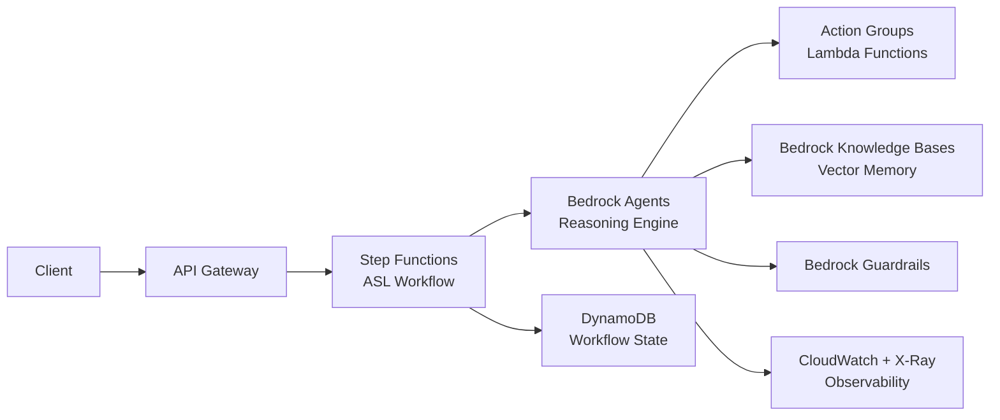
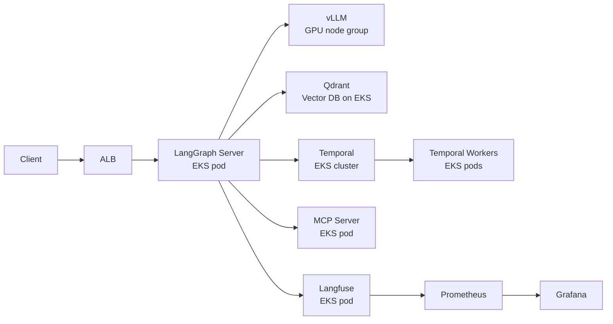
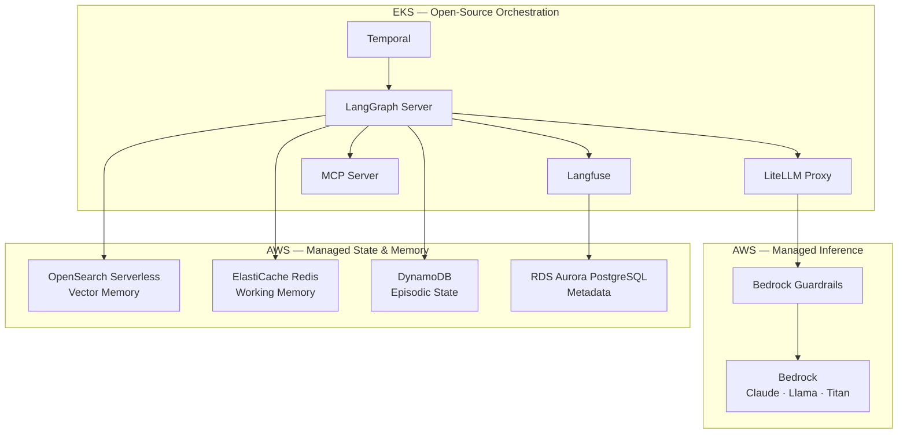

# Architecture Options & Tradeoffs

Three architectural strategies for the Agentic AI Orchestration Platform. Each is fully deployable; the differences are in flexibility, operational burden, cost, and vendor dependency.

**Recommendation: Option C — Hybrid** (see bottom of this document)

---

## Option A: AWS-Native

**Stack**: Bedrock Agents + Step Functions + Lambda + DynamoDB + OpenSearch + CloudWatch

### How it works

Every agent is a Bedrock Agent with Action Groups (Lambda functions). Workflows are Step Functions state machines. All state lives in DynamoDB. Observability is CloudWatch + X-Ray.



### Strengths

- **Zero Kubernetes for orchestration**: Bedrock Agents and Step Functions are fully serverless — no pod management for the reasoning layer
- **Managed everything**: AWS handles model updates, scaling, availability for inference and workflow execution
- **Native IAM integration**: every Lambda action group automatically scoped via execution role
- **Bedrock Knowledge Bases**: fully managed vector store and retrieval — no OpenSearch Serverless to configure
- **Fastest MVP path**: Bedrock Agents' console UI allows non-engineer creation of simple agents without code

### Weaknesses

- **Opaque reasoning**: Bedrock Agents' internal chain-of-thought is not inspectable or customizable. You cannot implement custom ReAct variants, multi-agent supervisor patterns, or CrewAI crew topologies
- **Step Functions ASL is poor for agent loops**: ASL (Amazon States Language) is designed for linear pipelines. Agent loops (think → act → observe → think) require convoluted `Choice` + `Map` + `Wait` workarounds. No native streaming
- **No streaming responses**: Step Functions executions are polling-based; real-time token streaming to clients requires architectural workarounds
- **Deep vendor lock-in**: All orchestration logic is encoded in ASL JSON and Bedrock Agent configurations — migrating to open-source requires a full rewrite
- **Limited Langfuse/LangSmith integration**: requires custom Lambda interceptors to get traces into third-party observability tools; CloudWatch traces are basic
- **Bedrock Agents action group limitations**: no MCP protocol support; custom tool schemas mapped manually; limited debugging on tool call failures
- **Cost at scale**: Step Functions charges per state transition — agent loops with 10+ iterations per run at high volume become expensive

### When to choose

- Team of ≤3 engineers, no MLOps/platform background
- Agent workflows are simple (1-2 tool calls, no cycles)
- Strict "no Kubernetes" policy from infrastructure team
- Time to first working demo is the primary constraint

---

## Option B: Open-Source on EKS

**Stack**: LangGraph + Temporal + vLLM + Qdrant + Langfuse + Prometheus — all on EKS

### How it works

Every component runs in EKS. vLLM serves open-weight models on GPU nodes. Qdrant provides the vector store. LangGraph handles agent orchestration. Temporal handles durable workflows. All fully self-managed.



### Strengths

- **Maximum flexibility**: any LLM, any reasoning pattern, any tool — no managed service constrains design
- **Lowest per-token inference cost at scale**: at >10M tokens/day, vLLM on spot GPU instances is significantly cheaper than Bedrock API pricing (e.g., Claude Haiku: ~$0.25/1M input tokens via Bedrock vs ~$0.05/1M via self-hosted Llama 3.3 70B on vLLM)
- **Full portability**: entire stack runs on any Kubernetes cluster (AWS, GCP, Azure, on-premises)
- **Zero SaaS dependencies**: complete control, no per-event pricing on Langfuse or LangSmith
- **Perfect IaC pattern match**: all components are Helm releases — maps directly to the existing platform's module structure

### Weaknesses

- **GPU cluster management is a significant burden**: NVIDIA drivers, CUDA compatibility, NIM images, GPU node autoscaling, model downloads, warm pool management
- **Multiple vLLM instances required**: each model family requires a separate vLLM deployment — Claude (not available open-source), Llama 3.3 70B, Mistral, etc. each need dedicated GPU resources
- **Cold start problem**: GPU nodes take 3-5 minutes to start from min=0; Cluster Autoscaler + Karpenter required to manage GPU warm pools without paying for idle
- **All stateful services self-managed**: Qdrant, Redis, PostgreSQL all on EKS (vs. managed ElastiCache/RDS/OpenSearch) — snapshot, backup, upgrade all manual
- **Security hardening is entirely manual**: no Bedrock Guardrails; must implement Presidio + custom filtering for all models
- **Highest time-to-first-working-agent**: setting up vLLM alone requires GPU quota approval, image builds, and model downloads

### When to choose

- Daily token volume >10M where vLLM cost savings justify GPU ops
- Regulatory requirement preventing use of AWS managed AI services (data residency, FIPS, etc.)
- Existing GPU infrastructure (on-premises or reserved EC2) already paid for
- Team has deep Kubernetes/GPU ops experience

### Cost comparison at different scales

| Daily Tokens | Bedrock (Claude Haiku) | vLLM (Llama 3.3 70B, g4dn.12xlarge) | Winner |
|---|---|---|---|
| 100K | $0.025 | ~$5.00 (GPU min cost) | Bedrock |
| 1M | $0.25 | ~$5.00 | Bedrock |
| 10M | $2.50 | ~$7.00 | Bedrock |
| 100M | $25.00 | ~$25.00 | Break-even |
| 1B | $250.00 | ~$50.00 | vLLM |

*(vLLM estimate: 1x g4dn.12xlarge at $3.912/hr, ~70K tokens/min throughput)*

---

## Option C: Hybrid (Recommended)

**Stack**: Bedrock (inference) + LangGraph + Temporal (orchestration) + OpenSearch Serverless + ElastiCache + LiteLLM + Langfuse — on EKS

### How it works

AWS Bedrock handles LLM inference (managed, pay-per-token, no GPU ops). LangGraph and Temporal on EKS handle orchestration with full flexibility. AWS-managed services (OpenSearch Serverless, ElastiCache, DynamoDB, RDS) handle state and memory. Langfuse self-hosted provides LLMOps observability without SaaS per-event cost.



### Why this is the right synthesis

**Takes the best from A and B, avoids the worst of both**

| Concern | Option A risk | Option B risk | Option C solution |
|---|---|---|---|
| Reasoning flexibility | Step Functions ASL is rigid | vLLM GPU ops burden | LangGraph on EKS: full flexibility, no GPU ops |
| Inference cost | Step Fn overhead | GPU 24/7 cost at low volume | Bedrock: $0.25/day at 1M tokens, no idle cost |
| Vendor lock-in | All logic in ASL | None | Only inference layer locked to Bedrock; swap via LiteLLM |
| Observability | CloudWatch only | Full but self-managed | Langfuse self-hosted: full depth, no per-event cost |
| IaC pattern | Lambda-heavy | Perfect match | Perfect match (Helm + IRSA) |
| Stateful services | All managed | All self-managed | AWS-managed (OpenSearch, Redis, DynamoDB) |

### LiteLLM as the abstraction boundary

The key to avoiding lock-in in Option C is LiteLLM. Every agent uses:

```python
from openai import OpenAI
client = OpenAI(base_url=os.environ["LITELLM_BASE_URL"], api_key=os.environ["LITELLM_KEY"])
response = client.chat.completions.create(model="claude-3-5-sonnet", messages=[...])
```

If Bedrock pricing increases or vLLM becomes cost-effective at your scale, change `LITELLM_BASE_URL` to point at a vLLM cluster — **zero application code change**. The orchestration layer (LangGraph), memory layer, and observability layer are all completely unaffected.

### Cost model for Option C

At typical development/staging scale (1M tokens/day):
- Bedrock Claude Haiku inference: ~$0.25/day
- EKS worker nodes (2x c6i.2xlarge on-demand): ~$6.50/day
- ElastiCache cache.t3.micro: ~$0.50/day
- RDS Aurora Serverless v2: ~$0.50/day (idle)
- OpenSearch Serverless (minimum OCU): ~$23/day ← primary cost driver at small scale
- **Total Phase 1: ~$31/day ($930/month)**

For small teams where OpenSearch Serverless minimum OCU is too expensive, Phase 2 can substitute a single-node Qdrant deployment on EKS (~$0/day extra beyond node costs) — Memory Service abstraction means zero application code change.

---

## Full Tradeoff Comparison

| Criterion | A: AWS-Native | B: OSS on EKS | C: Hybrid |
|---|---|---|---|
| **Vendor lock-in** | High (ASL + Bedrock Agents) | None | Low (inference only, behind LiteLLM) |
| **Orchestration flexibility** | Low | Maximum | Maximum |
| **Custom reasoning patterns** | No (Bedrock Agents only) | Yes | Yes (LangGraph) |
| **Streaming to client** | Difficult | Full | Full |
| **GPU operational burden** | None | High | None |
| **Time to first agent** | Fast (days) | Slow (weeks) | Medium (1–2 weeks) |
| **Cost @ 100K tokens/day** | Low | High (GPU idle) | Low |
| **Cost @ 1B tokens/day** | High | Low | Medium |
| **Observability depth** | Basic (CloudWatch/X-Ray) | Full custom | Full (Langfuse self-hosted) |
| **IaC pattern match** | Partial (Lambda-heavy) | Perfect | Perfect |
| **Multi-tenancy** | Via IAM only | Namespace + IAM | Namespace + IAM + Langfuse orgs |
| **Security (PII/guardrails)** | Managed (Bedrock Guardrails) | Manual (Presidio only) | Both (Guardrails + Presidio) |
| **HITL support** | Step Fn wait task | LangGraph interrupt | LangGraph interrupt + Temporal durable wait |
| **Model portability** | No (Bedrock Agents model selection limited) | Full | Full (via LiteLLM) |
| **Production readiness** | High (managed) | Medium (self-managed) | High (managed infra + open orchestration) |
| **Team expertise required** | Low | High (GPU, K8s) | Medium (K8s, existing in this repo) |

---

## Decision

**Option C** is recommended for this platform because:

1. The existing team already operates EKS (this repo demonstrates deep Terraform + Kubernetes expertise)
2. LangGraph's graph model is a direct evolution of Airflow's DAG model — familiar mental model
3. Bedrock eliminates GPU ops while keeping inference costs low at typical scales
4. LiteLLM ensures the inference decision is reversible — migrate to vLLM later with zero code change
5. AWS-managed OpenSearch, ElastiCache, and DynamoDB eliminate the stateful service management burden without sacrificing flexibility
6. Langfuse self-hosted gives LangSmith-quality observability at zero per-event cost — crucial for platforms with high trace volumes

See [docs/03_design_decisions.md](03_design_decisions.md) for the specific decisions within Option C.
