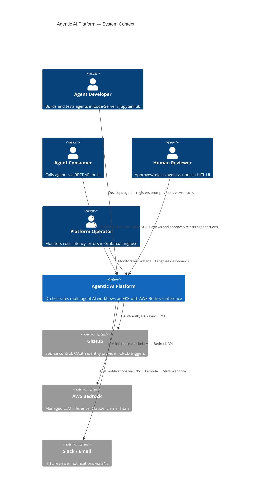
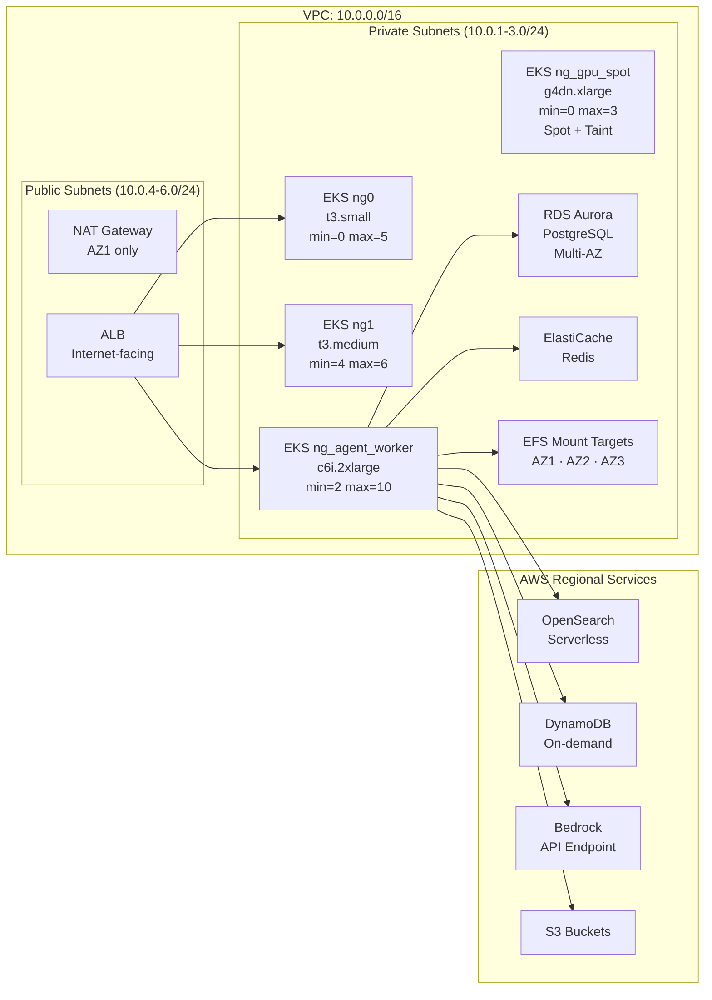
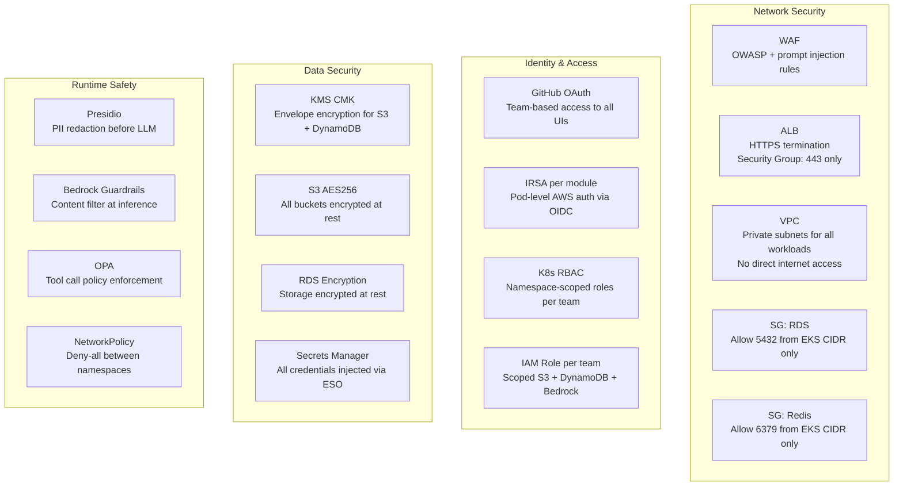
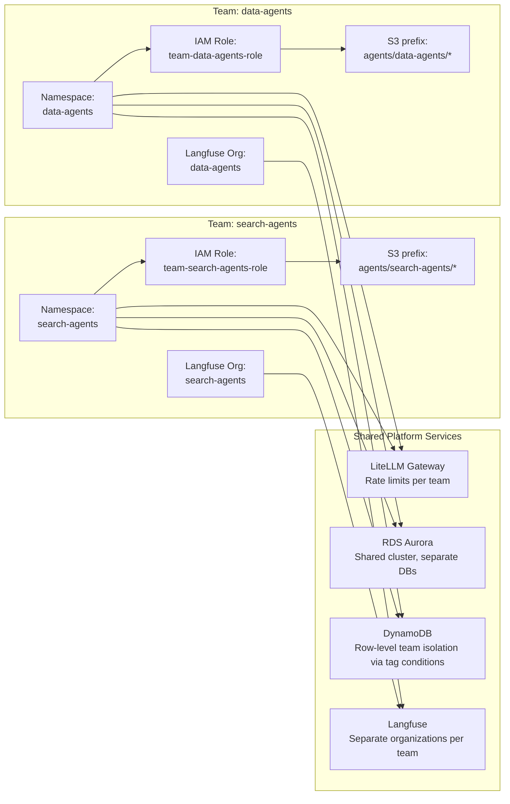
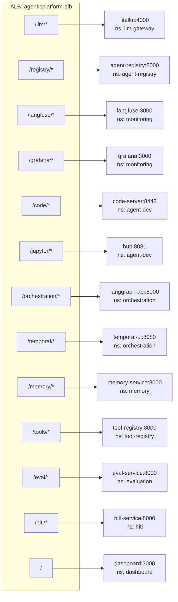
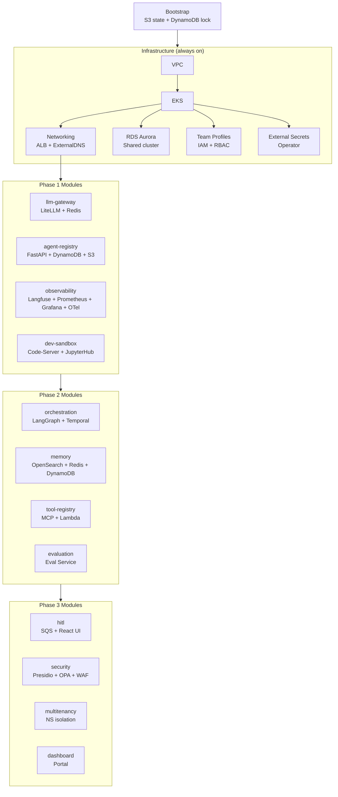

# High Level Design (HLD)

## Overview

The Agentic AI Orchestration Platform is a multi-tier, multi-tenant infrastructure on AWS designed to host, run, observe, and govern multi-agent AI workloads. It inherits all infrastructure patterns from the MLOps platform in this repository and extends them for agentic concerns: stateful agent reasoning loops, memory persistence, tool execution, LLM inference routing, human oversight, and LLMOps observability.

---

## C4 Level 1 — System Context



---

## C4 Level 2 — Container Diagram

```mermaid
graph TB
    subgraph External["External Actors"]
        DEV[Agent Developer]
        USER[Agent Consumer]
        REVIEWER[Human Reviewer]
        OPS[Platform Operator]
    end

    subgraph AWS_Account["AWS Account"]

        subgraph Edge["Edge Layer"]
            WAF[AWS WAF\nInjection defense]
            ALB[Application Load Balancer\nPath-based routing]
            R53[Route 53\nDNS via ExternalDNS]
        end

        subgraph EKS_Cluster["EKS Cluster"]

            subgraph Dev_Tools["Developer Tools"]
                VSCODE[Code-Server\nVS Code in browser]
                JUPYTER[JupyterHub\nNotebooks]
            end

            subgraph Inference["Inference Layer"]
                LITELLM[LiteLLM Proxy\nUnified LLM API]
                GUARDRAILS_SVC[Guardrails Interceptor\nBedrock Guardrails calls]
            end

            subgraph Registry["Registry Layer"]
                AGENT_REG[Agent Registry\nAgents · Prompts · Tools]
            end

            subgraph Orchestration["Orchestration Layer"]
                LANGGRAPH[LangGraph Server\nAgent graph execution]
                TEMPORAL[Temporal\nDurable workflows]
            end

            subgraph Memory["Memory Layer"]
                MEM_SVC[Memory Service\nUnified memory API]
            end

            subgraph Tools["Tool Layer"]
                MCP[MCP Server\nTool protocol executor]
            end

            subgraph Observability["Observability Layer"]
                LANGFUSE[Langfuse\nLLMOps tracing]
                PROMETHEUS[Prometheus\nMetrics]
                GRAFANA[Grafana\nDashboards]
                OTEL[OTel Collector\nSpan aggregator]
            end

            subgraph HITL_Layer["Human Oversight Layer"]
                HITL[HITL Service\nApproval queue + UI]
            end

            subgraph Security_Layer["Security Layer"]
                PRESIDIO[Presidio\nPII detection/redaction]
                OPA[OPA\nPolicy enforcement]
            end

        end

        subgraph AWS_Managed["AWS Managed Services"]
            BEDROCK[AWS Bedrock\nLLM Inference]
            OPENSEARCH[OpenSearch Serverless\nVector memory]
            ELASTICACHE[ElastiCache Redis\nWorking memory]
            DYNAMODB[DynamoDB\nEpisodic memory + state]
            RDS[RDS Aurora PostgreSQL\nMetadata]
            S3[S3\nArtifacts + traces]
            SQS[SQS\nApproval queue]
            SNS[SNS\nNotifications]
            EB[EventBridge\nAgent event bus]
        end

    end

    DEV --> ALB --> VSCODE & JUPYTER
    USER --> WAF --> ALB --> LITELLM
    REVIEWER --> ALB --> HITL
    OPS --> ALB --> GRAFANA & LANGFUSE

    LITELLM --> GUARDRAILS_SVC --> BEDROCK
    LANGGRAPH --> LITELLM
    LANGGRAPH --> MEM_SVC
    LANGGRAPH --> MCP
    LANGGRAPH --> HITL
    TEMPORAL --> LANGGRAPH

    MEM_SVC --> OPENSEARCH & ELASTICACHE & DYNAMODB
    AGENT_REG --> RDS & S3
    LANGFUSE --> RDS & S3
    OTEL --> LANGFUSE & PROMETHEUS --> GRAFANA

    HITL --> SQS & SNS
    PRESIDIO --> LANGGRAPH
    OPA --> MCP & LANGGRAPH
```



---

## System Layers

The platform is structured in six horizontal layers. Each layer has a clear responsibility boundary.

### Layer 1: Edge
| Component | Technology | Responsibility |
|---|---|---|
| Route 53 | AWS Managed DNS | Domain routing, ExternalDNS auto-sync from K8s Ingress |
| AWS WAF | AWS Managed WAF | OWASP Top 10, prompt injection pattern rules, IP rate limiting |
| ALB | AWS ALB (via AWS LBC) | Path-based routing to all EKS services; shared group `agenticplatform` |

**Key decision**: Single ALB for all services (cost-efficient, same pattern as MLOps platform's `mlplatform` group).

### Layer 2: Developer Tools
| Component | Technology | Responsibility |
|---|---|---|
| Code-Server | VS Code in browser | Agent development environment with pre-configured env vars |
| JupyterHub | JupyterHub 2.x | Notebook-based experimentation, extended from existing platform |

Both authenticated via GitHub OAuth (organization + team membership check).

### Layer 3: Inference
| Component | Technology | Responsibility |
|---|---|---|
| LiteLLM Proxy | LiteLLM OSS | Unified OpenAI-compatible API over Bedrock and future providers |
| AWS Bedrock | AWS Managed | LLM inference: Claude 3.5/3 Haiku, Llama 3.3 70B, Titan |
| Bedrock Guardrails | AWS Managed | Pre-inference PII filter, topic denial, content filter |

**Key decision**: LiteLLM creates a provider-agnostic boundary. The orchestration layer never calls Bedrock directly.

### Layer 4: Orchestration
| Component | Technology | Responsibility |
|---|---|---|
| LangGraph Server | LangGraph OSS | Agent graph execution engine; REST API for runs/threads |
| Temporal Server | Temporal OSS | Durable workflow execution for long-horizon agent tasks |
| Temporal Workers | Custom Python | Execute Temporal activities (individual agent tasks) |

**Key decision**: LangGraph handles the inner reasoning loop (think → tool → observe); Temporal handles the outer workflow (sequence of agent tasks with durability guarantees).

### Layer 5: Memory
| Component | Technology | Responsibility |
|---|---|---|
| Memory Service | FastAPI (custom) | Unified API abstracting all four memory tiers |
| OpenSearch Serverless | AWS Managed | Long-term semantic vector memory (embedding search) |
| ElastiCache Redis | AWS Managed | Short-term working memory, conversation state |
| DynamoDB | AWS Managed | Episodic memory (structured event log per agent run) |
| EFS | AWS Managed | Memory snapshot persistence across pod restarts |

### Layer 6: Observability
| Component | Technology | Responsibility |
|---|---|---|
| Langfuse | Self-hosted OSS | LLM trace/span collection, token costs, eval scores |
| OpenTelemetry Collector | CNCF OSS | Span aggregation from all agent pods |
| Prometheus | OSS | Time-series metrics for infra + LLM gateway |
| Grafana | OSS | Unified dashboards: infra + LLMOps metrics |

---

## Deployment Zones



**New node groups vs existing platform**:

| Node Group | Instance | Min | Max | Purpose |
|---|---|---|---|---|
| `ng0` | t3.small | 0 | 5 | Retained: general workloads |
| `ng1` | t3.medium | 4 | 6 | Retained: baseline workloads |
| `ng_agent_worker` | c6i.2xlarge | 2 | 10 | **New**: LangGraph, Temporal workers, Memory Service |
| `ng_gpu_spot` | g4dn.xlarge | 0 | 3 | **New**: Optional vLLM (Spot, tainted `NoSchedule`) |

---

## Security Architecture



**IRSA roles created (one per module)**:

| Role | Service Account | Key Permissions |
|---|---|---|
| `agenticplatform-litellm-role` | `llm-gateway-sa` | `bedrock:InvokeModel*` |
| `agenticplatform-registry-role` | `agent-registry-sa` | DynamoDB tables, S3 registry bucket |
| `agenticplatform-langfuse-role` | `observability-sa` | S3 traces bucket |
| `agenticplatform-memory-role` | `memory-sa` | OpenSearch `aoss:APIAccessAll`, DynamoDB episodic, ElastiCache (VPC) |
| `agenticplatform-langgraph-role` | `orchestration-sa` | DynamoDB checkpoint, S3 artifacts |
| `agenticplatform-mcp-role` | `tool-registry-sa` | `lambda:InvokeFunction` (registered tools) |
| `agenticplatform-hitl-role` | `hitl-sa` | SQS send/receive, SNS publish, DynamoDB HITL state |

---

## Multi-tenancy Model



**Isolation mechanisms**:
1. **Network**: Kubernetes NetworkPolicy — `deny-all` ingress per namespace; allow only from `ingress-nginx` / `aws-load-balancer-controller` namespace
2. **Storage**: IAM condition `dynamodb:LeadingKeys` = team name prefix; S3 IAM prefix conditions
3. **Observability**: Separate Langfuse organization per team — teams cannot see each other's traces
4. **Compute**: ResourceQuota per namespace prevents CPU/memory monopolization
5. **Inference**: LiteLLM per-team rate limits (TPM + RPM) prevent cost monopolization

---

## ALB Routing Architecture



All services annotated with:
```yaml
alb.ingress.kubernetes.io/group.name: agenticplatform
alb.ingress.kubernetes.io/scheme: internet-facing
alb.ingress.kubernetes.io/target-type: ip
```

---

## Phased Deployment Architecture

### Phase 1: Core Platform

What gets deployed and why each is required before the next:



**Deployment time estimates** (same approach as existing platform):

| Phase | Estimated Time | Bottleneck |
|---|---|---|
| Bootstrap | 2 min | DynamoDB create |
| Infrastructure (VPC + EKS + RDS + Net) | 25–35 min | EKS cluster provisioning |
| Phase 1 modules | 10–15 min | Helm releases + RDS DB init |
| Phase 2 modules | 15–20 min | OpenSearch Serverless collection |
| Phase 3 modules | 10–15 min | WAF rule group creation |
| **Total cold start** | **~65–85 min** | |

---

## Technology Stack Summary

| Concern | Technology | Hosting | Notes |
|---|---|---|---|
| Container orchestration | EKS 1.30 | AWS Managed | Identical to existing platform |
| LLM inference | AWS Bedrock | AWS Managed | Claude 3.5, Llama 3.3, Titan |
| LLM routing | LiteLLM | EKS | OpenAI-compatible proxy |
| Agent orchestration | LangGraph | EKS | Graph-based, streaming, HITL support |
| Durable workflows | Temporal | EKS | Replaces Airflow for agentic use cases |
| Vector memory | OpenSearch Serverless | AWS Managed | ANN search for semantic retrieval |
| Working memory | ElastiCache Redis | AWS Managed | Short-term conversation state |
| Episodic memory | DynamoDB | AWS Managed | Structured event log, TTL 90d |
| Metadata store | RDS Aurora PostgreSQL | AWS Managed | Langfuse, Registry, Temporal, Eval |
| Artifact storage | S3 | AWS Managed | Agent defs, traces, snapshots |
| LLMOps tracing | Langfuse (self-hosted) | EKS | Full trace/span/cost visibility |
| Infrastructure metrics | Prometheus + Grafana | EKS | Identical to existing platform |
| Span collection | OpenTelemetry Collector | EKS | DaemonSet, forwards to Langfuse + Prometheus |
| Human-in-the-loop | HITL Service | EKS | SQS + React UI + SNS notifications |
| PII detection | Presidio (Microsoft) | EKS | Pre/post LLM call scanning |
| Policy enforcement | OPA + Gatekeeper | EKS | Tool call and prompt policies |
| Edge security | AWS WAF | AWS Managed | OWASP rules + custom prompt injection |
| Guardrails | AWS Bedrock Guardrails | AWS Managed | PII, topic denial, content filter |
| Secret management | AWS Secrets Manager + ESO | AWS Managed | Same ESO pattern as existing platform |
| DNS | Route 53 + ExternalDNS | AWS Managed | Same pattern as existing platform |
| Identity | GitHub OAuth | External | Same org/team pattern as existing platform |
| IaC | Terraform ≥ 1.5.3 | — | All resources managed |
