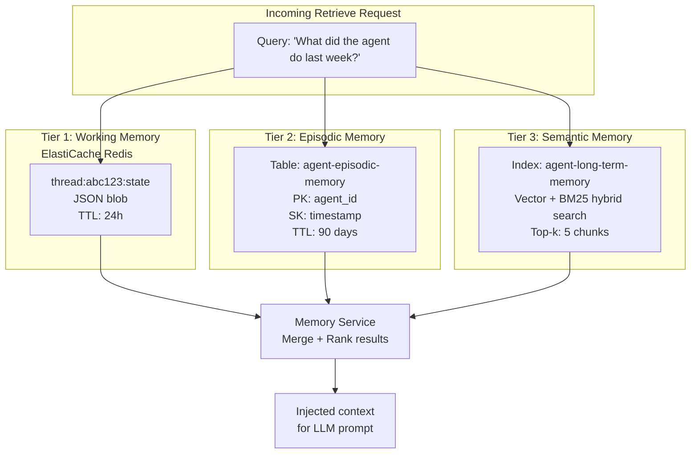
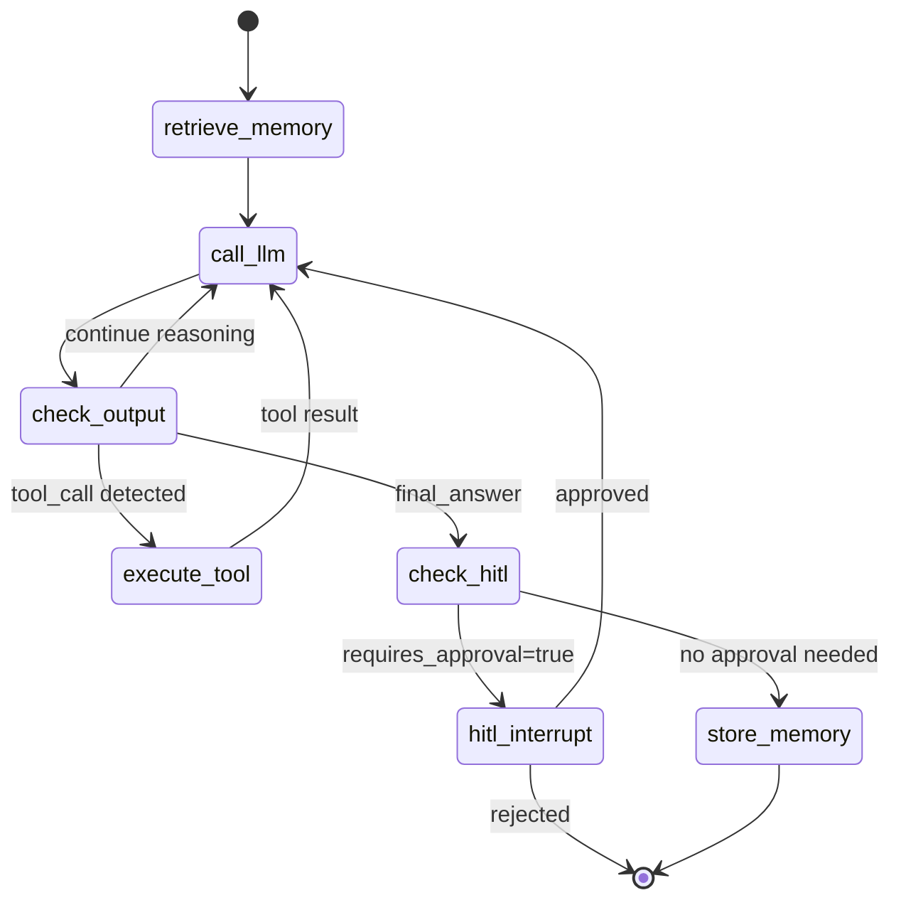
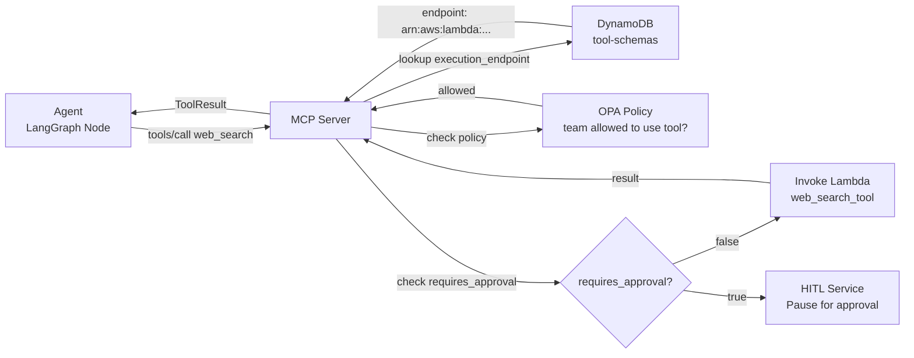
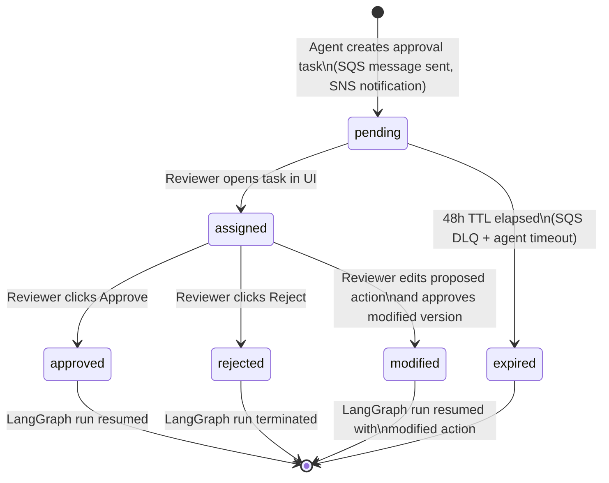

# Low Level Design (LLD)

## Overview

This document covers the detailed internal design of each platform module: Kubernetes resource specifications, data schemas, API contracts, inter-service communication patterns, and configuration details.

---

## 1. LLM Gateway (LiteLLM Proxy)

### Kubernetes Resources

```
Namespace: llm-gateway
├── Deployment: litellm (replicas: 2, HPA: 2–8 on CPU 70%)
├── Service: litellm (ClusterIP, port 4000)
├── ServiceAccount: llm-gateway-sa (annotated: eks.amazonaws.com/role-arn)
├── ConfigMap: litellm-config (model list, routing rules)
├── Secret: litellm-master-key (from Secrets Manager via ESO)
├── Ingress: litellm-ingress (ALB annotations, path /llm/*)
└── HorizontalPodAutoscaler: litellm-hpa (min: 2, max: 8, cpu: 70%)
```

### LiteLLM Model Configuration

```yaml
# ConfigMap: litellm-config
model_list:
  - model_name: claude-3-5-sonnet
    litellm_params:
      model: bedrock/anthropic.claude-3-5-sonnet-20241022-v2:0
      aws_region_name: us-east-1

  - model_name: claude-3-haiku
    litellm_params:
      model: bedrock/anthropic.claude-3-haiku-20240307-v1:0
      aws_region_name: us-east-1

  - model_name: llama-3-70b
    litellm_params:
      model: bedrock/meta.llama3-3-70b-instruct-v1:0
      aws_region_name: us-east-1

router_settings:
  redis_host: <elasticache-endpoint>
  redis_port: 6379
  routing_strategy: least-busy
  fallbacks:
    - model_name: claude-3-5-sonnet
      fallback_models: [claude-3-haiku]

litellm_settings:
  callbacks: [langfuse]
  success_callback: [langfuse]
  failure_callback: [langfuse]

environment_variables:
  LANGFUSE_SECRET_KEY: <from-secret>
  LANGFUSE_PUBLIC_KEY: <from-secret>
  LANGFUSE_HOST: http://langfuse.monitoring.svc.cluster.local:3000
```

### Rate Limiting Schema (Redis)

```
Key pattern:  rate_limit:{team_id}:{model_name}:{window}
Value:        {"requests": 42, "tokens": 158420}
TTL:          60 seconds (rolling window)

Team budgets stored in:
Key: litellm_team_config:{team_id}
Value: {"max_tpm": 1000000, "max_rpm": 100, "allowed_models": ["claude-3-haiku"]}
```

### API Contract

```http
POST /llm/v1/chat/completions
Authorization: Bearer <litellm-api-key>
Content-Type: application/json

{
  "model": "claude-3-5-sonnet",
  "messages": [{"role": "user", "content": "..."}],
  "stream": true,
  "metadata": {
    "trace_id": "run-abc123",
    "team_id": "search-agents"
  }
}

Response: SSE stream (Content-Type: text/event-stream)
data: {"choices": [{"delta": {"content": "..."}}]}
data: [DONE]
```

---

## 2. Agent Registry

### Kubernetes Resources

```
Namespace: agent-registry
├── Deployment: agent-registry-api (replicas: 2)
├── Service: agent-registry (ClusterIP, port 8000)
├── ServiceAccount: agent-registry-sa
├── ConfigMap: registry-config (AWS region, table names, S3 bucket)
├── Secret: rds-credentials (from Secrets Manager via ESO)
├── Ingress: registry-ingress (ALB, path /registry/*)
└── HorizontalPodAutoscaler: registry-hpa (min: 2, max: 6, cpu: 70%)
```

### DynamoDB Schema: `agent-definitions` Table

| Attribute | Type | Notes |
|---|---|---|
| `agent_id` (PK) | String | e.g., `search-agent-v2` |
| `version` (SK) | String | Semantic version: `1.0.0` |
| `stage` | String | `dev`, `staging`, `production` |
| `display_name` | String | Human-readable name |
| `description` | String | What the agent does |
| `graph_s3_key` | String | S3 key to serialized LangGraph graph |
| `default_model` | String | LiteLLM model alias |
| `tool_ids` | List[String] | List of registered tool IDs |
| `prompt_template_id` | String | Linked system prompt template |
| `created_at` | String | ISO 8601 timestamp |
| `created_by` | String | GitHub username |
| `tags` | Map | `{team: "search-agents", use_case: "..."}` |

**GSI**: `stage-index` — hash: `stage`, range: `agent_id` — query all production agents

### DynamoDB Schema: `prompt-templates` Table

| Attribute | Type | Notes |
|---|---|---|
| `template_id` (PK) | String | e.g., `search-system-v3` |
| `version` (SK) | String | `1.0.0` |
| `content` | String | System prompt with `{variable}` placeholders |
| `variables` | List[String] | List of required variable names |
| `model_hints` | Map | `{best_model: "claude-3-5-sonnet", max_tokens: 4096}` |
| `created_at` | String | ISO 8601 |
| `created_by` | String | GitHub username |

### DynamoDB Schema: `tool-schemas` Table

| Attribute | Type | Notes |
|---|---|---|
| `tool_id` (PK) | String | e.g., `web_search_v2` |
| `version` (SK) | String | `1.0.0` |
| `name` | String | MCP tool name |
| `description` | String | Tool description for LLM |
| `input_schema` | Map | JSON Schema for input arguments |
| `output_schema` | Map | JSON Schema for output |
| `execution_endpoint` | String | Lambda ARN or internal service URL |
| `requires_approval` | Boolean | Routes through HITL if true |
| `tags` | Map | `{category: "web", sensitivity: "low"}` |

### REST API Contract

```
GET    /registry/v1/agents               → list all agents (stage filter via ?stage=production)
POST   /registry/v1/agents               → register new agent version
GET    /registry/v1/agents/{id}/{version} → get agent definition + S3 artifact URL
PATCH  /registry/v1/agents/{id}/{version} → update stage (dev → staging → production)
DELETE /registry/v1/agents/{id}/{version} → delete agent version

GET    /registry/v1/prompts              → list prompt templates
POST   /registry/v1/prompts              → create prompt template
GET    /registry/v1/prompts/{id}/{version}

GET    /registry/v1/tools                → list registered tools
POST   /registry/v1/tools               → register tool schema
GET    /registry/v1/tools/{id}/{version}
```

---

## 3. Memory Service

### Kubernetes Resources

```
Namespace: memory
├── Deployment: memory-service (replicas: 2, HPA: 2–6)
├── Service: memory-service (ClusterIP, port 8000)
├── ServiceAccount: memory-sa (IRSA: OpenSearch + DynamoDB)
├── ConfigMap: memory-config (tier endpoints, embedding model)
├── Ingress: memory-ingress (ALB, path /memory/*)
└── PersistentVolumeClaim: memory-snapshots (EFS, ReadWriteMany, 10Gi)
```

### Memory Tier Design



### DynamoDB Schema: `agent-episodic-memory` Table

| Attribute | Type | Notes |
|---|---|---|
| `agent_id` (PK) | String | Agent identifier |
| `timestamp` (SK) | String | ISO 8601 event timestamp |
| `run_id` | String | LangGraph run ID |
| `thread_id` | String | Conversation thread |
| `event_type` | String | `tool_call`, `decision`, `error`, `completion` |
| `event_payload` | Map | Event-specific data |
| `summary` | String | Human-readable summary of event |
| `ttl` | Number | Unix timestamp (90 days from creation) |

### OpenSearch Index Mapping: `agent-long-term-memory`

```json
{
  "settings": {
    "index": {
      "knn": true,
      "knn.algo_param.ef_search": 512
    }
  },
  "mappings": {
    "properties": {
      "content": { "type": "text" },
      "content_vector": {
        "type": "knn_vector",
        "dimension": 1536,
        "method": { "name": "hnsw", "space_type": "l2" }
      },
      "agent_id": { "type": "keyword" },
      "team_id": { "type": "keyword" },
      "source_run_id": { "type": "keyword" },
      "created_at": { "type": "date" },
      "memory_type": { "type": "keyword" }
    }
  }
}
```

### REST API Contract

```
POST /memory/v1/store
Body: {
  "agent_id": "search-agent",
  "thread_id": "thread-xyz",
  "tier": "semantic | episodic | working",
  "content": "...",
  "metadata": {}
}

POST /memory/v1/retrieve
Body: {
  "agent_id": "search-agent",
  "query": "customer preferences from last session",
  "tiers": ["semantic", "episodic"],
  "top_k": 5,
  "filters": {"team_id": "search-agents"}
}
Response: {"results": [{"content": "...", "score": 0.92, "tier": "semantic", "source_run_id": "..."}]}

DELETE /memory/v1/{agent_id}?tier=episodic&before=2025-01-01
```

---

## 4. LangGraph Orchestration

### Kubernetes Resources

```
Namespace: orchestration
├── Deployment: langgraph-api (replicas: 2, HPA: 2–8)
├── Deployment: temporal-server (replicas: 1 — or clustered for HA)
├── Deployment: temporal-worker (replicas: 3, HPA on queue depth)
├── Service: langgraph-api (ClusterIP, port 8000)
├── Service: temporal-frontend (ClusterIP, port 7233)
├── Service: temporal-web (ClusterIP, port 8080)
├── ServiceAccount: orchestration-sa (IRSA: DynamoDB checkpoint + S3)
├── ConfigMap: langgraph-config
├── Secret: temporal-db-credentials (from Secrets Manager via ESO)
├── Ingress: orchestration-ingress (ALB, /orchestration/* and /temporal/*)
└── HorizontalPodAutoscaler: temporal-worker-hpa (min: 2, max: 20)
```

### LangGraph State Schema

```python
from typing import TypedDict, Annotated
from langgraph.graph.message import add_messages

class AgentState(TypedDict):
    # Conversation history (append-only via add_messages reducer)
    messages: Annotated[list, add_messages]
    # Working memory from Memory Service
    working_memory: dict
    # Retrieved long-term context
    retrieved_context: list[dict]
    # Tool calls made in this run
    tool_calls_log: list[dict]
    # Current reasoning step
    current_step: str
    # Run metadata
    run_id: str
    thread_id: str
    agent_id: str
    team_id: str
    # HITL state
    pending_approval: bool
    approval_task_id: str | None
```

### LangGraph Graph Definition (conceptual)



### LangGraph Server API Contract

```
POST /orchestration/v1/runs
Body: {
  "assistant_id": "search-agent",
  "thread_id": "thread-xyz",           # optional; omit to create new
  "input": {"messages": [{"role": "user", "content": "..."}]},
  "config": {"team_id": "search-agents", "stream_mode": "values"}
}
Response: {"run_id": "run-abc123", "thread_id": "thread-xyz", "status": "pending"}

GET /orchestration/v1/runs/{run_id}    → get run status and output
GET /orchestration/v1/runs/{run_id}/stream  → SSE stream of state updates

POST /orchestration/v1/threads/{thread_id}/runs/{run_id}/approve
Body: {"decision": "approved", "reviewer_id": "alice", "comment": "..."}

GET /orchestration/v1/assistants       → list registered agents (from Agent Registry)
```

### Temporal Workflow Definition (conceptual)

```python
@workflow.defn
class AgentPipelineWorkflow:
    """
    Outer durable wrapper around a multi-step agent task.
    Handles: retries, HITL waits, long-running pauses.
    """

    @workflow.run
    async def run(self, input: AgentPipelineInput) -> AgentPipelineOutput:
        # Step 1: Retrieve agent definition from Registry
        agent_def = await workflow.execute_activity(
            fetch_agent_definition,
            args=[input.agent_id],
            start_to_close_timeout=timedelta(seconds=10)
        )
        # Step 2: Execute agent via LangGraph Server
        run_result = await workflow.execute_activity(
            execute_langgraph_run,
            args=[agent_def, input.user_message, input.thread_id],
            start_to_close_timeout=timedelta(minutes=10),
            retry_policy=RetryPolicy(maximum_attempts=3)
        )
        # Step 3: If HITL required, wait for approval (can wait hours)
        if run_result.pending_approval:
            approval = await workflow.execute_activity(
                wait_for_hitl_approval,
                args=[run_result.approval_task_id],
                start_to_close_timeout=timedelta(hours=48)  # long wait
            )
            if not approval.approved:
                return AgentPipelineOutput(status="rejected")
            # Resume LangGraph run with approval
            run_result = await workflow.execute_activity(
                resume_langgraph_run,
                args=[run_result.run_id, approval],
                start_to_close_timeout=timedelta(minutes=10)
            )
        return AgentPipelineOutput(status="completed", result=run_result.output)
```

---

## 5. Tool Registry + MCP Server

### Kubernetes Resources

```
Namespace: tool-registry
├── Deployment: mcp-server (replicas: 2)
├── Deployment: tool-registry-api (replicas: 2)
├── Service: mcp-server (ClusterIP, port 3000)
├── Service: tool-registry (ClusterIP, port 8000)
├── ServiceAccount: tool-registry-sa (IRSA: lambda:InvokeFunction)
├── ConfigMap: tool-config (registered tool endpoints)
├── Ingress: tool-registry-ingress (ALB, /tools/*)
└── HorizontalPodAutoscaler: mcp-hpa (min: 2, max: 6)
```

### MCP Protocol (Model Context Protocol)

The MCP Server implements the [Model Context Protocol](https://modelcontextprotocol.io) spec. LangGraph agents use `langchain_mcp_adapters.MCPToolkit` to discover and call tools:

```python
# Agent code (runs inside LangGraph node)
from langchain_mcp_adapters.client import MultiServerMCPClient

async with MultiServerMCPClient({
    "agenticplatform-tools": {
        "url": "http://mcp-server.tool-registry.svc.cluster.local:3000/mcp",
        "transport": "streamable_http"
    }
}) as mcp_client:
    tools = await mcp_client.get_tools()   # Returns all registered tools as LangChain tools
    llm_with_tools = llm.bind_tools(tools)
```

### MCP Server API (internal)

```
GET  /mcp/tools                 → list all tools (MCP spec: tools/list)
POST /mcp/tools/call            → invoke a tool (MCP spec: tools/call)
Body: {"name": "web_search", "arguments": {"query": "latest AI news"}}
Response: {"content": [{"type": "text", "text": "Search results..."}]}
```

### Tool Routing Logic



### Built-in Lambda Tools

| Tool Name | Lambda | Input | Output |
|---|---|---|---|
| `s3_read` | `agenticplatform-tool-s3-read` | `{bucket, key}` | `{content, size, last_modified}` |
| `dynamodb_query` | `agenticplatform-tool-dynamo-query` | `{table, key_condition, filter}` | `{items, count}` |
| `ses_send` | `agenticplatform-tool-ses-send` | `{to, subject, body}` | `{message_id}` |
| `http_request` | `agenticplatform-tool-http` | `{url, method, headers, body}` | `{status, body}` |
| `bedrock_kb_query` | `agenticplatform-tool-bedrock-kb` | `{knowledge_base_id, query}` | `{results}` |

---

## 6. HITL Service

### Kubernetes Resources

```
Namespace: hitl
├── Deployment: hitl-api (replicas: 2)
├── Deployment: hitl-frontend (replicas: 1, React SPA served by nginx)
├── Service: hitl-service (ClusterIP, port 8000)
├── Service: hitl-frontend (ClusterIP, port 80)
├── ServiceAccount: hitl-sa (IRSA: SQS + SNS + DynamoDB)
├── Secret: github-oauth (from Secrets Manager via ESO)
└── Ingress: hitl-ingress (ALB, /hitl/*)
```

### HITL State Machine



### DynamoDB Schema: `hitl-state` Table

| Attribute | Type | Notes |
|---|---|---|
| `task_id` (PK) | String | UUID, also SQS message group ID |
| `run_id` | String | LangGraph run being paused |
| `thread_id` | String | Conversation thread |
| `agent_id` | String | Which agent needs approval |
| `team_id` | String | Owning team |
| `action_type` | String | `tool_call`, `message_send`, `data_write` |
| `proposed_action` | Map | What the agent wants to do |
| `status` | String | `pending`, `assigned`, `approved`, `rejected`, `expired` |
| `reviewer_id` | String | GitHub username of reviewer |
| `decision` | String | `approved`, `rejected` |
| `modified_action` | Map | Reviewer's edited version of the action |
| `comment` | String | Reviewer annotation |
| `created_at` | String | ISO 8601 |
| `resolved_at` | String | ISO 8601 |
| `ttl` | Number | Unix timestamp (7 days from creation) |

### SQS Message Format

```json
{
  "task_id": "hitl-abc123",
  "run_id": "run-xyz789",
  "agent_id": "search-agent",
  "team_id": "search-agents",
  "action_type": "tool_call",
  "proposed_action": {
    "tool": "ses_send",
    "arguments": {"to": "customer@example.com", "subject": "...", "body": "..."}
  },
  "review_url": "https://agents.example.com/hitl/tasks/hitl-abc123",
  "created_at": "2025-04-04T12:00:00Z"
}
```

---

## 7. Observability Stack

### Langfuse Trace Schema

Every agent run produces a Langfuse trace with this span hierarchy:

```
Trace: run-abc123
├── Span: retrieve_memory (type: retrieval)
│   ├── Input: {query: "...", tiers: ["semantic"]}
│   └── Output: {results: [...], latency_ms: 45}
├── Span: call_llm (type: llm)
│   ├── Model: claude-3-5-sonnet
│   ├── Input tokens: 1240
│   ├── Output tokens: 385
│   ├── Cost: $0.00247
│   └── Latency: 2340ms
├── Span: execute_tool (type: tool)
│   ├── Tool: web_search
│   ├── Input: {query: "..."}
│   └── Output: {results: [...]}
├── Span: call_llm (type: llm)     ← second iteration
│   └── ...
└── Span: store_memory (type: retrieval)
    └── Input: {tier: "episodic", content: "..."}
```

### Prometheus Metrics (agent-specific)

```
# LiteLLM metrics
litellm_requests_total{model, team, status}
litellm_tokens_total{model, team, type}         # type: input|output
litellm_cost_total{model, team}
litellm_request_duration_seconds{model, team}

# LangGraph metrics
langgraph_runs_total{agent_id, team, status}
langgraph_run_duration_seconds{agent_id}
langgraph_tool_calls_total{agent_id, tool_name, status}
langgraph_hitl_tasks_total{agent_id, decision}

# Memory metrics
memory_retrieve_duration_seconds{tier}
memory_store_duration_seconds{tier}
opensearch_query_latency_seconds

# Temporal metrics
temporal_workflow_started_total
temporal_workflow_completed_total
temporal_workflow_failed_total
temporal_task_queue_depth{task_queue}          # ← triggers worker autoscale
```

### Grafana Dashboard Inventory

| Dashboard | Key Panels | Data Source |
|---|---|---|
| `agent-overview.json` | Active runs, error rate, p95 latency by agent | Prometheus |
| `token-cost.json` | Daily spend by team + model, budget vs actual | Prometheus (LiteLLM metrics) |
| `memory-health.json` | OpenSearch query latency, Redis hit rate, episodic TTL distribution | Prometheus |
| `temporal-workers.json` | Worker count, queue depth, workflow success rate | Prometheus |
| `hitl-queue.json` | Pending approvals, average review time, rejection rate | Prometheus + Langfuse |
| `infra-cluster.json` | Node CPU/memory, pod counts (existing dashboard 315) | Prometheus |
| `langfuse-traces.json` | Trace volume, span types, cost per trace | Langfuse API (datasource) |

---

## 8. Security Controls (Detailed)

### Bedrock Guardrails Configuration

```hcl
# Terraform: aws_bedrock_guardrail
resource "aws_bedrock_guardrail" "platform" {
  name        = "${var.deployment_name}-guardrail"
  description = "Platform-wide guardrail for all Bedrock calls via LiteLLM"
  blocked_input_messaging  = "[INPUT BLOCKED] Your request was blocked by platform policy."
  blocked_outputs_messaging = "[OUTPUT BLOCKED] The response was blocked by platform policy."

  pii_entity_policy_config {
    pii_entity_config { type = "SSN";          action = "ANONYMIZE" }
    pii_entity_config { type = "CREDIT_DEBIT_CARD_NUMBER"; action = "ANONYMIZE" }
    pii_entity_config { type = "EMAIL";        action = "BLOCK" }
    pii_entity_config { type = "PHONE";        action = "ANONYMIZE" }
    pii_entity_config { type = "AWS_ACCESS_KEY"; action = "BLOCK" }
    pii_entity_config { type = "AWS_SECRET_KEY"; action = "BLOCK" }
  }

  content_policy_config {
    filters_config {
      type             = "VIOLENCE"
      input_strength   = "HIGH"
      output_strength  = "HIGH"
    }
    filters_config {
      type             = "HATE"
      input_strength   = "HIGH"
      output_strength  = "HIGH"
    }
  }

  topic_policy_config {
    topics_config {
      name       = "financial-advice"
      definition = "Providing specific investment or financial recommendations"
      type       = "DENY"
    }
  }
}
```

### OPA Policy: Tool Authorization

```rego
# policy: tool_authorization.rego
package agenticplatform.tools

default allow = false

# Allow tool call if team is in allowed_teams for the tool
allow {
    tool := data.tools[input.tool_id]
    team_allowed(tool, input.team_id)
    not tool_requires_sensitive_data(tool, input.team_id)
}

team_allowed(tool, team_id) {
    tool.allowed_teams[_] == team_id
}

team_allowed(tool, team_id) {
    tool.allowed_teams[_] == "*"  # public tools
}

tool_requires_sensitive_data(tool, team_id) {
    tool.sensitivity == "high"
    not data.teams[team_id].approved_for_sensitive_tools
}
```

### NetworkPolicy: Namespace Isolation

```yaml
# Applied to every team namespace
apiVersion: networking.k8s.io/v1
kind: NetworkPolicy
metadata:
  name: default-deny-ingress
  namespace: search-agents
spec:
  podSelector: {}
  policyTypes: [Ingress]
  ingress:
  - from:
    # Allow from same namespace
    - podSelector: {}
    # Allow from ingress controller
    - namespaceSelector:
        matchLabels:
          kubernetes.io/metadata.name: kube-system
```

---

## 9. Data Persistence Summary

| Data Type | Technology | TTL / Retention | Backup |
|---|---|---|---|
| Agent definitions | DynamoDB | Indefinite | DynamoDB PITR enabled |
| Prompt templates | DynamoDB | Indefinite | DynamoDB PITR enabled |
| Tool schemas | DynamoDB | Indefinite | DynamoDB PITR enabled |
| Agent episodic memory | DynamoDB | 90 days (TTL) | DynamoDB PITR enabled |
| HITL state | DynamoDB | 7 days (TTL) | DynamoDB PITR enabled |
| Langfuse metadata | RDS Aurora PostgreSQL | Indefinite | RDS automated backups 7 days |
| Temporal state | RDS Aurora PostgreSQL | Indefinite (compacted) | RDS automated backups 7 days |
| Evaluation results | RDS Aurora PostgreSQL | Indefinite | RDS automated backups 7 days |
| Long-term vector memory | OpenSearch Serverless | Indefinite | OpenSearch automated snapshots |
| Working memory | ElastiCache Redis | 24h (key TTL) | Not persisted (ephemeral by design) |
| LangGraph checkpoints | DynamoDB | Per run TTL (30 days) | DynamoDB PITR enabled |
| Agent artifacts (S3) | S3 | Indefinite | S3 versioning enabled |
| Trace archives (S3) | S3 | 90 days (lifecycle rule) | S3 versioning enabled |
| Langfuse traces | RDS + S3 | 90 days (configurable) | RDS backups + S3 versioning |
| User home dirs (EFS) | EFS | Until deleted | EFS automated backups |

---

## 10. Environment Variables Reference

Every agent pod (LangGraph workers, Temporal workers, dev sandbox) receives:

| Variable | Value | Set By |
|---|---|---|
| `LITELLM_BASE_URL` | `http://litellm.llm-gateway.svc.cluster.local:4000` | Helm values / ConfigMap |
| `LITELLM_API_KEY` | `sk-...` | Secrets Manager → ESO → K8s Secret |
| `LANGFUSE_HOST` | `http://langfuse.monitoring.svc.cluster.local:3000` | Helm values / ConfigMap |
| `LANGFUSE_SECRET_KEY` | `sk-lf-...` | Secrets Manager → ESO → K8s Secret |
| `LANGFUSE_PUBLIC_KEY` | `pk-lf-...` | Secrets Manager → ESO → K8s Secret |
| `AGENT_REGISTRY_URL` | `http://agent-registry.agent-registry.svc.cluster.local:8000` | ConfigMap |
| `MEMORY_SERVICE_URL` | `http://memory-service.memory.svc.cluster.local:8000` | ConfigMap |
| `MCP_SERVER_URL` | `http://mcp-server.tool-registry.svc.cluster.local:3000` | ConfigMap |
| `LANGGRAPH_API_URL` | `http://langgraph-api.orchestration.svc.cluster.local:8000` | ConfigMap |
| `AWS_REGION` | `us-east-1` | Helm values |
| `TEAM_ID` | `search-agents` | K8s namespace env injection |
