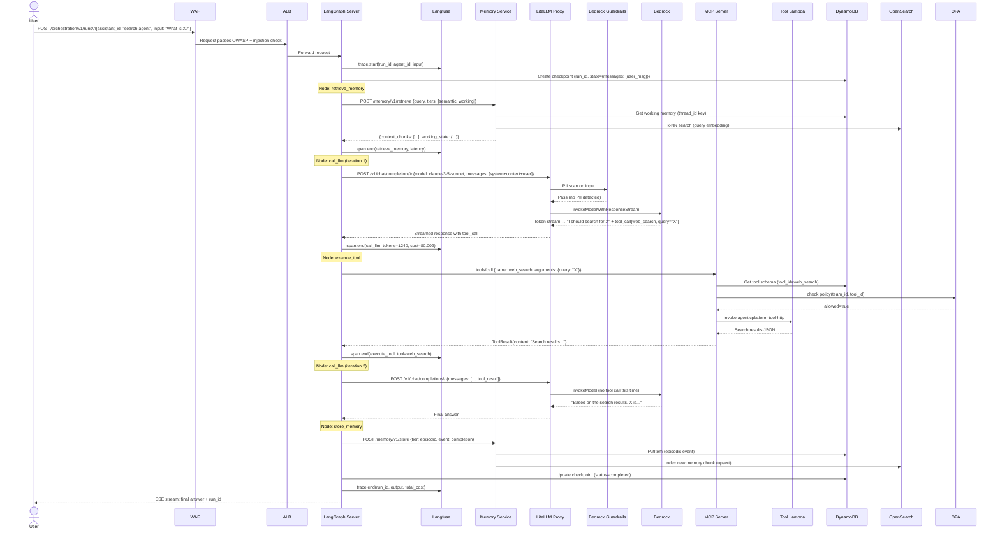
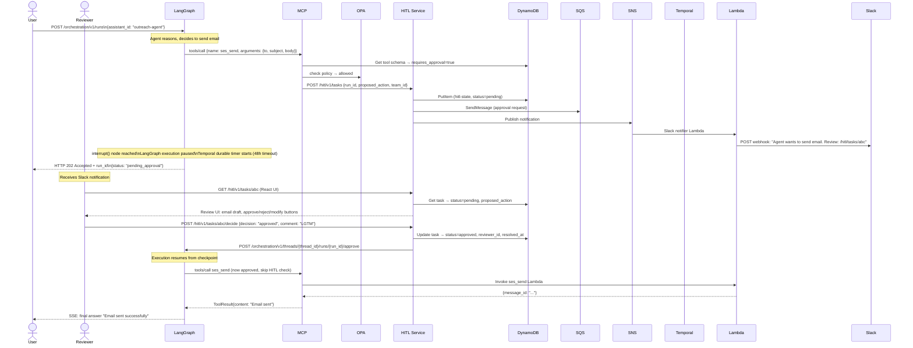
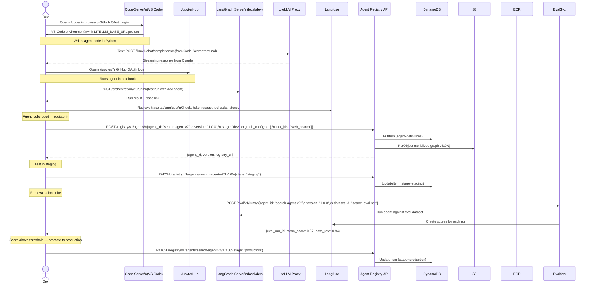
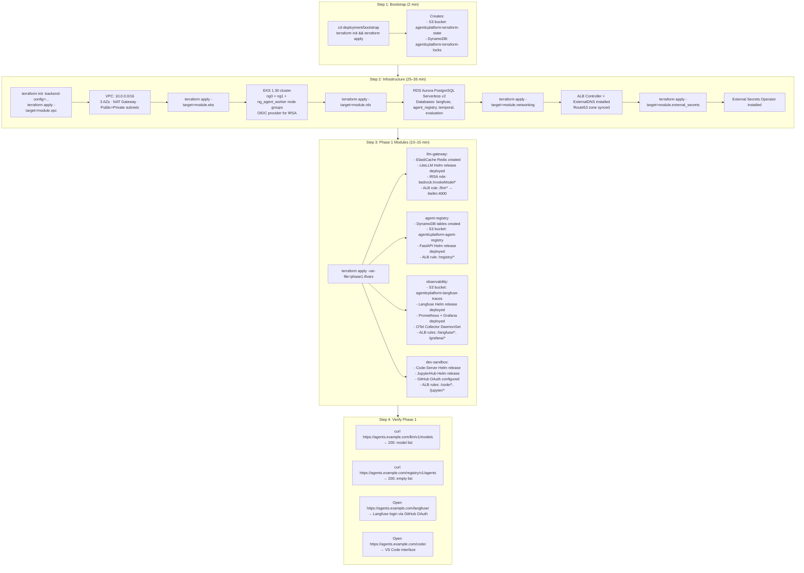

# Data Flows

End-to-end scenarios showing how data moves through the platform. Each scenario is a realistic use case.

---

## Scenario 1: Standard Agent Run (No HITL)

**User submits a question to a registered agent. Agent thinks, retrieves memory, calls a tool, and returns an answer.**



---

## Scenario 2: Agent Run with HITL (Human Approval Required)

**Agent wants to send an email. The `ses_send` tool has `requires_approval=true`. Execution pauses until a human approves.**



---

## Scenario 3: Developer Registers a New Agent

**Developer writes an agent in Code-Server, tests it in JupyterHub, then registers it in the Agent Registry.**



---

## Scenario 4: Memory Retrieval and Storage Flow

**Detailed flow showing how the four memory tiers interact during a single agent run.**

```mermaid
graph TB
    subgraph AgentRun["Agent Run: run-abc123 / thread-xyz789"]
        MSG[User Message:\n'Continue our analysis\nfrom last week']
    end

    subgraph MemoryRetrieve["Memory Retrieve (beginning of run)"]
        R1[1. Working Memory\nRedis GET thread:xyz789:state\n→ last 5 messages + tool results\nLatency: ~1ms]
        R2[2. Episodic Memory\nDynamoDB Query: agent_id=search-agent\nSK between timestamps\n→ last week's run events\nLatency: ~5ms]
        R3[3. Semantic Memory\nOpenSearch kNN search\nEmbedding: 'analysis last week'\ntop-k=5 relevant chunks\nLatency: ~45ms]
        R4[Memory Service\nMerges + deduplicates results\nReturns 2000 token context window]
    end

    subgraph LLMCall["LLM Call with Context"]
        PROMPT[System: You are a research agent\nContext: {retrieved_memory}\nHistory: {working_memory}\nUser: {new_message}]
    end

    subgraph MemoryStore["Memory Store (end of run)"]
        S1[1. Update Working Memory\nRedis SET thread:xyz789:state\nNew messages appended\nTTL refreshed to 24h]
        S2[2. Write Episodic Event\nDynamoDB PutItem\nevent_type: completion\nsummary: 'User asked about X, agent responded Y'\nTTL: 90 days]
        S3[3. Upsert Semantic Memory\nGenerate embedding for run summary\nOpenSearch index: upsert\nKey insight: 'Analysis conclusion: X leads to Y']
    end

    MSG --> R1 & R2 & R3 --> R4 --> PROMPT
    PROMPT --> S1 & S2 & S3
```

---

## Scenario 5: Evaluation Run and A/B Test

**Platform operator runs an evaluation comparing prompt_v1 vs prompt_v2 on the same test dataset.**

```mermaid
sequenceDiagram
    actor Operator
    participant EvalSvc as Evaluation Service
    participant Registry as Agent Registry
    participant LangGraph
    participant LiteLLM
    participant Bedrock
    participant Langfuse
    participant Grafana

    Operator->>EvalSvc: POST /eval/v1/ab-tests\n{control: {agent_id, prompt: v1},\n treatment: {agent_id, prompt: v2},\n dataset_id: "search-golden-set",\n traffic_split: 50,\n sample_size: 100}

    EvalSvc->>Registry: GET /registry/v1/prompts/search-system/v1
    EvalSvc->>Registry: GET /registry/v1/prompts/search-system/v2

    loop 100 test cases
        EvalSvc->>EvalSvc: Assign variant (hash(test_case_id) % 2)

        alt Variant: control (prompt_v1)
            EvalSvc->>LangGraph: POST /runs\n{prompt_template: v1, input: test_case}
        else Variant: treatment (prompt_v2)
            EvalSvc->>LangGraph: POST /runs\n{prompt_template: v2, input: test_case}
        end

        LangGraph->>LiteLLM: Chat completion
        LiteLLM->>Bedrock: InvokeModel
        Bedrock-->>LangGraph: Response
        LangGraph->>Langfuse: Trace (tagged: ab_test=true, variant=control|treatment)
        LangGraph-->>EvalSvc: Run result

        EvalSvc->>LiteLLM: LLM-as-judge: score response (0-1)
        LiteLLM->>Bedrock: Judge prompt
        Bedrock-->>LiteLLM: Score
        EvalSvc->>Langfuse: POST /api/public/scores\n{run_id, name: "llm_judge_score", value: 0.87}
    end

    EvalSvc->>Langfuse: GET /api/public/scores?tag=ab_test_id=xyz
    Note over EvalSvc: Calculate: mean score per variant\nStatistical significance (t-test)

    EvalSvc-->>Operator: {
        control_mean: 0.78,
        treatment_mean: 0.87,
        p_value: 0.02,
        recommendation: "treatment (prompt_v2) is significantly better"
    }

    Operator->>Grafana: Views ab-test-results dashboard
    Grafana->>Langfuse: Query scores by tag
    Grafana-->>Operator: Score distributions, confidence intervals

    Operator->>Registry: PATCH /registry/v1/prompts/search-system/v2\n{stage: production}
```

---

## Scenario 6: Platform Startup and Bootstrap

**First-time deployment sequence from zero to Phase 1 running.**



---

## Scenario 7: Cost Monitoring and Budget Alerting

**How the platform tracks and alerts on LLM spend per team.**

```mermaid
graph LR
    subgraph Generation["Cost Data Generation"]
        LiteLLM[LiteLLM Proxy\nPer-request: tokens + cost\ncalculated from pricing table]
        CB[LiteLLM Callbacks\nPUSH to Langfuse trace\nPUSH to Prometheus counter]
    end

    subgraph Storage["Cost Data Storage"]
        PROM[Prometheus\nlitellm_cost_total label: model, team]
        LF_DB[Langfuse\nCost field on every LLM span]
        CW[CloudWatch\nAWS Bedrock usage metrics\n(ground truth for billing)]
    end

    subgraph Visualization["Visualization"]
        GRAFANA[Grafana: token-cost.json\nDaily spend by team\nBudget gauge: actual vs limit\nTop 5 models by cost]
        LF_DASH[Langfuse: Cost dashboard\nPer-trace cost\nCost per agent type]
    end

    subgraph Alerting["Alerting"]
        PA[Prometheus AlertManager\nAlert: daily_team_cost > budget_limit\nSends SNS → email/Slack]
        LF_ALERT[Langfuse Score Alert\nAlert: cost per run > $1.00\n(LLM running away?)]
    end

    LiteLLM --> CB --> PROM & LF_DB
    CW --> PROM
    PROM --> GRAFANA & PA
    LF_DB --> LF_DASH & LF_ALERT
```

**Budget enforcement hierarchy**:
1. **Hard limit** (LiteLLM per-team TPM/RPM): returns `429` when exceeded — blocks runaway agents immediately
2. **Soft alert** (Prometheus AlertManager): notifies team lead when 80% of daily budget consumed
3. **Audit** (AWS Cost Explorer + resource tags): monthly per-team actual Bedrock spend for finance reporting
