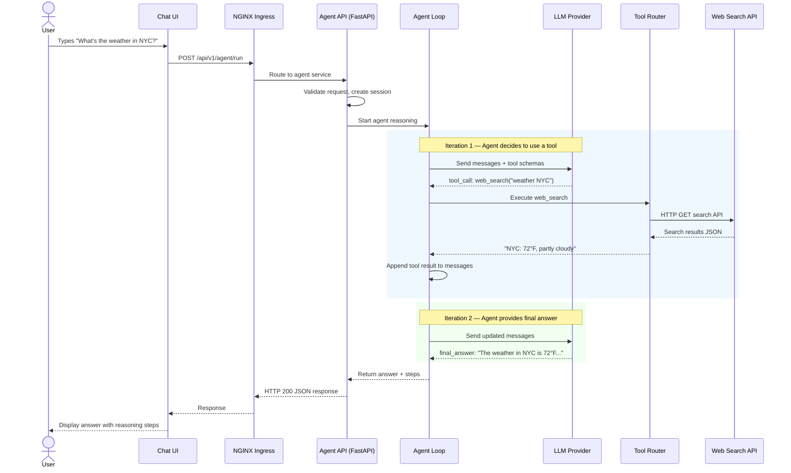
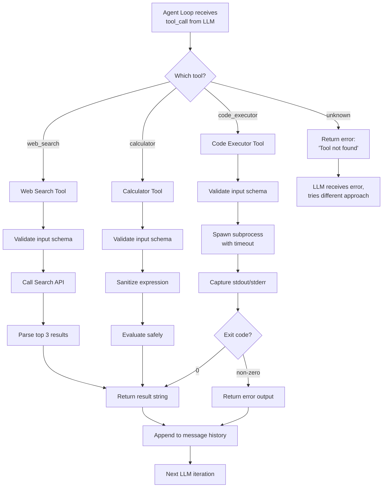
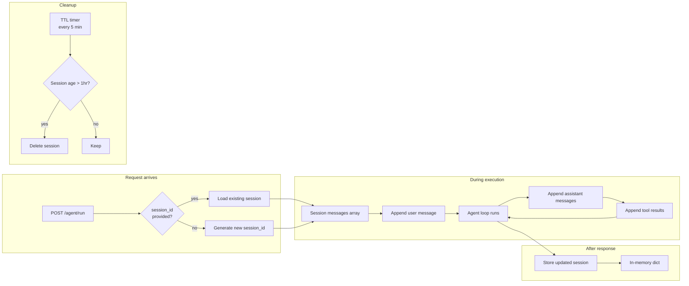
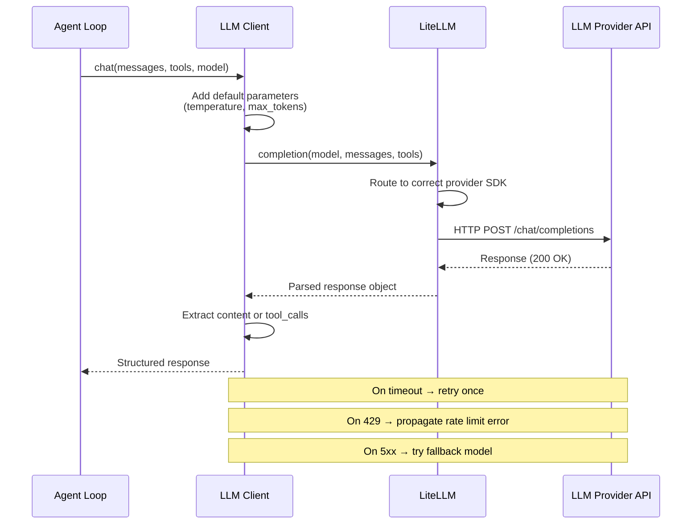
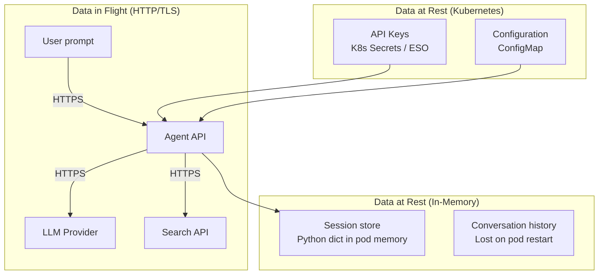
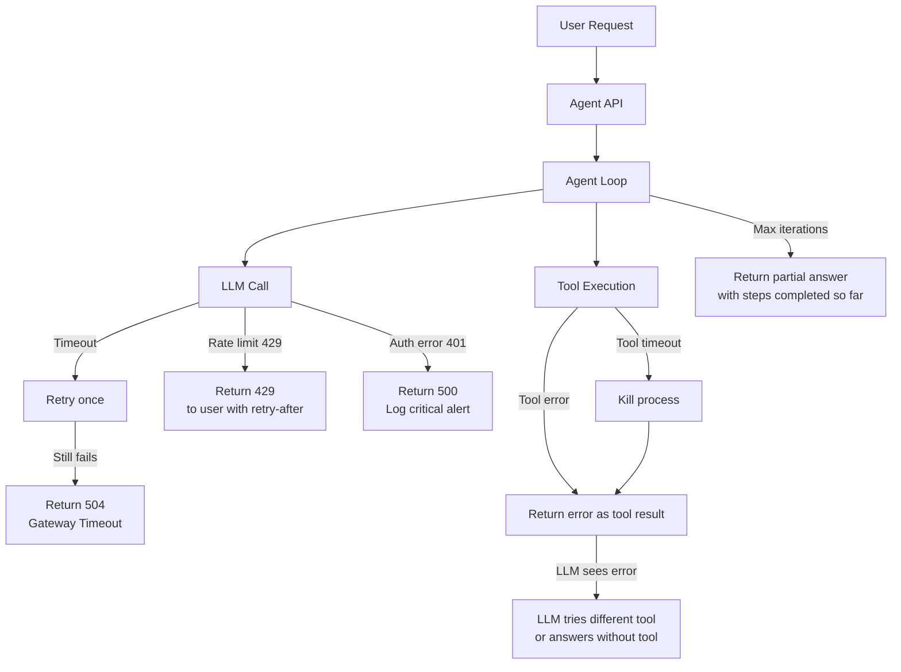

# Phase 0: Prototype — Data Flow Diagrams

> **Objective:** Trace every data path through the prototype system — from user input to final response.

---

## 1. End-to-End Request Flow

---

## 2. Tool Execution Flow

---

## 3. Session Data Lifecycle

---

## 4. LLM Communication Flow

---

## 5. Data at Rest vs. Data in Flight

| Data | Location | Encrypted? | Persistent? |
|------|----------|-----------|-------------|
| User prompts | In-memory | No (in pod) | No |
| LLM responses | In-memory | No (in pod) | No |
| Tool results | In-memory | No (in pod) | No |
| API keys | K8s Secrets | At rest (etcd encryption) | Yes |
| Config | ConfigMap | No | Yes |
| Network traffic | Ingress → Service | TLS terminated at ingress | n/a |

---

## 6. Error Propagation Flow

