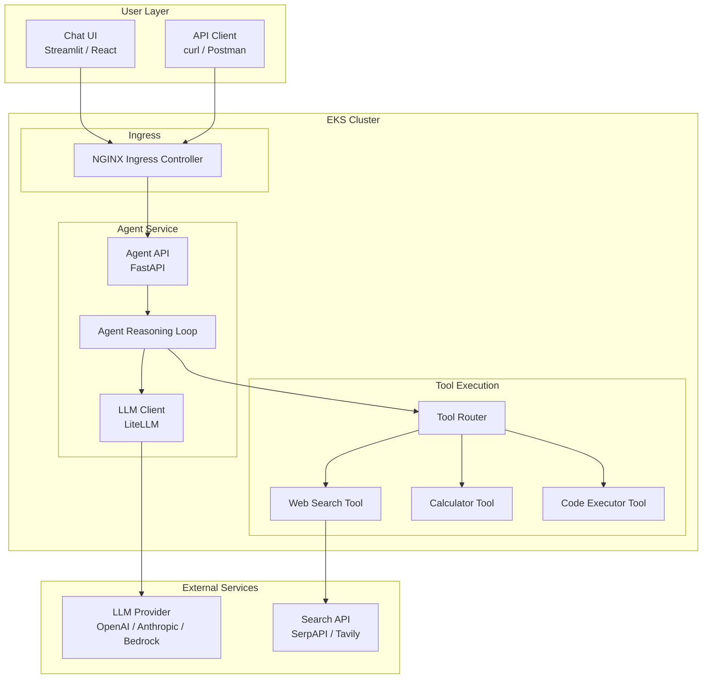
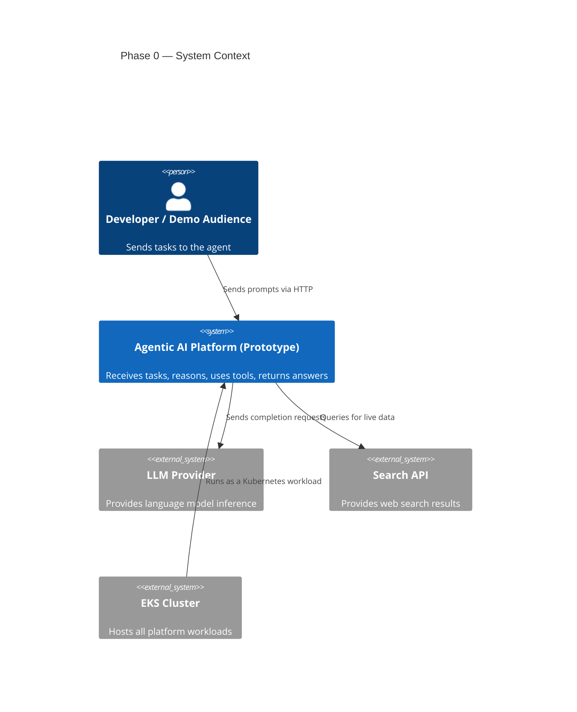
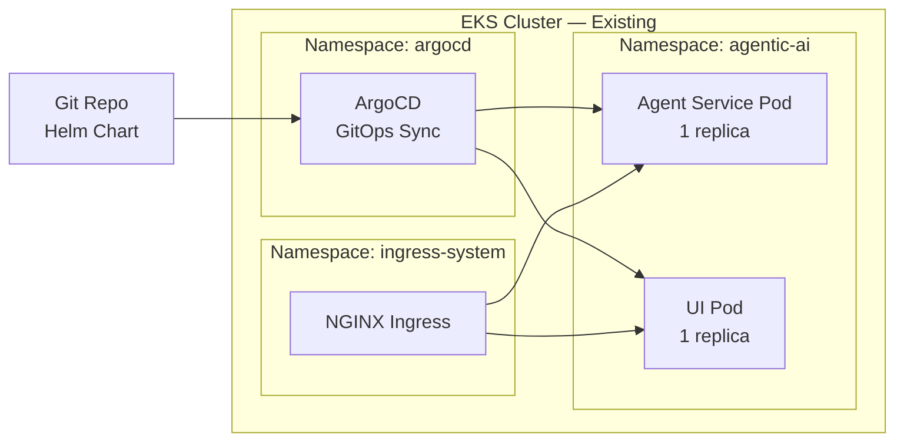

# Phase 0: Prototype — High-Level Design

> **Objective:** Prove the core agent loop works end-to-end on EKS. One agent, one endpoint, a couple of tools, a simple UI.

---

## Team Thinking

**Product Lead:** "We need to validate that an agent running on our existing EKS cluster can receive a task, reason about it, call tools, and return a useful answer — all within acceptable latency. Nothing fancy. Just prove the loop."

**Platform Engineer:** "We already have EKS, ArgoCD, External Secrets, and Terraform. The agent service is just another workload. I'll package it as a Helm chart and deploy it like everything else."

**Backend Engineer:** "I'll build the agent runtime as a FastAPI service. It receives a prompt, talks to an LLM, decides which tool to call, executes it, and returns the result. Stateless for now."

**Frontend Engineer:** "A Streamlit app or a minimal React chat UI. Just enough to demo it. No auth, no persistence."

---

## High-Level Architecture

---

## System Boundaries

---

## Component Responsibilities

| Component | Responsibility | Owner |
|-----------|---------------|-------|
| **Agent API** | HTTP endpoint, request validation, response formatting | Backend Engineer |
| **Agent Loop** | LLM call → tool decision → tool execution → repeat or return | Backend Engineer |
| **LLM Client** | Abstraction over LLM providers, prompt formatting | Backend Engineer |
| **Tool Router** | Maps tool names to executors, validates tool inputs | Backend Engineer |
| **Tools (2-3)** | Concrete tool implementations (search, calc, code exec) | Backend Engineer |
| **Chat UI** | Simple interface for demo purposes | Frontend Engineer |
| **Helm Chart** | Packaging, deployment config, resource limits | Platform Engineer |
| **Ingress** | Route external traffic to agent service | Platform Engineer |

---

## Key Design Decisions

| Decision | Choice | Rationale |
|----------|--------|-----------|
| Framework | No heavy framework (no LangChain) | Keep it simple, understand every line, avoid abstraction tax |
| LLM abstraction | LiteLLM | Swap providers without code changes, test different models easily |
| Deployment | Helm on existing EKS | Leverage existing infra — no new clusters, no new tools |
| UI | Streamlit | Fastest path to a working demo — one Python file |
| State | In-memory only | Prototype scope — persistence comes in Phase 1 |
| Auth | None | Internal demo only — security comes in Phase 1 |

---

## Deployment Topology

---

## Non-Goals for Phase 0

- No persistent storage
- No authentication or multi-tenancy
- No auto-scaling
- No multi-agent orchestration
- No guardrails or content filtering
- No production SLAs
