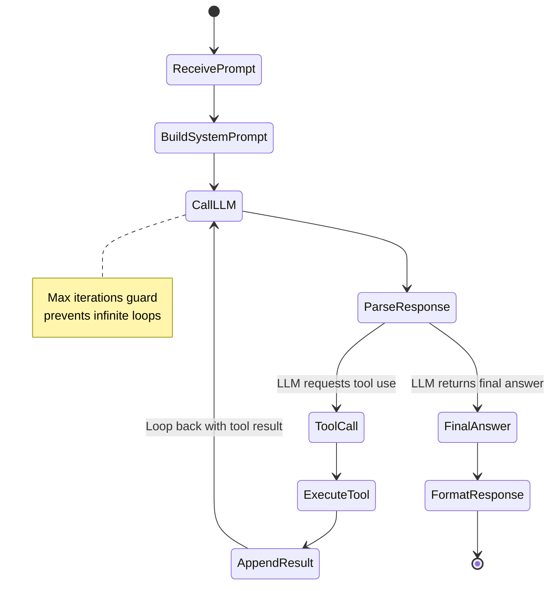
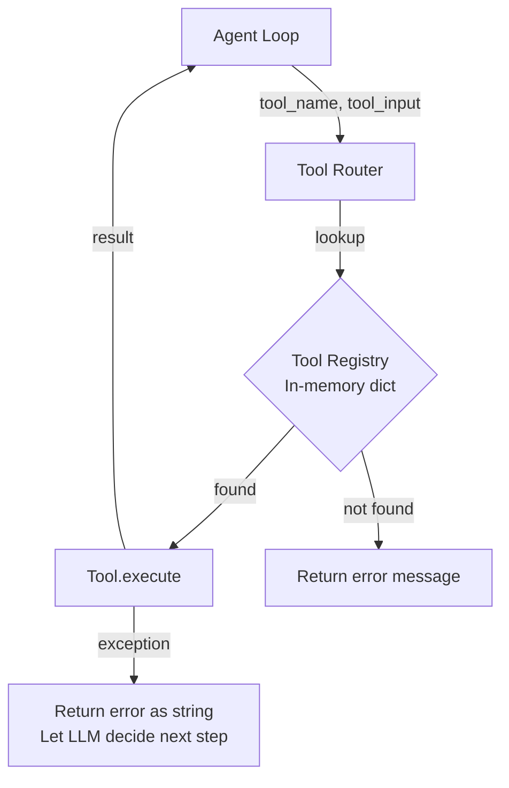
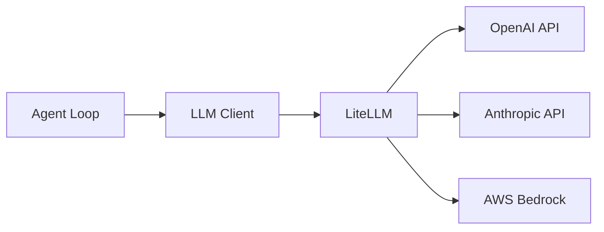
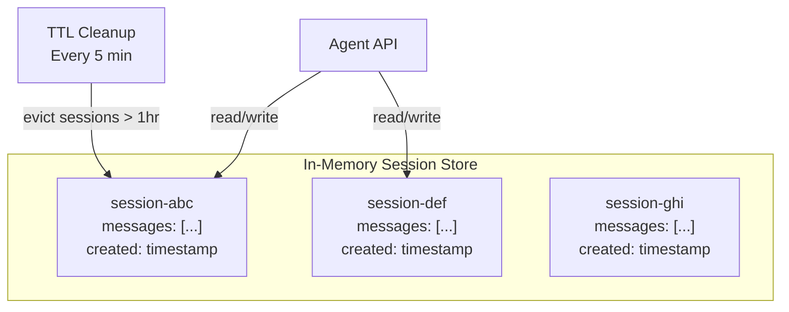

# Phase 0: Prototype — Low-Level Design

> **Objective:** Detail every component, API contract, data structure, and interaction for the prototype agent system.

---

## 1. Agent API Service

### API Contract

```
POST /api/v1/agent/run
```

**Request:**
```json
{
  "session_id": "optional-uuid",
  "prompt": "What is the current price of Bitcoin and calculate 15% of it?",
  "model": "gpt-4o",
  "max_iterations": 5,
  "tools_enabled": ["web_search", "calculator"]
}
```

**Response:**
```json
{
  "session_id": "uuid",
  "status": "completed",
  "answer": "Bitcoin is currently $67,432. 15% of that is $10,114.80.",
  "steps": [
    {
      "step": 1,
      "thought": "I need to find the current Bitcoin price first.",
      "tool_used": "web_search",
      "tool_input": {"query": "current bitcoin price"},
      "tool_output": "$67,432",
      "duration_ms": 1200
    },
    {
      "step": 2,
      "thought": "Now I need to calculate 15% of $67,432.",
      "tool_used": "calculator",
      "tool_input": {"expression": "67432 * 0.15"},
      "tool_output": "10114.8",
      "duration_ms": 5
    }
  ],
  "metadata": {
    "total_tokens": 1847,
    "total_duration_ms": 4500,
    "model_used": "gpt-4o",
    "iterations": 2
  }
}
```

**Health Check:**
```
GET /health → { "status": "ok", "version": "0.1.0" }
```

---

## 2. Agent Reasoning Loop — Internal Design



### Loop Logic (Pseudocode)

```
function agent_run(prompt, tools, max_iterations):
    messages = [system_prompt, user_prompt]
    steps = []

    for i in range(max_iterations):
        response = llm.chat(messages, tools=tool_schemas)

        if response.has_tool_call:
            tool_name = response.tool_call.name
            tool_input = response.tool_call.arguments
            tool_output = tool_router.execute(tool_name, tool_input)

            steps.append({step: i, thought, tool_name, tool_input, tool_output})
            messages.append(assistant_message_with_tool_call)
            messages.append(tool_result_message)
        else:
            return {answer: response.content, steps: steps}

    return {answer: "Max iterations reached", steps: steps}
```

---

## 3. Tool System — Detailed Design

### Tool Interface

Every tool implements:

```
interface Tool:
    name: str              # unique identifier
    description: str       # what the LLM sees
    parameters: JSONSchema # input schema for the LLM
    execute(input) → str   # actual execution
```

### Tool Definitions

**Web Search Tool**
```
name: "web_search"
description: "Search the web for current information"
parameters:
  query: str (required) — the search query
execute:
  1. Call SerpAPI/Tavily with query
  2. Extract top 3 results (title + snippet)
  3. Return formatted text
```

**Calculator Tool**
```
name: "calculator"
description: "Evaluate mathematical expressions"
parameters:
  expression: str (required) — math expression
execute:
  1. Sanitize input (no imports, no exec)
  2. Evaluate with Python ast.literal_eval or simpleeval
  3. Return result as string
```

**Code Executor Tool**
```
name: "code_executor"
description: "Execute Python code and return output"
parameters:
  code: str (required) — Python code to execute
execute:
  1. Run in subprocess with timeout (10s)
  2. Capture stdout/stderr
  3. Return output (truncated to 2000 chars)
  Security: no network, no file write, resource limits
```

### Tool Router



---

## 4. LLM Client — Abstraction Layer



### Configuration

```yaml
llm:
  default_model: "gpt-4o"
  fallback_model: "claude-sonnet-4-20250514"
  timeout_seconds: 30
  max_tokens: 4096
  temperature: 0.1
```

API keys pulled from environment variables (mounted via Kubernetes Secrets / ESO).

---

## 5. Session Memory — In-Memory Store



- Python dictionary keyed by `session_id`
- Each session stores the full message list
- TTL-based cleanup to prevent memory leaks
- Lost on pod restart (acceptable for prototype)

---

## 6. Project Structure

```
agentic-ai-platform/
├── src/
│   ├── main.py                 # FastAPI app entry point
│   ├── agent/
│   │   ├── loop.py             # Core reasoning loop
│   │   ├── prompts.py          # System prompts & templates
│   │   └── models.py           # Pydantic request/response models
│   ├── tools/
│   │   ├── base.py             # Tool interface
│   │   ├── router.py           # Tool registry & routing
│   │   ├── web_search.py       # Web search implementation
│   │   ├── calculator.py       # Calculator implementation
│   │   └── code_executor.py    # Code execution implementation
│   ├── llm/
│   │   └── client.py           # LLM abstraction via LiteLLM
│   ├── memory/
│   │   └── session_store.py    # In-memory session management
│   └── config.py               # Configuration loading
├── ui/
│   └── app.py                  # Streamlit chat interface
├── helm/
│   └── agentic-ai/
│       ├── Chart.yaml
│       ├── values.yaml
│       └── templates/
│           ├── deployment.yaml
│           ├── service.yaml
│           ├── ingress.yaml
│           └── configmap.yaml
├── Dockerfile
├── requirements.txt
└── Makefile
```

---

## 7. Kubernetes Resources

### Agent Service Pod Spec

```yaml
resources:
  requests:
    cpu: "250m"
    memory: "512Mi"
  limits:
    cpu: "1000m"
    memory: "1Gi"

replicas: 1
```

### Environment Variables

| Variable | Source | Purpose |
|----------|--------|---------|
| `OPENAI_API_KEY` | K8s Secret / ESO | LLM auth |
| `ANTHROPIC_API_KEY` | K8s Secret / ESO | LLM auth (fallback) |
| `SEARCH_API_KEY` | K8s Secret / ESO | Web search tool auth |
| `DEFAULT_MODEL` | ConfigMap | Default LLM model |
| `MAX_ITERATIONS` | ConfigMap | Agent loop guard |
| `LOG_LEVEL` | ConfigMap | Logging verbosity |

---

## 8. Error Handling Strategy

| Scenario | Handling |
|----------|----------|
| LLM API timeout | Retry once, then return error to user |
| LLM API rate limit | Return 429 with retry-after header |
| Tool execution fails | Return error as tool result, let LLM recover |
| Tool execution timeout | Kill after 10s, return timeout error to LLM |
| Invalid tool name | Return "tool not found" to LLM, let it try again |
| Max iterations reached | Return partial answer with steps so far |
| Malformed request | Return 422 with validation details |
