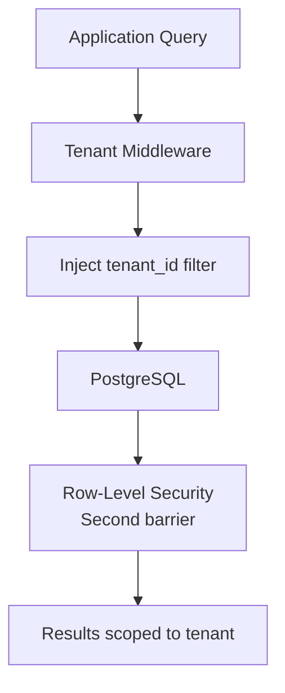
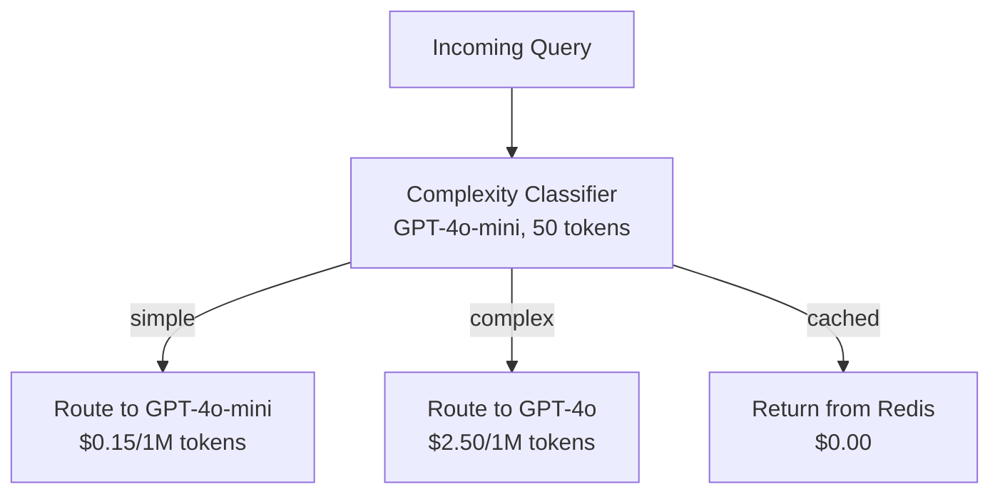

# Phase 1: Foundation — Challenges & How We Solved Them

> **The story of going from "cool prototype" to "production system that multiple teams depend on."**

---

## Challenge 1: "Redis keeps losing sessions after deployments"

### The Problem

We moved session storage from in-memory to Redis. Sessions persisted across pod restarts — great. But during Helm upgrades, Redis itself was restarting and losing all data. Turns out we deployed Redis as a single-replica Deployment with no persistence.

### The Debate

**SRE:** "We need Redis with AOF persistence and replicas."

**Platform Engineer:** "Or we use ElastiCache and let AWS manage it. One less pod to worry about."

**Backend Engineer:** "Managed Redis costs 3x more. Can we justify that for session data?"

### How We Solved It

1. **Short-term:** Enabled Redis persistence (AOF) with a PVC. Sessions survive restarts.
2. **Medium-term:** Added a Redis replica for read scaling and failover.
3. **Design change:** Made sessions *recoverable* — if a session is lost, the agent starts fresh but retrieves long-term memory from pgvector. The experience degrades gracefully instead of breaking.

**Lesson learned:** Never deploy stateful services without persistence — even "temporary" data matters when users are mid-conversation.

---

## Challenge 2: "Multi-tenancy is harder than we thought"

### The Problem

Every query, every table, every cache key needed to be scoped by `tenant_id`. We forgot to add the tenant filter on one query — the tool usage endpoint — and during testing, Team Beta could see Team Alpha's tool invocation history. Caught in code review, not in production, but it shook our confidence.

### What Went Wrong

- Row-level security was an afterthought, not a design principle
- We relied on developers remembering to add `WHERE tenant_id = ?` everywhere
- No automated test to verify tenant isolation

### How We Solved It

1. **Database middleware** — Created a query wrapper that automatically injects `tenant_id` filter on every SELECT. Developers physically cannot query without it unless they explicitly bypass (which triggers an audit log).

2. **PostgreSQL Row-Level Security (RLS)** — Enabled RLS policies on sensitive tables. Even if the middleware is bypassed, the database enforces isolation.

3. **Integration tests** — Wrote tests that create data as Tenant A, then query as Tenant B and assert zero results. Runs on every PR.

4. **Redis key convention** — All Redis keys prefixed with `tenant:{id}:`. Namespace isolation by convention, verified by linter.



---

## Challenge 3: "pgvector search is slow and returns garbage"

### The Problem

Long-term memory retrieval was returning irrelevant memories. A user asks "what's the revenue forecast?" and the vector search returns a memory about "revenue recognition accounting standards" from a different conversation. Also, search was taking 800ms+ as the memory table grew.

### What We Investigated

- Embedding quality: We were using `text-embedding-ada-002` which produces reasonable embeddings, so the model wasn't the issue
- The issue: We were embedding entire conversations, not extracting key facts. Long documents produce averaged embeddings that lose specificity.

### How We Solved It

1. **Better chunking** — Instead of embedding full conversations, we extract key facts and decisions from each conversation using an LLM summarization step. Each fact becomes a separate memory with its own embedding.

2. **Metadata filtering** — Added metadata (agent_id, topic, date) and filtered before vector search. "Revenue forecast" queries only search memories tagged with "finance" topic.

3. **Index tuning** — Switched from IVFFlat to HNSW index with better parameters. Latency dropped from 800ms to 45ms.

4. **Relevance threshold** — Only include memories with cosine similarity > 0.78. Below that, the context hurts more than it helps.

---

## Challenge 4: "We can't tell why an agent gave a wrong answer"

### The Problem

A tenant reported: "The agent told me our Q3 revenue was $14M but it's actually $12M." We couldn't reproduce it. We had no trace of:
- What tools the agent called
- What data the tools returned
- What memories were injected into context
- Which LLM call produced the wrong number

### The Debate

**SRE:** "We need distributed tracing. OpenTelemetry, Tempo, the full stack."

**Backend Engineer:** "That's a lot of instrumentation work. Can we just add more logging?"

**Product Lead:** "Logging isn't enough. I need to click on a run and see every step — tool inputs, tool outputs, LLM prompts, LLM responses. Like a debugger for agents."

### How We Solved It

Built a three-layer observability system:

1. **Structured logging** — Every log line is JSON with `run_id`, `tenant_id`, `step`, `tool_name`. Shipped to Loki. Searchable.

2. **Distributed tracing** — OpenTelemetry spans for every operation: HTTP request → auth → agent loop → LLM call → tool execution → response. Shipped to Tempo. Visualized as a waterfall in Grafana.

3. **Agent trace log** — A denormalized table that stores the complete agent reasoning chain for every run: every prompt sent to the LLM, every response, every tool call and result. This is the "flight recorder." When a tenant reports a bad answer, we pull the trace and replay the agent's thinking.

```
agent_traces table:
  run_id → [step_1, step_2, step_3, ...]
  Each step: { type, prompt, response, tool_input, tool_output, tokens, latency }
```

---

## Challenge 5: "LLM costs are growing 40% week-over-week"

### The Problem

After onboarding 3 teams, our monthly LLM bill went from $200 to $3,400 in two weeks. One team was running an agent in a loop that made 15+ LLM calls per user query. Another team's agent was including the entire conversation history (50+ messages) in every call, burning tokens on context.

### How We Solved It

1. **Per-tenant metering** — Real-time token counting, cost attribution dashboard. Every team can see their spend.

2. **Budget alerts** — Soft limits (email warning at 80% of budget) and hard limits (reject requests at 100%).

3. **Context window management** — Auto-summarize conversation history when it exceeds a threshold. Recent messages stay full, older messages get compressed into a summary.

4. **Model routing** — Simple queries (greetings, clarifications) use cheap models (GPT-4o-mini). Complex queries (multi-step reasoning) use expensive models. The first LLM call classifies the query complexity.

5. **Response caching** — Identical prompts (same tenant, same tools, same input) return cached responses from Redis. Hit rate: ~12%, but those are the most expensive queries (repeated automated workflows).



---

## Challenge 6: "Database migrations during deployments cause downtime"

### The Problem

Adding new columns or tables to PostgreSQL required running Alembic migrations. Our first approach: run migrations as part of application startup. Problem: if 3 replicas start simultaneously, 3 migrations run concurrently, causing lock contention and failed deployments.

### How We Solved It

1. **Kubernetes Job as ArgoCD pre-sync hook** — Migrations run as a one-time Job before the application pods are updated. The Job completes, then ArgoCD rolls out the new pods.

2. **Backward-compatible migrations only** — Every migration must work with both the old and new application version. No "rename column" in one step. Instead: add new column → deploy code that writes both → migrate data → deploy code that reads new → drop old column.

3. **Migration testing** — Every PR with a migration includes a test that applies it to a copy of the production schema and verifies it works.

---

## Team Retrospective — Phase 1

### What Went Well
- Multi-tenancy isolation is solid — caught the leak before production
- Observability investment is already paying off — debugging is 10x faster
- Cost tracking prevented a surprise $10K bill

### What Didn't Go Well
- pgvector tuning took longer than expected — should have benchmarked earlier
- Redis persistence was an embarrassing oversight
- Underestimated the observability instrumentation effort

### Key Metrics After Phase 1
- **3 tenants** onboarded and running agents
- **99.92% uptime** (target: 99.9%)
- **p95 latency:** 8.2 seconds (target: < 10s)
- **Monthly LLM cost:** $2,800 (down from $3,400 peak)
- **Mean time to debug:** 15 minutes (down from "we can't debug this")
