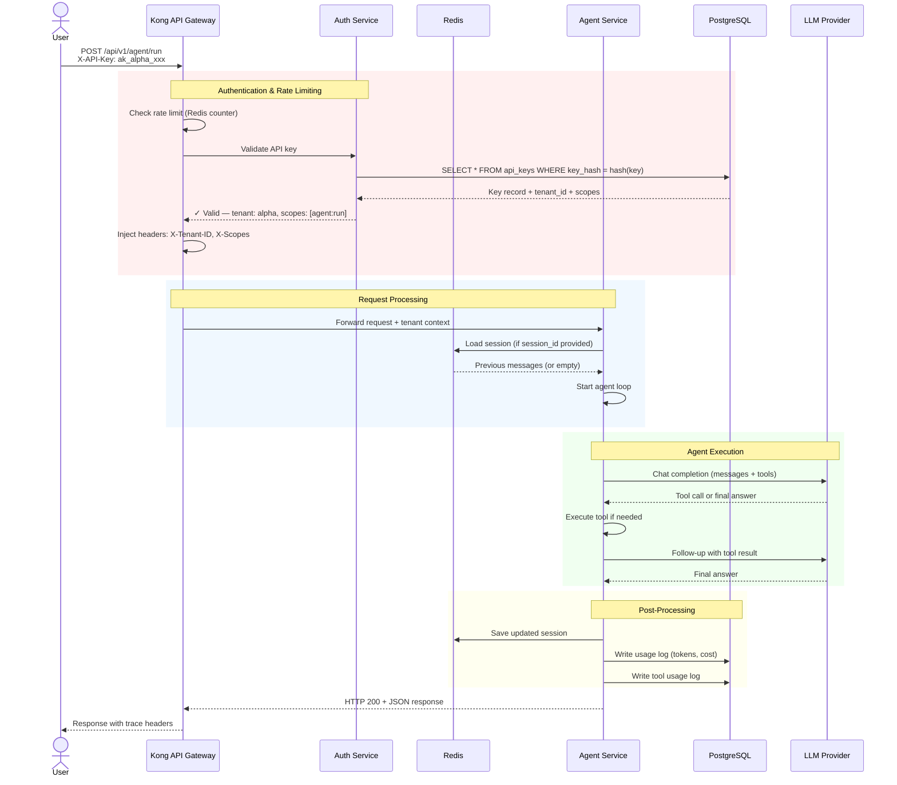
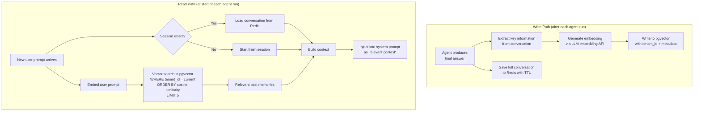
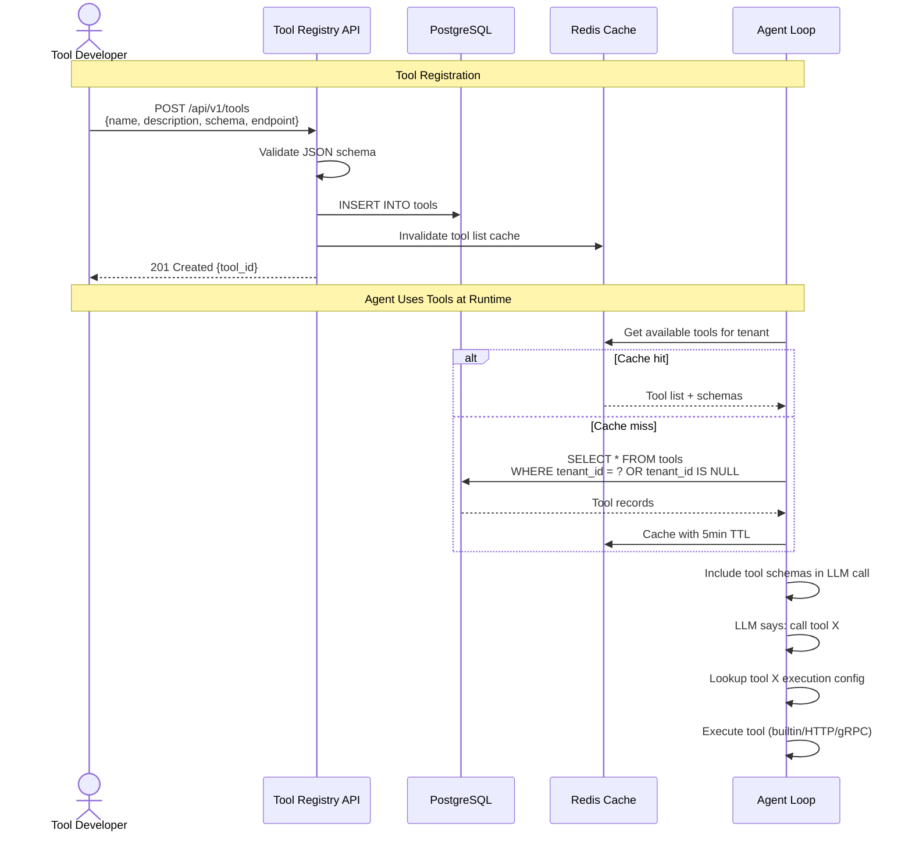
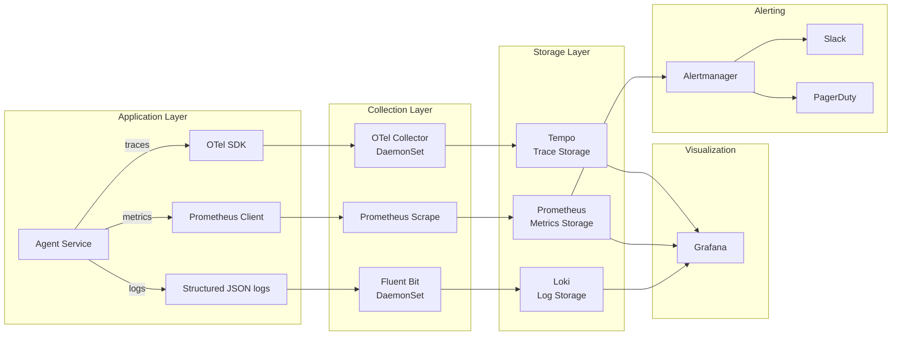
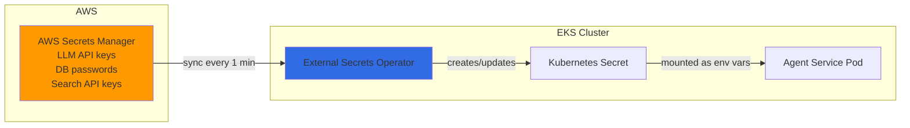
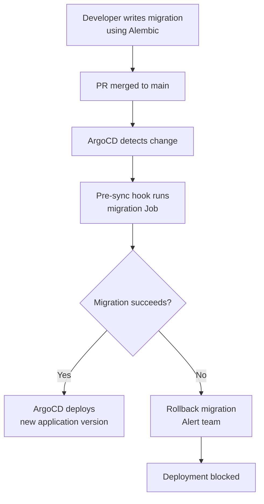

# Phase 1: Foundation — Data Flow Diagrams

> **Objective:** Trace every data path through the production-grade system — auth, state, memory, metering, observability.

---

## 1. Authenticated Request Flow



---

## 2. Memory Read/Write Flow



---

## 3. Tool Registry Data Flow



---

## 4. Cost & Metering Data Flow

```mermaid
flowchart TD
    subgraph "Real-time Metering"
        A[Every LLM call] --> B[Extract token counts<br/>from response]
        B --> C[Calculate cost<br/>using pricing table]
        C --> D[INCR Redis counter<br/>tenant:{id}:tokens:daily]
        C --> E[INSERT into usage_logs<br/>in PostgreSQL]
    end

    subgraph "Budget Enforcement"
        D --> F{Daily tokens ><br/>tenant budget?}
        F -->|No| G[Allow next request]
        F -->|Yes, soft limit| H[Log warning<br/>Notify tenant admin]
        F -->|Yes, hard limit| I[Reject request<br/>HTTP 429 with reason]
    end

    subgraph "Reporting (Async)"
        E --> J[Nightly aggregation job]
        J --> K[tenant_usage_daily table]
        K --> L[Grafana cost dashboard]
        K --> M[Monthly billing report]
    end
```

---

## 5. Observability Data Flow



---

## 6. Secret Management Flow



| Secret | Source | Mounted As |
|--------|--------|-----------|
| `OPENAI_API_KEY` | AWS Secrets Manager | Env var |
| `ANTHROPIC_API_KEY` | AWS Secrets Manager | Env var |
| `DATABASE_URL` | AWS Secrets Manager | Env var |
| `REDIS_URL` | AWS Secrets Manager | Env var |
| `SEARCH_API_KEY` | AWS Secrets Manager | Env var |

---

## 7. Database Migration Flow


