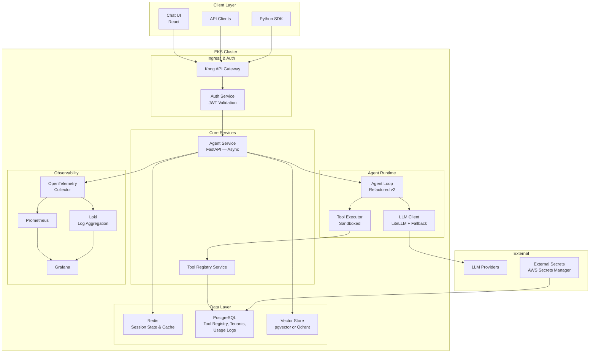
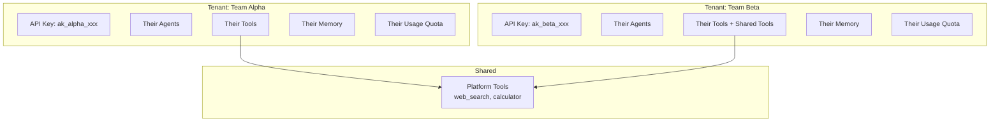

# Phase 1: Foundation — High-Level Design

> **Objective:** Take the prototype to production-grade. Persistent memory, authentication, multi-tenancy, tool registry, observability, and cost tracking.

---

## Team Thinking

**Product Lead:** "The prototype proved the concept. Now we need it running 24/7, serving multiple teams, with visibility into what agents are doing and how much they cost. No more 'it works on my cluster.'"

**Platform Engineer:** "This is where we earn our keep. Persistent state means databases. Multi-tenancy means isolation. Observability means tracing every agent decision. I need to design the data layer properly."

**Backend Engineer:** "The agent loop from Phase 0 was solid but brittle. I need to refactor it into a proper service — async execution, structured logging, graceful shutdown, health checks that actually mean something."

**SRE:** "I'm joining the team now. My job is to make sure this thing doesn't page us at 3am. That means proper alerting, runbooks, and capacity planning."

**Security Engineer:** "No more 'auth: none.' Every request gets authenticated. Every agent is scoped to a tenant. API keys are rotated. Secrets are never in plaintext."

---

## High-Level Architecture

---

## Multi-Tenancy Model

| Isolation Level | What's Isolated | Implementation |
|----------------|-----------------|----------------|
| **API Keys** | Each tenant has unique keys | Kong consumer groups |
| **Data** | Sessions, memory, logs | Tenant ID column in every table |
| **Tools** | Custom tools per tenant + shared catalog | Tool ownership in registry |
| **Costs** | Token usage tracked per tenant | Metering middleware |
| **Rate Limits** | Per-tenant rate limits | Kong rate limiting plugin |

---

## Component Ownership

| Component | Team | Responsibility |
|-----------|------|---------------|
| **Kong Gateway** | Platform | Routing, rate limiting, SSL termination |
| **Auth Service** | Security | JWT validation, API key management |
| **Agent Service v2** | Backend | Async agent execution, session management |
| **Tool Registry** | Backend | CRUD for tools, schema validation |
| **Redis** | Platform | Deployment, backup, monitoring |
| **PostgreSQL** | Platform | Deployment, migrations, backup |
| **Vector Store** | Backend + Platform | Schema design + operational management |
| **Observability Stack** | SRE | Dashboards, alerts, runbooks |
| **Cost Tracking** | Backend + Product | Metering logic + reporting UI |

---

## Key Design Decisions

| Decision | Choice | Rationale |
|----------|--------|-----------|
| API Gateway | Kong (OSS) | Already in Kubernetes ecosystem, plugin system for auth/rate-limit |
| Database | PostgreSQL (RDS) | Reliable, already operational, pgvector for embeddings |
| Cache/State | Redis (ElastiCache) | Session store, LLM response cache, pub/sub for async |
| Vector Store | pgvector (in Postgres) | One less database to manage, good enough for Phase 1 scale |
| Observability | OpenTelemetry → Prometheus + Grafana + Loki | Standard stack, already partially deployed |
| Auth | API Keys → JWT | Simple to start, JWT for service-to-service auth |
| Async execution | FastAPI background tasks + Redis queue | Lightweight — no Celery yet |

---

## SLA Targets

| Metric | Target | Measurement |
|--------|--------|-------------|
| API availability | 99.9% | Uptime of `/health` endpoint |
| Agent response latency (p95) | < 10 seconds | End-to-end including LLM calls |
| Tool registry CRUD | < 200ms p99 | Database operations |
| Error rate | < 1% | Non-4xx server errors |
| Data durability | 99.99% | PostgreSQL with daily backups |
