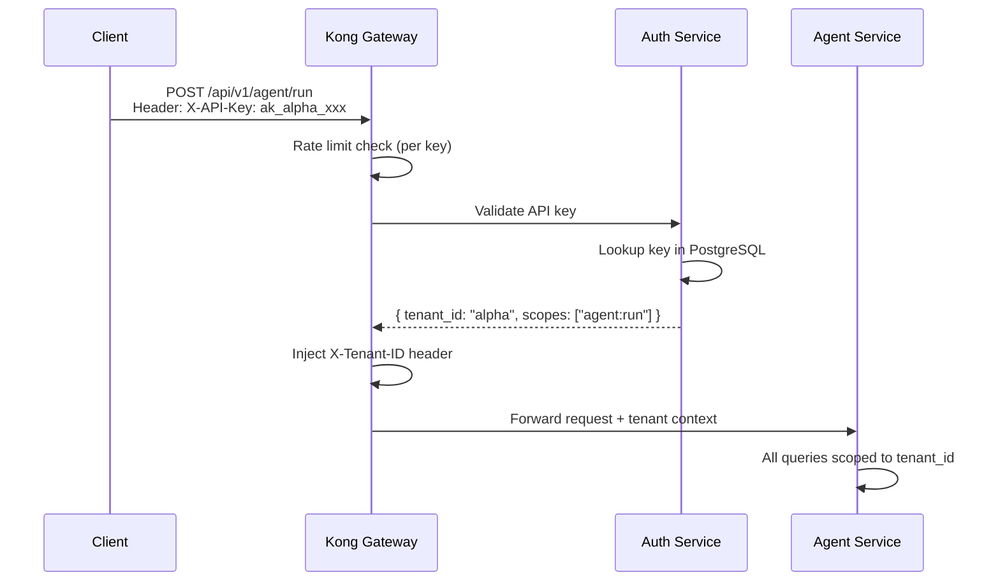
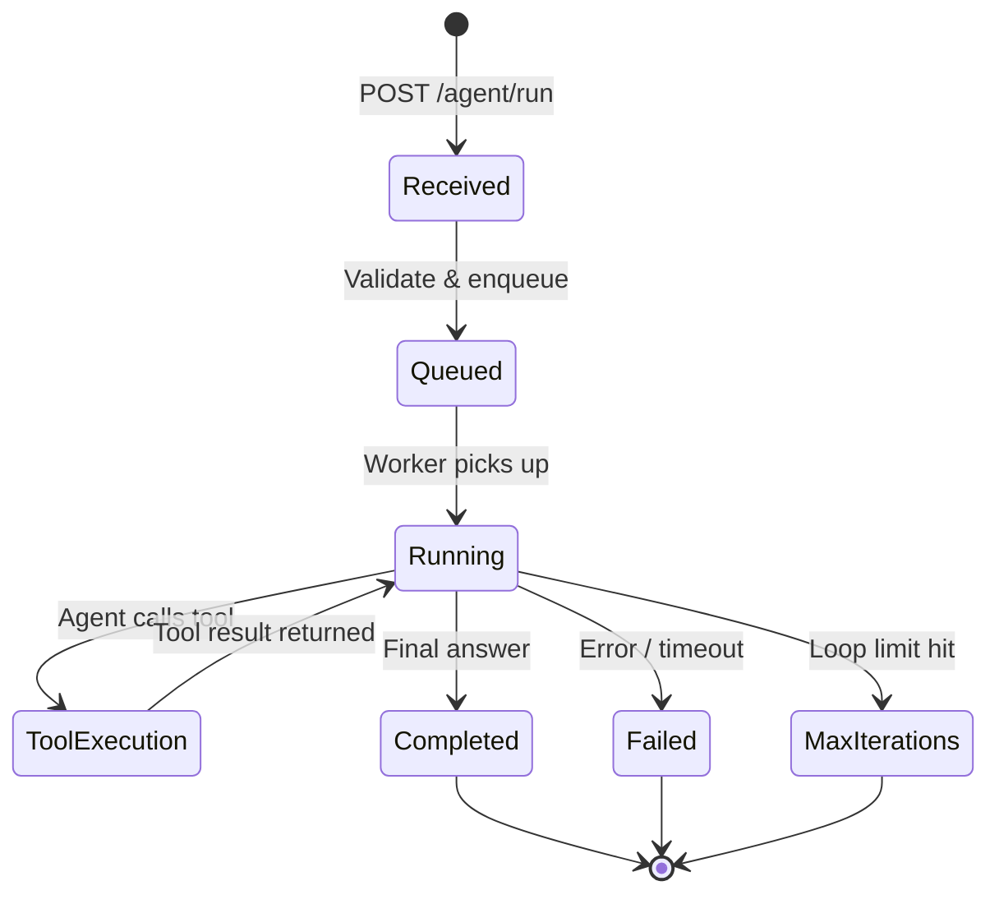
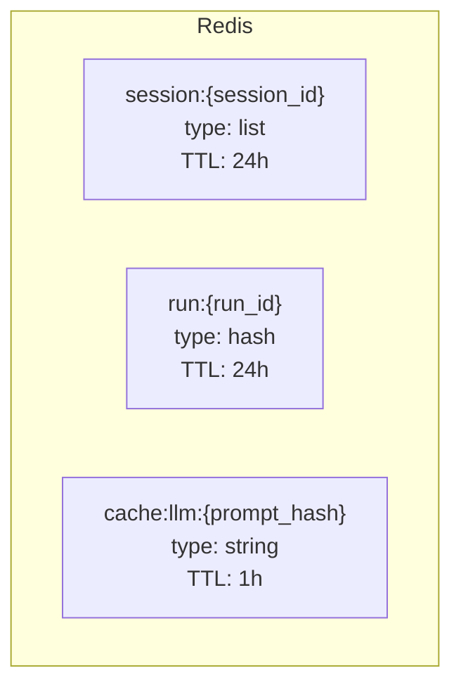
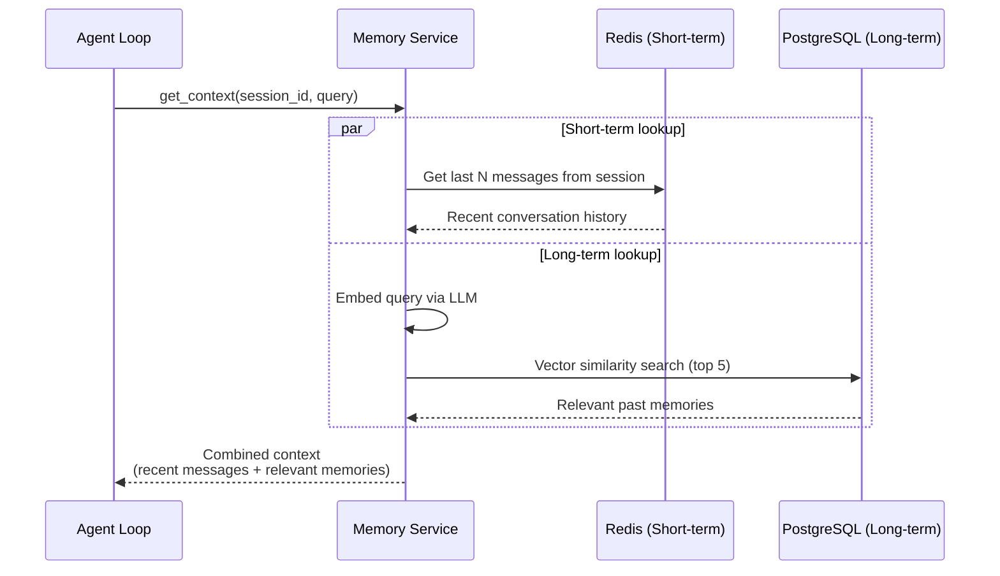
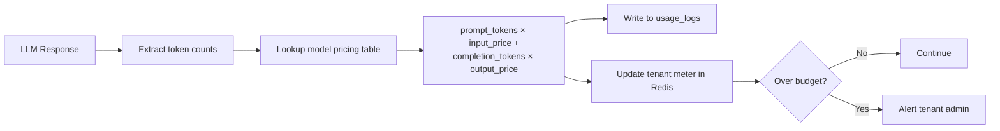
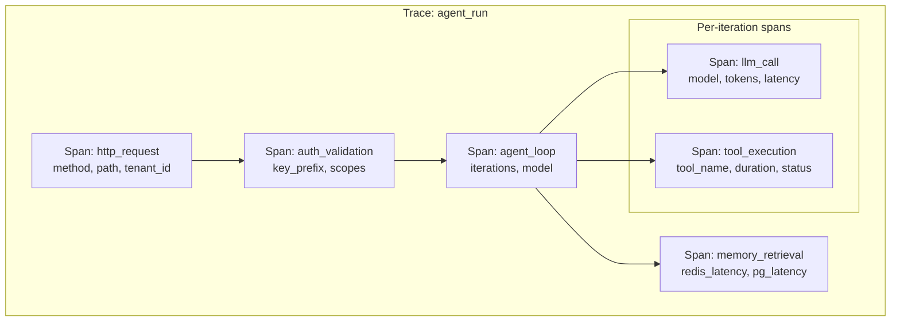

# Phase 1: Foundation — Low-Level Design

> **Objective:** Detailed design for every service, schema, API, and integration needed to make the platform production-grade.

---

## 1. Auth & API Key Management

### API Key Format

```
ak_<tenant_id>_<random_32_chars>
Example: ak_alpha_a8f3b2c1d4e5f6a7b8c9d0e1f2a3b4c5
```

### Auth Flow



### API Key Table Schema

```sql
CREATE TABLE api_keys (
    id UUID PRIMARY KEY DEFAULT gen_random_uuid(),
    tenant_id VARCHAR(64) NOT NULL REFERENCES tenants(id),
    key_hash VARCHAR(128) NOT NULL,  -- bcrypt hash, never store plaintext
    key_prefix VARCHAR(16) NOT NULL, -- "ak_alpha_a8f3" for identification
    name VARCHAR(255),
    scopes TEXT[],
    created_at TIMESTAMPTZ DEFAULT now(),
    expires_at TIMESTAMPTZ,
    last_used_at TIMESTAMPTZ,
    is_active BOOLEAN DEFAULT true
);

CREATE INDEX idx_api_keys_hash ON api_keys(key_hash);
CREATE INDEX idx_api_keys_tenant ON api_keys(tenant_id);
```

---

## 2. Agent Service v2 — Async Execution

### Execution Model



### Synchronous vs Asynchronous Mode

| Mode | Endpoint | Behavior |
|------|----------|----------|
| **Sync** | `POST /api/v1/agent/run` | Block until completion, stream response via SSE |
| **Async** | `POST /api/v1/agent/run/async` | Return `run_id` immediately, poll for result |
| **Poll** | `GET /api/v1/agent/run/{run_id}` | Get status and result of async run |

### Async Run State in Redis

```json
{
  "run_id": "uuid",
  "tenant_id": "alpha",
  "status": "running",
  "created_at": "2026-04-04T10:00:00Z",
  "steps": [
    {"step": 1, "tool": "web_search", "status": "completed"}
  ],
  "result": null,
  "error": null
}
```

TTL: 24 hours after completion.

---

## 3. Persistent Memory Architecture

### Short-Term Memory (Redis)



- **Session messages** — Conversation history per session, stored as a Redis list
- **Run state** — Current execution status for async runs
- **LLM cache** — Cache identical prompts to reduce cost and latency

### Long-Term Memory (pgvector)

```sql
CREATE TABLE memories (
    id UUID PRIMARY KEY DEFAULT gen_random_uuid(),
    tenant_id VARCHAR(64) NOT NULL,
    agent_id VARCHAR(128),
    content TEXT NOT NULL,
    embedding vector(1536),  -- OpenAI ada-002 dimensions
    metadata JSONB,
    created_at TIMESTAMPTZ DEFAULT now()
);

CREATE INDEX idx_memories_tenant ON memories(tenant_id);
CREATE INDEX idx_memories_embedding ON memories
    USING ivfflat (embedding vector_cosine_ops)
    WITH (lists = 100);
```

### Memory Retrieval Flow



---

## 4. Tool Registry — Database Design

### Schema

```sql
CREATE TABLE tools (
    id UUID PRIMARY KEY DEFAULT gen_random_uuid(),
    tenant_id VARCHAR(64),            -- NULL = shared/platform tool
    name VARCHAR(128) NOT NULL,
    description TEXT NOT NULL,
    version VARCHAR(32) DEFAULT '1.0.0',
    input_schema JSONB NOT NULL,      -- JSON Schema for tool parameters
    auth_config JSONB,                -- How the tool authenticates
    endpoint_url VARCHAR(512),        -- For HTTP-based tools
    execution_type VARCHAR(32),       -- 'builtin', 'http', 'grpc', 'lambda'
    rate_limit_rpm INTEGER DEFAULT 60,
    timeout_ms INTEGER DEFAULT 10000,
    is_active BOOLEAN DEFAULT true,
    created_at TIMESTAMPTZ DEFAULT now(),
    updated_at TIMESTAMPTZ DEFAULT now(),

    UNIQUE(tenant_id, name, version)
);

CREATE TABLE tool_usage (
    id UUID PRIMARY KEY DEFAULT gen_random_uuid(),
    tool_id UUID REFERENCES tools(id),
    tenant_id VARCHAR(64) NOT NULL,
    run_id UUID,
    input_summary TEXT,
    output_summary TEXT,
    duration_ms INTEGER,
    status VARCHAR(32),
    tokens_used INTEGER,
    created_at TIMESTAMPTZ DEFAULT now()
);
```

### Tool Registry API

```
GET    /api/v1/tools                   — List available tools (tenant-scoped)
POST   /api/v1/tools                   — Register a new tool
GET    /api/v1/tools/{id}              — Get tool details
PUT    /api/v1/tools/{id}              — Update tool
DELETE /api/v1/tools/{id}              — Deactivate tool
POST   /api/v1/tools/{id}/test         — Test tool with sample input
```

---

## 5. Cost Tracking & Metering

### Token Usage Table

```sql
CREATE TABLE usage_logs (
    id UUID PRIMARY KEY DEFAULT gen_random_uuid(),
    tenant_id VARCHAR(64) NOT NULL,
    run_id UUID,
    model VARCHAR(128),
    prompt_tokens INTEGER,
    completion_tokens INTEGER,
    total_tokens INTEGER,
    estimated_cost_usd DECIMAL(10, 6),
    created_at TIMESTAMPTZ DEFAULT now()
);

CREATE INDEX idx_usage_tenant_time ON usage_logs(tenant_id, created_at);
```

### Cost Calculation



---

## 6. Observability — Tracing Design

### Trace Structure



### Key Metrics

| Metric | Type | Labels |
|--------|------|--------|
| `agent_run_duration_seconds` | Histogram | tenant, model, tool_count |
| `agent_run_total` | Counter | tenant, status |
| `llm_call_duration_seconds` | Histogram | model, provider |
| `llm_tokens_total` | Counter | tenant, model, type (prompt/completion) |
| `tool_execution_duration_seconds` | Histogram | tool_name, status |
| `tool_execution_total` | Counter | tool_name, tenant, status |
| `active_sessions` | Gauge | tenant |
| `memory_retrieval_duration_seconds` | Histogram | store (redis/pgvector) |

### Grafana Dashboards

1. **Agent Overview** — Total runs, success rate, avg latency, active sessions
2. **LLM Usage** — Token consumption, cost trends, model distribution
3. **Tool Performance** — Tool call frequency, latency percentiles, error rates
4. **Tenant Usage** — Per-tenant breakdown of runs, tokens, cost
5. **Infrastructure** — Pod CPU/memory, Redis connections, Postgres query latency
