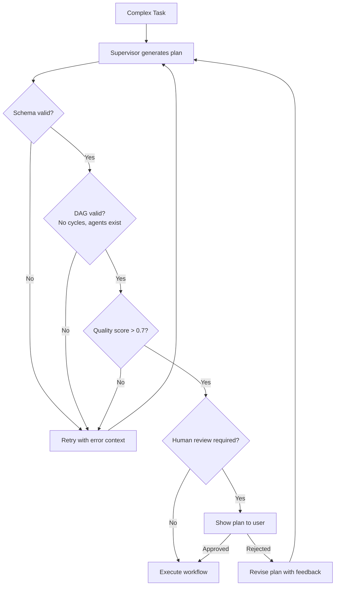
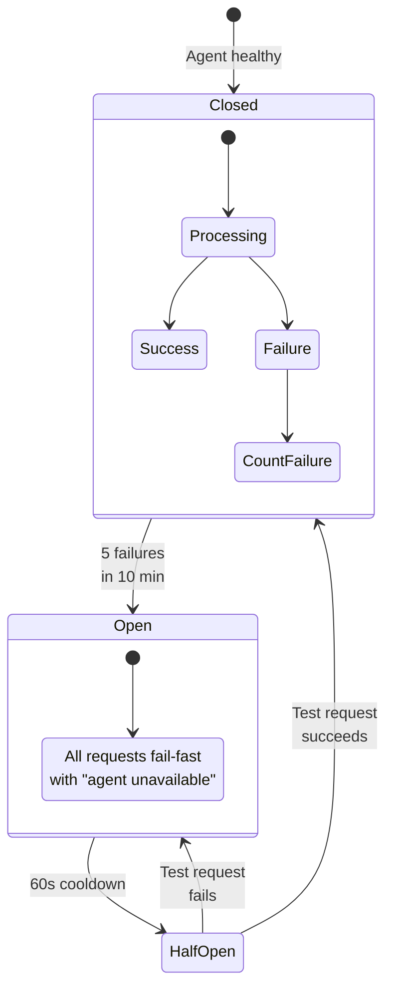
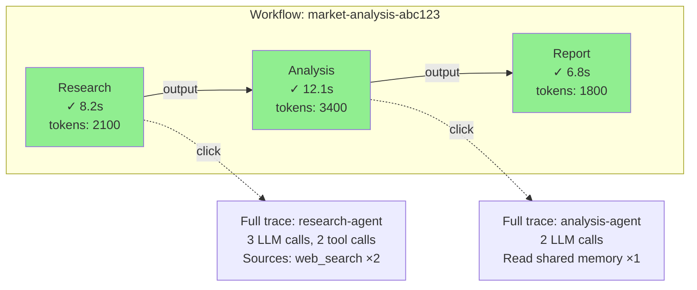

# Phase 2: Multi-Agent & Orchestration — Challenges & How We Solved Them

> **The story of building systems where agents collaborate, and everything that can go wrong when autonomous entities talk to each other.**

---

## Challenge 1: "The supervisor agent's plans are terrible"

### The Problem

The supervisor agent receives a complex task and decomposes it into sub-tasks. But its plans were often:
- **Too granular** — 12 steps for a task that needs 3
- **Missing dependencies** — says "analyze data" before "collect data"
- **Wrong agent assignments** — sends writing tasks to the code agent
- **Non-deterministic** — same task produces wildly different plans each time

### The Debate

**Backend Engineer:** "We need to constrain the supervisor's output format. Structured output with validation."

**Product Lead:** "If the plan is bad, the entire workflow is bad. This is our single point of failure."

**Architect:** "Maybe the supervisor shouldn't generate plans from scratch every time. Can we give it plan templates?"

### How We Solved It

Layered approach:

1. **Structured output** — Supervisor must return a JSON plan conforming to a strict schema. If the output fails validation, we retry with the validation error in context.

2. **Plan templates** — For common workflows (research → analyze → write), we provide templates the supervisor can select and customize rather than inventing from scratch.

3. **Plan validation rules:**
   - No circular dependencies in the DAG
   - Every referenced agent must exist
   - Max 8 steps per workflow (force the supervisor to be concise)
   - Every step must have clear input/output definitions

4. **Human review gate** (optional) — For high-stakes workflows, show the plan to the user before executing: "I plan to do X, Y, Z. Proceed?"

5. **Plan grading** — A separate LLM call evaluates the plan for quality before execution. If score < threshold, regenerate.



---

## Challenge 2: "Agent B gets stuck waiting for Agent A, and the whole workflow hangs"

### The Problem

In a sequential workflow (research → analyze → write), if the research agent hangs (LLM timeout, tool failure, infinite loop), every downstream agent waits forever. We had a workflow stuck in "running" state for 6 hours before anyone noticed.

### What We Observed

- No timeout on individual steps
- No timeout on the overall workflow
- No alerting on stuck workflows
- NATS messages sat in the queue with no consumer processing them

### How We Solved It

1. **Step-level timeout** — Every step has a timeout (default: 120s). If the agent doesn't respond within the timeout, the step is marked as failed and retry logic kicks in.

2. **Workflow-level timeout** — Every workflow has a maximum duration (default: 10 minutes). If the workflow isn't complete by then, it's terminated and all in-progress steps are cancelled.

3. **Heartbeats** — Agents send heartbeat messages every 15s while processing. If the orchestrator doesn't receive a heartbeat for 45s, the agent is presumed dead and the step is retried on a different pod.

4. **Dead letter queue** — Tasks that fail 3 times go to a dead letter subject. An alert fires. An operator can inspect and replay.

5. **Circuit breaker** — If an agent type fails 5 times in 10 minutes, the circuit breaker opens. New tasks for that agent return immediately with "agent temporarily unavailable." This prevents cascading failures.



---

## Challenge 3: "Two agents write conflicting information to shared memory"

### The Problem

In a parallel workflow, the research agent and the analysis agent both wrote to the key `summary`. The research agent wrote a factual summary. The analysis agent overwrote it with an analytical summary. The writer agent (downstream) only saw the analysis version and missed all the factual data.

### The Debate

**Backend Engineer:** "We need locking. Distributed locks on Redis keys."

**Architect:** "Locks in a distributed system are a nightmare. Let's avoid them entirely."

**SRE:** "If agents overwrite each other's data, the outputs will be unpredictable. We can't ship that."

### How We Solved It

1. **Namespaced keys** — Each agent writes to its own namespace: `research_agent:summary`, `analysis_agent:summary`. No overwrites possible.

2. **Append-only shared log** — Instead of overwriting, agents append to a shared log. Downstream agents read the full log and synthesize.

3. **Write-once semantics** — For critical keys, the first write wins. Subsequent writes fail with "key already exists." The agent can read the existing value and adapt.

4. **Merge function** — For specific keys that need combining, a merge function is defined in the workflow spec:
   ```yaml
   shared_memory:
     summary:
       merge_strategy: "concatenate"  # or "llm_merge" or "last_wins"
   ```

We went with **namespaced keys** as the default (simplest, most predictable) and **append-only log** for cases where agents need to build on each other's work.

---

## Challenge 4: "Scaling agents based on queue depth doesn't work — they spin up too slow"

### The Problem

KEDA scales agents based on NATS consumer lag. But:
- New pods take 15-20 seconds to start (image pull, init containers, health check)
- By the time the pod is ready, 10 more messages are queued
- The system over-scales: 10 pods spin up, process the backlog in seconds, then sit idle for 60s (cooldown) burning compute

### What We Measured

```
Scaling timeline:
  T+0s:   15 messages arrive
  T+5s:   KEDA detects lag > 5
  T+10s:  Scale-up decision made
  T+25s:  New pods running (15s startup)
  T+35s:  All messages processed
  T+95s:  Cooldown expires, scale down

  Cost: 10 pods × 95 seconds = 950 pod-seconds
  Optimal: 3 pods × 40 seconds = 120 pod-seconds
```

### How We Solved It

1. **Warm pool** — Keep 1-2 pre-warmed replicas per agent type. They're idle but already running, so the first burst is handled instantly.

2. **Pre-pull images** — DaemonSet that pre-pulls agent runtime images on all nodes. Startup time dropped from 15s to 5s.

3. **Conservative scaling** — Changed KEDA settings: `lagThreshold: 10` (not 5), `cooldownPeriod: 180` (not 60). Scale fewer pods, keep them longer.

4. **Batch processing** — Agents pull 3 messages at a time (NATS batch fetch) instead of 1. Fewer pods process more work.

5. **Priority queues** — Urgent tasks go to a high-priority stream. Warm pods process high-priority first. Low-priority tasks queue until capacity is available.

---

## Challenge 5: "We can't debug multi-agent workflows — which agent broke?"

### The Problem

A 4-agent workflow produces a wrong answer. Which agent introduced the error? Was it bad research? Bad analysis? Bad writing? With single agents we had traces. With multi-agent, we have N traces that need to be correlated.

### How We Solved It

1. **Workflow trace ID** — A single `workflow_id` propagates through every message, every agent span, every database write. One ID to find everything.

2. **Step-level input/output recording** — Every step records its exact input and output in the `workflow_steps` table. We can replay the workflow step-by-step.

3. **Blame analysis** — A debugging tool that:
   - Takes the final (wrong) output
   - Walks backward through the DAG
   - Shows each agent's contribution
   - Highlights where the data diverged from expected

4. **Workflow visualization** — Grafana dashboard showing the DAG with color-coded steps (green = success, red = failure, yellow = slow). Click a step to see its trace.



---

## Challenge 6: "Choosing NATS over Kafka was controversial"

### The Problem

Half the team wanted Kafka because "it's the industry standard for event streaming." The other half wanted NATS because "Kafka is overkill for our scale."

### The Debate

| Criteria | Kafka | NATS JetStream |
|----------|-------|----------------|
| Operational complexity | High (ZooKeeper/KRaft, brokers, topic config) | Low (single binary, simple config) |
| Throughput | Massive (millions/sec) | High (hundreds of thousands/sec) |
| Latency | ~5ms p99 | ~1ms p99 |
| Kubernetes-native | Strimzi Operator (complex) | Helm chart (simple) |
| Ordering guarantees | Per-partition | Per-subject |
| Our actual throughput | ~100 messages/sec | ~100 messages/sec |

### How We Solved It

We chose **NATS JetStream** because:
- Our throughput is nowhere near Kafka's sweet spot
- NATS deploys as a single StatefulSet — Kafka needs brokers, ZooKeeper/KRaft, schema registry
- NATS latency is better for interactive agent workflows
- If we outgrow NATS, we can switch to Kafka later — the message interface is abstracted behind our own publisher/consumer layer

**Escape hatch:** The orchestrator talks to a `MessageBus` interface, not directly to NATS. Replacing NATS with Kafka means implementing one interface, not rewriting the system.

---

## Team Retrospective — Phase 2

### What Went Well
- CRD-based agent definitions are loved by platform teams — "it's just YAML"
- NATS JetStream operational overhead is minimal
- Supervisor + specialist pattern works well for 80% of use cases

### What Didn't Go Well
- Supervisor plan quality required more guardrails than expected
- Scaling dynamics took 3 iterations to get right
- Shared memory conflict resolution needed clearer conventions from day one

### Key Metrics After Phase 2
- **12 agent types** registered across 5 tenants
- **8 multi-agent workflows** in production
- **Average workflow duration:** 45 seconds (3-step workflows)
- **Workflow success rate:** 94% (6% failures, mostly timeout-related)
- **Agent scaling efficiency:** 70% utilization (up from 12% before optimization)
