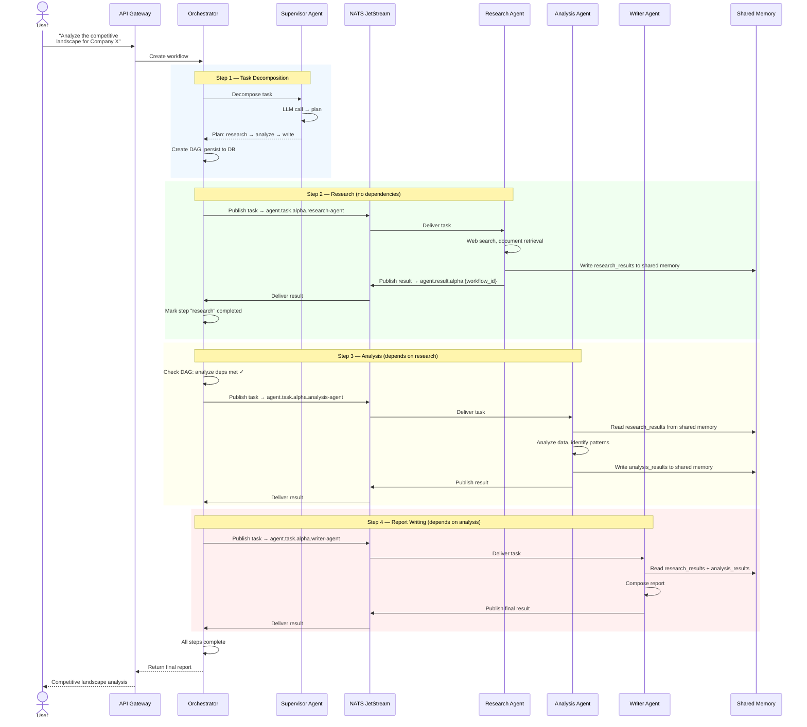
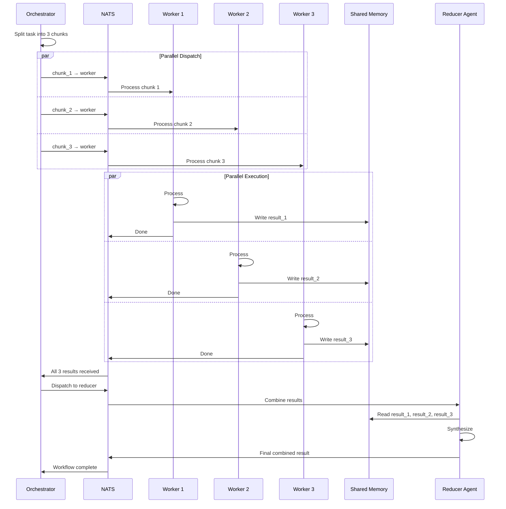
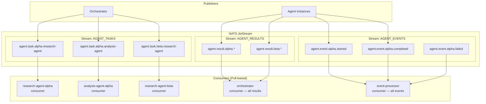
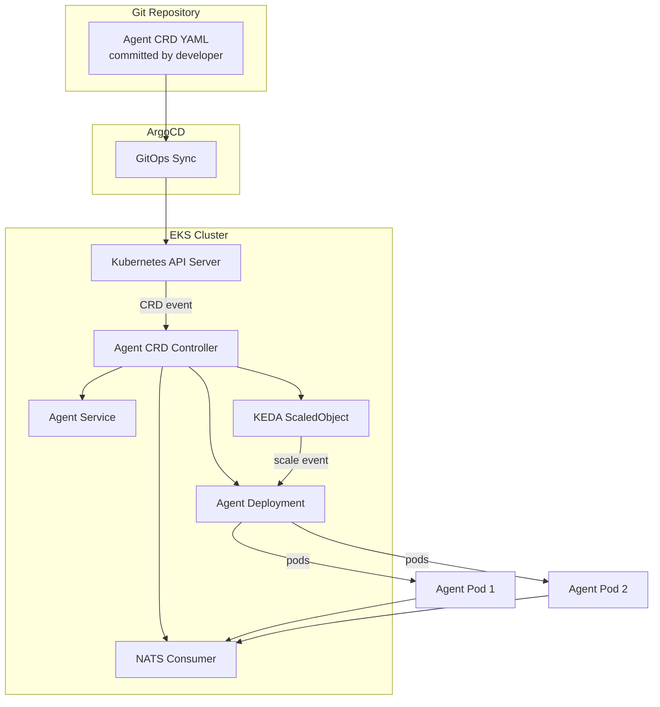
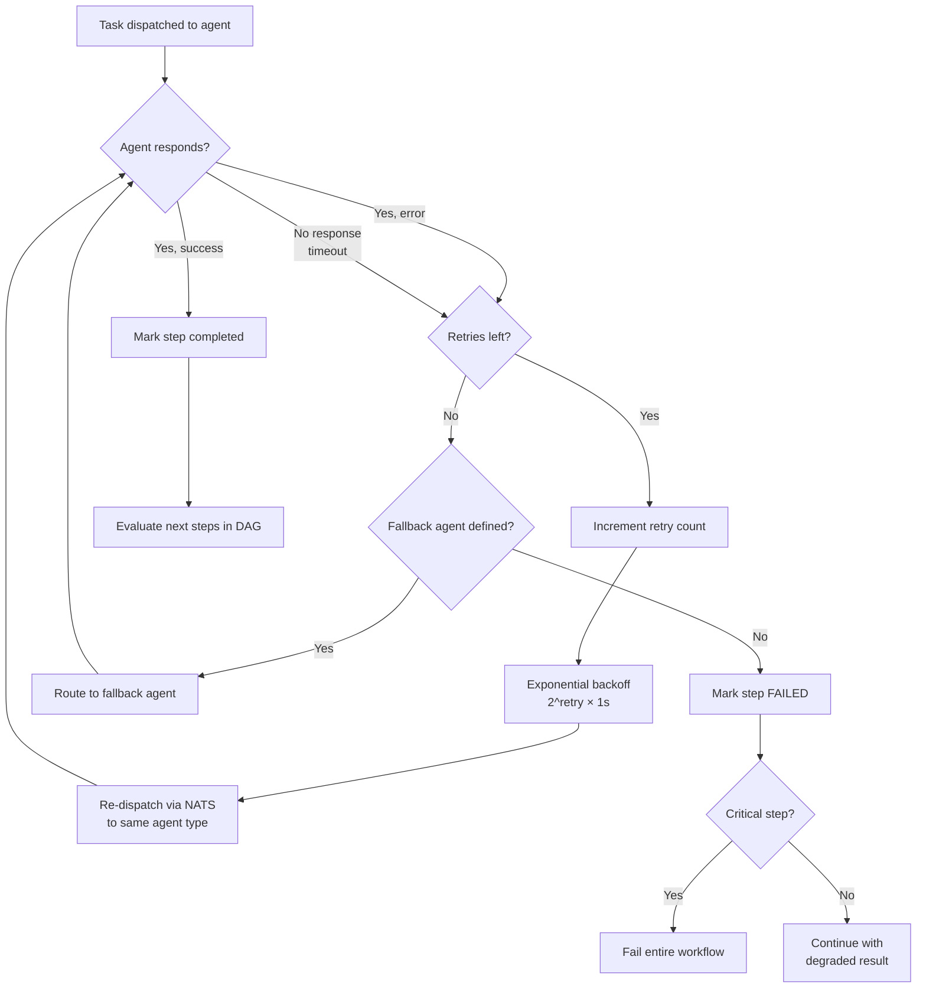

# Phase 2: Multi-Agent & Orchestration — Data Flow Diagrams

> **Objective:** Trace data paths through multi-agent workflows — task decomposition, message routing, shared memory, and result aggregation.

---

## 1. Supervisor Workflow — End-to-End



---

## 2. Parallel Execution — Map-Reduce Pattern



---

## 3. NATS Message Routing



---

## 4. Agent Lifecycle in Kubernetes



---

## 5. Failure & Retry Flow



---

## 6. Shared Memory Read/Write Pattern

```mermaid
flowchart TD
    subgraph "Agent A (Research)"
        A1[Produce research results] --> A2[Write to shared memory]
    end

    subgraph "Shared Memory (Redis)"
        SM["workflow:{id}:context<br/>──────────<br/>research_results: '...'<br/>analysis_results: null<br/>──────────<br/>TTL: workflow timeout + 1hr"]
    end

    subgraph "Agent B (Analysis)"
        B1[Read from shared memory] --> B2[Process research + analyze]
        B2 --> B3[Write analysis results]
    end

    A2 -->|HSET workflow:{id}:context<br/>research_results '...'| SM
    SM -->|HGET workflow:{id}:context<br/>research_results| B1
    B3 -->|HSET workflow:{id}:context<br/>analysis_results '...'| SM
```

| Operation | Redis Command | Complexity |
|-----------|---------------|-----------|
| Write key | `HSET workflow:{id}:context {key} {value}` | O(1) |
| Read key | `HGET workflow:{id}:context {key}` | O(1) |
| Read all | `HGETALL workflow:{id}:context` | O(N) |
| Check exists | `HEXISTS workflow:{id}:context {key}` | O(1) |
| Cleanup | `DEL workflow:{id}:context` (after workflow ends) | O(1) |
