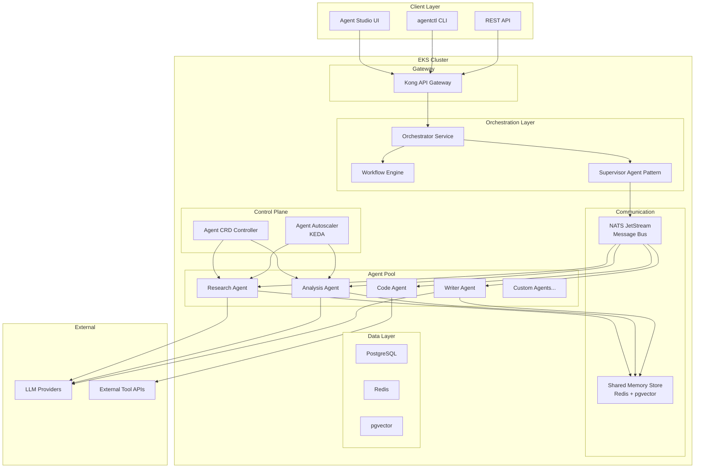
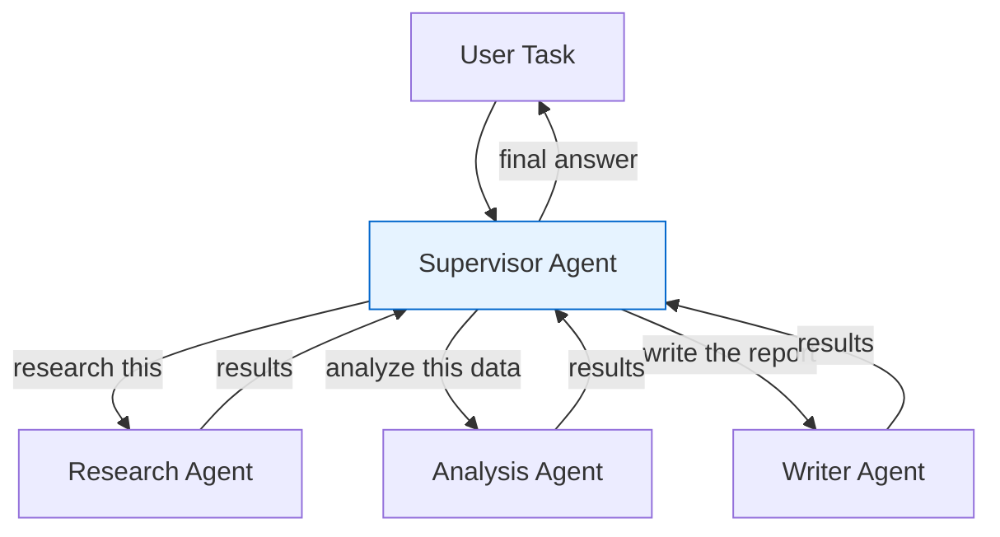
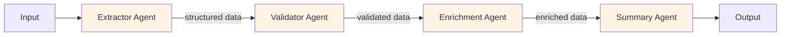
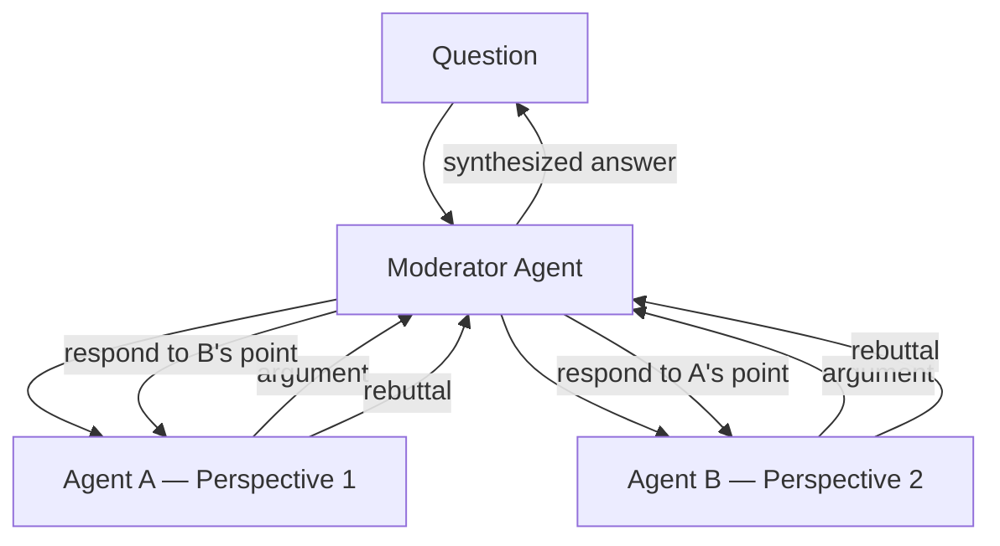
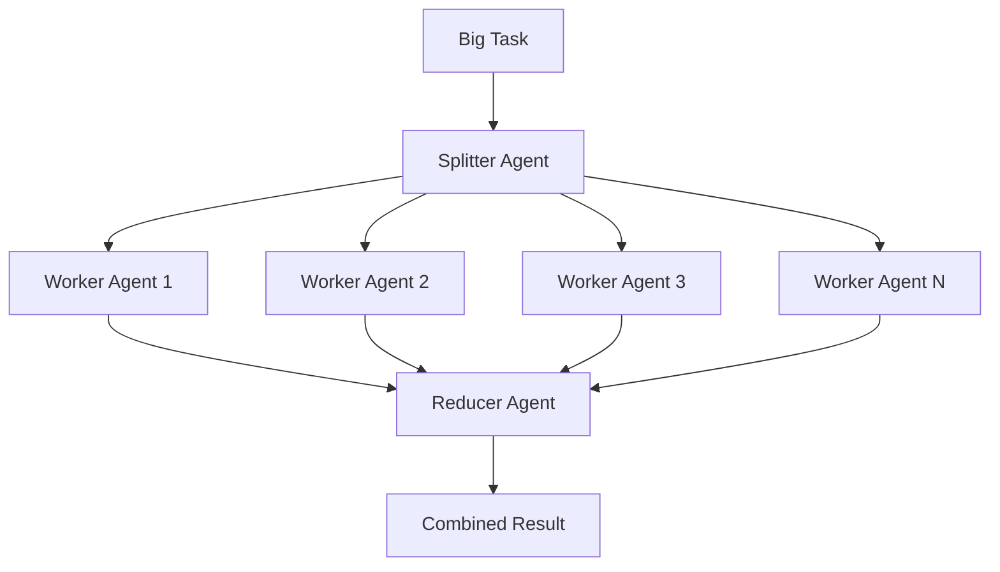

# Phase 2: Multi-Agent & Orchestration — High-Level Design

> **Objective:** Move from single agents to agent systems — agents that delegate, collaborate, and operate as coordinated teams.

---

## Team Thinking

**Product Lead:** "Single agents hit a ceiling. Complex tasks need specialists — one agent for research, another for analysis, another for writing. Human teams delegate. Agent teams should too."

**Architect:** "This is the hardest phase. Multi-agent introduces distributed state, message routing, failure cascading, and debugging complexity that's an order of magnitude harder than single-agent. We need to get the patterns right."

**Backend Engineer:** "I've been studying the patterns — supervisor, swarm, pipeline, debate. Each fits different use cases. We shouldn't pick one; we should build primitives that support all of them."

**Platform Engineer:** "Kubernetes already solves service orchestration. Can we model agents as Kubernetes-native resources? CRDs, controllers, the whole pattern."

**SRE:** "Multi-agent means one agent's failure cascades to others. I need circuit breakers, fallback behavior, and clear ownership of who owns which agent."

---

## High-Level Architecture



---

## Multi-Agent Patterns

### Pattern 1: Supervisor



**When to use:** Complex tasks that require decomposition. The supervisor decides the plan, delegates to specialists, and synthesizes results.

### Pattern 2: Pipeline



**When to use:** Sequential data processing. Each agent transforms the data and passes it forward.

### Pattern 3: Debate / Consensus



**When to use:** High-stakes decisions where multiple perspectives reduce error. Code review, risk assessment, diagnosis.

### Pattern 4: Map-Reduce



**When to use:** Parallelizable tasks. Analyze 50 documents, process 100 records, search across multiple sources.

---

## Agent CRD (Custom Resource Definition)

```yaml
apiVersion: agentic.ai/v1alpha1
kind: Agent
metadata:
  name: research-agent
  namespace: tenant-alpha
spec:
  description: "Researches topics using web search and document retrieval"
  model: gpt-4o
  systemPrompt: |
    You are a research specialist. Your job is to find accurate,
    relevant information using the tools available to you.
  tools:
    - web_search
    - document_retrieval
    - summarizer
  memory:
    shortTerm: true
    longTerm: true
  scaling:
    minReplicas: 1
    maxReplicas: 10
    targetConcurrency: 5
  resources:
    requests:
      cpu: "500m"
      memory: "1Gi"
    limits:
      cpu: "2"
      memory: "4Gi"
  timeout: 120s
  maxIterations: 10
```

---

## Workflow Definition

```yaml
apiVersion: agentic.ai/v1alpha1
kind: AgentWorkflow
metadata:
  name: market-analysis
  namespace: tenant-alpha
spec:
  trigger: api  # or schedule, event
  steps:
    - name: research
      agent: research-agent
      input: "{{ .input.topic }}"
      output: research_results

    - name: analyze
      agent: analysis-agent
      input: "{{ .steps.research.output }}"
      dependsOn: [research]
      output: analysis

    - name: report
      agent: writer-agent
      input: |
        Based on this analysis: {{ .steps.analyze.output }}
        Write a market analysis report.
      dependsOn: [analyze]
      output: final_report

  output: "{{ .steps.report.output }}"
```

---

## Component Ownership

| Component | Team | Responsibility |
|-----------|------|---------------|
| **Orchestrator** | Backend | Task decomposition, agent routing, result aggregation |
| **Workflow Engine** | Backend | DAG execution, step dependencies, retries |
| **Agent CRD Controller** | Platform | Watch CRDs, create/update agent deployments |
| **NATS JetStream** | Platform | Deployment, stream configuration, monitoring |
| **Agent Autoscaler** | Platform + SRE | KEDA triggers, scaling policies |
| **Shared Memory** | Backend | Cross-agent context, conflict resolution |
| **Agent Studio UI** | Frontend | Visual workflow builder, agent configuration |

---

## Key Design Decisions

| Decision | Choice | Rationale |
|----------|--------|-----------|
| Message bus | NATS JetStream | Lightweight, persistent, built for Kubernetes, lower ops than Kafka |
| Orchestration | Custom controller + DAG engine | Argo Workflows too heavy for agent-specific needs |
| Agent definition | Kubernetes CRD | Native to the platform, declarative, GitOps-friendly |
| Inter-agent communication | Async message passing (not direct HTTP) | Decoupling, resilience, natural backpressure |
| Shared state | Redis (hot) + pgvector (semantic) | Fast access for active workflows, semantic search for context |
| Autoscaling | KEDA with NATS triggers | Scale agents based on message queue depth, not CPU |
