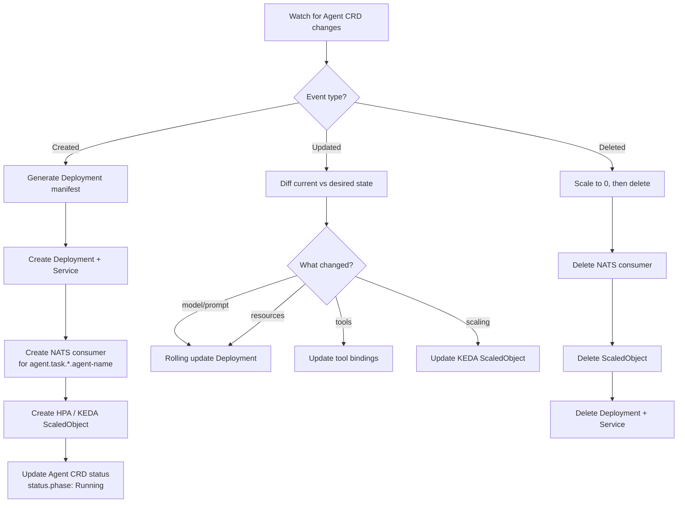
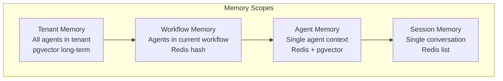
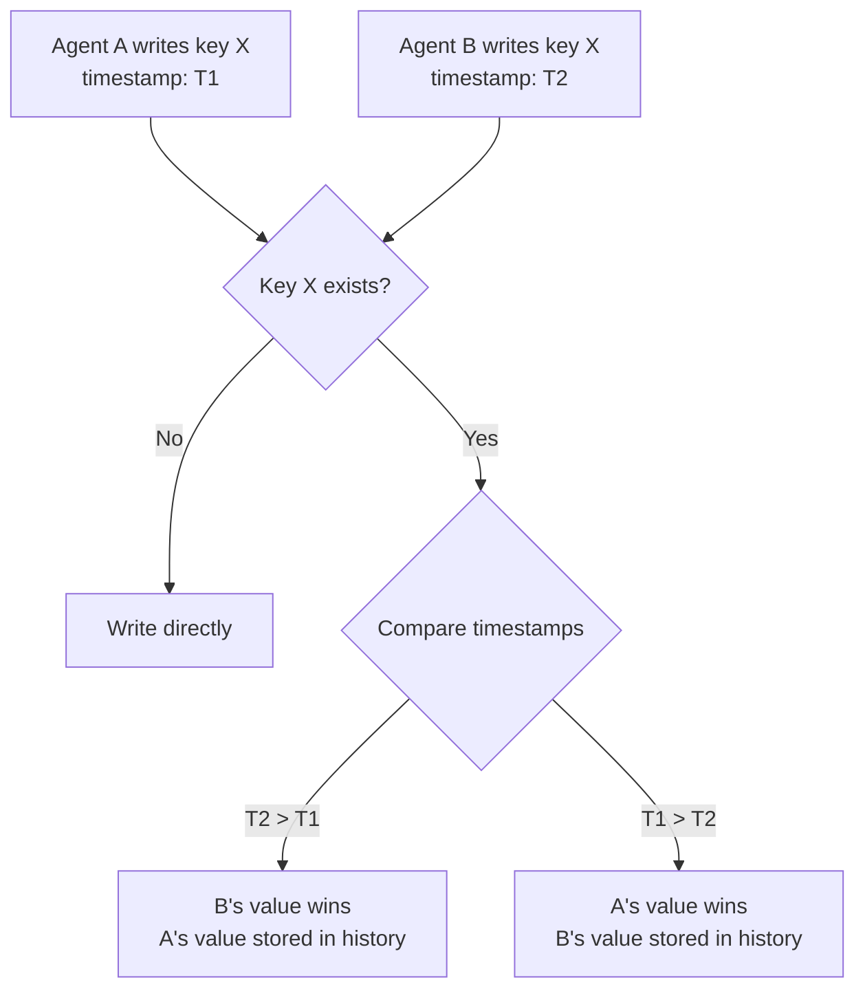
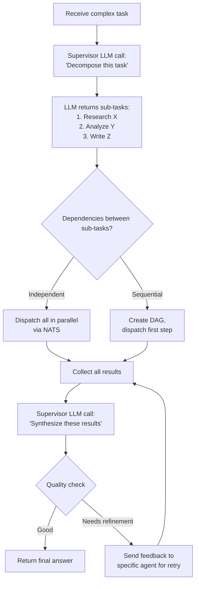

# Phase 2: Multi-Agent & Orchestration — Low-Level Design

> **Objective:** Detailed design for inter-agent communication, workflow execution, CRD controller, and shared memory.

---

## 1. NATS JetStream — Message Architecture

### Stream & Subject Design

```
Streams:
  AGENT_TASKS    — Durable, all agent task messages
  AGENT_RESULTS  — Durable, all agent result messages
  AGENT_EVENTS   — Durable, lifecycle events (started, completed, failed)

Subject hierarchy:
  agent.task.{tenant_id}.{agent_name}      — Task dispatched to specific agent
  agent.result.{tenant_id}.{workflow_id}    — Result from agent execution
  agent.event.{tenant_id}.{event_type}      — Agent lifecycle events
```

### Message Schema

**Task Message:**
```json
{
  "message_id": "uuid",
  "workflow_id": "uuid",
  "step_name": "research",
  "tenant_id": "alpha",
  "agent_name": "research-agent",
  "input": "Research the latest trends in renewable energy",
  "context": {
    "previous_steps": {},
    "shared_memory_keys": ["workflow:uuid:context"]
  },
  "metadata": {
    "created_at": "2026-04-04T10:00:00Z",
    "timeout_seconds": 120,
    "retry_count": 0,
    "max_retries": 2,
    "priority": "normal"
  }
}
```

**Result Message:**
```json
{
  "message_id": "uuid",
  "workflow_id": "uuid",
  "step_name": "research",
  "agent_name": "research-agent",
  "status": "completed",
  "output": "Here are the key trends...",
  "metrics": {
    "duration_ms": 8500,
    "llm_calls": 3,
    "tool_calls": 2,
    "total_tokens": 4200
  }
}
```

---

## 2. Workflow Engine — DAG Execution

### State Machine

```mermaid
stateDiagram-v2
    [*] --> Pending: Workflow created
    Pending --> Running: Trigger fires

    state Running {
        [*] --> EvaluateReady
        EvaluateReady --> DispatchStep: Steps with all deps met
        DispatchStep --> WaitForResult
        WaitForResult --> StepCompleted: Agent returns result
        WaitForResult --> StepFailed: Agent error/timeout
        StepCompleted --> EvaluateReady: More steps remaining
        StepFailed --> RetryStep: Retries remaining
        StepFailed --> WorkflowFailed: No retries left
        RetryStep --> DispatchStep
        EvaluateReady --> AllDone: No more steps
    end

    Running --> Completed: AllDone
    Running --> Failed: WorkflowFailed
    Running --> TimedOut: Global timeout exceeded

    Completed --> [*]
    Failed --> [*]
    TimedOut --> [*]
```

### DAG Resolution Algorithm

```
function evaluate_ready_steps(workflow):
    for each step in workflow.steps:
        if step.status == "pending":
            dependencies_met = all(
                workflow.steps[dep].status == "completed"
                for dep in step.depends_on
            )
            if dependencies_met:
                dispatch(step)
```

### Workflow State Table

```sql
CREATE TABLE workflows (
    id UUID PRIMARY KEY,
    tenant_id VARCHAR(64) NOT NULL,
    name VARCHAR(255),
    definition JSONB NOT NULL,
    status VARCHAR(32) DEFAULT 'pending',
    input JSONB,
    output JSONB,
    started_at TIMESTAMPTZ,
    completed_at TIMESTAMPTZ,
    created_at TIMESTAMPTZ DEFAULT now()
);

CREATE TABLE workflow_steps (
    id UUID PRIMARY KEY,
    workflow_id UUID REFERENCES workflows(id),
    step_name VARCHAR(128),
    agent_name VARCHAR(128),
    status VARCHAR(32) DEFAULT 'pending',
    input JSONB,
    output JSONB,
    depends_on TEXT[],
    retry_count INTEGER DEFAULT 0,
    started_at TIMESTAMPTZ,
    completed_at TIMESTAMPTZ,
    error TEXT
);

CREATE INDEX idx_wf_tenant ON workflows(tenant_id);
CREATE INDEX idx_wf_steps_workflow ON workflow_steps(workflow_id);
CREATE INDEX idx_wf_steps_status ON workflow_steps(status);
```

---

## 3. Agent CRD Controller

### Controller Reconciliation Loop



### Generated Deployment (from CRD)

```yaml
# Auto-generated by Agent Controller
apiVersion: apps/v1
kind: Deployment
metadata:
  name: research-agent
  namespace: tenant-alpha
  labels:
    app.kubernetes.io/managed-by: agent-controller
    agentic.ai/agent-name: research-agent
    agentic.ai/tenant: alpha
spec:
  replicas: 1  # Managed by KEDA
  selector:
    matchLabels:
      agentic.ai/agent-name: research-agent
  template:
    spec:
      containers:
        - name: agent-runtime
          image: agentic-ai/agent-runtime:1.2.0
          env:
            - name: AGENT_NAME
              value: research-agent
            - name: AGENT_CONFIG
              valueFrom:
                configMapKeyRef:
                  name: research-agent-config
                  key: config.json
            - name: NATS_URL
              value: nats://nats.messaging:4222
          resources:
            requests: { cpu: "500m", memory: "1Gi" }
            limits: { cpu: "2", memory: "4Gi" }
```

---

## 4. Shared Memory — Cross-Agent State

### Memory Scope Hierarchy



### Shared Memory API (Internal)

```
# Read shared context for a workflow
GET /internal/memory/{workflow_id}/context
→ { "research_results": "...", "analysis_notes": "..." }

# Write to shared context
PUT /internal/memory/{workflow_id}/context/{key}
Body: { "value": "...", "written_by": "research-agent" }

# Semantic search across workflow memory
POST /internal/memory/{workflow_id}/search
Body: { "query": "revenue trends", "top_k": 5 }
```

### Conflict Resolution

When two agents write to the same key simultaneously:



Strategy: **Last-writer-wins** with full history. Agents can read the history if they need to reconcile.

---

## 5. KEDA Autoscaling Configuration

```yaml
apiVersion: keda.sh/v1alpha1
kind: ScaledObject
metadata:
  name: research-agent-scaler
  namespace: tenant-alpha
spec:
  scaleTargetRef:
    name: research-agent
  minReplicaCount: 1
  maxReplicaCount: 10
  cooldownPeriod: 60
  triggers:
    - type: nats-jetstream
      metadata:
        natsServerMonitoringEndpoint: "nats.messaging:8222"
        account: "$G"
        stream: "AGENT_TASKS"
        consumer: "research-agent-consumer"
        lagThreshold: "5"
        activationLagThreshold: "1"
```

**Scaling Logic:**
- 1 replica at rest (warm pool)
- Scale up when NATS consumer lag > 5 messages
- Scale down after 60s cooldown with no messages
- Max 10 replicas per agent per tenant

---

## 6. Supervisor Agent — Internal Design

### Supervisor Decision Flow



### Supervisor System Prompt Pattern

```
You are a supervisor agent. Your job is to:
1. Analyze the user's task
2. Decompose it into sub-tasks for specialist agents
3. Assign each sub-task to the most appropriate agent
4. Synthesize the results into a final answer

Available agents:
- research-agent: Finds information from web and documents
- analysis-agent: Performs data analysis and reasoning
- writer-agent: Produces well-structured written content
- code-agent: Writes and executes code

Respond with a JSON plan:
{
  "steps": [
    {"agent": "research-agent", "task": "...", "depends_on": []},
    {"agent": "analysis-agent", "task": "...", "depends_on": ["step_0"]}
  ]
}
```
