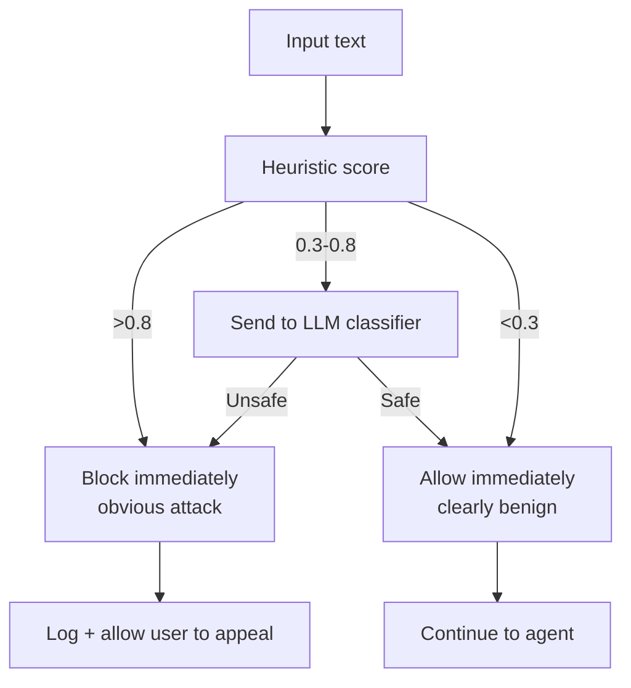
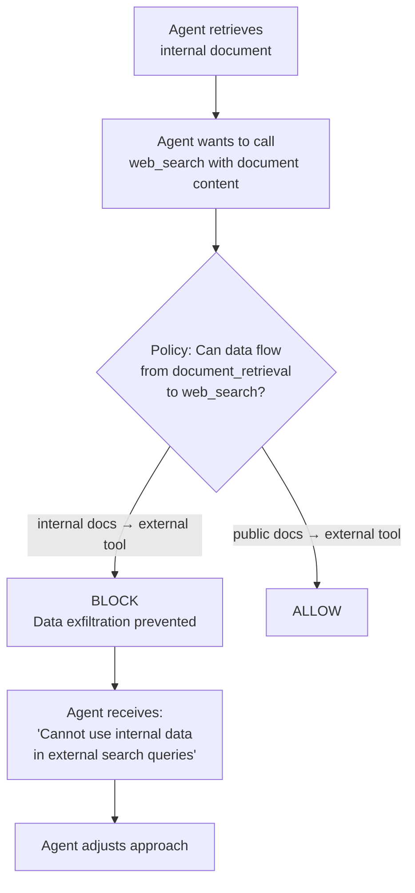
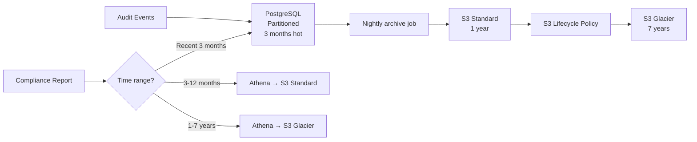

# Phase 3: Safety & Governance — Challenges & How We Solved Them

> **The story of making autonomous AI agents safe enough for enterprise — every loophole we found, every assumption that broke, and how the team fought to close the gaps.**

---

## Challenge 1: "The prompt injection detector has a 15% false positive rate"

### The Problem

Our heuristic-based prompt injection detector was blocking legitimate user inputs. Examples that triggered false positives:
- "Ignore the previous report and focus on Q4 data" — flagged as "ignore previous instructions"
- "You are now looking at the 2025 financials" — flagged as "you are now" role manipulation
- Code snippets with `system()` calls — flagged as system prompt attacks

### The Debate

**Security Engineer:** "I'd rather block 15% of legitimate requests than let one injection through."

**Product Lead:** "15% false positives means 15% of users are having a terrible experience. We're going to get a flood of support tickets."

**Backend Engineer:** "Can we just let the LLM handle injections? Modern models are pretty resistant."

**Security Engineer:** "Absolutely not. LLM-only defense is like hoping your users won't find the SQL injection. Defense in depth."

### How We Solved It

Replaced the binary block/allow with a scored, multi-layer approach:

1. **Heuristic layer** (fast, < 1ms) — Scores input 0.0-1.0 based on pattern matching. Only blocks if score > 0.8 (obvious attacks).

2. **Context-aware rules** — "ignore previous" is fine in natural conversation. It's suspicious only when combined with other signals (role assignment, instruction formatting, encoding tricks).

3. **LLM classifier** (invoked only for ambiguous cases, score 0.3-0.8) — A fine-tuned small model that understands the difference between "ignore previous report" (benign) and "ignore previous instructions" (suspicious).

4. **Feedback loop** — Users can report false positives. Security team reviews and adjusts rules weekly. False positive rate dropped from 15% → 2.1%.

5. **Tenant-specific sensitivity** — Finance tenants run at higher sensitivity (more false positives accepted). Internal dev tenants run at lower sensitivity.



---

## Challenge 2: "An agent exfiltrated data through a tool it was allowed to use"

### The Problem

A research agent was configured with access to `web_search` and `document_retrieval`. During testing, the red team showed that the agent could be manipulated to:
1. Retrieve sensitive internal documents via `document_retrieval`
2. Embed the document content in a search query to `web_search` (e.g., searching for "revenue forecast $14M Q3 2026")
3. The search query shows up in the search API provider's logs — data exfiltrated via a "legitimate" tool

### Why This Was Scary

The agent used only tools it was authorized to use. No policy was violated. No safety filter was triggered. The data left through a side channel.

### How We Solved It

1. **Output analysis on tool inputs** — Before executing a tool, the safety layer scans the tool's *input* for sensitive data patterns. A search query containing dollar amounts, names, or document fragments gets flagged.

2. **Data classification tags** — Documents in the retrieval system are tagged with classification levels. If a document is classified "internal," any attempt to pass its content to an external tool is blocked.

3. **Tool-to-tool transfer policies** — OPA policies now govern data flow *between* tools, not just access to individual tools:
   ```rego
   deny {
     input.source_tool == "document_retrieval"
     input.target_tool == "web_search"
     input.source_data_classification == "internal"
   }
   ```

4. **Egress content inspection** — All outbound HTTP requests from agent pods pass through a proxy that scans for sensitive patterns.



---

## Challenge 3: "Human-in-the-loop approvals take too long and block agent workflows"

### The Problem

After enabling HITL for high-risk actions, agent workflows that previously completed in 45 seconds now took 10-30 minutes because they were stuck waiting for human approval. Approvers:
- Didn't see the Slack notification
- Didn't understand what they were approving
- Approved everything without reading (rubber-stamping) because they were overwhelmed

### The Debate

**Backend Engineer:** "The approval UX is terrible. The Slack message is a wall of JSON. No wonder nobody reads it."

**Compliance Officer:** "We need HITL for compliance. We can't remove it."

**Product Lead:** "Can we reduce the number of things that need approval?"

### How We Solved It

1. **Risk-tiered approvals:**
   - **Low risk** — Auto-approved, logged for audit (e.g., making a read-only API call)
   - **Medium risk** — Approved with one-click in Slack, with a clear plain-English summary
   - **High risk** — Requires approval in the web UI with full context
   - **Critical** — Requires two approvers

2. **Better notification UX:**
   ```
   🔒 Approval Required
   Agent: research-agent (Team Alpha)
   Action: Query HR database for salary data
   Risk: Medium

   Why: User asked about employee compensation trends
   Data accessed: salary table (5 records)

   [✅ Approve]  [❌ Reject]  [🔍 View Details]
   ```

3. **Standing approvals** — Approvers can pre-approve categories: "Team Alpha's agents can always query the HR database for aggregate (not individual) data." Reduces approval volume by 60%.

4. **Auto-escalation** — If no response in 5 minutes, escalate to the next approver. If no response in 15 minutes, auto-reject (safe default).

5. **Approval analytics** — Dashboard showing approval volume, response time, rubber-stamp rate. Teams with >90% approval rate without reviewing get flagged for training.

---

## Challenge 4: "gVisor breaks some Python libraries the agents need"

### The Problem

gVisor (runsc) intercepts all system calls and re-implements them in userspace. Most Python code works fine, but some libraries make system calls that gVisor doesn't support:
- `numpy` with certain BLAS backends — uses unsupported `memfd_create`
- `multiprocessing` — gVisor's `/proc` filesystem is incomplete
- Some HTTP libraries — issues with non-standard socket options

Agents that worked perfectly in standard containers crashed on gVisor.

### How We Solved It

1. **Compatibility matrix** — Tested our entire dependency tree against gVisor. Documented what works, what doesn't, and alternatives.

2. **Tiered sandboxing:**
   - **Tier 1 (gVisor):** Agents that only use standard Python + HTTP. Maximum isolation.
   - **Tier 2 (seccomp + AppArmor):** Agents that need numpy/pandas. Strong isolation without gVisor.
   - **Tier 3 (standard runc + strict policies):** Agents with exotic dependencies. Minimal isolation, compensated with aggressive network policies and monitoring.

3. **Agent sandbox auto-detection** — The platform analyzes the agent's dependencies and auto-assigns the appropriate sandbox tier.

4. **Pre-built base images** — For each tier, we provide tested base images with common libraries pre-installed and verified.

---

## Challenge 5: "Audit log queries are killing the database when compliance runs reports"

### The Problem

The audit log table grew to 50 million rows in 2 months. When the compliance team ran monthly reports (aggregating all events for a tenant over 30 days), the queries took 45+ minutes and caused lock contention that slowed down the audit write path.

### How We Solved It

1. **Table partitioning** — Partitioned by month. Monthly reports query only one partition instead of scanning 50M rows.

2. **Read replicas** — Compliance reports run against a PostgreSQL read replica. Zero impact on the write path.

3. **Pre-aggregated tables** — A nightly batch job creates `audit_daily_summary` and `audit_tenant_monthly` tables. Compliance queries these instead of raw events.

4. **S3 + Athena for deep analysis** — Audit logs older than 3 months are archived to S3. Compliance can run arbitrary SQL via Athena for historical analysis without touching PostgreSQL.

5. **Retention tiers:**
   - Hot (PostgreSQL): 3 months
   - Warm (S3 Standard): 1 year
   - Cold (S3 Glacier): 7 years



---

## Challenge 6: "How do we test safety before shipping to production?"

### The Problem

Safety features are only valuable if they work when they need to. But testing safety is hard:
- How do you test prompt injection defense without writing actual prompt injections?
- How do you verify PII detection catches all patterns without real PII?
- How do you test HITL without a human sitting there clicking buttons?

### How We Solved It

Built an **Evaluation Framework** that runs as part of CI/CD:

1. **Red team test suite** — 200+ prompt injection attempts, maintained by the security team. New techniques added monthly based on published research. The suite includes adversarial examples for multi-turn injection, encoding bypasses, and context manipulation.

2. **Synthetic PII test data** — Generated with `Faker` library. Realistic but not real. Covers all entity types across multiple formats and languages.

3. **HITL mock service** — In CI, the HITL service is replaced with a mock that auto-approves or auto-rejects based on the test scenario. Tests verify that the agent correctly pauses, receives the decision, and proceeds/adjusts.

4. **Regression gating** — Every PR runs the safety test suite. If safety pass rate drops below 98%, the PR is blocked. No exceptions.

5. **Monthly adversarial assessment** — External red team (rotation of security-focused engineers) attempts to bypass safety controls. Findings become new test cases.

---

## Team Retrospective — Phase 3

### What Went Well
- Policy engine (OPA) is flexible and fast — < 2ms per evaluation
- Audit trail has survived two compliance audits with zero findings
- Data exfiltration attack was caught by the red team, not in production

### What Didn't Go Well
- gVisor compatibility issues wasted significant effort
- HITL approval UX required 3 iterations to get right
- Prompt injection defense is an ongoing arms race, not a solved problem

### Key Metrics After Phase 3
- **Prompt injection block rate:** 99.1% (on known attack patterns)
- **False positive rate:** 2.1% (down from 15%)
- **HITL median approval time:** 2.3 minutes (down from 18 minutes)
- **Audit log integrity:** 100% — zero tampered events detected
- **Safety test suite:** 247 test cases, 98.4% pass rate
- **Compliance audits passed:** 2 (SOC 2 readiness, internal security review)
