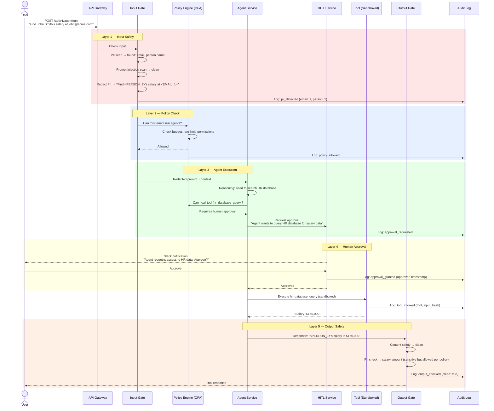
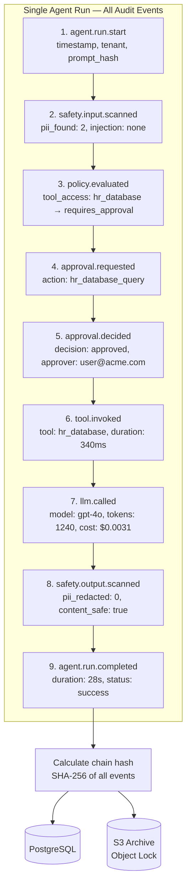
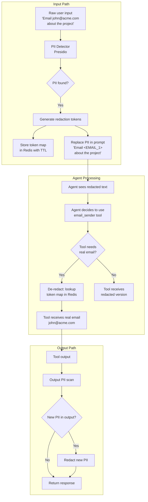
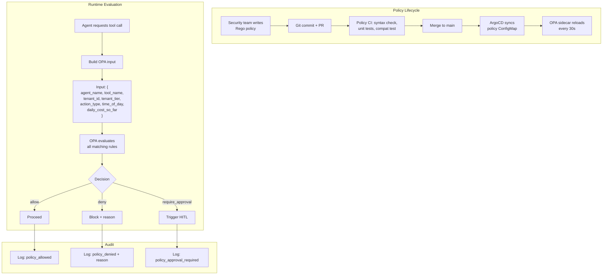
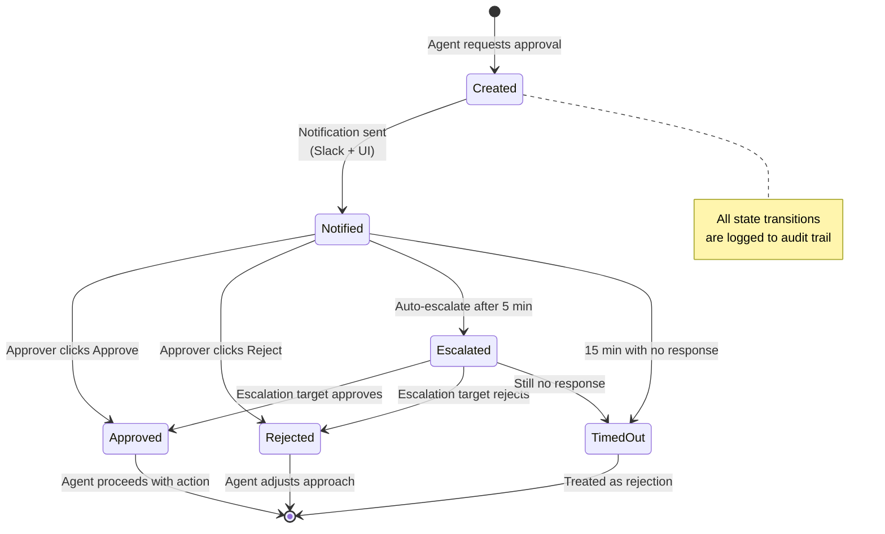
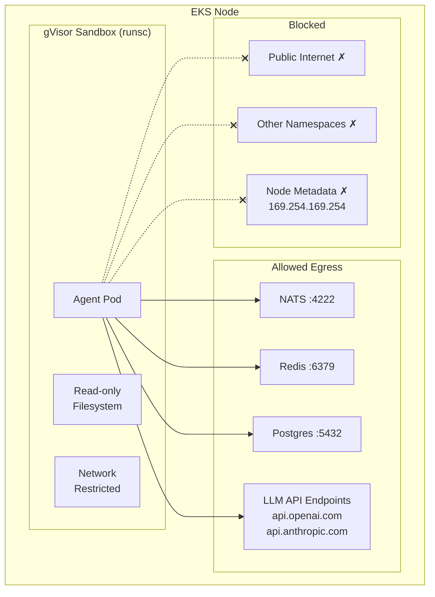

# Phase 3: Safety & Governance — Data Flow Diagrams

> **Objective:** Trace data through every safety checkpoint — from input filtering to output redaction to immutable audit.

---

## 1. Complete Request Flow with Safety Layers



---

## 2. Audit Trail — Complete Event Chain



---

## 3. PII Data Flow — Redaction & Recovery



---

## 4. Policy Decision Data Flow



---

## 5. Human-in-the-Loop — State Machine



### Approval Request Table

```sql
CREATE TABLE approval_requests (
    id UUID PRIMARY KEY,
    tenant_id VARCHAR(64) NOT NULL,
    run_id UUID NOT NULL,
    agent_name VARCHAR(128),
    action_type VARCHAR(128),
    action_description TEXT,
    context JSONB,
    risk_level VARCHAR(32),     -- 'low', 'medium', 'high', 'critical'
    status VARCHAR(32) DEFAULT 'pending',
    assigned_to VARCHAR(255),
    escalated_to VARCHAR(255),
    decided_by VARCHAR(255),
    decision_note TEXT,
    created_at TIMESTAMPTZ DEFAULT now(),
    decided_at TIMESTAMPTZ,
    timeout_at TIMESTAMPTZ
);
```

---

## 6. Sandbox — Network & Resource Isolation



| Resource | Limit | Enforcement |
|----------|-------|-------------|
| CPU | 2 cores max | Kubernetes resource limits |
| Memory | 4 GB max | Kubernetes resource limits + OOM kill |
| Disk | Read-only root fs | securityContext.readOnlyRootFilesystem |
| Network | Allowlist only | NetworkPolicy |
| Process count | 256 max | PID limits via cgroup |
| File descriptors | 1024 max | ulimit via securityContext |
| Execution time | 120s per run | Application-level timeout |
