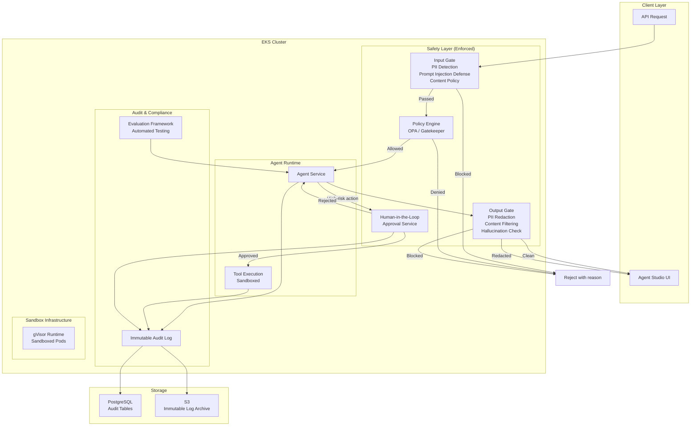
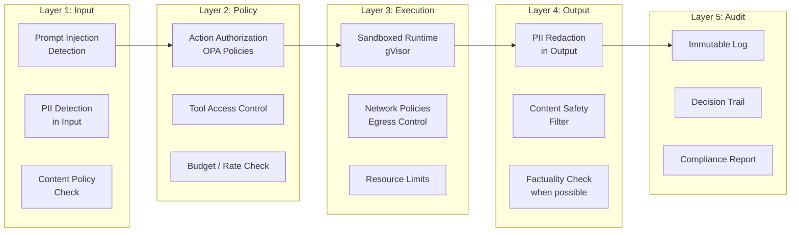
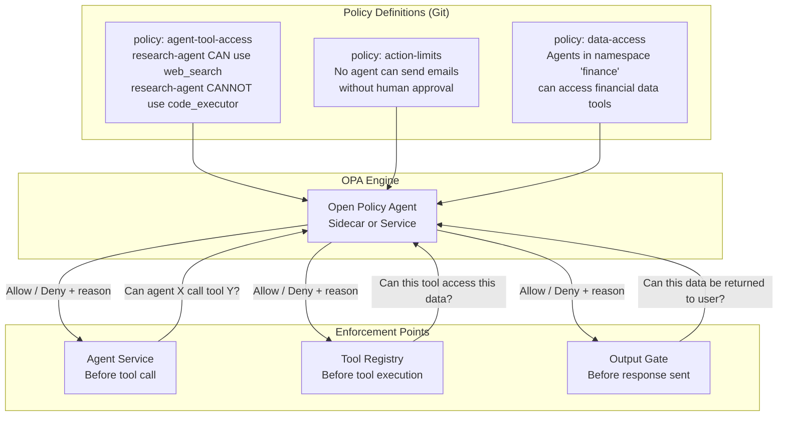
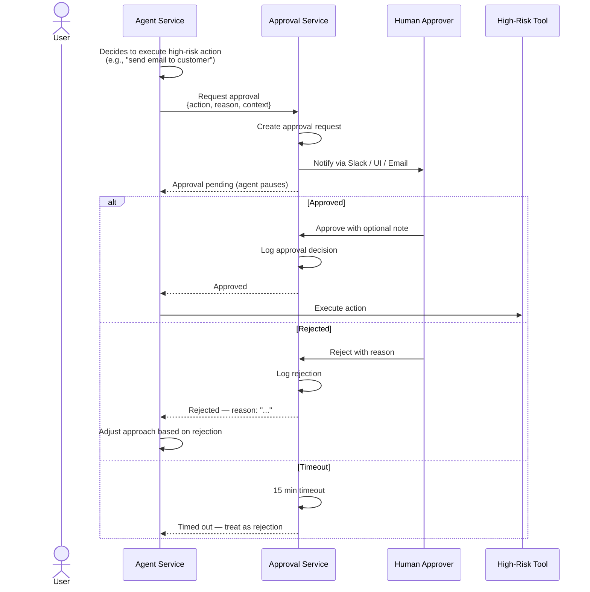

# Phase 3: Safety & Governance — High-Level Design

> **Objective:** Make the platform enterprise-ready — policy enforcement, content safety, audit trails, human-in-the-loop, and sandboxed execution.

---

## Team Thinking

**Product Lead:** "We've proven the technology works. Now we need to prove it's safe enough for regulated industries. Finance, healthcare, legal — they won't touch us without guardrails, audit trails, and compliance controls."

**Security Engineer:** "Agents are the first software that can *decide* to do dangerous things. A SQL injection bug is accidental. An agent that decides to email customer data to an external address is *intentional within its reasoning*. We need a fundamentally different security model."

**Compliance Officer (new hire):** "I need to answer three questions for any auditor: What did the agent do? Who authorized it? Can we prove it? If we can't answer all three, we can't ship to enterprise."

**SRE:** "Guardrails can't add 500ms to every request. Safety has to be fast, or teams will turn it off."

**Architect:** "The safety layer needs to be a sidecar or middleware — not embedded in the agent runtime. Agents shouldn't be able to bypass their own guardrails."

---

## High-Level Architecture

---

## Safety Layers — Defense in Depth

---

## Policy Engine — OPA Integration

---

## Human-in-the-Loop — Approval Flow

---

## Component Ownership

| Component | Team | Responsibility |
|-----------|------|---------------|
| **Input Gate** | Security | PII detection, prompt injection defense, content policy |
| **Output Gate** | Security | PII redaction, content filtering |
| **Policy Engine (OPA)** | Security + Platform | Policy authoring, deployment, enforcement |
| **HITL Service** | Backend | Approval workflow, notification, timeout handling |
| **Audit Log** | Compliance + Platform | Immutable logging, archival, retention |
| **Sandbox Runtime** | Platform | gVisor configuration, security contexts |
| **Evaluation Framework** | Backend + QA | Test authoring, execution, regression detection |
| **Compliance Reporting** | Compliance | Report generation, auditor access |

---

## Key Design Decisions

| Decision | Choice | Rationale |
|----------|--------|-----------|
| Policy engine | OPA (Open Policy Agent) | Industry standard, Rego language is expressive, Kubernetes-native |
| PII detection | Presidio (Microsoft) + custom rules | Open source, extensible, supports custom entity types |
| Prompt injection defense | Multi-layer (heuristic + LLM classifier) | No single approach is reliable enough alone |
| Audit storage | PostgreSQL + S3 archive | Queryable in PG, immutable archive in S3 with lifecycle policies |
| Sandbox runtime | gVisor (runsc) | Better security than default runc, less overhead than Firecracker |
| HITL notifications | Slack + Web UI | Where approvers already are |
