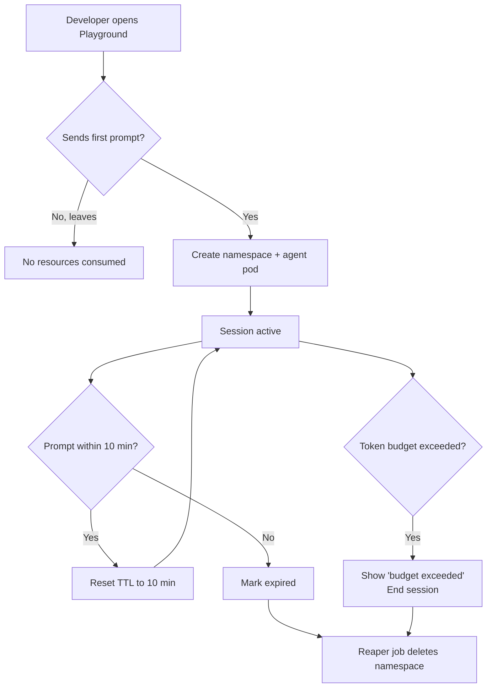

# Phase 4: Developer Experience — Challenges & How We Solved Them

> **The story of making a complex platform feel simple — the UX battles, the API design arguments, and the realization that developer experience is a product, not a feature.**

---

## Challenge 1: "Nobody reads the docs — they just try things and get frustrated"

### The Problem

We wrote extensive documentation: architecture guides, API reference, tutorials. The docs site had beautiful diagrams. But during beta testing with internal teams:
- 80% of developers skipped the docs entirely
- They went straight to the CLI, typed `agentctl --help`, and tried to figure it out
- When something didn't work, they Slacked the platform team instead of reading docs
- The "Getting Started" guide was 12 pages long. Nobody finished it.

### The Debate

**Developer Advocate:** "The docs are great. Developers just don't read."

**Product Lead:** "If developers don't read our docs, our docs are wrong. Not the developers."

**Backend Engineer:** "I'm a developer and I never read docs either. I want to copy-paste a command and have it work."

### How We Solved It

1. **5-minute quickstart** — Reduced the getting started guide to exactly 4 commands:
   ```bash
   pip install agentic-ai-cli
   agentctl config set-api-key <your-key>
   agentctl agent create my-first-agent --from-template rag-assistant
   agentctl agent run my-first-agent "Hello, are you working?"
   ```
   Everything else is optional. Get the developer to "hello world" in under 5 minutes.

2. **Interactive CLI help** — `agentctl agent create` without arguments launches an interactive wizard that asks questions and builds the config. No YAML required for basic cases.

3. **Error messages as docs** — Every error message includes a link to the relevant doc page and a suggested fix:
   ```
   Error: Agent 'my-agent' failed to deploy.
   Reason: Tool 'custom_search' is not registered.

   Fix: Register the tool first:
     agentctl tool register custom_search.yaml

   Docs: https://docs.agentic-ai.internal/guides/custom-tools
   ```

4. **In-portal tutorials** — Instead of a separate docs site, we embedded step-by-step tutorials directly in the portal. When you click "Create Agent," a guided flow walks you through it.

5. **Example gallery** — A searchable gallery of real, working agent configurations with one-click deploy. Developers learn by copying, not by reading essays.

---

## Challenge 2: "The portal tries to do everything and does nothing well"

### The Problem

First version of the developer portal had 14 pages, 8 navigation items, 3 levels of sub-navigation. It was a Frankenstein of features: agent management, monitoring, workflow builder, tool registry, key management, cost explorer, playground, approvals, audit log.

Beta testers said:
- "I can't find anything"
- "It takes 6 clicks to see my agent's logs"
- "The workflow builder is cool but I don't understand it"
- "Why do I need a portal when I use the CLI for everything?"

### The Debate

**Frontend Engineer:** "We built everything the product spec asked for. The problem is information architecture, not features."

**Developer Advocate:** "Developers live in the terminal. The portal should be for things that are *better* in a GUI: visualization, monitoring, onboarding."

**Product Lead:** "Let's figure out what developers actually use, not what we think they should use."

### How We Solved It

1. **Usage analytics** — Tracked which pages developers visited and for how long. Found that 70% of time was spent on 3 pages: Agent Detail, Trace Viewer, and Playground.

2. **Redesigned around 3 core flows:**
   - **Build** (Create/configure agents) — Wizard + YAML editor
   - **Test** (Playground) — Chat UI with debug mode
   - **Monitor** (Dashboard + traces) — Agent health, recent runs, traces

   Everything else became secondary navigation or settings.

3. **Agent Detail as the hub** — One page per agent with tabs: Overview, Runs, Traces, Logs, Config, Cost. No more bouncing between 5 different pages.

4. **Keyboard-first navigation** — `Cmd+K` opens a command palette (like VS Code). Power users never touch the sidebar.

5. **CLI parity** — Anything you can do in the portal, you can do in the CLI. The portal is for visual tasks; the CLI is for automation and scriptability. Neither is second-class.

---

## Challenge 3: "The SDK feels like a thin REST client, not a real SDK"

### The Problem

First version of the Python SDK was essentially:
```python
client = AgenticAIClient(api_key="...")
response = client.post("/api/v1/agents/my-agent/run", {"prompt": "..."})
```

Developers said: "This is just `requests` with extra steps." They wanted:
- Agent objects that feel like real Python objects
- Async support
- Type hints everywhere
- Streaming that works like iterating over a generator
- Custom agent classes they can extend

### How We Solved It

Redesigned the SDK with the **complexity ladder** principle:

1. **Level 1 is one line** — `Agent("name").run("prompt")` works out of the box. Configuration comes from the platform; the SDK just calls the API.

2. **Type-safe responses** — Everything returns typed Pydantic models, not dicts. IDE autocomplete works everywhere.

3. **Async-first, sync-compatible:**
   ```python
   # Sync (for scripts)
   result = agent.run("question")

   # Async (for web apps)
   result = await agent.arun("question")

   # Streaming (for UIs)
   async for chunk in agent.astream("question"):
       print(chunk)
   ```

4. **Agent subclassing** — Developers can extend the base Agent class to add hooks (before_tool_call, after_run, custom_tool_router). This is how advanced teams customize behavior without forking the platform.

5. **Local development mode** — `agent.run("question", local=True)` runs the agent loop locally (on the developer's machine) while still using the platform's tools and memory. Faster iteration, no deployment needed.

---

## Challenge 4: "Playground sessions keep running after developers leave, burning money"

### The Problem

Each playground session spins up an agent pod, allocates Redis memory, and consumes LLM tokens. During the first week of beta:
- 47 playground sessions were created
- 12 of them were never used (developer opened playground and went to lunch)
- 8 were used once and abandoned
- Average session lifetime: 3.2 hours (with only 4 minutes of actual usage)
- Total playground LLM cost that week: $180 (mostly idle sessions left open)

### How We Solved It

1. **Aggressive TTL** — Sessions expire 10 minutes after last interaction (not 10 minutes after creation). Active use extends the TTL.

2. **Token budget per session** — 50,000 tokens max per playground session. After that: "Budget exceeded. Start a new session." Prevents runaway loops.

3. **No auto-create** — Playground doesn't create a namespace until the developer sends their first prompt. Just opening the playground page costs nothing.

4. **Visible resource usage** — The playground shows a live counter: "Tokens used: 12,340 / 50,000 | Session expires in 8:42"

5. **Reaper job** — A CronJob runs every minute, deleting namespaces where `ttl.expired = true`. Separate from application logic — even if the portal crashes, cleanup still happens.



---

## Challenge 5: "Templates are stale — they reference tools that no longer exist"

### The Problem

Templates were created at launch and never updated. Over 2 months:
- Two tools were renamed (`web_search` → `internet_search`)
- One tool was deprecated
- Model names changed (`gpt-4o` pricing tier changed, teams migrated to `gpt-4o-2026`)
- Template that used old tool names failed on instantiation

Developers created agents from templates, got deployment errors, and filed angry support tickets.

### How We Solved It

1. **Template CI/CD pipeline** — Every template is tested nightly against the live platform. The test instantiates the template, deploys the agent, runs a sample query, and validates the output. Failing templates are flagged.

2. **Template versioning** — Templates declare minimum platform version and tool version dependencies. `agentctl` warns if a template is incompatible with the current platform.

3. **Automatic migration** — When a tool is renamed, a migration script updates all templates that reference it. This runs as part of the tool deprecation process.

4. **Template ownership** — Every template has an owner (team or individual). Owners get pinged when their template's tests fail. Unowned templates that fail for 2 weeks are unlisted.

5. **Community contributions** — Teams can submit templates via PR. They go through the same CI pipeline before being published.

---

## Challenge 6: "Self-serve means teams deploy agents without understanding the cost"

### The Problem

Self-serve provisioning was a success — 15 teams created agents in the first month. But some teams:
- Deployed agents with `gpt-4o` when `gpt-4o-mini` would have been fine
- Set `max_replicas: 50` because "more is better"
- Didn't set token budgets, leading to $500+ surprise bills
- Created 12 agents for what could have been 1 agent with different prompts

### How We Solved It

1. **Cost estimation at creation time** — When creating an agent, the portal shows an estimated monthly cost: "Based on this model and expected usage, estimated cost: $45-120/month." This changed behavior immediately.

2. **Sane defaults** — Templates ship with conservative defaults: `max_replicas: 3`, `budget_daily: $5`, `model: gpt-4o-mini`. Developers can override, but the defaults are safe.

3. **Weekly cost digest** — Every team lead gets a weekly email: "Your team's agent usage this week: $X. Top agents by cost. Optimization suggestions."

4. **Model recommendation engine** — For each agent run, the platform records the task complexity. Monthly report shows: "Agent X used gpt-4o for 847 runs. Based on task complexity, 720 of those could have used gpt-4o-mini, saving ~$X."

5. **Quota approval for expensive configs** — Agents requesting >$50/day budget or >10 replicas require platform team approval. This isn't bureaucracy — it's a conversation: "What's the use case? Let's find the right config."

---

## Team Retrospective — Phase 4

### What Went Well
- 5-minute quickstart got 90% of beta testers to "hello world" successfully
- Playground is the most loved feature — teams use it for live demos to stakeholders
- CLI + SDK parity means teams pick their preferred workflow

### What Didn't Go Well
- Portal v1 was over-engineered — should have launched with 3 pages, not 14
- SDK v1 was too thin — should have invested in the object model from day one
- Template staleness was embarrassing and should have been caught by CI from the start

### Key Metrics After Phase 4
- **Time to first agent:** 4 min 30 sec (target: < 5 min)
- **Portal daily active users:** 42 across 15 teams
- **CLI daily active users:** 28
- **SDK downloads:** 340 installs
- **Template usage:** 68% of new agents created from templates
- **Playground sessions per week:** 120 (average 6 min active time)
- **Support tickets about "how to use the platform":** 3/week (down from 25/week pre-Phase 4)
