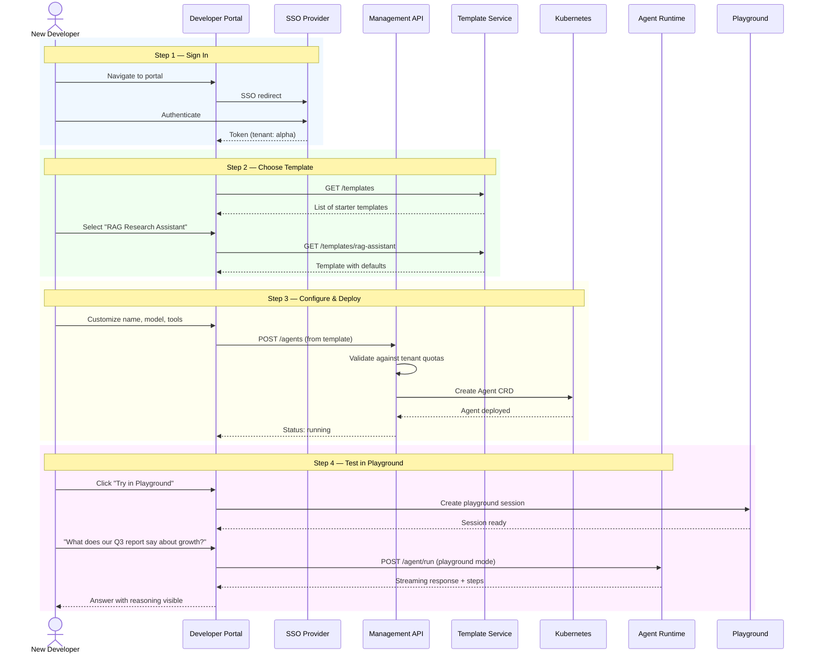
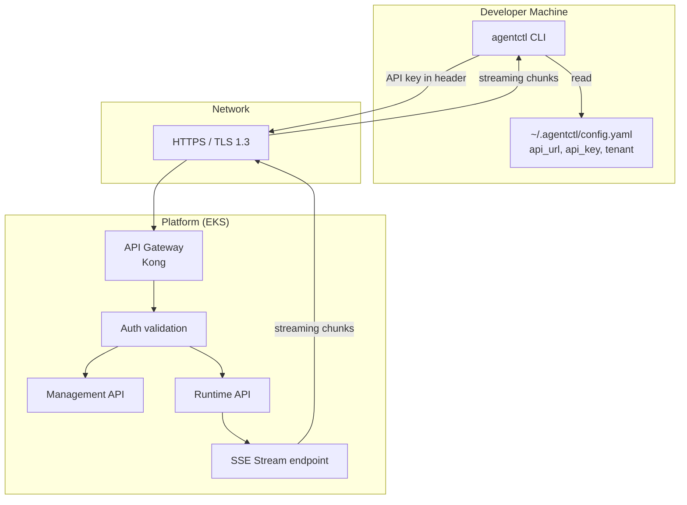
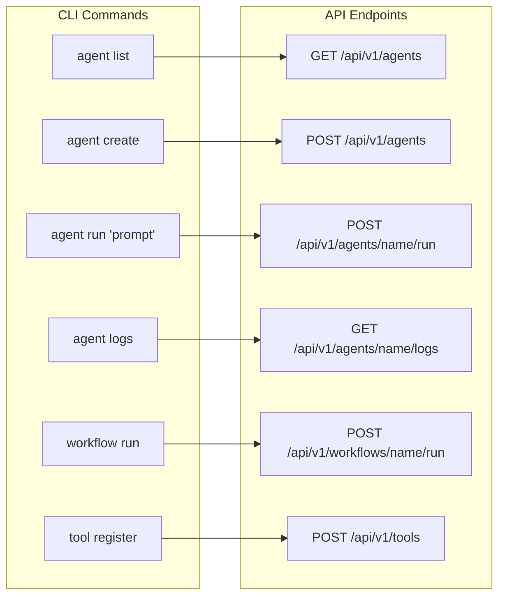
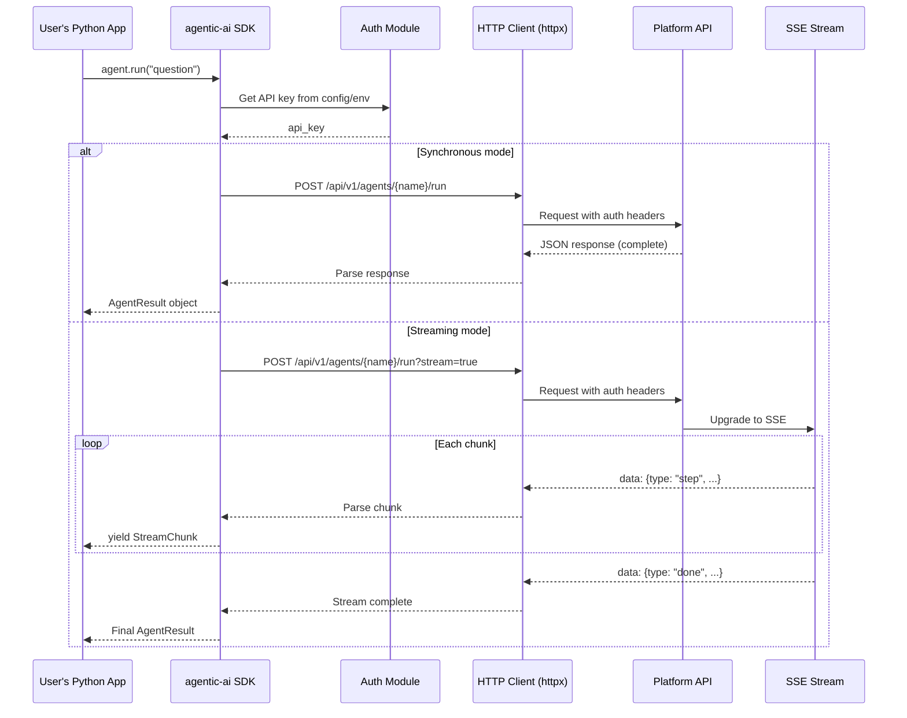
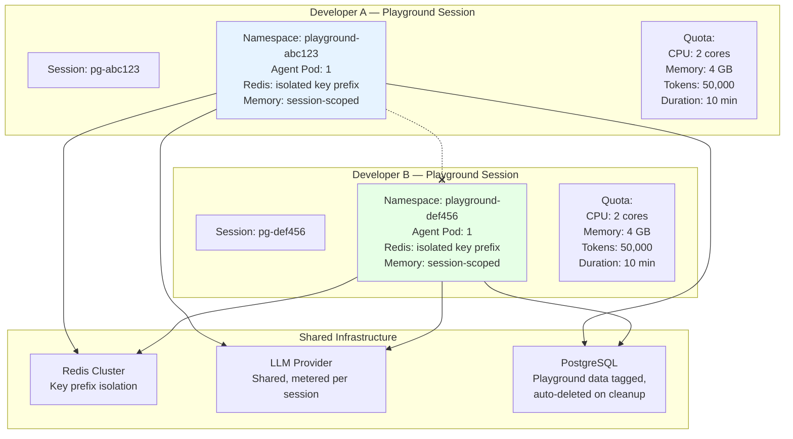
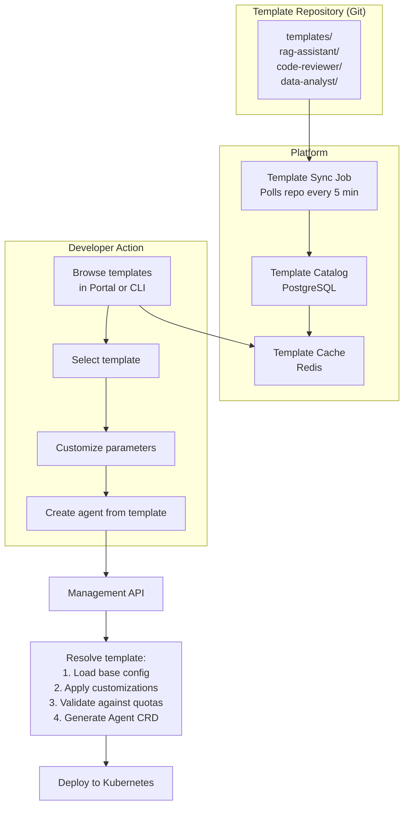
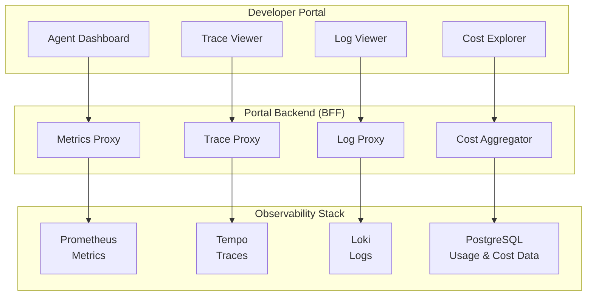
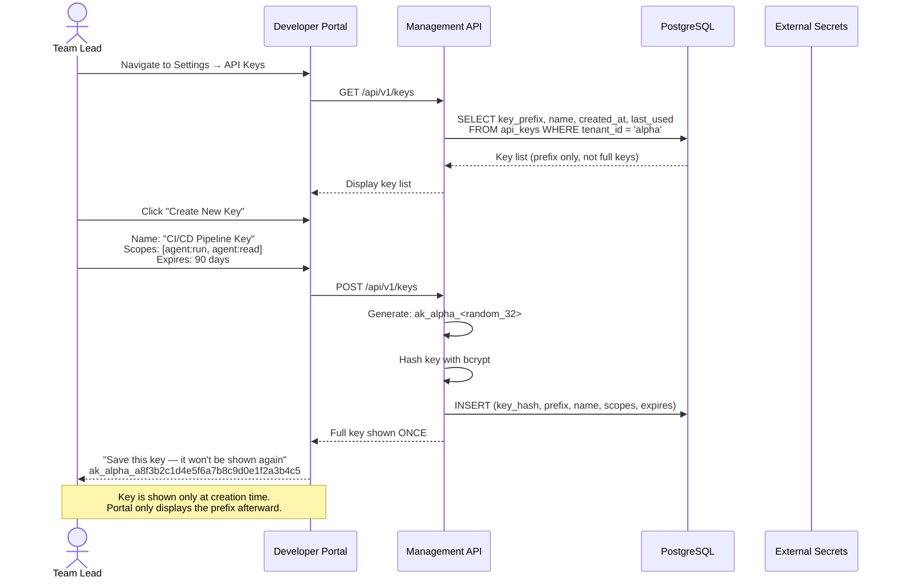

# Phase 4: Developer Experience — Data Flow Diagrams

> **Objective:** Trace every interaction path — from developer action to platform response — across portal, CLI, SDK, and playground.

---

## 1. Developer Onboarding Flow — Zero to First Agent

---

## 2. CLI → Platform Data Flow

### Command-to-API Mapping

---

## 3. SDK Internal Data Flow

---

## 4. Playground — Session Data Isolation

---

## 5. Template Installation Flow

---

## 6. Real-Time Monitoring — Portal to Observability Stack

### Trace Viewer — What the Developer Sees

```mermaid
gantt
    title Agent Run Trace — run_id: abc123
    dateFormat X
    axisFormat %s

    section HTTP
    Request received           :0, 200

    section Auth
    API key validation         :200, 250

    section Agent Loop
    LLM Call #1 (decide tool)  :250, 3400
    Tool: web_search           :3400, 4600
    LLM Call #2 (decide tool)  :4600, 7200
    Tool: calculator           :7200, 7210
    LLM Call #3 (final answer) :7210, 9800

    section Safety
    Output filter              :9800, 9850

    section Response
    Send response              :9850, 9900
```

---

## 7. API Key Self-Service Flow

