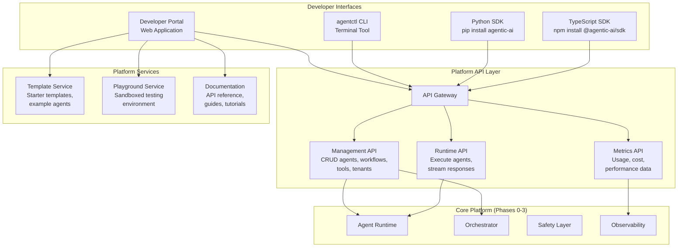
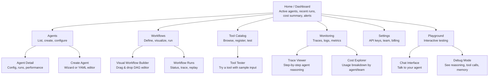
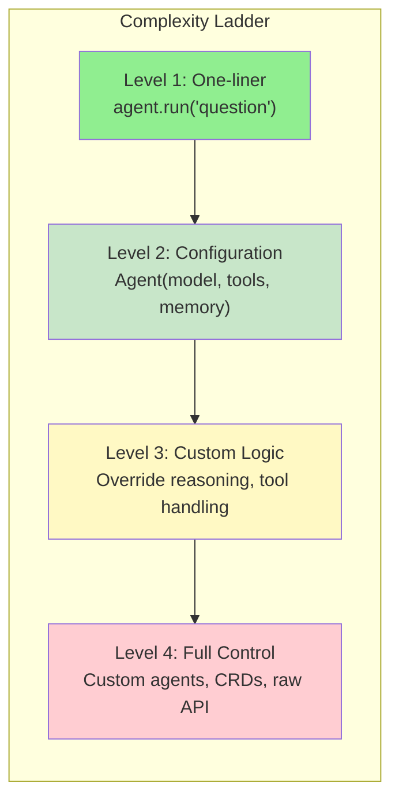

# Phase 4: Developer Experience & Self-Serve — High-Level Design

> **Objective:** Make the platform accessible to every team — a portal, CLI, SDKs, templates, playground, and documentation that lets someone go from zero to running agent in minutes.

---

## Team Thinking

**Product Lead:** "We built a powerful platform. But right now only the platform team can use it. If adopting the platform requires a Kubernetes expert, we've failed. Every developer should be able to build, deploy, and manage agents without filing a ticket."

**Developer Advocate (new hire):** "I've onboarded onto dozens of platforms. The ones that win have three things: a great getting-started guide, a CLI that doesn't suck, and a playground where you can experiment without breaking anything."

**Frontend Engineer:** "The portal isn't just a dashboard. It's the primary interface for teams. Agent configuration, monitoring, logs, approvals — all in one place. No more switching between Grafana, kubectl, and Slack."

**Backend Engineer:** "The SDK needs to feel like writing normal Python. No 50-line YAML files to create an agent. `Agent(name='my-agent', model='gpt-4o', tools=[search])` — that simple."

**Platform Engineer:** "Self-serve means guardrails. Teams can provision agents without us, but within limits. Quotas, approved models, approved tools. Self-serve doesn't mean free-for-all."

---

## High-Level Architecture



---

## Developer Portal — Page Map



---

## CLI (agentctl) — Command Map

```
agentctl
├── agent
│   ├── list                    List all agents in your tenant
│   ├── create <name>           Create a new agent (interactive or --from-template)
│   ├── deploy <name>           Deploy agent to the platform
│   ├── describe <name>         Show agent config, status, recent runs
│   ├── logs <name>             Stream agent logs
│   ├── run <name> "prompt"     Execute agent with a prompt
│   └── delete <name>           Remove agent
├── workflow
│   ├── list                    List workflows
│   ├── create <name>           Create workflow from YAML
│   ├── run <name> --input {}   Execute workflow
│   ├── status <run-id>         Check workflow run status
│   └── visualize <name>        Print DAG in terminal (ASCII art)
├── tool
│   ├── list                    List available tools
│   ├── register <tool.yaml>    Register a new tool
│   └── test <name> --input {}  Test a tool
├── playground                  Open interactive playground
├── config
│   ├── set-context <tenant>    Switch tenant context
│   └── set-api-key <key>       Configure authentication
└── status                      Platform health, your usage, alerts
```

---

## SDK Design Philosophy



**Principle:** Simple things are simple. Complex things are possible.

---

## Component Ownership

| Component | Team | Responsibility |
|-----------|------|---------------|
| **Developer Portal** | Frontend + Product | UX design, implementation, user research |
| **agentctl CLI** | Backend | Command implementation, auto-updates |
| **Python SDK** | Backend | API wrappers, agent abstractions |
| **TypeScript SDK** | Backend | API wrappers, frontend integration |
| **Management API** | Backend | CRUD endpoints, validation |
| **Template Service** | Developer Advocate + Backend | Template curation, testing |
| **Playground** | Frontend + Platform | Sandboxed environment, resource limits |
| **Documentation** | Developer Advocate | Guides, API reference, tutorials |

---

## Key Design Decisions

| Decision | Choice | Rationale |
|----------|--------|-----------|
| Portal framework | React + Next.js | SSR for docs, rich interactivity for workflow builder |
| CLI framework | Python (Click) | Same language as SDK, cross-platform |
| SDK style | Declarative + imperative | Define agents as objects, override behavior with methods |
| Playground isolation | Dedicated namespace per session, 10-min TTL | No cross-contamination, auto-cleanup |
| Template source | Git repo, synced to platform | Version controlled, community contributions via PR |
| API docs | OpenAPI spec → auto-generated docs | Single source of truth, always in sync |
