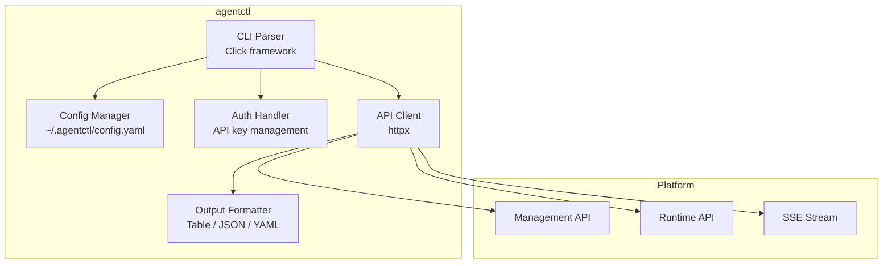
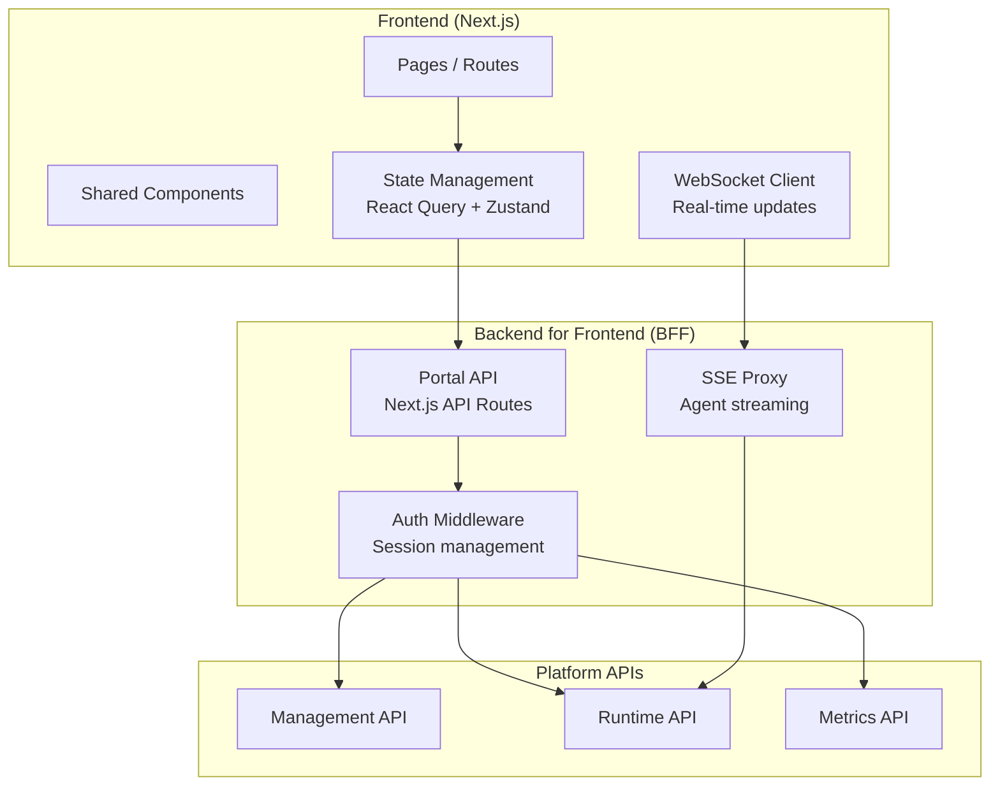
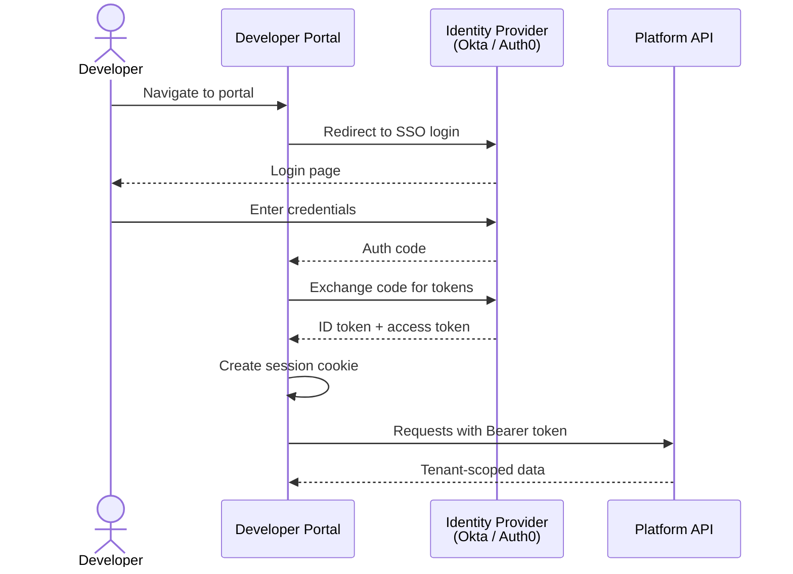
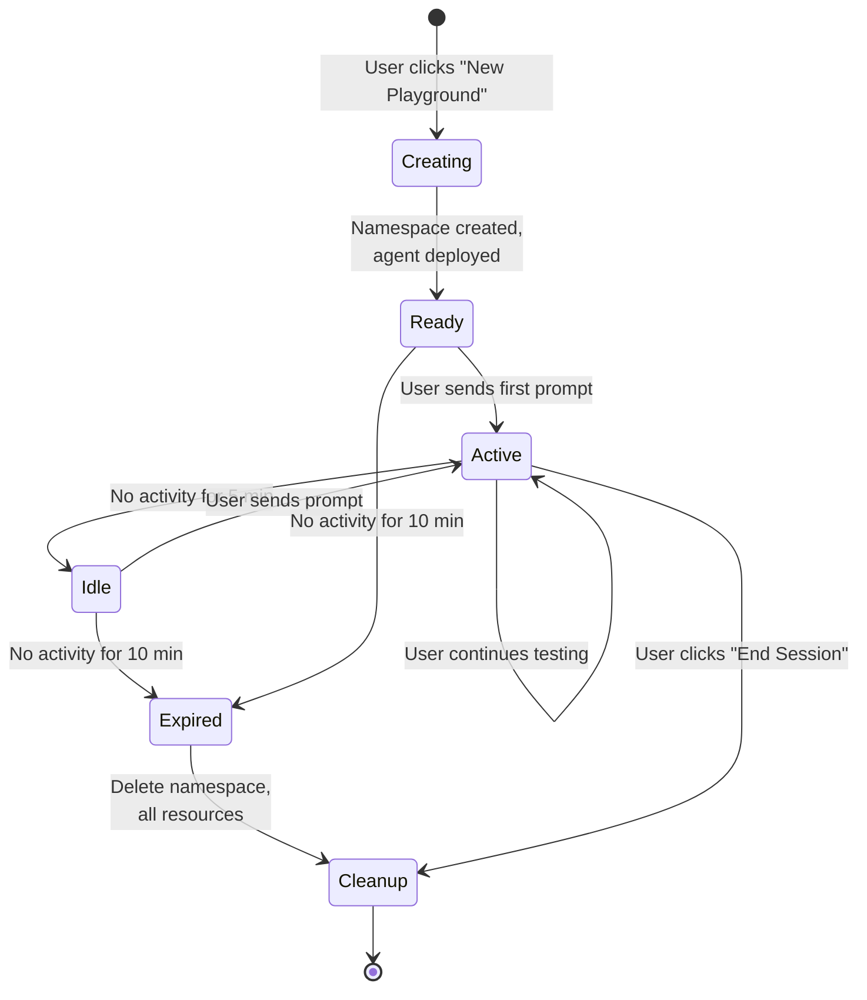
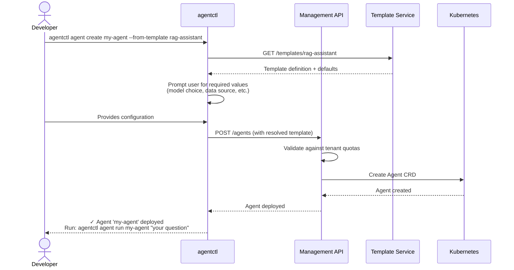
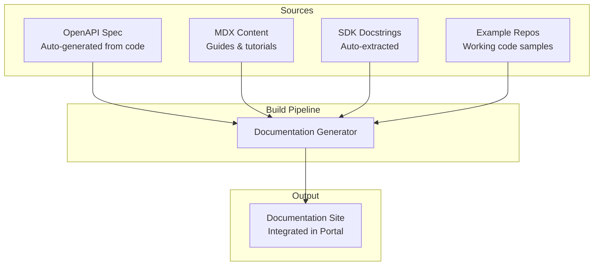

# Phase 4: Developer Experience & Self-Serve — Low-Level Design

> **Objective:** Detailed design for the portal, CLI, SDKs, playground, templates, and the management APIs that power them all.

---

## 1. Management API — Complete Specification

### Agent Management

```
POST   /api/v1/agents                    Create agent
GET    /api/v1/agents                    List agents (tenant-scoped)
GET    /api/v1/agents/{name}             Get agent details
PUT    /api/v1/agents/{name}             Update agent
DELETE /api/v1/agents/{name}             Delete agent
POST   /api/v1/agents/{name}/deploy      Deploy agent to cluster
GET    /api/v1/agents/{name}/runs        List recent runs
GET    /api/v1/agents/{name}/metrics     Get agent performance metrics
POST   /api/v1/agents/{name}/run         Execute agent (sync/async)
```

### Create Agent Request

```json
{
  "name": "research-assistant",
  "description": "Researches topics and provides summaries",
  "model": "gpt-4o",
  "system_prompt": "You are a research assistant...",
  "tools": ["web_search", "document_retrieval"],
  "memory": {
    "short_term": true,
    "long_term": true,
    "long_term_collection": "research-memories"
  },
  "scaling": {
    "min_replicas": 1,
    "max_replicas": 5
  },
  "safety": {
    "input_filtering": true,
    "output_filtering": true,
    "sandbox_tier": "auto"
  }
}
```

### Agent Status Response

```json
{
  "name": "research-assistant",
  "status": "running",
  "replicas": {
    "desired": 2,
    "ready": 2
  },
  "metrics": {
    "total_runs_24h": 847,
    "success_rate": 0.97,
    "p50_latency_ms": 4200,
    "p95_latency_ms": 9800,
    "tokens_used_24h": 1240000,
    "cost_24h_usd": 3.12
  },
  "last_run": {
    "run_id": "uuid",
    "status": "completed",
    "timestamp": "2026-04-04T14:32:00Z"
  }
}
```

---

## 2. Python SDK — API Design

### Level 1: One-Liner

```python
from agentic_ai import Agent

answer = Agent("research-assistant").run("What are the latest trends in AI?")
print(answer.text)
```

### Level 2: Configuration

```python
from agentic_ai import Agent, Tool, Memory

agent = Agent(
    name="my-analyst",
    model="gpt-4o",
    system_prompt="You are a data analyst...",
    tools=[
        Tool.builtin("web_search"),
        Tool.builtin("calculator"),
        Tool.builtin("code_executor"),
    ],
    memory=Memory(short_term=True, long_term=True),
)

# Synchronous run
result = agent.run("Analyze the S&P 500 performance this quarter")
print(result.text)
print(result.steps)  # List of reasoning steps
print(result.tokens_used)
print(result.cost_usd)

# Streaming run
for chunk in agent.stream("Analyze the S&P 500 performance this quarter"):
    if chunk.type == "step":
        print(f"Step: {chunk.tool_name}...")
    elif chunk.type == "text":
        print(chunk.text, end="")
```

### Level 3: Custom Logic

```python
from agentic_ai import Agent, ToolCall, RunContext

class MyAgent(Agent):
    def before_tool_call(self, ctx: RunContext, call: ToolCall):
        """Called before every tool execution — add custom logic."""
        if call.tool_name == "web_search" and "competitor" in call.input["query"]:
            ctx.log.warn("Competitor research detected, flagging for review")
        return call  # modify or block

    def after_run(self, ctx: RunContext):
        """Called after every run — logging, notifications, etc."""
        if ctx.result.cost_usd > 0.10:
            ctx.notify(f"High-cost run: ${ctx.result.cost_usd:.2f}")
```

### Level 4: Workflow SDK

```python
from agentic_ai import Workflow, Step

workflow = Workflow(
    name="market-report",
    steps=[
        Step("research", agent="research-assistant",
             input="Research {{ topic }}"),
        Step("analyze", agent="data-analyst",
             input="{{ steps.research.output }}",
             depends_on=["research"]),
        Step("write", agent="report-writer",
             input="Write report from: {{ steps.analyze.output }}",
             depends_on=["analyze"]),
    ]
)

result = workflow.run(topic="renewable energy market 2026")
print(result.output)
print(result.duration)
print(result.dag_visualization())
```

---

## 3. CLI (agentctl) — Internal Architecture



### Config File (~/.agentctl/config.yaml)

```yaml
current_context: production

contexts:
  production:
    api_url: https://agent-platform.internal.company.com
    api_key: ak_alpha_xxxx
    tenant: alpha
    default_namespace: default

  staging:
    api_url: https://agent-platform-staging.internal.company.com
    api_key: ak_alpha_staging_xxxx
    tenant: alpha
    default_namespace: staging
```

### CLI Output Example

```
$ agentctl agent list

NAME                 STATUS    REPLICAS   RUNS (24h)   SUCCESS   P95 LATENCY   COST (24h)
research-assistant   running   2/2        847          97.0%     9.8s          $3.12
data-analyst         running   1/1        234          98.7%     12.3s         $2.45
report-writer        running   1/1        156          99.4%     6.1s          $0.89
code-helper          stopped   0/0        0            —         —             $0.00

$ agentctl agent run research-assistant "What AI regulations passed in 2026?"

⠋ Thinking...
⠙ Using tool: web_search — "AI regulations 2026"
⠹ Using tool: web_search — "EU AI Act 2026 enforcement"
⠸ Composing answer...

Several significant AI regulations took effect or were enacted in 2026:
1. EU AI Act enforcement began in phases...
2. ...

Steps: 3 | Tokens: 2,847 | Cost: $0.0071 | Duration: 8.2s
```

---

## 4. Developer Portal — Component Architecture



### Portal Authentication Flow



---

## 5. Playground — Sandboxed Testing

### Playground Session Lifecycle



### Playground Isolation

```yaml
# Each playground session gets its own namespace
apiVersion: v1
kind: Namespace
metadata:
  name: playground-sess-abc123
  labels:
    agentic.ai/type: playground
    agentic.ai/tenant: alpha
    agentic.ai/session: abc123
    agentic.ai/ttl: "600"  # 10 minutes

# Resource quota per session
apiVersion: v1
kind: ResourceQuota
metadata:
  name: playground-quota
  namespace: playground-sess-abc123
spec:
  hard:
    requests.cpu: "2"
    requests.memory: "4Gi"
    limits.cpu: "4"
    limits.memory: "8Gi"
    pods: "5"

# LLM token limit per session
# Enforced at application level
max_tokens_per_session: 50000
max_tool_calls_per_session: 20
```

---

## 6. Template System

### Template Structure

```
templates/
├── rag-assistant/
│   ├── template.yaml          # Template metadata
│   ├── agent.yaml             # Agent CRD template
│   ├── tools/                 # Required tool configs
│   ├── sample-data/           # Example data for testing
│   └── README.md              # Setup guide
├── code-reviewer/
│   ├── template.yaml
│   ├── agent.yaml
│   └── README.md
├── data-analyst/
│   └── ...
└── multi-agent-report-writer/
    ├── template.yaml
    ├── workflow.yaml           # Multi-agent workflow
    ├── agents/                 # Multiple agent definitions
    └── README.md
```

### Template Metadata

```yaml
name: rag-assistant
display_name: "RAG Research Assistant"
description: "An agent that answers questions using retrieved documents"
category: research
difficulty: beginner
estimated_setup: "5 min"
required_tools:
  - document_retrieval
  - web_search
required_integrations:
  - vector_store
tags: ["rag", "research", "documents"]
```

### Template Instantiation Flow



---

## 7. Documentation Architecture



### Documentation Structure

```
docs/
├── getting-started/
│   ├── quickstart.mdx              # 5-minute first agent
│   ├── concepts.mdx                # What are agents, tools, memory
│   └── installation.mdx            # CLI, SDK setup
├── guides/
│   ├── building-your-first-agent.mdx
│   ├── adding-custom-tools.mdx
│   ├── multi-agent-workflows.mdx
│   ├── memory-and-context.mdx
│   └── safety-and-policies.mdx
├── api-reference/
│   ├── management-api.mdx          # Auto-generated from OpenAPI
│   ├── runtime-api.mdx
│   └── webhook-events.mdx
├── sdk-reference/
│   ├── python/                     # Auto-generated from docstrings
│   └── typescript/
├── architecture/
│   ├── overview.mdx
│   ├── agent-runtime.mdx
│   └── security-model.mdx
└── changelog.mdx
```
