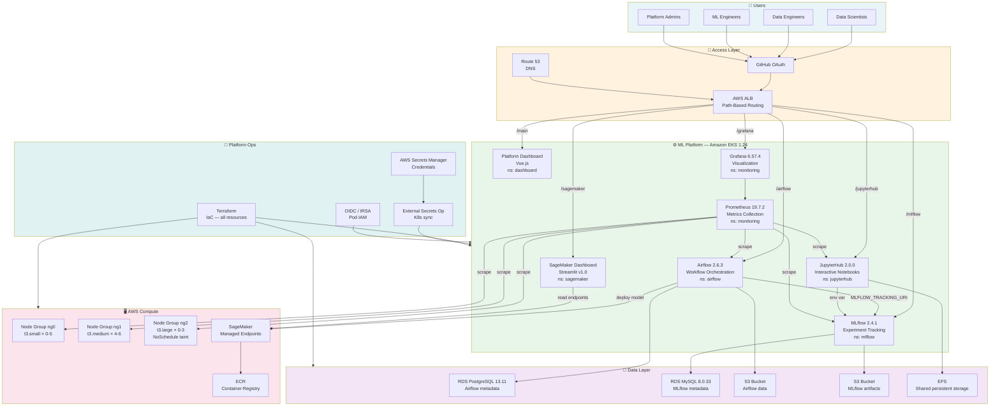
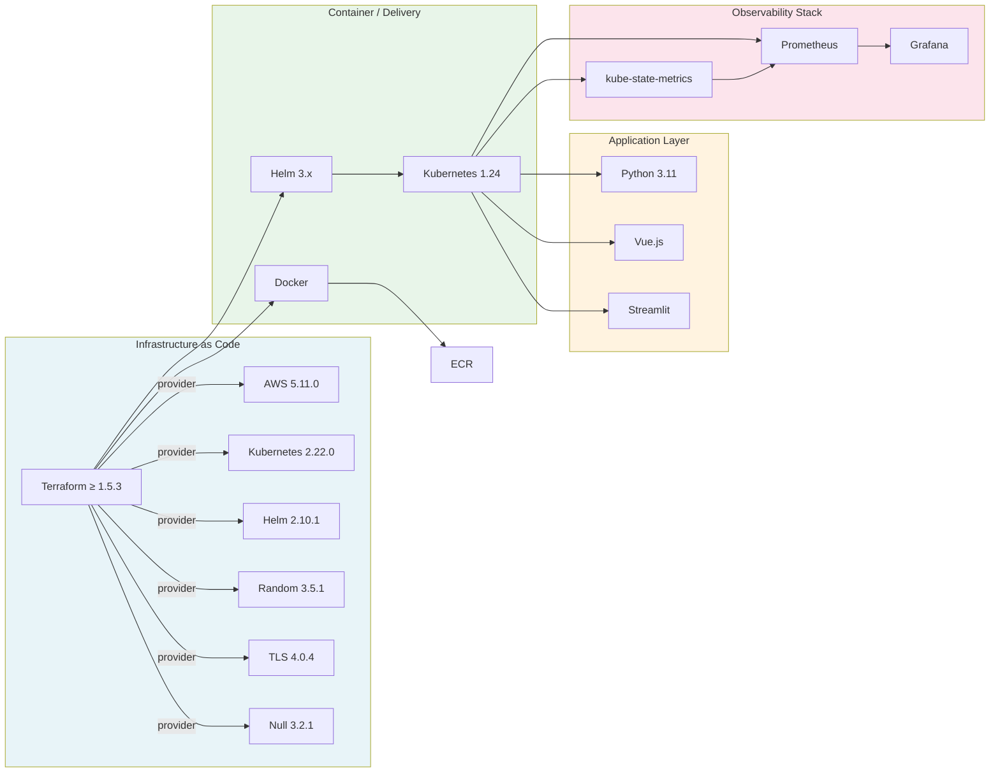
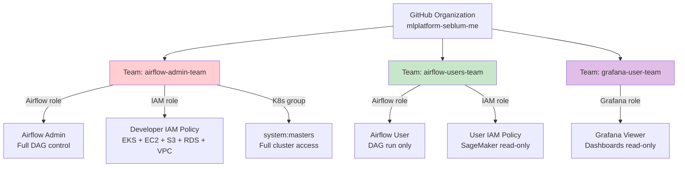
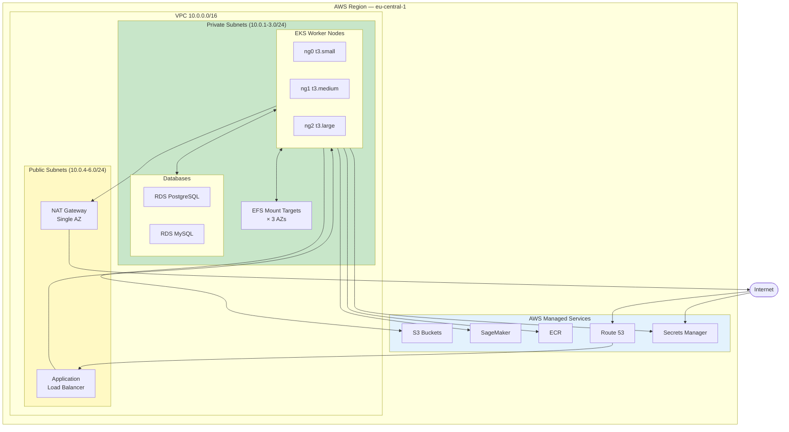

# System Overview

> **Audience**: Engineering managers, architects, new team members  
> **Purpose**: Understand what the platform is, why it exists, and what it contains

---

## Executive Summary

The **MLOps Platform on EKS** is a fully managed, Infrastructure-as-Code ML platform that provides a complete, end-to-end machine learning lifecycle environment on Amazon Web Services.

It eliminates the need for data scientists to manage any infrastructure. A data scientist can:

1. **Explore data and prototype models** in JupyterHub (with shared EFS storage and pre-installed ML libraries).
2. **Schedule and orchestrate ML pipelines** with Airflow (git-sync DAGs, KubernetesExecutor for isolation).
3. **Track experiments, log parameters/metrics, and register models** with MLflow.
4. **Deploy trained models as REST endpoints** via SageMaker, monitored via a Streamlit dashboard.
5. **Observe the entire platform health** through Prometheus + Grafana.

All access is controlled via **GitHub OAuth** and **AWS IAM**, creating a secure, auditable environment suitable for multiple teams.

---

## Platform Goals

| Goal | How Addressed |
|------|--------------|
| **Reproducibility** | MLflow experiment tracking + artifact versioning in S3 |
| **Scalability** | EKS Cluster Autoscaler + KubernetesExecutor ephemeral pods |
| **Security** | IRSA (no node-level credentials), GitHub OAuth, private subnets |
| **Multi-tenancy** | Per-namespace isolation, per-user IAM roles, GitHub team-based access |
| **Observability** | Prometheus + Grafana, K8s dashboard IDs: 2, 315, 6417 |
| **Infrastructure Independence** | All IaC in Terraform; reproducible from scratch in ~20 min |
| **Cost Efficiency** | Autoscaling node groups (min=0), spot-friendly (large workloads on tainted ng2) |

---

## Component Catalogue

---

## AWS Service Map

| AWS Service | Role | Key Configuration |
|-------------|------|-------------------|
| **EKS** | Kubernetes control plane | v1.24, public + private endpoint, OIDC enabled |
| **EC2 Auto Scaling** | Worker nodes | 3 node groups: t3.small/medium/large |
| **VPC** | Network isolation | `10.0.0.0/16`, 3 AZs, single NAT gateway |
| **ALB** | Ingress traffic | Internet-facing, IP target type, path-based rules |
| **Route 53** | DNS | ExternalDNS syncs Ingress → A records automatically |
| **RDS (PostgreSQL)** | Airflow DB | v13.11, `db.t3.micro`, port 5000, private subnets |
| **RDS (MySQL)** | MLflow DB | v8.0.33, `db.t3.micro`, port 5432, private subnets |
| **EFS** | Shared file storage | Dynamic provisioning, `efs-ap` mode, IAM auth |
| **EBS** | Block storage | `gp2` available (not default), used by stateful workloads |
| **S3** | Artifact & data storage | 2 buckets (MLflow artifacts, Airflow data), AES256 encryption |
| **S3** | Terraform remote state | `mlplatform-terraform-state`, versioned, encrypted |
| **DynamoDB** | Terraform state locking | `mlplatform-terraform-locks`, prevents concurrent applies |
| **IAM + OIDC** | IRSA (pod-level AWS access) | One role per K8s service account |
| **Secrets Manager** | Credential storage | Per-user AWS keys + OAuth tokens |
| **ECR** | Container registry | `mlflow-sagemaker-deployment` for model images |
| **SageMaker** | Model serving | Endpoint management; deployment triggered from Airflow |

---

## Infrastructure Technical Stack

---

## Deployment Feature Flags

Every platform component can be independently enabled or disabled via a boolean variable in the `.tfvars` file.

| Variable | Default | Component Deployed |
|----------|---------|-------------------|
| `deploy_airflow` | `true` | Airflow + RDS PostgreSQL + S3 data bucket |
| `deploy_mlflow` | `true` | MLflow + RDS MySQL + S3 artifact bucket |
| `deploy_jupyterhub` | `true` | JupyterHub |
| `deploy_monitoring` | `true` | Prometheus + Grafana |
| `deploy_dashboard` | `true` | Vue.js unified dashboard |
| `deploy_sagemaker` | `true` | SageMaker IAM + ECR + Streamlit dashboard |

> Cloud cost tip: Set all `deploy_*` to `false` until needed. EKS control plane (base cost) + 4× t3.medium nodes run continuously regardless of flags.

---

## User Roles

---

## Network Topology Summary

