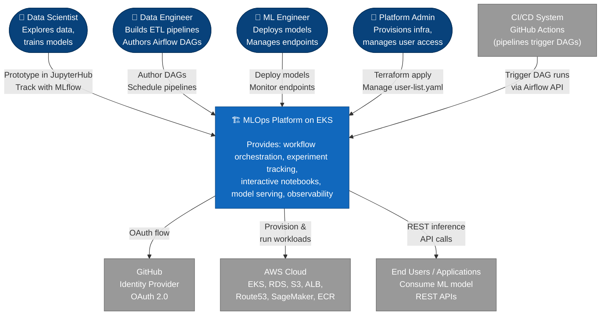
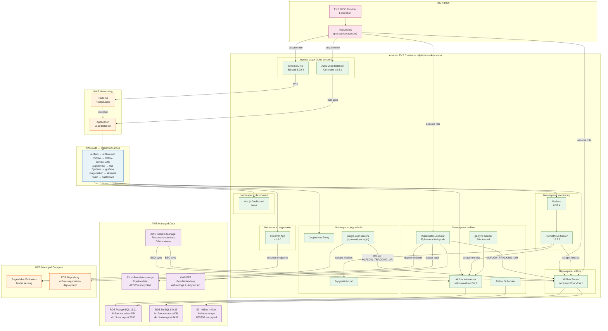
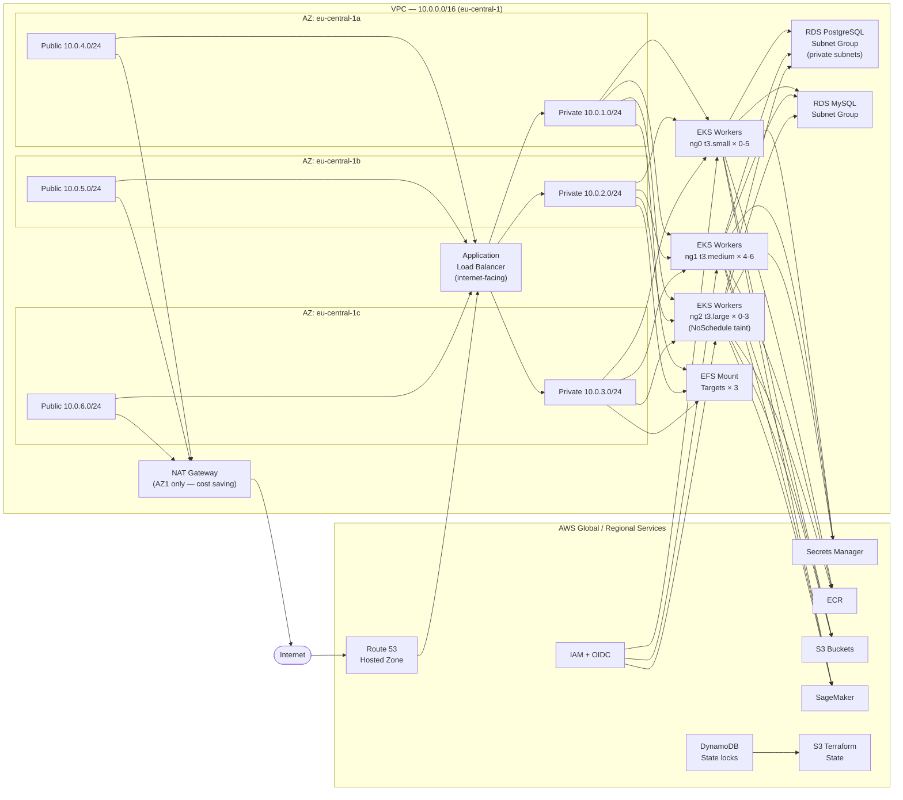
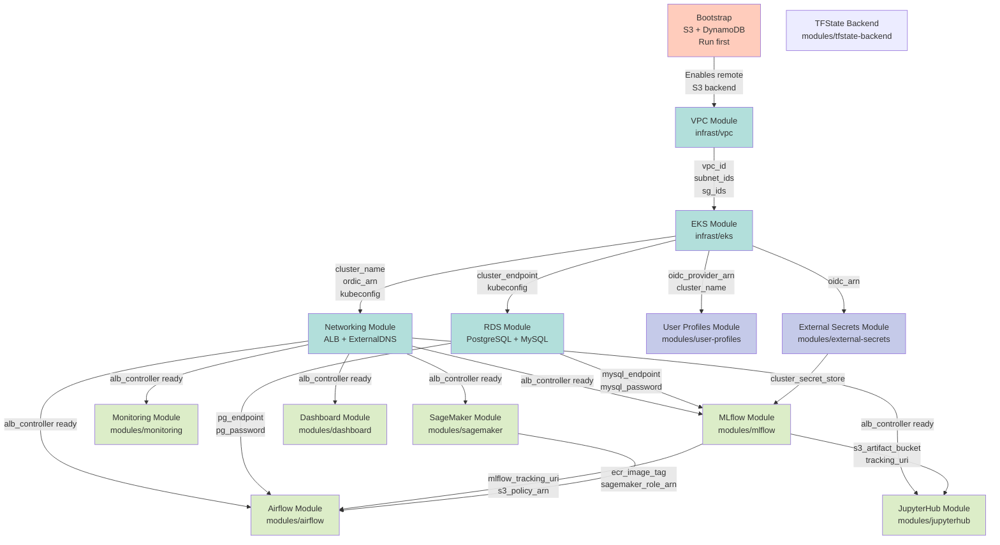
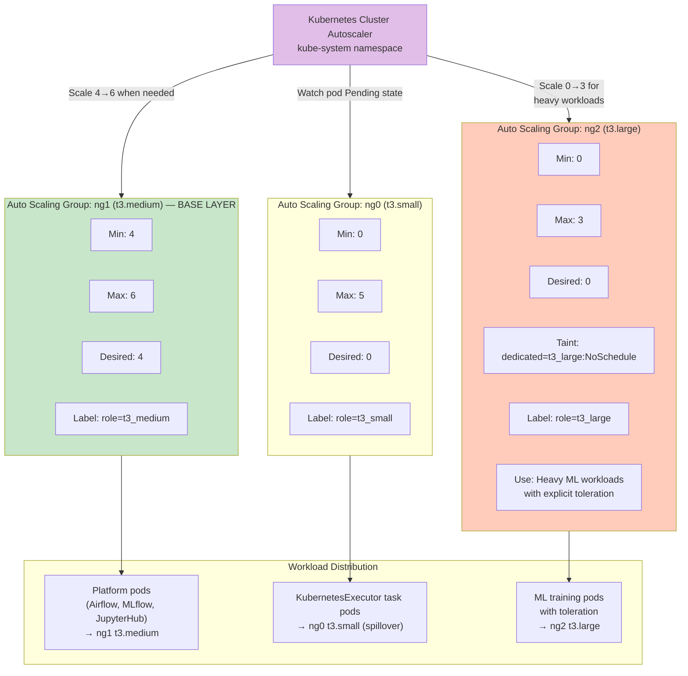
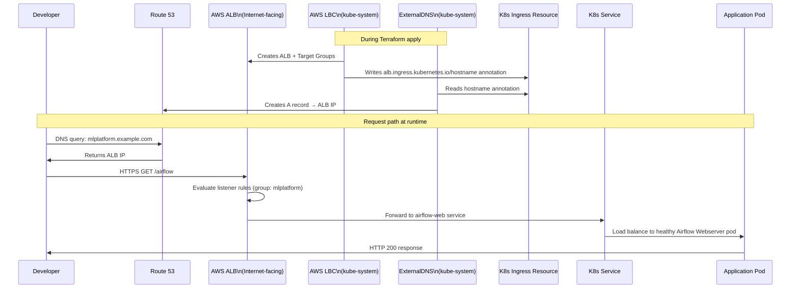

# High-Level Design (HLD)

> **Audience**: Solution architects, technical leads, DevOps/Platform engineers  
> **Purpose**: End-to-end architectural view — how components interconnect, AWS service topology, and module organization

---

## 1. C4 Context Diagram — System in Environment

The platform is used by ML practitioners and integrates with GitHub (identity), AWS (infrastructure), and end customers (consuming deployed models).



---

## 2. C4 Container Diagram — Internal Components



---

## 3. AWS Service Architecture Map



---

## 4. Terraform Module Dependency Graph

All modules are conditionally deployed from a single root `deployment/main.tf`. Arrows indicate data dependencies (output → input).



---

## 5. Authentication & Authorization Flow

```mermaid
sequenceDiagram
    actor User
    participant Browser
    participant ALB as AWS ALB
    participant App as Platform App\n(Airflow / JupyterHub / Grafana)
    participant GH as GitHub OAuth
    participant IAM as AWS IAM
    participant K8s as Kubernetes RBAC

    User->>Browser: Navigate to https://domain.com/airflow
    Browser->>ALB: HTTPS request
    ALB->>App: Forward to Airflow Webserver pod
    App->>Browser: 302 Redirect to GitHub OAuth
    Browser->>GH: Authorization request\n(scopes: read:org, read:user, user:email)
    GH->>Browser: Show Authorize screen
    User->>GH: Approves access
    GH->>Browser: Return authorization code
    Browser->>App: Callback with code
    App->>GH: Exchange code for access token
    GH->>App: Return token + user info
    App->>GH: GET /orgs/{org}/teams/{team}/members
    GH->>App: Team membership list
    App->>App: Map team → FAB role\n(airflow-admin-team → Admin)
    App->>Browser: Set session cookie; redirect to /airflow

    Note over IAM, K8s: For kubectl / AWS SDK access (Developers)
    User->>IAM: AssumeRole mlplatform-access-{name}
    IAM->>User: Temporary credentials
    User->>K8s: kubectl commands\n(authenticated via aws-auth ConfigMap)
    K8s->>User: API response (system:masters for Developers)
```

---

## 6. Node Group Scaling Architecture



---

## 7. Data Architecture Overview

```mermaid
graph LR
    subgraph SOURCE["Data Sources"]
        GIT_DAGS[Git Repository\nAirflow DAG code]
        JUPYTER_NB[JupyterHub Notebooks\nExperimentation]
        EXT_DATA[External Data Sources\nAPIs, datasets]
    end

    subgraph PROCESSING["Processing Layer"]
        AF_TASK[Airflow Task Pods\nKubernetesExecutor]
        JHB_SERVER[JupyterHub\nSingle-user servers]
    end

    subgraph TRACKING["ML Tracking"]
        MLF_UI[MLflow UI\nExperiment browser]
        MLF_API[MLflow Tracking API\nhttp://mlflow-service.mlflow.svc]
    end

    subgraph STORAGE["Persistent Storage"]
        S3_DATA[S3 — Airflow Data\nmlplatform-{prefix}-airflow-data-storage]
        S3_ART[S3 — Artifacts\nmlplatform-{prefix}-mlflow-mlflow]
        RDS_PG2[RDS PostgreSQL\nDag/task run metadata]
        RDS_MY2[RDS MySQL\nRun params + metrics]
        EFS2[EFS\nLogs + notebooks]
    end

    subgraph SERVING["Model Serving"]
        ECR4[ECR\nDocker image]
        SM3[SageMaker Endpoint\nREST API]
        DASH3[Streamlit\nEndpoint manager]
    end

    GIT_DAGS -->|git-sync 60s| AF_TASK
    EXT_DATA --> AF_TASK
    AF_TASK --> S3_DATA
    AF_TASK --> MLF_API
    AF_TASK -->|docker build + push| ECR4
    AF_TASK -->|deploy endpoint| SM3
    JUPYTER_NB --> JHB_SERVER
    JHB_SERVER --> MLF_API
    JHB_SERVER --> EFS2
    MLF_API --> RDS_MY2
    MLF_API --> S3_ART
    MLF_UI --> RDS_MY2
    AF_TASK --> RDS_PG2
    SM3 --> DASH3
    ECR4 --> SM3

    style SOURCE fill:#e3f2fd
    style PROCESSING fill:#f3e5f5
    style TRACKING fill:#e8f5e9
    style STORAGE fill:#fff3e0
    style SERVING fill:#fce4ec
```

---

## 8. DNS and Ingress Resolution


