# Low-Level Design (LLD)

> **Audience**: Platform engineers, SREs, backend developers  
> **Purpose**: Detailed component internals — K8s resource specs, DB schemas, IAM role trust policies, Helm configurations, and storage classes

---

## 1. Kubernetes Resources Per Namespace

### 1.1 kube-system — Platform Infrastructure

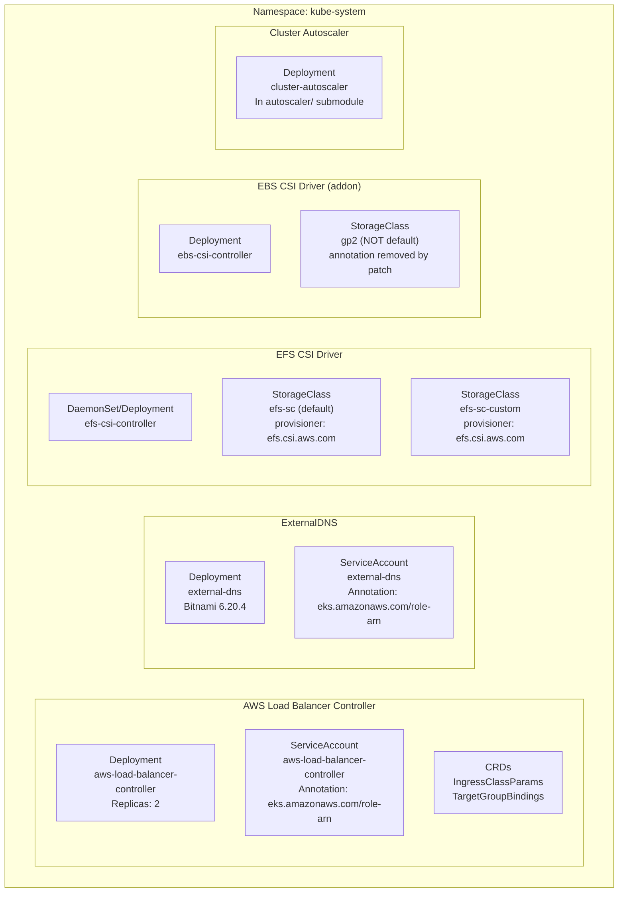

### 1.2 Airflow Namespace — Detailed K8s Resources

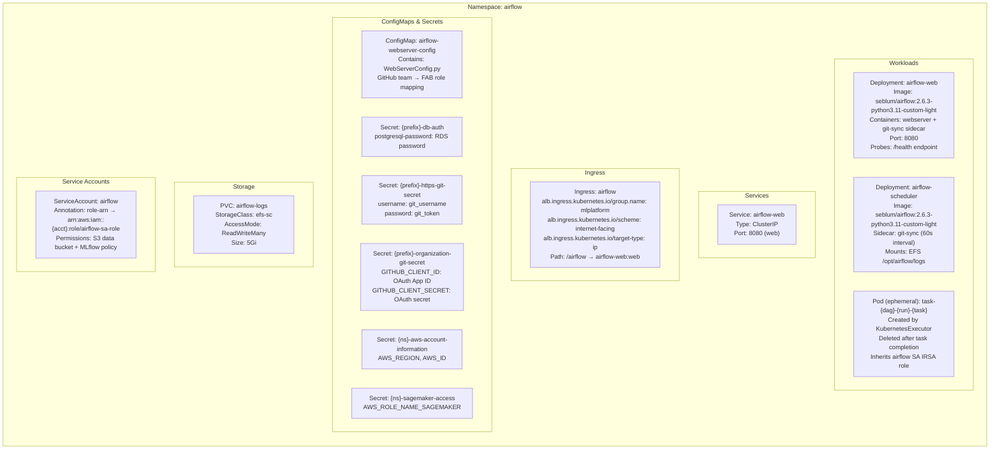

### 1.3 MLflow Namespace

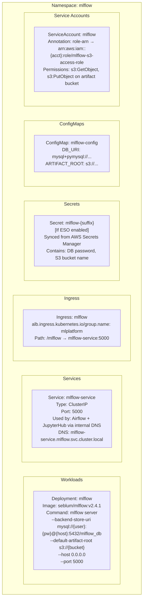

### 1.4 JupyterHub Namespace

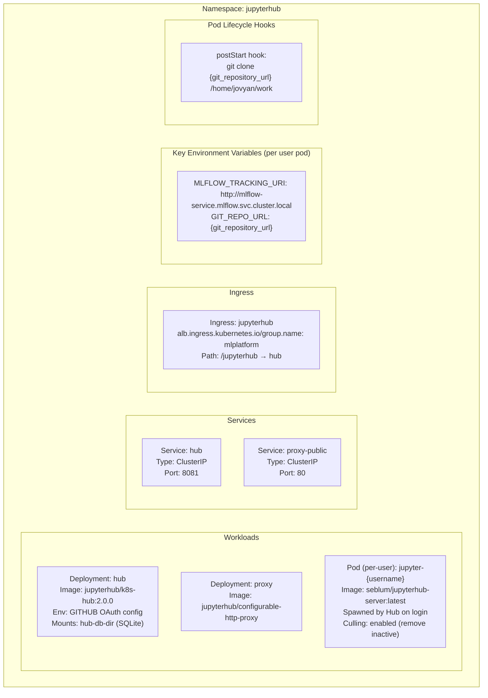

### 1.5 Monitoring Namespace

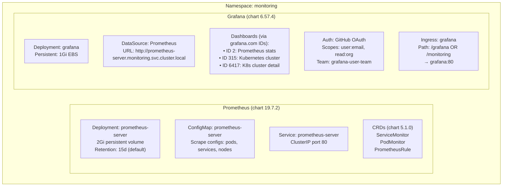

### 1.6 SageMaker & Dashboard Namespaces

| Resource | SageMaker NS | Dashboard NS |
|----------|-------------|-------------|
| Deployment | `streamlit-sagemaker-app` `seblum/streamlit-sagemaker-app:v1.0.0` | `dashboard` `seblum/vuejs-ml-dashboard:latest` |
| Service | `streamlit-sagemaker-service` ClusterIP:8501 | `dashboard-service` ClusterIP:80 |
| Ingress | `/sagemaker` → streamlit | `/main` → dashboard |
| Env vars | `AWS_ACCESS_KEY_ID`, `AWS_SECRET_ACCESS_KEY` (from IAM user) | Component URLs |

---

## 2. RDS Database Schemas

### 2.1 Airflow — PostgreSQL 13.11

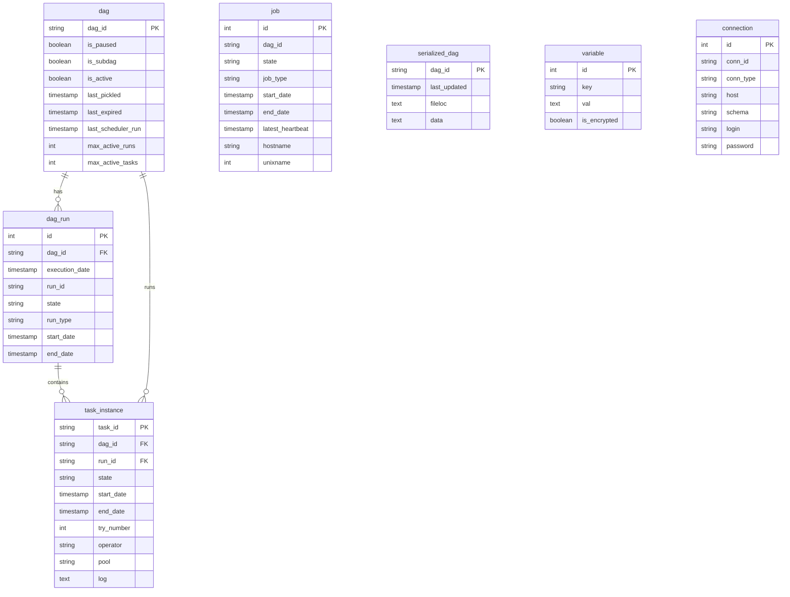

**Connection Details**:
- DB Name: `airflow_db`
- Engine: PostgreSQL 13.11
- Host: `{rds_endpoint}:5000`
- Admin User: `airflow_admin`
- Character Encoding: UTF-8
- Backup: `skip_final_snapshot = true`
- Storage: 20 GB gp2 (auto-scale to 500 GB)

### 2.2 MLflow — MySQL 8.0.33

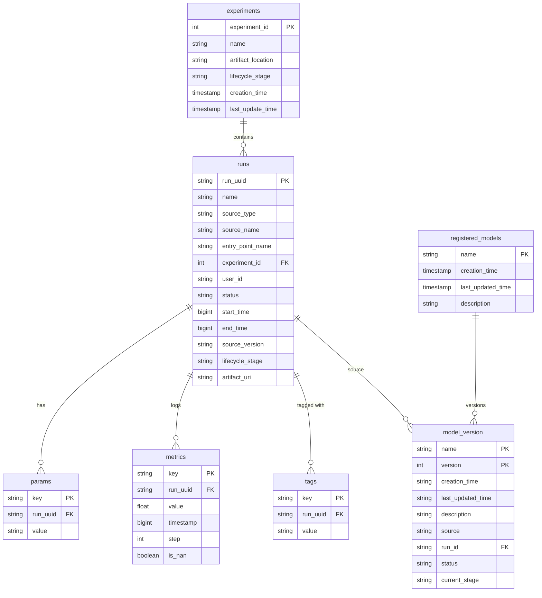

**Connection Details**:
- DB Name: `mlflow_db`
- Engine: MySQL 8.0.33
- Host: `{rds_endpoint}:5432`
- Admin User: `mlflow_admin`
- Password: No special characters (MySQL 8 compat)
- Connection URI: `mysql+pymysql://mlflow_admin:{pw}@{host}:5432/mlflow_db`
- Storage: 20 GB gp2 (auto-scale to 500 GB)

---

## 3. S3 Bucket Policies & IRSA Role Map

### 3.1 MLflow Artifact Bucket

```json
{
  "Version": "2012-10-17",
  "Statement": [
    {
      "Effect": "Allow",
      "Action": [
        "s3:GetObject", "s3:PutObject", "s3:DeleteObject",
        "s3:GetObjectVersion", "s3:ListBucketVersions"
      ],
      "Resource": "arn:aws:s3:::mlplatform-{random12}-mlflow-mlflow/*"
    },
    {
      "Effect": "Allow",
      "Action": ["s3:ListBucket", "s3:GetBucketLocation"],
      "Resource": "arn:aws:s3:::mlplatform-{random12}-mlflow-mlflow"
    }
  ]
}
```

**Trust policy (IRSA)** for `mlflow-s3-access-role`:
```json
{
  "Principal": {
    "Federated": "arn:aws:iam::{ACCOUNT}:oidc-provider/oidc.eks.eu-central-1.amazonaws.com/id/{HASH}"
  },
  "Action": "sts:AssumeRoleWithWebIdentity",
  "Condition": {
    "StringEquals": {
      "oidc.eks.eu-central-1.amazonaws.com/id/{HASH}:sub":
        "system:serviceaccount:mlflow:mlflow"
    }
  }
}
```

### 3.2 Airflow Data Bucket

- **Authentication**: Stored as K8s Secret (access key + secret key), NOT IRSA
- **Secret name**: `{namespace}-{s3_data_bucket_secret_name}`
- **Access keys**: Rotatable via re-running Terraform `user-profiles` module

### 3.3 Complete IRSA Role Map

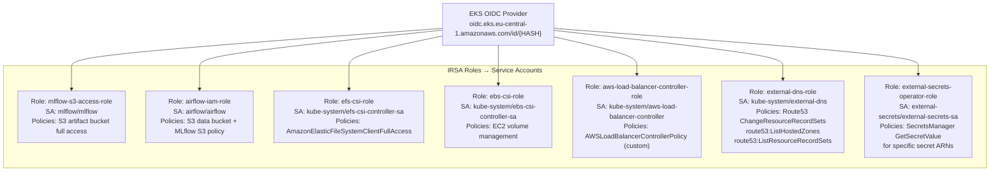

---

## 4. Per-User IAM Provisioning (user-profiles)

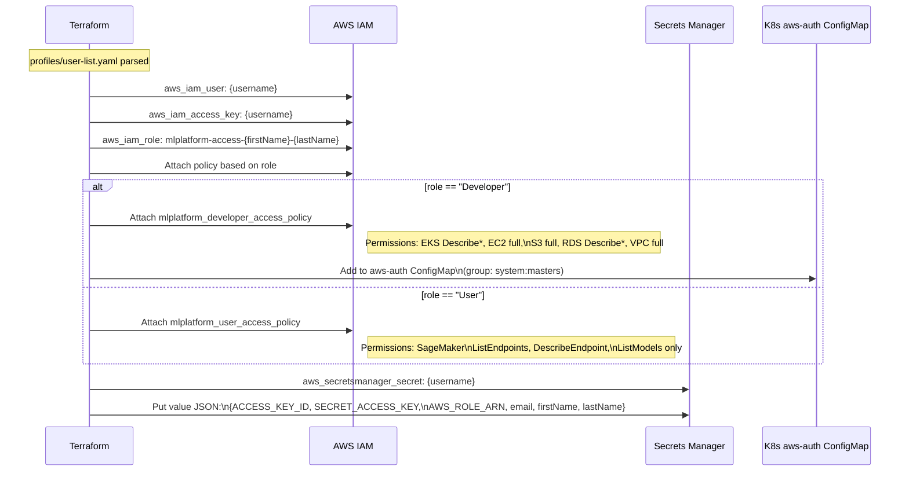

### User IAM Policies

**Developer Policy** (`AccessPolicyDeveloper.json`):
```json
{
  "Statement": [
    { "Effect": "Allow", "Action": "eks:Describe*", "Resource": "*" },
    { "Effect": "Allow", "Action": "ec2:*", "Resource": "*" },
    { "Effect": "Allow", "Action": "s3:*", "Resource": "*" },
    { "Effect": "Allow", "Action": "rds:Describe*", "Resource": "*" },
    { "Effect": "Allow", "Action": "vpc:*", "Resource": "*" }
  ]
}
```

**User Policy** (`AccessPolicyUser.json`):
```json
{
  "Statement": [
    {
      "Effect": "Allow",
      "Action": [
        "sagemaker:ListEndpoints",
        "sagemaker:DescribeEndpoint",
        "sagemaker:ListModels",
        "sagemaker:DescribeModel"
      ],
      "Resource": "*"
    }
  ]
}
```

---

## 5. Network Security Groups

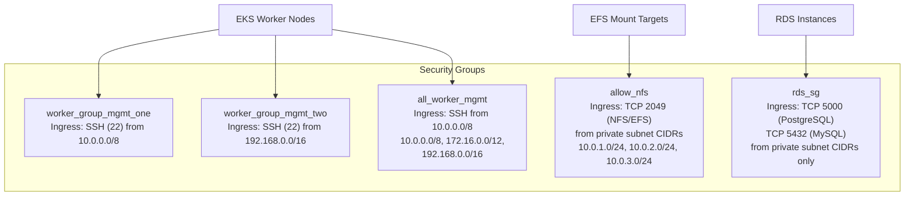

**Missing Security Controls** (known gaps — see [Security Architecture](06_security_architecture.md)):
- No `NetworkPolicy` resources — all pods can reach all pods in all namespaces
- No `PodSecurityStandards` — containers can run as root
- No `ResourceQuota` per namespace — one noisy tenant can starve others

---

## 6. Helm Chart Configurations — Key Values

### 6.1 Airflow (community 8.7.1)

| Key | Value |
|-----|-------|
| `executor` | `KubernetesExecutor` |
| `scheduler.image` | `seblum/airflow:2.6.3-python3.11-custom-light` |
| `webserver.baseUrl` | `http://{domain_name}/airflow` |
| `web.webserverConfig.configMapName` | `airflow-webserver-config` |
| `dags.gitSync.repo` | `{git_sync_repository_url}` |
| `dags.gitSync.branch` | `{git_sync_branch}` |
| `dags.gitSync.syncWait` | `60` |
| `dags.gitSync.syncTimeout` | `120` |
| `logs.persistence.storageClass` | `efs-sc` |
| `logs.persistence.size` | `5Gi` |
| `logs.persistence.accessMode` | `ReadWriteMany` |
| `web.defaultView` | `grid` |
| `scheduler.timezone` | `Europe/Amsterdam` |
| `web.auth.oauth.providers` | GitHub OAuth (clientId, clientSecret) |

### 6.2 MLflow (Custom Local Chart v2.4.1)

| Key | Value |
|-----|-------|
| `image.repository` | `seblum/mlflow` |
| `image.tag` | `v2.4.1` |
| `backendStore` | MySQL URI via RDS |
| `artifactRoot` | `s3://{bucket_name}` |
| `serviceAccount.annotations` | IRSA role ARN |
| `ingress.annotations` | ALB group `mlplatform`, path `/mlflow` |
| `externalSecrets.enabled` | `true` (if ESO deployed) |

### 6.3 JupyterHub (official 2.0.0)

| Key | Value |
|-----|-------|
| `hub.config.GitHubOAuthenticator.oauth_callback_url` | `https://{domain}/jupyterhub/hub/oauth_callback` |
| `hub.config.GitHubOAuthenticator.client_id` | `{jupyterhub_git_client_id}` |
| `hub.config.GitHubOAuthenticator.allowed_organizations` | `["{github_org}"]` |
| `singleuser.image.name` | `seblum/jupyterhub-server` |
| `singleuser.image.tag` | `latest` |
| `singleuser.defaultUrl` | `/lab` |
| `singleuser.storage.type` | `dynamic` (EFS) |
| `singleuser.lifecycleHooks.postStart.exec.command` | `git clone {repo}` |
| `cull.enabled` | `true` |
| `cull.timeout` | `3600` (1 hour) |
| `proxy.secretToken` | `{jupyterhub_proxy_secret_token}` |

### 6.4 Grafana (grafana.github.io 6.57.4)

| Key | Value |
|-----|-------|
| `adminPassword` | Set via variable |
| `auth.github.enabled` | `true` |
| `auth.github.client_id` | `{grafana_git_client_id}` |
| `auth.github.allowed_organizations` | GitHub org name |
| `datasources.datasources.yaml` | Prometheus URL |
| `dashboardProviders` | `grafana.com` IDs: 2, 315, 6417 |
| `ingress.annotations` | ALB group `mlplatform`, path `/grafana` |

---

## 7. EFS Storage Class Configuration

```yaml
# StorageClass: efs-sc (default for platform)
apiVersion: storage.k8s.io/v1
kind: StorageClass
metadata:
  name: efs-sc
  annotations:
    storageclass.kubernetes.io/is-default-class: "true"
provisioner: efs.csi.aws.com
parameters:
  provisioningMode: efs-ap          # Access Point mode (per-PVC isolation)
  fileSystemId: fs-{efs_id}
  directoryPerms: "777"
  gidRangeStart: "1000"
  gidRangeEnd: "2000"
  basePath: "/dynamic_provisioning"
mountOptions:
  - iam                              # IAM-based access authentication
reclaimPolicy: Retain
volumeBindingMode: Immediate
```

```yaml
# PVC: airflow-logs
apiVersion: v1
kind: PersistentVolumeClaim
metadata:
  name: airflow-logs
  namespace: airflow
spec:
  accessModes: ["ReadWriteMany"]     # Multiple pods can mount simultaneously
  storageClassName: efs-sc
  resources:
    requests:
      storage: 5Gi
```

---

## 8. Terraform State Backend Detail

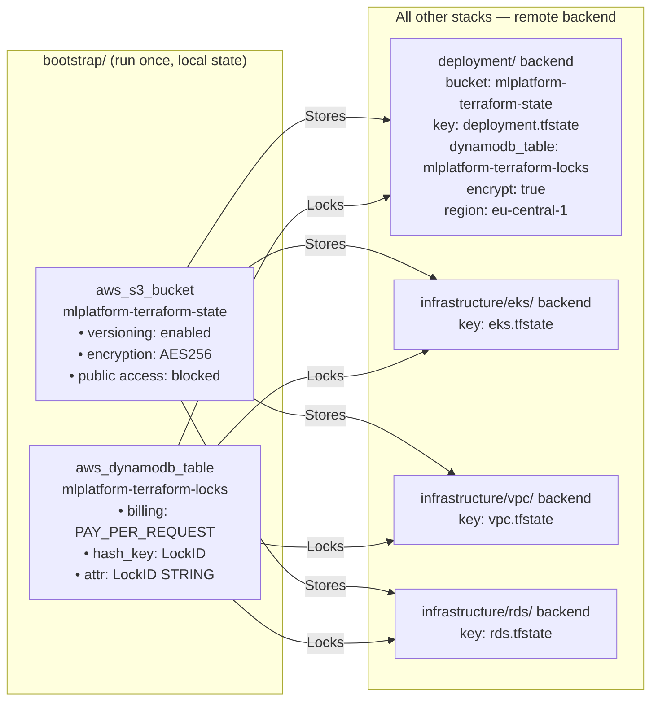

**Terraform Remote Data Sources** (cross-stack references):
- `deployment/` reads VPC outputs → `terraform_remote_state.vpc`
- `deployment/` reads EKS outputs → `terraform_remote_state.eks`
- Each module in `deployment/main.tf` passes these as variables

---

## 9. Airflow GitHub OAuth — WebServerConfig.py

The custom `WebServerConfig.py` maps GitHub organization teams to Airflow FAB roles.

```python
# Role → Team mapping (actual code pattern)
GITHUB_ORG = "mlplatform-seblum-me"   # Hardcoded GitHub org
ROLE_MAPPING = {
    "Admin":  f"{GITHUB_ORG}/airflow-admin-team",
    "User":   f"{GITHUB_ORG}/airflow-users-team",
    "Viewer": f"{GITHUB_ORG}/airflow-viewers-team",
    "Op":     f"{GITHUB_ORG}/airflow-op-team",
    "Public": f"{GITHUB_ORG}/airflow-public-team",
}
# Session: 30-minute timeout, force re-auth + role sync on expiry
```

**OAuth Scopes**: `read:org`, `read:user`, `user:email`

---

## 10. Computed Local Values (locals.tf)

| Local | Value | Used By |
|-------|-------|---------|
| `name_prefix` | `mlplatform-{random 12-char string}` | All resource names |
| `cluster_name` | `mlplatform-eks-cluster` | EKS, Helm, K8s provider |
| `vpc_name` | `mlplatform-vpc` | VPC module |
| `mlflow_tracking_uri` | `http://mlflow-service.mlflow.svc.cluster.local` | Airflow vars, JupyterHub env |
| `airflow_variable_list` | Map of env vars injected into Airflow | Airflow DAGs |
| `developers_user_access_auth_list` | List of Dev users for aws-auth configmap | EKS module |
| `ecr_sagemaker_image_tag` | SageMaker ECR image tag | Airflow variable |
