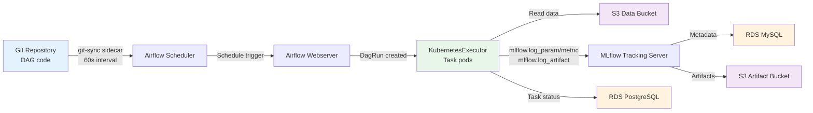
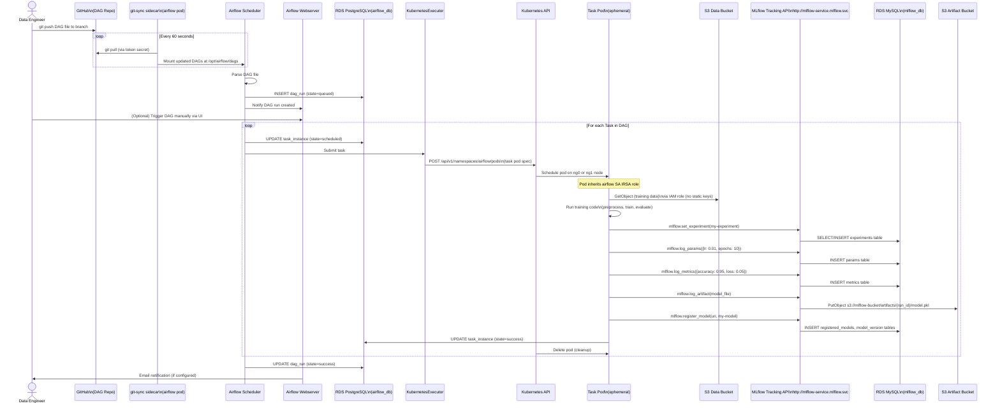

# Data Flow — ML Training Pipeline

> **Scenario**: A data engineer authors a DAG in Git. The DAG runs on a schedule, processes data from S3, trains an ML model, and logs everything to MLflow.  
> **Actors**: Data Engineer, Airflow, KubernetesExecutor, S3, MLflow, RDS

---

## Overview



---

## Detailed Sequence Diagram



---

## Step-by-Step Description

### Phase 1: DAG Ingestion (Continuous)

1. **Author DAG**: Data engineer writes a Python DAG file and pushes to the designated Git branch.
2. **git-sync**: A sidecar container in the Airflow Scheduler pod polls GitHub every 60 seconds.
   - Uses `{prefix}-https-git-secret` (username + token) for authentication.
   - Syncs to `/opt/airflow/dags/` shared volume.
3. **Scheduler parses**: The Airflow Scheduler detects the new DAG file, validates syntax, and registers it in the PostgreSQL metadata database.

### Phase 2: DAG Triggering

4. **Schedule evaluation**: The Scheduler checks cron expressions and queues runs when due.
5. **Manual trigger**: Engineers can also trigger from the Airflow UI at `https://domain.com/airflow` (GitHub OAuth required).
6. **DagRun created**: A `dag_run` record is written to `airflow_db.dag_run` with `state=running`.

### Phase 3: Task Execution (KubernetesExecutor)

7. **Pod spec building**: The KubernetesExecutor builds a pod manifest:
   - Image: Same as scheduler (configurable per task via `executor_config`)
   - Environment: Airflow variables (`MLFLOW_TRACKING_URI`, `ECR_REPOSITORY_NAME`, etc.)
   - Service Account: `airflow` (carries IRSA role for S3 access)
   - Resources: Configurable CPU/memory per task
8. **Pod scheduling**: Kubernetes schedules the pod on available nodes (`ng0` or `ng1`). If resources exhausted, Cluster Autoscaler scales up `ng0` (t3.small, min=0).
9. **S3 data read**: Task pod authenticates to S3 via IRSA (no static credentials stored).
10. **Compute**: Training/processing logic runs inside the ephemeral pod.

### Phase 4: MLflow Logging

11. **Tracking URI**: Pod reads `MLFLOW_TRACKING_URI` from Airflow variable → `http://mlflow-service.mlflow.svc.cluster.local`.
12. **Experiment logging**: MLflow Python SDK sends HTTP requests to the MLflow server (in-cluster, no egress cost).
13. **Metadata persistence**: MLflow server writes parameters/metrics to RDS MySQL.
14. **Artifact upload**: Model files/plots are uploaded to S3 artifact bucket via MLflow server's IRSA role.
15. **Model registration**: Registered model version created in MySQL `model_version` table.

### Phase 5: Cleanup

16. **Pod deletion**: After task completion (success or failure), KubernetesExecutor deletes the task pod.
17. **Status update**: Task instance and dag_run states updated in PostgreSQL.
18. **Log persistence**: Task logs written to EFS (`airflow-logs` PVC) before pod termination.

---

## Key Configuration Values

| Parameter | Value | Source |
|-----------|-------|--------|
| `MLFLOW_TRACKING_URI` | `http://mlflow-service.mlflow.svc.cluster.local` | Airflow variable (locals.tf) |
| `ECR_REPOSITORY_NAME` | `mlflow-sagemaker-deployment` | Airflow variable |
| Git sync interval | 60 seconds | Helm values |
| Git sync timeout | 120 seconds | Helm values |
| Node for spillover tasks | `ng0 t3.small` (0→5) | EKS config |
| Executor | `KubernetesExecutor` | Helm values |
| Logs storage | EFS `ReadWriteMany` 5Gi | Helm values |

---

## AWS Services Involved

| Service | Role in This Flow |
|---------|-------------------|
| **GitHub** | DAG source of truth |
| **EKS (Kubernetes)** | Runs scheduler, webserver, task pods |
| **EC2 Auto Scaling** | Scales `ng0` nodes for task pods |
| **RDS PostgreSQL** | Airflow metadata (DAG runs, task instances) |
| **RDS MySQL** | MLflow metadata (experiments, params, metrics) |
| **S3 (data bucket)** | Raw training/test data |
| **S3 (artifact bucket)** | Trained models, plots, artifacts |
| **IAM (IRSA)** | Pod-level S3 permissions |
| **EFS** | Shared DAG files + persistent logs |
| **ALB** | Public access to Airflow UI |
| **Route 53** | DNS for Airflow domain |

---

## Error Handling & Retry Behaviour

```mermaid
flowchart TD
    TASK_START[Task starts in pod]
    CHECK{Task succeeds?}
    SUCCESS[Update task_instance\nstate=success\nDelete pod]
    RETRY{Retry count\n< max_retries?}
    RESCHEDULE[Reschedule task\nafter retry_delay]
    FAIL[Update task_instance\nstate=failed\nTrigger on_failure_callback\nDelete pod]
    ALERT[Email / Slack alert\n(if callbacks configured)]

    TASK_START --> CHECK
    CHECK -->|Yes| SUCCESS
    CHECK -->|No| RETRY
    RETRY -->|Yes| RESCHEDULE --> TASK_START
    RETRY -->|No| FAIL --> ALERT
```

**Airflow retry defaults** (configurable per task):
- `retries`: 1
- `retry_delay`: 5 minutes
- `execution_timeout`: None (configurable)
