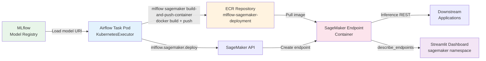
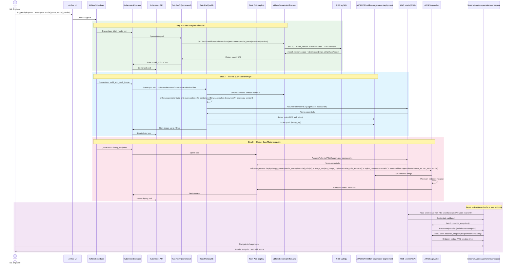
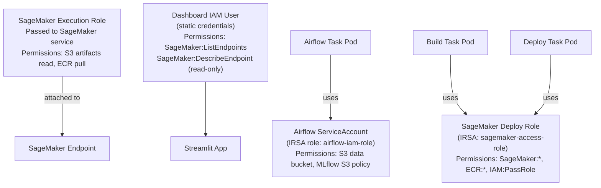

# Data Flow — Model Deployment to SageMaker

> **Scenario**: An Airflow DAG builds a Docker image from a trained MLflow model, pushes it to ECR, deploys a SageMaker endpoint, and the Streamlit dashboard reflects the new endpoint.  
> **Actors**: Airflow KubernetesExecutor, MLflow Model Registry, ECR, SageMaker, Streamlit Dashboard

---

## Overview

---

## Detailed Sequence Diagram

---

## Step-by-Step Description

### Phase 1: Trigger and Setup

1. **ML Engineer triggers DAG** via Airflow UI (authenticated with GitHub OAuth). Passes model name and version as DAG parameters.
2. **Scheduler logs DagRun** in PostgreSQL `dag_run` table.
3. **Airflow variables** already configured (`ECR_REPOSITORY_NAME`, `ECR_SAGEMAKER_IMAGE_TAG`, `AWS_REGION`).

### Phase 2: Fetch Trained Model

4. **MLflow model lookup**: Task pod queries MLflow's REST API at the internal Kubernetes DNS address `http://mlflow-service.mlflow.svc.cluster.local`.
5. **Model URI retrieved**: Returns `s3://mlplatform-{prefix}-mlflow-mlflow/{run_id}/artifacts/model`.
6. **XCom storage**: Model URI stored in Airflow XCom for downstream tasks.

### Phase 3: Container Build & Push

7. **Docker image build**: Task pod runs `mlflow sagemaker build-and-push-container`. This:
   - Downloads the MLflow model from S3.
   - Wraps it in a SageMaker-compatible container using `mlflow.sagemaker`.
   - Tags the image with the ECR repository URI.
8. **ECR authentication**: Uses IRSA-vended short-lived credentials to authenticate via `aws ecr get-login-password`.
9. **Image push**: Pushes to `{account_id}.dkr.ecr.eu-central-1.amazonaws.com/mlflow-sagemaker-deployment:{tag}`.

### Phase 4: SageMaker Endpoint Deployment

10. **Endpoint deploy**: Calls `mlflow.sagemaker.deploy()` with:
    - `mode=DEPLOY_MODE_REPLACE` (updates existing endpoint with zero-downtime rolling update).
    - `execution_role_arn`: SageMaker execution role (separate from IRSA).
    - `instance_type`: Configurable (e.g., `ml.t2.medium`).
11. **SageMaker lifecycle**:
    - Creates an endpoint configuration.
    - Pulls image from ECR.
    - Starts model server on managed infrastructure.
    - Runs health checks.
12. **Endpoint status**: Transitions `Creating → InService` (typically 5–7 minutes).

### Phase 5: Dashboard Reflection

13. **Streamlit reads endpoints**: The Streamlit app in the `sagemaker` namespace polls SageMaker's `list_endpoints` API using read-only IAM credentials (stored as K8s Secret).
14. **Dashboard displays**: Shows endpoint name, status, ARN, creation time, and instance type.

---

## IAM Roles Involved

---

## Airflow Variables Used

| Variable | Value | Purpose |
|----------|-------|---------|
| `MLFLOW_TRACKING_URI` | `http://mlflow-service.mlflow.svc.cluster.local` | Retrieve model URI |
| `ECR_REPOSITORY_NAME` | `mlflow-sagemaker-deployment` | Container registry |
| `ECR_SAGEMAKER_IMAGE_TAG` | `{computed tag}` | Docker image version |
| `AWS_REGION` | `eu-central-1` | SageMaker API region |
| `s3_access_name` | `airflow-s3-data-bucket-access-credentials` | S3 data access secret ref |

---

## AWS Services Involved

| Service | Role |
|---------|------|
| **MLflow** (in-cluster) | Model registry, artifact URI source |
| **S3 (artifact bucket)** | Model artifact storage |
| **ECR** | Built container image storage |
| **SageMaker** | Managed endpoint provisioning + inference |
| **IAM** | IRSA for task pods, execution role for SageMaker |
| **EKS** | Runs all task pods and Streamlit dashboard |
| **RDS MySQL** | MLflow model version metadata |

---

## Deployment Modes

| Mode | Behaviour | Use Case |
|------|-----------|---------|
| `CREATE` | Create new endpoint | First deployment |
| `REPLACE` | Update endpoint (rolling, zero-downtime) | Model update |
| `ADD` | Add new variant to existing endpoint | A/B testing |
