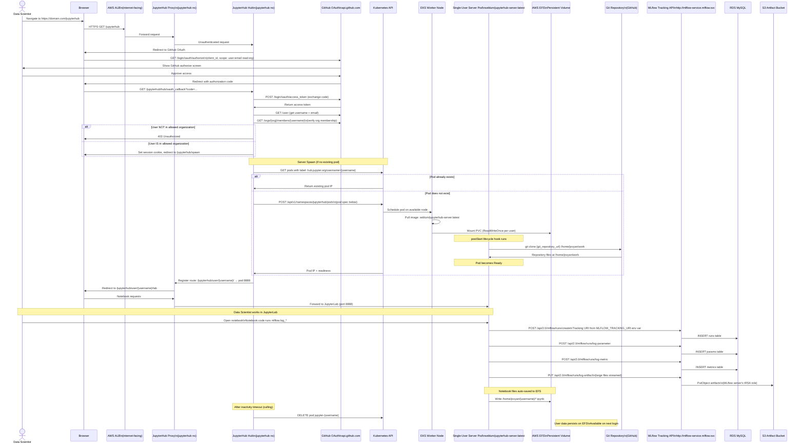
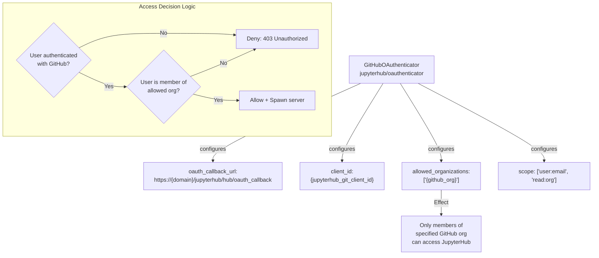

# Data Flow — Interactive Development in JupyterHub

> **Scenario**: A data scientist logs in with GitHub, launches a JupyterHub server, gets their workspace auto-configured with a cloned repo and MLflow connection, and runs experiments that are tracked in MLflow.  
> **Actors**: Data Scientist, GitHub OAuth, JupyterHub Hub, EKS, EFS, MLflow

---

## Overview

```mermaid
graph LR
    DS[Data Scientist\n(Browser)] -->|HTTPS /jupyterhub| ALB2[AWS ALB]
    ALB2 --> JHB_PROXY[JupyterHub Proxy]
    JHB_PROXY -->|OAuth redirect| GH[GitHub OAuth]
    GH -->|Callback + token| JHB_HUB[JupyterHub Hub\n(org membership check)]
    JHB_HUB -->|Spawn| K8S2[Kubernetes API]
    K8S2 -->|Create pod| JUSER[Single-User Server Pod\nseblum/jupyterhub-server:latest]
    JUSER -->|postStart: git clone| GIT2[Git Repository]
    JUSER -->|Mount| EFS3[EFS Volume\nPersistent home dir]
    JUSER -->|MLFLOW_TRACKING_URI\nenv var| MLF3[MLflow Server\nInternal DNS]
    MLF3 -->|Store runs| RDS3[RDS MySQL] & S3_3[S3 Artifacts]

    style DS fill:#e3f2fd
    style JUSER fill:#e8f5e9
    style EFS3 fill:#fff3e0
    style MLF3 fill:#fce4ec
```

---

## Detailed Sequence Diagram



---

## Single-User Pod Specification

```yaml
# Pod created by JupyterHub Hub for each logged-in user
apiVersion: v1
kind: Pod
metadata:
  name: jupyter-{username}
  namespace: jupyterhub
  labels:
    hub.jupyter.org/username: "{username}"
    component: singleuser-server
spec:
  containers:
    - name: notebook
      image: seblum/jupyterhub-server:latest
      ports:
        - containerPort: 8888
      env:
        - name: MLFLOW_TRACKING_URI
          value: "http://mlflow-service.mlflow.svc.cluster.local"
        - name: JUPYTERHUB_API_URL
          value: "http://hub.jupyterhub.svc:8081/jupyterhub/hub/api"
        - name: JPY_API_TOKEN
          valueFrom:
            secretKeyRef:
              name: jupyterhub-hub-secret
              key: hub.config
      volumeMounts:
        - name: home
          mountPath: /home/jovyan
      lifecycle:
        postStart:
          exec:
            command:
              - /bin/sh
              - -c
              - "git clone {git_repository_url} /home/jovyan/work || true"
  volumes:
    - name: home
      persistentVolumeClaim:
        claimName: claim-{username}        # Dynamically provisioned per user on EFS
  automountServiceAccountToken: false
```

---

## User Workspace Layout

```
/home/jovyan/                    ← EFS persistent volume (per-user PVC)
├── work/                        ← Cloned from git_repository_url (postStart)
│   ├── notebooks/
│   ├── src/
│   └── requirements.txt
├── .ipynb_checkpoints/          ← Auto-saved checkpoint files
└── {user-created files}
```

---

## Environment Variables in User Pods

| Variable | Value | Source |
|----------|-------|--------|
| `MLFLOW_TRACKING_URI` | `http://mlflow-service.mlflow.svc.cluster.local` | Helm values → JupyterHub config |
| `JUPYTERHUB_BASE_URL` | `/jupyterhub` | JupyterHub internal |
| `PATH` | Includes conda envs | Docker image |
| `AWS_DEFAULT_REGION` | (Not injected by default) | User can set in notebook |

---

## JupyterHub Authn/Authz Configuration



---

## Server Lifecycle (Culling)

```mermaid
stateDiagram-v2
    [*] --> Spawning: User logs in / clicks Start Server
    Spawning --> Ready: Pod running, git clone complete
    Ready --> Active: User sends requests
    Active --> Idle: No notebook activity (kernels paused)
    Idle --> Culled: After cull.timeout = 3600s
    Culled --> [*]: Pod deleted; EFS data retained
    
    note right of Culled: Next login re-spawns pod\nUser data on EFS intact\ngit clone skipped (dir exists)
```



---

## AWS Services Involved

| Service | Role |
|---------|------|
| **EKS** | Runs Hub, Proxy, and single-user server pods |
| **EFS** | Per-user persistent home directories (`ReadWriteOnce` per pod) |
| **ALB** | Routes `/jupyterhub` traffic; handles HTTPS termination |
| **Route 53** | DNS for the JupyterHub domain |
| **IAM** | Hub uses K8s ServiceAccount to create/delete pods |
| **RDS MySQL** | MLflow stores experiment tracking data |
| **S3** | MLflow stores model artifacts uploaded from notebooks |
| **GitHub** | OAuth authentication + org membership check |

---

## Common Issues & Solutions

| Issue | Root Cause | Solution |
|-------|------------|---------|
| Pod stuck at `Spawning` | Docker image pull timeout | Pre-pull image on nodes with DaemonSet |
| EFS mount fails | Security group missing port 2049 | Check `allow_nfs` SG attached to EFS mount targets |
| git clone fails | Wrong token / SSH vs HTTPS mismatch | Use HTTPS with personal access token |
| 403 on login | User not in allowed GitHub org | Add user to GitHub org `{github_org}` |
| MLflow connection refused | Pod DNS can't resolve `mlflow-service.mlflow.svc` | Check CoreDNS; verify MLflow pod is running |
