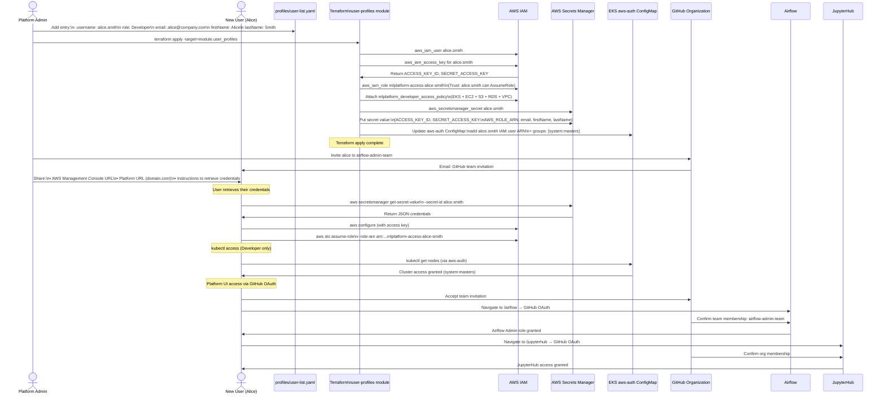
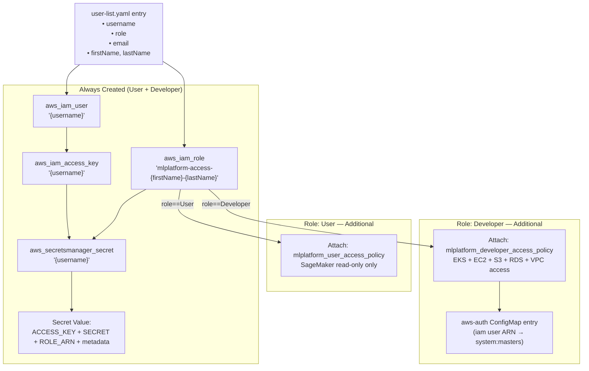

# Data Flow — New Team / User Onboarding

> **Scenario**: A platform admin adds a new user to the platform by editing `user-list.yaml`, running Terraform, and then onboarding the user to the appropriate GitHub team.  
> **Actors**: Platform Admin, Terraform, AWS IAM, Secrets Manager, EKS aws-auth

---

## Overview

```mermaid
graph LR
    ADMIN[Platform Admin] -->|Edit profiles/user-list.yaml\nAdd user entry + role| GIT4[Git Repository\n(IaC repo)]
    GIT4 -->|terraform apply| TF4[Terraform\nuser-profiles module]
    TF4 -->|Create user resources| IAM4[AWS IAM\nUser + Role + Policy]
    TF4 -->|Store credentials| SM4[AWS Secrets Manager\n{username} secret]
    TF4 -->|Update if Developer| K8S4[K8s aws-auth ConfigMap\n(EKS admin access)]
    ADMIN -->|Add user to GitHub team| GH4[GitHub Organization\nmlplatform-seblum-me]
    GH4 -->|Enables OAuth login| ALL_APPS[Airflow / JupyterHub\nGrafana]

    style ADMIN fill:#e3f2fd
    style TF4 fill:#e8f5e9
    style IAM4 fill:#fff3e0
    style SM4 fill:#fce4ec
    style K8S4 fill:#f3e5f5
```

---

## End-to-End Flow

```mermaid
flowchart TD
    START([New hire joins ML team])
    
    ADMIN_EDIT[Admin edits\nprofiles/user-list.yaml\nAdds: username, role, email]
    GIT_COMMIT[Commit + push to IaC repo]
    TF_PLAN[terraform plan\nReview changes]
    TF_APPLY[terraform apply\n-target=module.user_profiles]

    subgraph AWS_PROV["AWS Resource Provisioning"]
        IAM_USER[aws_iam_user\n{username}]
        IAM_KEYS[aws_iam_access_key\n{username}\nAccess Key + Secret Key]
        IAM_ROLE[aws_iam_role\nmlplatform-access-{firstName}-{lastName}]
        IAM_TRUST[Trust Policy\nAllow user to AssumeRole]
        
        ROLE_DECISION{User role?}
        
        DEV_POLICY[Attach Developer Policy\nEKS + EC2 + S3 + RDS + VPC]
        USER_POLICY[Attach User Policy\nSageMaker read-only]
        
        SM_SECRET[aws_secretsmanager_secret\n{username}]
        SM_VALUE[Secret value JSON:\nACCESS_KEY_ID\nSECRET_ACCESS_KEY\nAWS_ROLE_ARN\nemail, firstName, lastName]
        
        K8S_AUTH{Developer role?}
        K8S_UPDATE[Update aws-auth ConfigMap\nAdd user ARN + system:masters group]
    end

    GH_TEAM[Admin adds user to GitHub team\nairflow-admin-team OR airflow-users-team]
    
    USER_ONBOARD[User receives:\n• AWS credentials from Secrets Manager\n• GitHub team invite\n• Platform URL]
    
    AWS_LOGIN[User: aws configure\naws sts assume-role\n--role-arn {role_arn}]
    
    PLATFORM_LOGIN[User: Navigate to domain.com/airflow\nGitHub OAuth → Platform access]

    START --> ADMIN_EDIT --> GIT_COMMIT --> TF_PLAN --> TF_APPLY
    TF_APPLY --> IAM_USER --> IAM_KEYS --> IAM_ROLE --> IAM_TRUST
    IAM_TRUST --> ROLE_DECISION
    ROLE_DECISION -->|Developer| DEV_POLICY
    ROLE_DECISION -->|User| USER_POLICY
    DEV_POLICY & USER_POLICY --> SM_SECRET --> SM_VALUE
    DEV_POLICY --> K8S_AUTH
    K8S_AUTH -->|Yes| K8S_UPDATE
    K8S_AUTH -->|No| GH_TEAM
    K8S_UPDATE --> GH_TEAM
    SM_VALUE --> GH_TEAM
    GH_TEAM --> USER_ONBOARD
    USER_ONBOARD --> AWS_LOGIN & PLATFORM_LOGIN
```

---

## Detailed Sequence Diagram



---

## `user-list.yaml` Schema

```yaml
# profiles/user-list.yaml
profiles:
  - username: max.mustermann          # Must match IAM/Secrets Manager naming convention
    role: User                         # "User" or "Developer"
    email: max.mustermann@company.com
    firstName: Max
    lastName: Mustermann

  - username: sebastian.blum
    role: Developer
    email: sebastian.blum@company.com
    firstName: Sebastian
    lastName: Blum
```

---

## Resources Created Per User



---

## Off-Boarding Process

```mermaid
flowchart TD
    REMOVE([User leaves team])
    ADMIN_REMOVE[Admin removes entry\nfrom user-list.yaml]
    TF_DESTROY[terraform apply\nTerraform detects removal]
    
    subgraph DESTROY["Resources Destroyed"]
        D1[IAM user + access keys deleted]
        D2[IAM role + policy detachment]
        D3[Secrets Manager secret deleted]
        D4[aws-auth ConfigMap entry removed]
    end
    
    GH_REMOVE[Admin removes user from\nGitHub organization teams]
    
    REVOKE["Access Revoked:\n• kubectl — immediately (aws-auth removed)\n• Airflow — on next session expiry (30 min)\n• JupyterHub — on next login attempt\n• Grafana — on next login attempt"]
    
    DATA_REVIEW[Review user's EFS home dir\n/home/jovyan/{username}\nfor work to save before deletion]

    REMOVE --> ADMIN_REMOVE --> TF_DESTROY
    TF_DESTROY --> D1 & D2 & D3 & D4
    D1 & D2 & D3 & D4 --> GH_REMOVE --> REVOKE & DATA_REVIEW
```

---

## GitHub Team → Platform Role Mapping

| GitHub Team | Airflow Role | K8s Access | IAM Policy |
|-------------|-------------|-----------|------------|
| `airflow-admin-team` | Admin (full DAG management) | `system:masters` (if Developer in YAML) | Developer policy |
| `airflow-users-team` | User (trigger/view DAGs) | None | User policy |
| `grafana-user-team` | Grafana Viewer | None | User policy |
| _(org member)_ | JupyterHub access | None | Per YAML role |

> **Note**: GitHub team membership controls OAuth-based UI access. YAML role controls AWS IAM policy attachment and K8s RBAC. A user must be in **both** the correct YAML role **and** the correct GitHub team.

---

## AWS Services Involved

| Service | Role |
|---------|------|
| **IAM** | User accounts, roles, policy attachments |
| **Secrets Manager** | Credential storage and retrieval |
| **EKS** | aws-auth ConfigMap for Developer kubectl access |
| **GitHub** | Team-based OAuth access control |
| **Terraform (local)** | Drives all provisioning from `user-list.yaml` |
