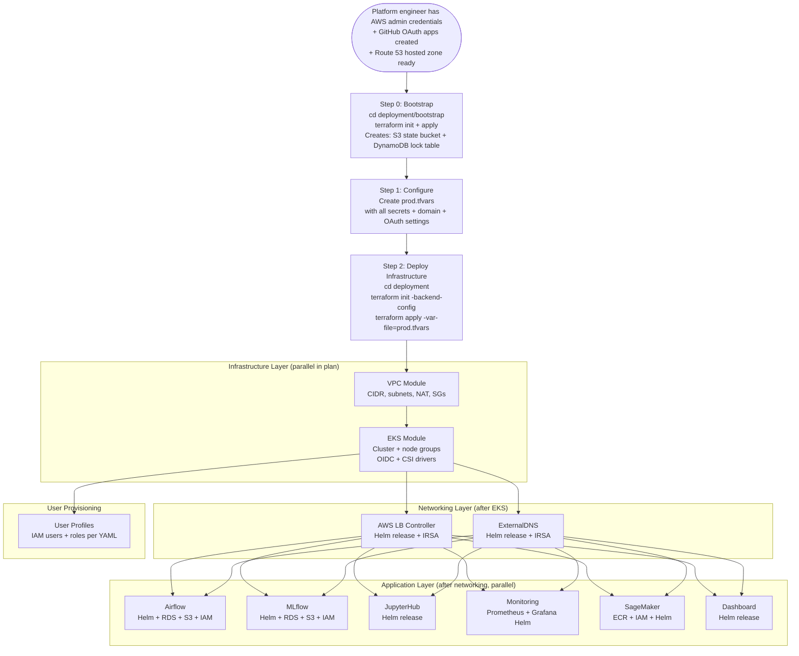
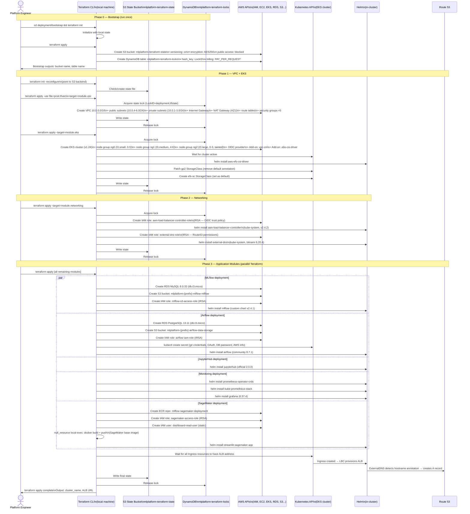
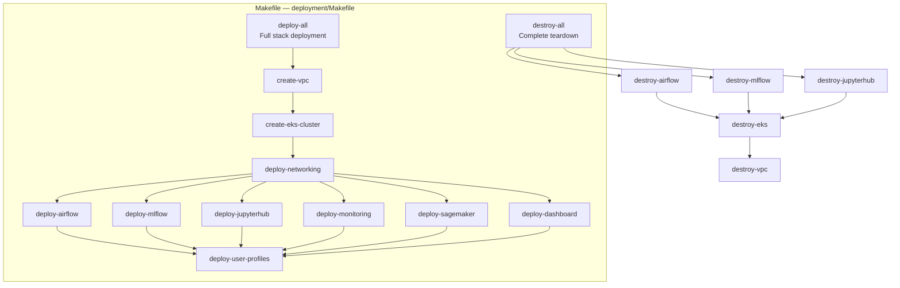

# Data Flow — Infrastructure Deployment with Terraform

> **Scenario**: A platform engineer deploys the entire MLOps stack from scratch or updates a component using Terraform.  
> **Actors**: Platform Engineer, Terraform CLI, AWS APIs, Helm, Kubernetes

---

## Overview: Full Stack Deployment



---

## Detailed Deployment Sequence



---

## Makefile Targets



**Usage**:
```bash
# Full deployment
make deploy-all VARS_FILE=prod.tfvars

# Deploy single module
make deploy-mlflow VARS_FILE=prod.tfvars

# Destroy everything
make destroy-all VARS_FILE=prod.tfvars
```

---

## Terraform Backend Configuration

```hcl
# deployment/providers.tf (or backend.tf per sub-stack)
terraform {
  backend "s3" {
    bucket         = "mlplatform-terraform-state"
    key            = "deployment.tfstate"
    region         = "eu-central-1"
    dynamodb_table = "mlplatform-terraform-locks"
    encrypt        = true
  }
  required_version = ">= 1.5.3"
}
```

---

## Required `prod.tfvars` Values

```hcl
# Network & Identity
domain_name = "ml.example.com"
AWS_REGION  = "eu-central-1"

# Git Source
git_username             = "github-user"
git_token                = "ghp_xxxx"    # GitHub PAT
git_sync_repository_url  = "https://github.com/org/ml-dags.git"
git_sync_branch          = "main"

# GitHub OAuth Apps (one per component)
airflow_git_client_id     = "..."
airflow_git_client_secret = "..."
jupyterhub_git_client_id  = "..."
jupyterhub_git_client_secret = "..."
jupyterhub_proxy_secret_token = "random-hex-64-chars"
grafana_git_client_id     = "..."
grafana_git_client_secret = "..."

# Airflow Security
airflow_fernet_key = "base64-encoded-32-byte-key"

# Feature Flags
deploy_airflow    = true
deploy_mlflow     = true
deploy_jupyterhub = true
deploy_monitoring = true
deploy_dashboard  = true
deploy_sagemaker  = true
```

---

## Deployment Timing

| Module | Approx. Time | Notes |
|--------|-------------|-------|
| Bootstrap | 1–2 min | S3 + DynamoDB only |
| VPC | 3–5 min | NAT gateway slow to provision |
| EKS cluster + nodes | 12–18 min | Longest step; node group creation |
| Networking (ALB + DNS) | 3–5 min | Including Helm release + IRSA |
| MLflow + RDS MySQL | 8–12 min | RDS creation dominates |
| Airflow + RDS PostgreSQL | 8–12 min | RDS creation dominates |
| JupyterHub | 2–3 min | Helm only |
| Monitoring | 3–5 min | 2 Helm releases (CRDs + stack) |
| SageMaker | 5–8 min | ECR + docker push + Helm |
| **Total (parallel)** | **~30–40 min** | |

---

## AWS Services Involved

| Service | Role |
|---------|------|
| **S3** | Terraform remote state storage |
| **DynamoDB** | Terraform state locking |
| **VPC, Subnets, NAT** | Network layer |
| **EKS** | Kubernetes control plane + nodes |
| **RDS** | PostgreSQL + MySQL (for Airflow/MLflow) |
| **ECR** | Container image registry |
| **IAM** | IRSA roles, user/developer policies, user accounts |
| **Route 53** | DNS record creation via ExternalDNS |
| **EFS** | StorageClass creation + mount targets |
| **EBS** | CSI driver add-on |
| **ALB** | Provisioned by LBC after Helm install |
| **Secrets Manager** | Per-user credential storage |
| **SageMaker** | Endpoint infrastructure (post-deploy) |
