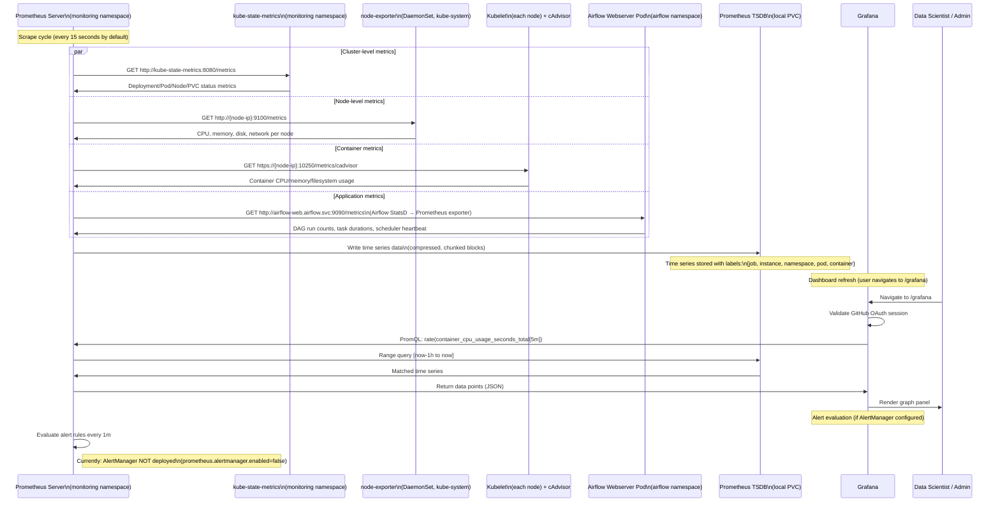
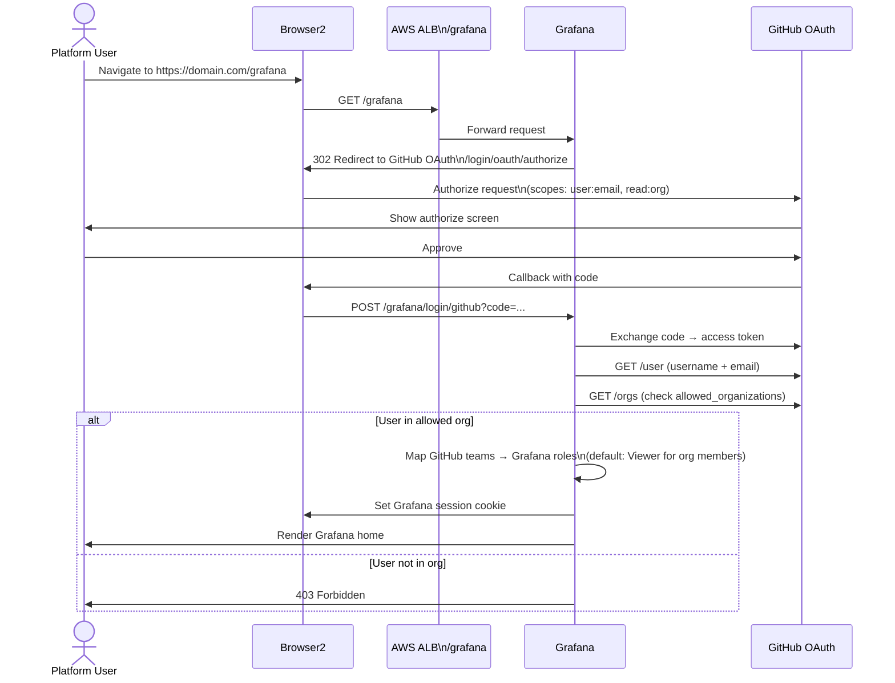
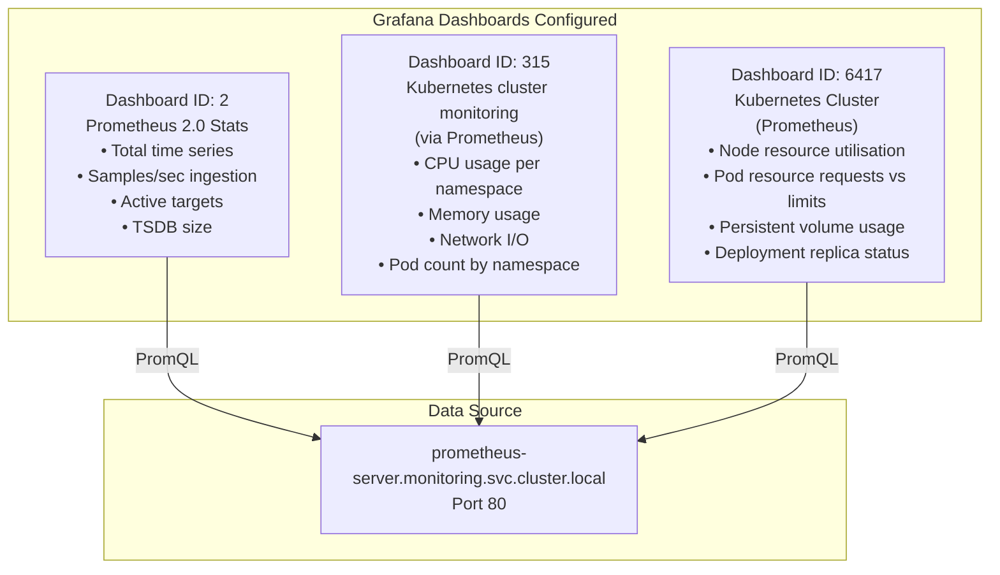
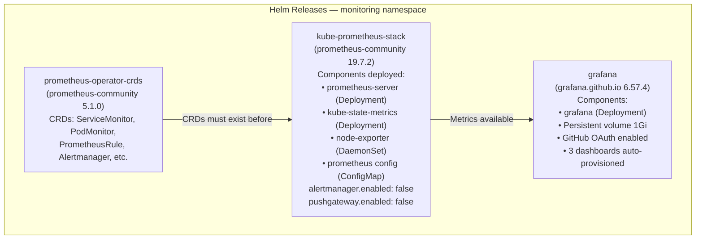

# Data Flow — Monitoring & Alerting

> **Scenario**: Prometheus continuously scrapes all platform components; Grafana visualizes dashboards; GitHub OAuth controls read access.  
> **Actors**: Prometheus, Grafana, Platform components (Airflow, MLflow, JupyterHub, K8s), Data Scientists / Admins

---

## Overview

```mermaid
graph LR
    subgraph SCRAPED["Scraped Targets"]
        AF_M[Airflow\n/metrics :9090]
        MLF_M[MLflow\n/metrics :5000]
        JHB_M[JupyterHub Hub\n/hub/metrics]
        K8S_M[kube-state-metrics\n:8080]
        NODE_M[node-exporter\n:9100]
        CADV[cAdvisor\n(built into kubelet)]
    end

    PROM["Prometheus Server\n(prometheus-server.monitoring.svc)\nPort 80"]
    PROM_TSDB["Prometheus TSDB\n(local PVC 2Gi)\nRetention: 15d"]
    GRAF["Grafana\n/grafana endpoint\nGitHub OAuth"]
    DASH_ID["Grafana Dashboards\n• ID 2: Prometheus Stats\n• ID 315: K8s Cluster\n• ID 6417: K8s Detail"]

    AF_M & MLF_M & JHB_M & K8S_M & NODE_M & CADV -->|"HTTP GET /metrics\nevery 15s (default)"| PROM
    PROM --> PROM_TSDB
    GRAF -->|"PromQL queries\nHTTP GET"| PROM
    GRAF --> DASH_ID

    style PROM fill:#e8f5e9
    style GRAF fill:#e3f2fd
    style PROM_TSDB fill:#fff3e0
```

---

## Detailed Sequence: Prometheus Scrape Cycle



---

## Grafana Authentication Flow



---

## Prometheus Targets Configuration

### ServiceMonitor Targets (via CRDs — Prometheus Operator)

```yaml
# ServiceMonitor for Airflow (example)
apiVersion: monitoring.coreos.com/v1
kind: ServiceMonitor
metadata:
  name: airflow
  namespace: monitoring
spec:
  namespaceSelector:
    matchNames: [airflow]
  selector:
    matchLabels:
      app: airflow
  endpoints:
    - port: metrics
      interval: 15s
      path: /metrics
```

### Prometheus Static Scrape Config (fallback for apps without ServiceMonitor)

```yaml
scrape_configs:
  - job_name: "kubernetes-pods"
    kubernetes_sd_configs:
      - role: pod
    relabel_configs:
      - source_labels: [__meta_kubernetes_pod_annotation_prometheus_io_scrape]
        action: keep
        regex: "true"
      - source_labels: [__meta_kubernetes_pod_annotation_prometheus_io_path]
        action: replace
        target_label: __metrics_path__
      - source_labels: [__meta_kubernetes_namespace]
        target_label: namespace
      - source_labels: [__meta_kubernetes_pod_name]
        target_label: pod

  - job_name: "kube-state-metrics"
    static_configs:
      - targets: ["kube-state-metrics.monitoring.svc.cluster.local:8080"]

  - job_name: "node-exporter"
    kubernetes_sd_configs:
      - role: node
    relabel_configs:
      - source_labels: [__address__]
        action: replace
        regex: (.+):(.+)
        replacement: ${1}:9100
        target_label: __address__
```

---

## Grafana Dashboard Breakdown



---

## Key Metrics to Monitor

| Metric | Component | PromQL Example | Alert Threshold |
|--------|-----------|---------------|-----------------|
| Node CPU usage | EC2 + kube-system | `1 - avg(irate(node_cpu_seconds_total{mode="idle"}[5m]))` | > 80% |
| Pod memory RSS | All namespaces | `container_memory_rss{namespace="airflow"}` | > node capacity |
| DAG run duration | Airflow | `airflow_dagrun_duration_success` | > SLA |
| Task failure rate | Airflow | `rate(airflow_ti_failures_total[5m])` | > 0 per 5m |
| MLflow request latency | MLflow | `flask_http_request_duration_seconds` | > 2s p99 |
| EFS IOPS | EFS via node-exporter | `node_filesystem_files_free` | < 10% free |
| PVC usage | All | `kubelet_volume_stats_used_bytes` | > 80% |
| Node count | EC2 Auto Scaling | `kube_node_status_condition{status="true",condition="Ready"}` | < min nodes |

---

## Monitoring Stack Deployment Detail



---

## AWS Services Involved

| Service | Role |
|---------|------|
| **EKS** | Runs Prometheus, Grafana, kube-state-metrics, node-exporter |
| **EBS** | PersistentVolumeClaims for Prometheus TSDB and Grafana data |
| **ALB** | Routes `/grafana` and `/monitoring` traffic |
| **Route 53** | DNS for Grafana domain |
| **GitHub** | OAuth for Grafana authentication |

---

## Missing Capabilities (Current Gaps)

| Gap | Impact | Recommended Solution |
|-----|--------|---------------------|
| AlertManager disabled | No notifications on failures | Enable `alertmanager.enabled=true`; configure PagerDuty/Slack routes |
| No ML-specific metrics | No experiment tracking visibility | Add MLflow custom Prometheus exporter |
| No log aggregation | Logs scattered per pod | Add Fluent Bit → CloudWatch Logs or Loki stack |
| Prometheus retention 15d | Limited historical analysis | Extend retention or add Thanos/Cortex for long-term storage |
| No business metrics | No SLA tracking | Instrument Airflow DAG-level metrics with StatsD |
