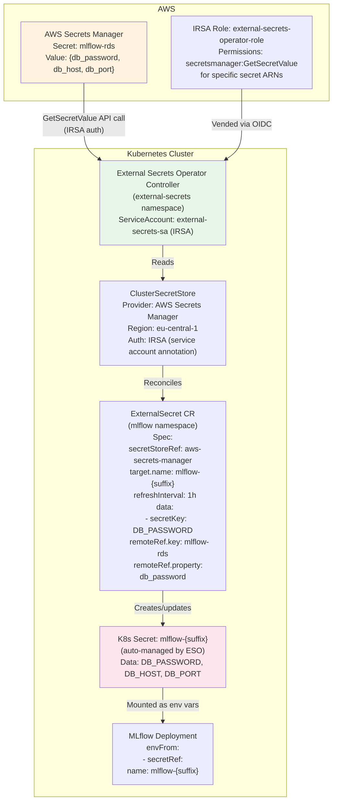
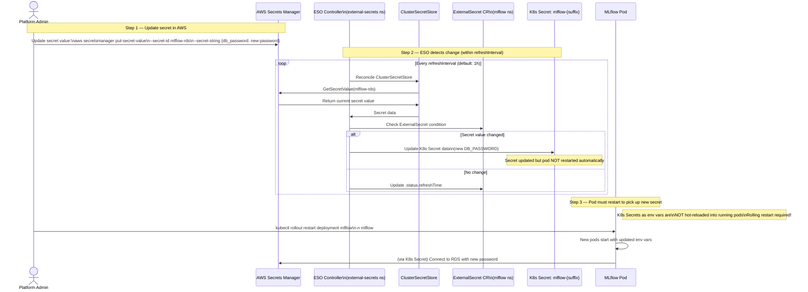
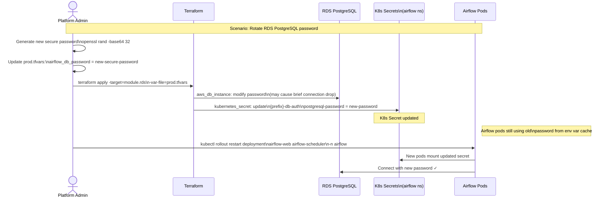
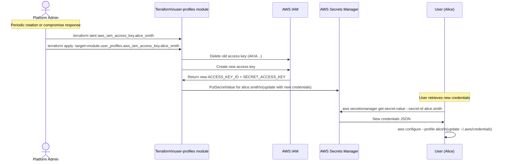
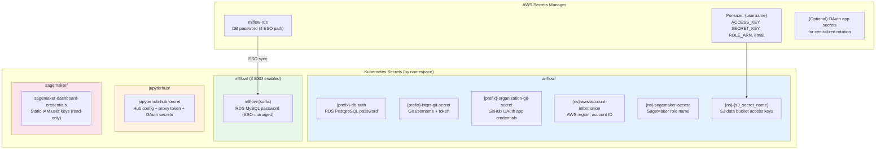

# Data Flow — Secrets Rotation

> **Scenario**: Secrets (DB passwords, OAuth tokens, AWS access keys) need to be rotated. This covers both the automated ESO sync path and the manual rotation path.  
> **Actors**: Platform Admin, AWS Secrets Manager, External Secrets Operator (ESO), Kubernetes, Application Pods

---

## Overview: Two Secrets Paths

```mermaid
graph TB
    subgraph PATH_A["Path A — ESO Automated Sync (MLflow RDS)"]
        SM_A[AWS Secrets Manager\nSecret: mlflow-rds]
        ESO_A[External Secrets Operator\nClusterSecretStore]
        ES_A[ExternalSecret CR\n(mlflow namespace)]
        K8S_SEC_A[K8s Secret: mlflow-{suffix}\nAuto-refreshed]
        MLF_POD_A[MLflow Pod\nMounts secret as env var]
        
        SM_A -->|"ESO polls every 1h"| ESO_A
        ESO_A -->|ExternalSecret reconcile| ES_A
        ES_A -->|Creates/updates| K8S_SEC_A
        K8S_SEC_A -->|Projected into pod env| MLF_POD_A
    end

    subgraph PATH_B["Path B — Manual Rotation (Airflow OAuth, DB passwords)"]
        ADMIN_B[Platform Admin\nUpdates tfvars / secret value]
        TF_B[Terraform apply\nUpdates K8s Secret]
        K8S_SEC_B[K8s Secret\n(airflow namespace)]
        AF_POD_B[Airflow Pod\nRestarts to pick up new secret]
        
        ADMIN_B -->|Edit prod.tfvars| TF_B
        TF_B -->|kubectl apply| K8S_SEC_B
        K8S_SEC_B -->|Rolling restart| AF_POD_B
    end

    style PATH_A fill:#e8f5e9
    style PATH_B fill:#e3f2fd
```

---

## Path A: Automated Rotation via External Secrets Operator

### Architecture



### ESO-Automated Rotation Sequence



---

## Path B: Manual Rotation — Airflow Secrets

### What Needs Manual Rotation

| Secret | K8s Secret Name | Contents | Rotation Trigger |
|--------|----------------|----------|-----------------|
| Airflow DB password | `{prefix}-db-auth` | `postgresql-password` | RDS password change |
| Git token | `{prefix}-https-git-secret` | `username`, `password` | GitHub PAT expiry |
| GitHub OAuth | `{prefix}-organization-git-secret` | `GITHUB_CLIENT_ID`, `GITHUB_CLIENT_SECRET` | OAuth app rotation |
| AWS info | `{ns}-aws-account-information` | `AWS_REGION`, `AWS_ID` | Account changes |

### Manual Rotation Sequence



---

## Per-User AWS Access Key Rotation



---

## Secrets Inventory



---

## Rotation Runbook Quick Reference

| Secret Type | Rotation Method | Downtime? | Command |
|-------------|----------------|-----------|---------|
| RDS PostgreSQL password | Terraform taint + apply | ≤30s (connection reset) | `terraform taint module.rds.aws_db_instance.airflow` |
| RDS MySQL password | Terraform taint + apply | ≤30s | `terraform taint module.rds.aws_db_instance.mlflow` |
| GitHub PAT (git-sync) | Update tfvars + apply + rollout restart | No | `kubectl rollout restart deploy/airflow-scheduler -n airflow` |
| GitHub OAuth secrets | Update tfvars + apply | No (hot reload) | `terraform apply -target=kubernetes_secret.airflow_oauth` |
| MLflow DB (ESO) | Update AWS Secrets Manager + rollout restart | No | `kubectl rollout restart deploy/mlflow -n mlflow` |
| Per-user access keys | Terraform taint access_key | No | `terraform taint ...aws_iam_access_key.{user}` |
| Airflow Fernet Key | Update tfvars + apply | Requires full restart | Requires re-encryption of all connections |

---

## AWS Services Involved

| Service | Role |
|---------|------|
| **AWS Secrets Manager** | Source of truth for all sensitive values |
| **IAM** | Access key management, IRSA role for ESO |
| **EKS (Kubernetes)** | Stores K8s Secrets; pods consume via env vars |
| **External Secrets Operator** | Bridges Secrets Manager → K8s Secrets |
| **RDS** | Database whose passwords are rotated |
| **GitHub** | OAuth app credentials (client ID + secret) |
| **Terraform** | Drives declarative secret provisioning |
