# Enterprise Scaling Challenges

> **Audience**: Platform engineers, architects, CTOs — engineering leaders at large organizations like Amazon  
> **Purpose**: Identify where this platform hits scaling walls when growing from a POC for one team to a production platform serving hundreds of teams and thousands of users

---

## Executive Summary

This platform was designed as a single-team MLOps environment. At Amazon-scale — where you might have:
- **500+ ML teams** across different orgs and business units
- **5,000+ data scientists and engineers**
- **100,000+ Airflow DAG runs per day**
- **Multi-region redundancy requirements**
- **SOC2 Type II / ISO 27001 compliance mandates**
- **$50M+ annual cloud spend requiring rigorous FinOps governance**

— you need fundamentally different architecture decisions in 7 key areas.

---

## Challenge 1: Multi-Team Namespace Isolation & Quotas

### Current State

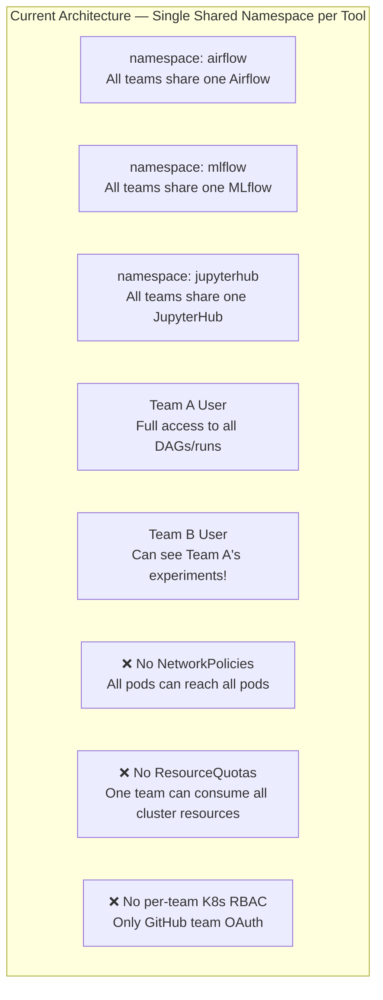

**Gaps**:
- No data isolation: Team A can query Team B's MLflow experiments
- No resource fairness: one burst training job blocks other teams
- No blast radius containment: a bad DAG can crash the shared Airflow

### Recommended Solution (Amazon Scale)

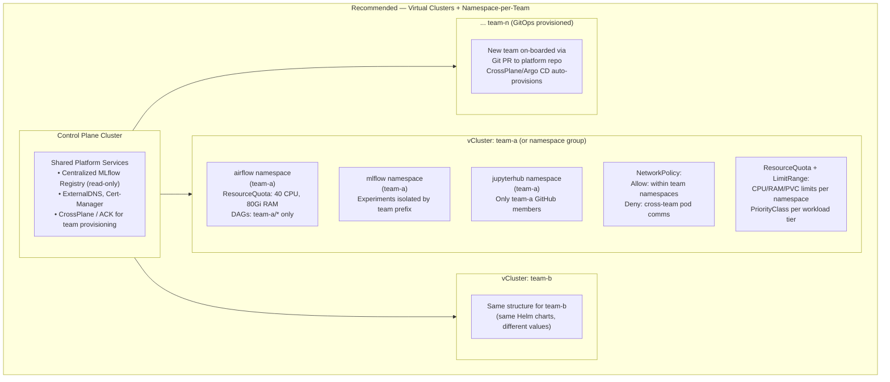

**Implementation Steps**:
1. Deploy [vcluster](https://www.vcluster.com/) or use Namespace groups per team
2. Add `ResourceQuota` and `LimitRange` per namespace:
   ```yaml
   apiVersion: v1
   kind: ResourceQuota
   metadata:
     name: team-a-quota
     namespace: airflow-team-a
   spec:
     hard:
       requests.cpu: "40"
       requests.memory: 80Gi
       limits.cpu: "80"
       limits.memory: 160Gi
       persistentvolumeclaims: "20"
       pods: "200"
   ```
3. Add `NetworkPolicy` to deny cross-namespace traffic by default
4. Use `PriorityClass` for critical vs. batch workloads
5. GitOps (Argo CD) + CrossPlane for automated team provisioning from a Git PR

---

## Challenge 2: Hundreds/Thousands of Users — IAM & OAuth Scaling

### Current State

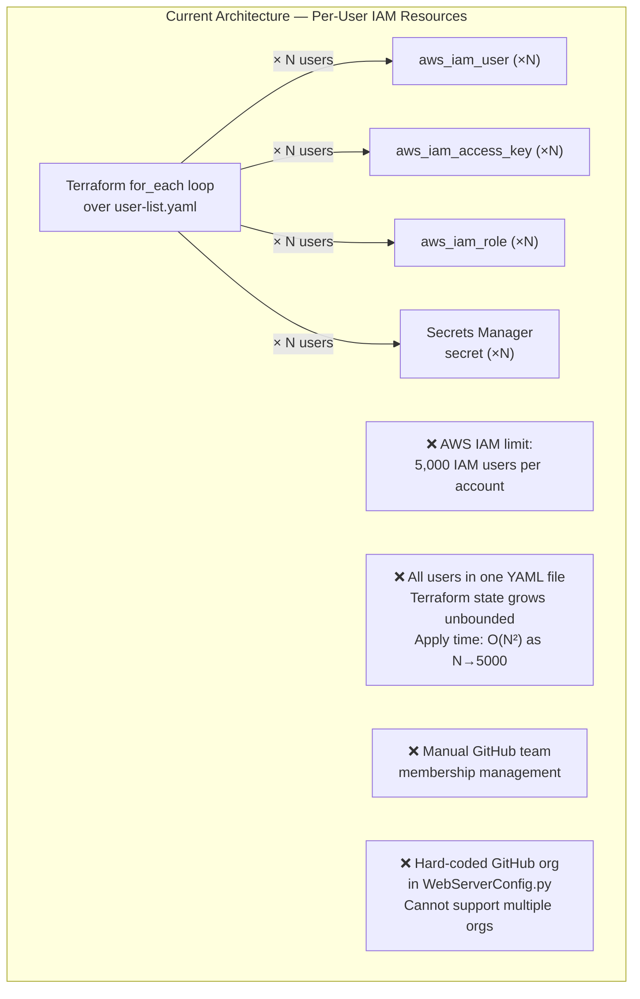

**Gaps at 5,000+ users**:
- IAM user limit (5,000) hit per AWS account → need multiple accounts
- `terraform apply` on 5,000-user YAML is slow and risky
- GitHub OAuth doesn't scale to 3rd party identity providers (LDAP, SAML)
- Single GitHub org hard-coded in Airflow config

### Recommended Solution (Amazon Scale)

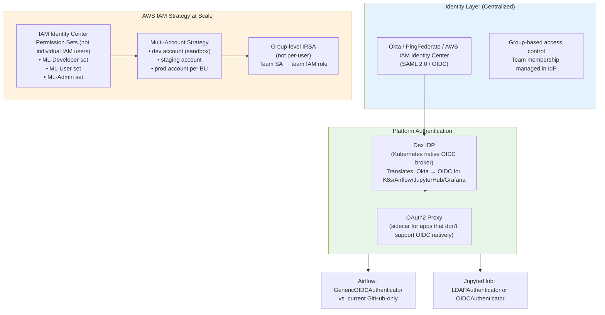

**Key Changes**:
1. Replace `aws_iam_user` per person with **IAM Identity Center Permission Sets** per role
2. Replace GitHub OAuth with **Dex IDP** (proxies Okta/SAML) for all apps
3. Replace `user-list.yaml` manual management with **SCIM provisioning** from Okta
4. Use **multi-account AWS Organizations** (one account per team/BU for blast radius)
5. Role-based IRSA instead of user-based

---

## Challenge 3: Cost Governance Per Team

### Current State

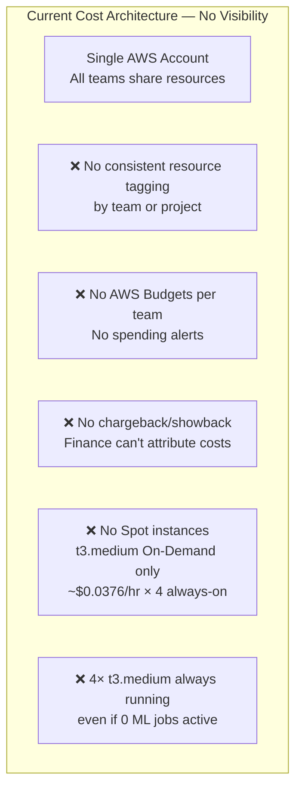

**Annual cost estimate** (current): 4× `t3.medium` ($0.0376/hr) × 8,760hrs = **~$1,317/year base** just for the always-on nodes. At Amazon scale with 100 teams each with their own cluster, this becomes $131,700/year in idle compute.

### Recommended Solution (Amazon Scale)

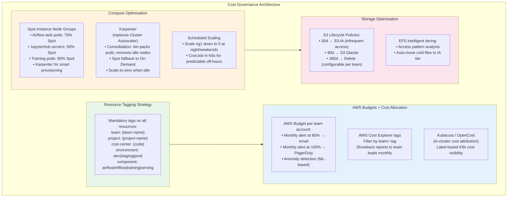

**Cost Reduction Levers**:

| Lever | Current | Optimized | Savings |
|-------|---------|-----------|---------|
| Node type | t3.medium On-Demand | Spot + Karpenter | 60–70% |
| Idle nodes | 4 base, always on | Scale-to-zero w/ Karpenter | 40–80% off-hours |
| S3 storage class | Standard | Lifecycle → IA/Glacier | 40–60% |
| RDS | db.t3.micro always-on | Stop during off-hours (non-prod) | 50% non-prod |
| EFS | Standard | Intelligent tiering | 20–30% |

---

## Challenge 4: Multi-Region / Multi-Cluster Federation

### Current State

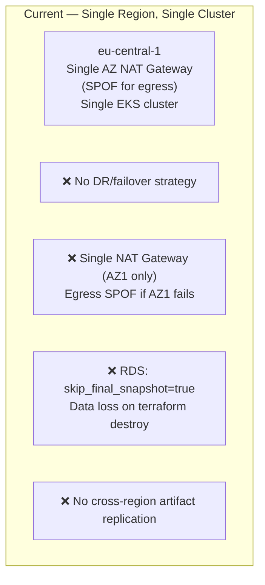

### Recommended Solution (Amazon Scale)

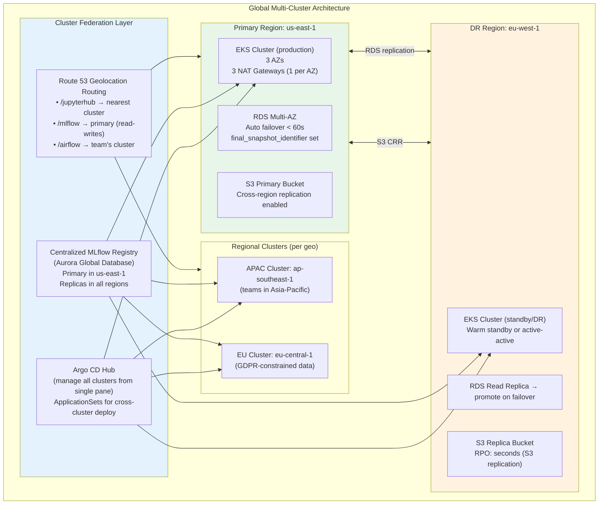

**Key RTO/RPO Targets**:

| Component | Current RTO | Target RTO | Approach |
|-----------|-------------|-----------|----------|
| Airflow (metadata) | Hours (rebuild) | 15 min | RDS Multi-AZ + warm standby |
| MLflow (experiments) | Hours | 5 min | Aurora Global DB + replica promotion |
| S3 artifacts | N/A (durable) | Seconds | S3 Cross-Region Replication |
| EKS cluster | Hours | 30 min | GitOps + bootstrap script |
| DNS | Minutes | < 1 min | Route 53 health checks + failover |

---

## Challenge 5: Data Lake Governance (S3 Access Controls)

### Current State

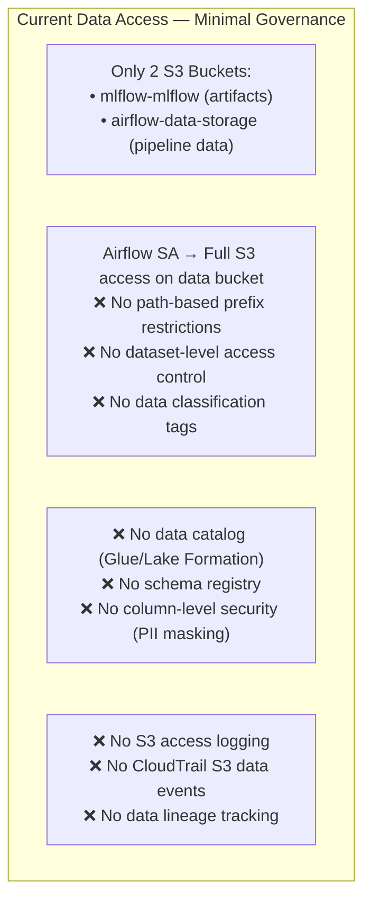

### Recommended Solution (Amazon Scale)

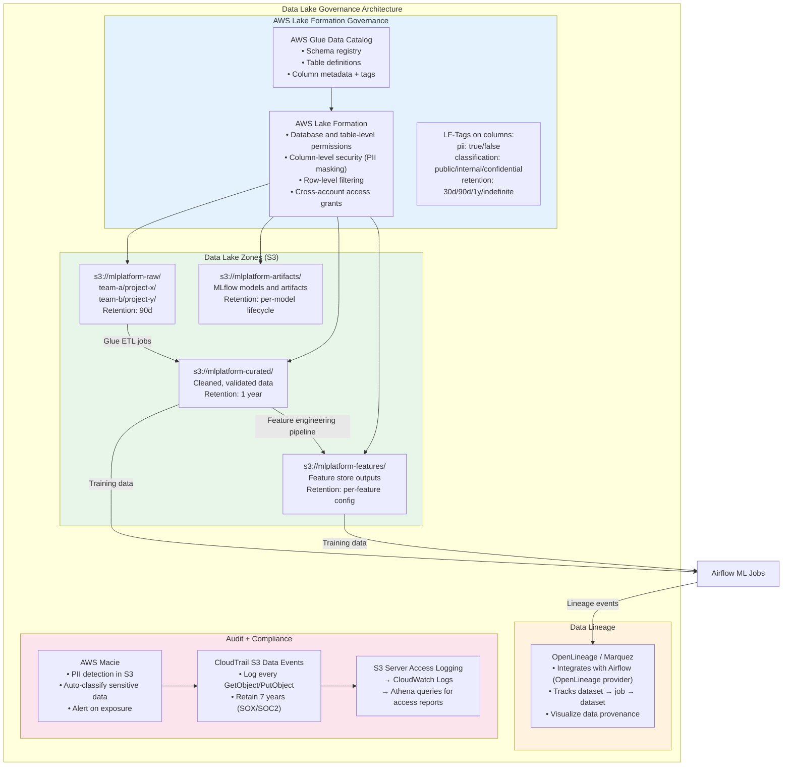

---

## Challenge 6: Compliance & Audit Logging (SOC2 / ISO 27001)

### Current State — Missing Controls

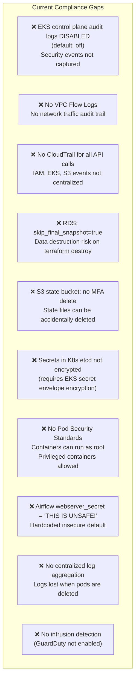

### Recommended Solution (Amazon Scale — SOC2 Type II Ready)

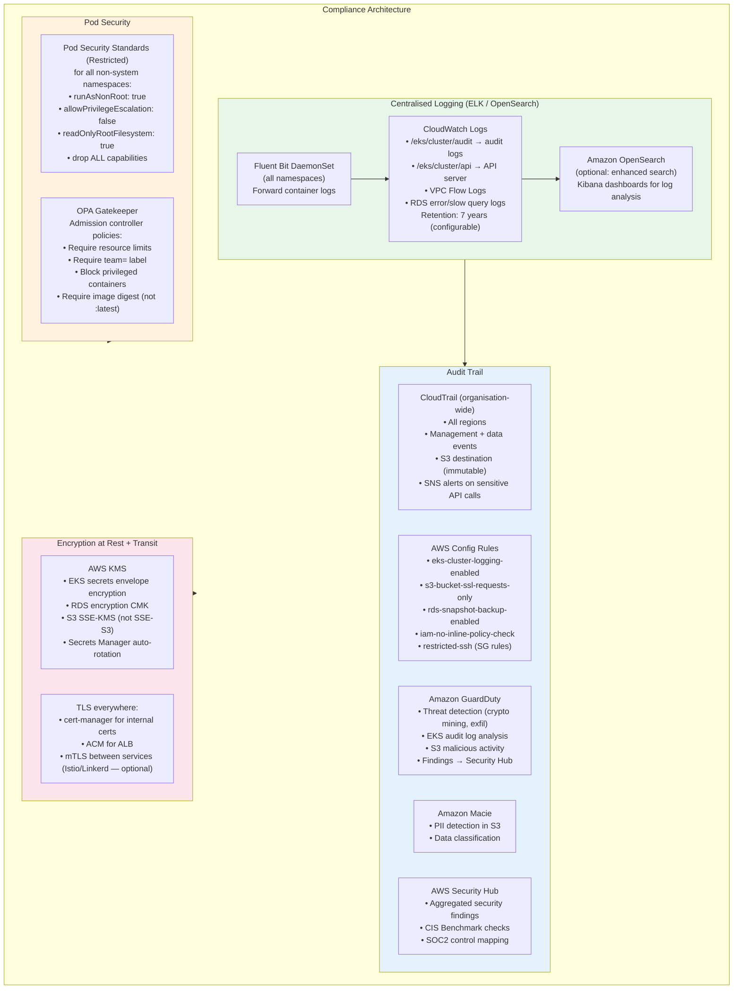

**SOC2 Control Mapping**:

| SOC2 Control | Current Status | Recommended Action |
|-------------|---------------|-------------------|
| CC6.1 (Logical access) | ⚠️ Partial (GitHub OAuth) | Add SAML SSO + MFA enforcement |
| CC6.2 (New access provisioning) | ⚠️ Manual (user-list.yaml) | SCIM auto-provisioning |
| CC6.3 (Access removal) | ⚠️ Manual (terraform taint) | Auto-deprovisioning on IdP offboard |
| CC7.1 (Change detection) | ❌ Missing | Enable AWS Config + CloudTrail |
| CC7.2 (Intrusion detection) | ❌ Missing | GuardDuty + Security Hub |
| CC8.1 (Change management) | ⚠️ IaC only | Add PR review + manual approval gates |
| A1.1 (Availability) | ❌ Single AZ NAT | Multi-AZ NAT + Cross-Region DR |
| C1.1 (Confidentiality) | ❌ Missing | KMS encryption + Macie + Lake Formation |

---

## Challenge 7: Platform Self-Service & GitOps Automation

### Current State — Manual Everything

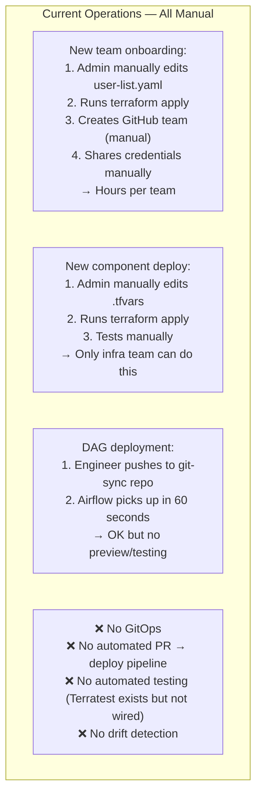

### Recommended Solution (Amazon Scale — Full Self-Service)

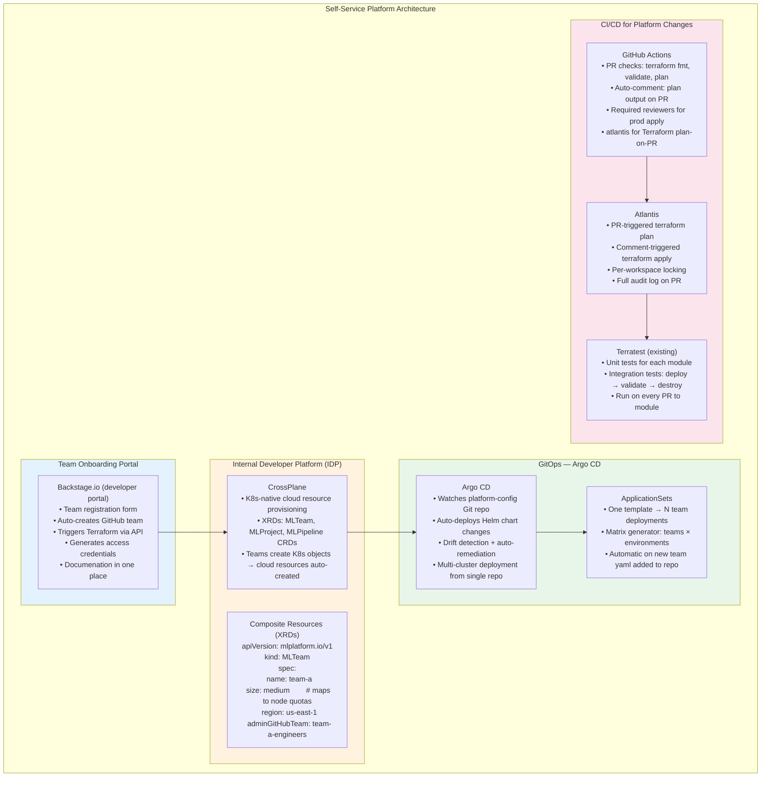

**Team Onboarding: Current vs. Target**:

| Step | Current (Manual) | Target (Self-Service) | Time |
|------|-----------------|----------------------|------|
| Request access | Email Platform team | Fill Backstage form | 2 min |
| Create GitHub team | Admin logs in | SCIM auto-creates | Instant |
| Provision AWS resources | `terraform apply` by admin | CrossPlane reconcile | 5 min |
| Airflow namespace | Shared (no isolation) | Separate namespace via Argo CD | 5 min |
| Issue credentials | Admin emails | Secrets Manager → user's vault | Instant |
| **Total time** | **Hours–Days** | **~10 minutes** | |

---

## Summary: Scaling Roadmap

```mermaid
gantt
    title Platform Scaling Roadmap
    dateFormat YYYY-Q[Q]
    
    section Quick Wins (Q1)
    NetworkPolicies per namespace         :active, q1a, 2026-Q1, 2026-Q2
    ResourceQuotas + LimitRanges          :q1b, 2026-Q1, 2026-Q2
    CloudTrail + VPC Flow Logs            :q1c, 2026-Q1, 2026-Q2
    Spot instances + Karpenter            :q1d, 2026-Q1, 2026-Q2
    AlertManager enable                   :q1e, 2026-Q1, 2026-Q1

    section Medium-term (Q2-Q3)
    Multi-account AWS Organizations       :q2a, 2026-Q2, 2026-Q3
    IAM Identity Center + SAML SSO        :q2b, 2026-Q2, 2026-Q3
    Argo CD GitOps                        :q2c, 2026-Q2, 2026-Q3
    Kubecost cost attribution             :q2d, 2026-Q2, 2026-Q3
    EKS control plane audit logging       :q2e, 2026-Q2, 2026-Q2
    GuardDuty + Security Hub              :q2f, 2026-Q2, 2026-Q3
    S3 Lifecycle Policies                 :q2g, 2026-Q2, 2026-Q2

    section Strategic (Q4+)
    Multi-region cluster federation       :q3a, 2026-Q4, 2027-Q1
    CrossPlane team self-service          :q3b, 2026-Q4, 2027-Q1
    Backstage developer portal            :q3c, 2026-Q4, 2027-Q2
    Lake Formation data governance        :q3d, 2026-Q4, 2027-Q2
    OpenLineage data lineage              :q3e, 2027-Q1, 2027-Q2
    SOC2 Type II audit readiness          :q3f, 2027-Q1, 2027-Q3
```
