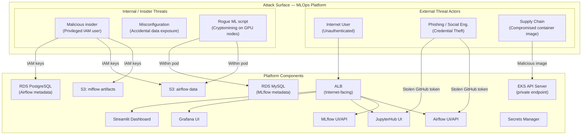
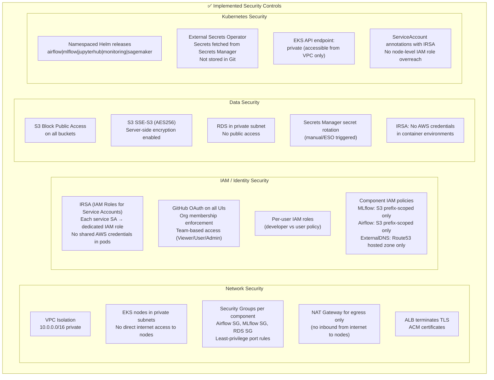
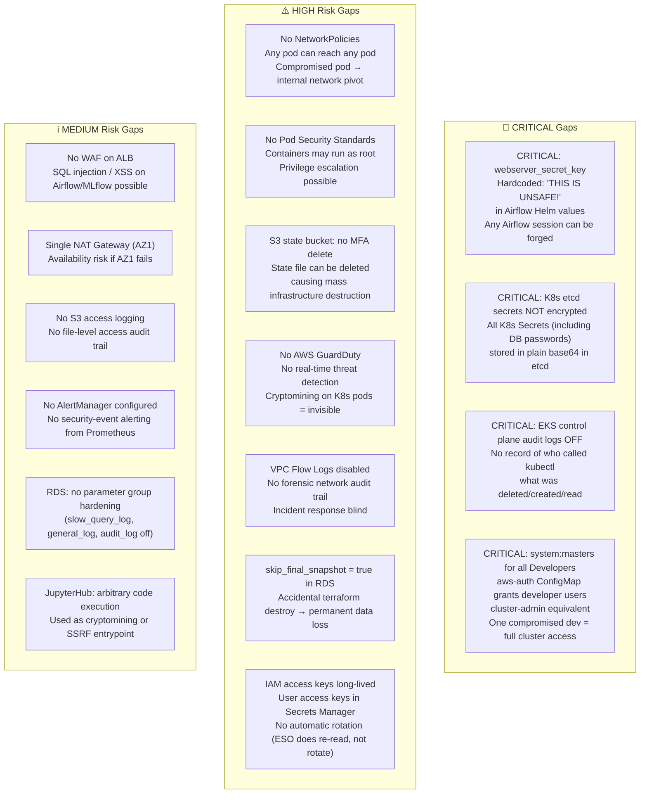
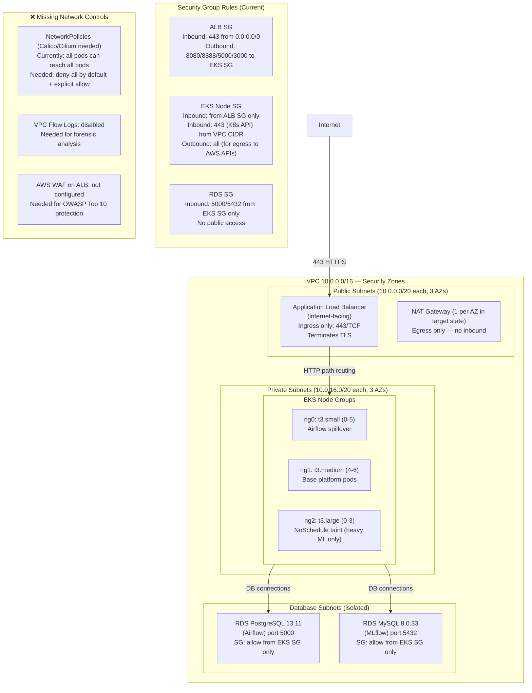
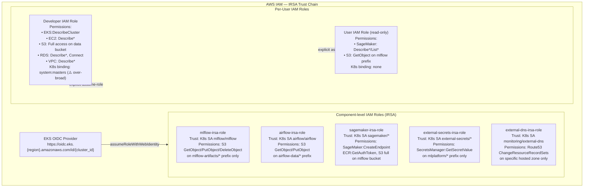
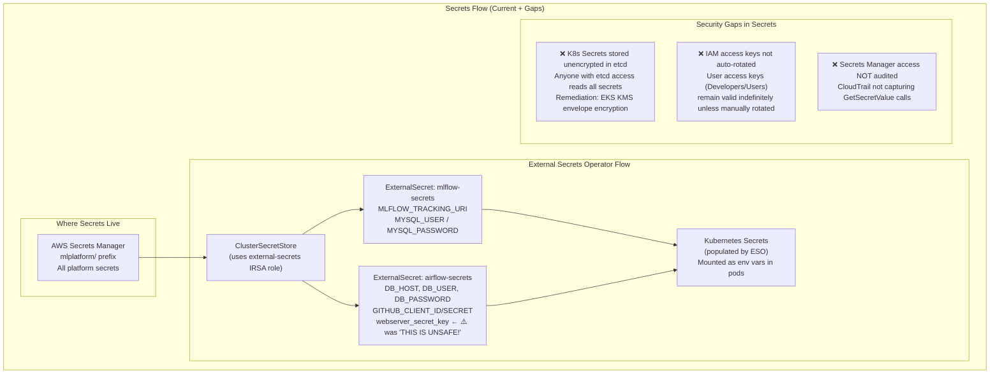
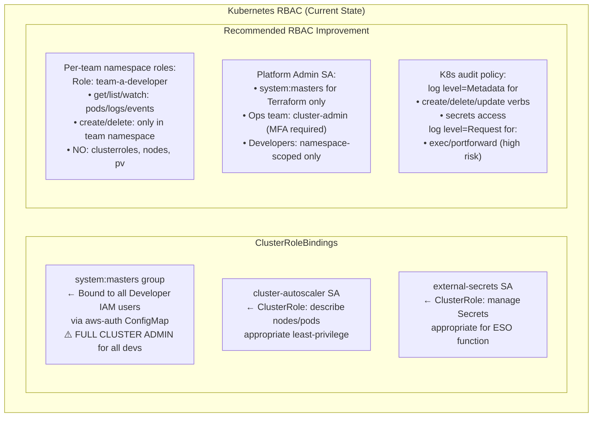

# Security Architecture

> **Audience**: Security engineers, platform architects, compliance officers  
> **Purpose**: Complete security posture analysis — what IS hardened, what has critical gaps, and a prioritised remediation roadmap

---

## Threat Model Overview (STRIDE)

### STRIDE Analysis Per Component

| Component | Spoofing | Tampering | Repudiation | Info Disclosure | DoS | Elevation |
|-----------|----------|-----------|-------------|-----------------|-----|-----------|
| ALB | ✅ HTTPS/TLS | ✅ WAF (not enabled) | ⚠️ No access logs | ✅ Private targets | ⚠️ No rate limiting | N/A |
| GitHub OAuth | ✅ OAuth state param | ✅ JWT signed | ❌ No audit log | ⚠️ Tokens in K8s | ✅ Short-lived | ⚠️ No MFA enforce |
| Airflow API | ✅ OAuth required | ⚠️ No API auth on internal | ❌ No API audit | ⚠️ DB password in K8s | ⚠️ No rate-limit | ❌ KubEx pod → system:masters |
| JupyterHub | ✅ OAuth required | ⚠️ User can exec arbitrary | ❌ No notebook audit | ⚠️ Shared EFS | ⚠️ No resource limits | ⚠️ Privileged pod possible |
| MLflow | ✅ OAuth proxy | ❌ No model signing | ❌ No run audit | ⚠️ S3 creds via SA | ⚠️ No API rate-limit | ⚠️ IRSA over-permissive |
| K8s API | ✅ OIDC GitHub | ✅ RBAC (partial) | ⚠️ Audit logs off | ⚠️ etcd unencrypted | ✅ etcd has auth | ❌ system:masters |
| RDS Postgres | ✅ Password auth | ✅ VPC locked | ❌ No query audit | ⚠️ Password in K8s SM | ✅ Private VPC | ✅ SG restricted |
| S3 Buckets | ✅ IAM IRSA | ✅ Block public | ❌ No access logging | ⚠️ No versioning policy | N/A | ⚠️ Broad prefix access |
| Secrets Manager | ✅ IAM auth | ✅ Encrypted | ✅ CloudTrail (if enabled) | ⚠️ Access key rotation | N/A | ⚠️ User keys long-lived |

---

## Current Security Controls (What IS Implemented)

---

## Critical Security Gaps (Immediate Action Required)

---

## Network Security Architecture

---

## IAM Trust Boundaries & IRSA Roles

---

## Secrets Management Architecture

---

## Container Security

```mermaid
graph TB
    subgraph CONTAINER_SEC["Container Image Security"]
        subgraph CURRENT_IMAGES["Current Images (DockerHub)"]
            I1["seblum/airflow:2.6.3-python3.11-custom-light"]
            I2["seblum/mlflow:v2.4.1"]
            I3["seblum/jupyterhub-server:latest  ← ⚠️ :latest tag = non-deterministic"]
            I4["seblum/streamlit-sagemaker-app:v1.0.0"]
            I5["seblum/vuejs-ml-dashboard:latest  ← ⚠️ :latest"]
        end

        subgraph IMAGE_RISKS["Image Security Risks"]
            R1["⚠️ Images from DockerHub\n(public registry — no SLA, can disappear)\nRemediation: Mirror to private ECR"]
            R2["⚠️ :latest tag on 2 images\nNon-deterministic — different behaviour across\ndeploys/restarts\nRemediation: Pin to digest sha256:..."]
            R3["⚠️ No image vulnerability scanning\nTrivy / Amazon ECR scanning not configured\nCritical CVEs in base images undetected"]
            R4["⚠️ No image signing (Cosign/Notary)\nImage tampering undetected"]
        end

        subgraph IMAGE_HARDENING["Recommended Hardening"]
            H_ECR["Migrate to ECR private registry\n(replicate from DockerHub)\nECR image scanning: on-push + on-schedule"]
            H_SCAN["Trivy in CI pipeline\nBlock deployment if CRITICAL CVEs"]
            H_SIGN["Cosign image signing\nVerify signature before deploy (OPA)"]
            H_SBOM["Generate SBOM (syft)\nFor compliance artifact delivery"]
        end
    end

    CURRENT_IMAGES --> IMAGE_RISKS
    IMAGE_RISKS --> IMAGE_HARDENING
```

---

## Kubernetes RBAC Analysis

---

## Security Remediation Roadmap

### Immediate (P0 — within 1 week)

| Issue | Severity | Action |
|-------|----------|--------|
| `webserver_secret_key = 'THIS IS UNSAFE!'` | CRITICAL | Rotate to random 32-char secret in Secrets Manager |
| EKS control plane audit logs | CRITICAL | `aws eks update-cluster-config --logging '{"clusterLogging":[{"types":["api","audit","authenticator","controllerManager","scheduler"],"enabled":true}]}'` |
| etcd secret encryption | CRITICAL | Enable KMS envelope encryption on EKS cluster |
| `system:masters` for all developers | CRITICAL | Create namespace-scoped Roles; reserve system:masters for Terraform SA only |
| `skip_final_snapshot = true` | HIGH | Change to `false`; set `final_snapshot_identifier` |

### Short-term (P1 — within 1 month)

| Issue | Severity | Action |
|-------|----------|--------|
| NetworkPolicies | HIGH | Deploy Calico; add deny-all + allow-same-namespace policies |
| VPC Flow Logs | HIGH | Enable on all VPC subnets → CloudWatch Logs |
| GuardDuty | HIGH | Enable GuardDuty + EKS protection in account settings |
| S3 state bucket MFA delete | HIGH | Enable MFA delete on `mlplatform-terraform-state` |
| Pod Security Standards | HIGH | Apply `Restricted` profile on all non-system namespaces |
| IAM access key rotation | MEDIUM | Implement Lambda rotation in Secrets Manager for user keys |
| S3 access logging | MEDIUM | Enable access logging on both S3 buckets |
| Docker :latest tags | MEDIUM | Pin `jupyterhub-server` and `vuejs-ml-dashboard` to digests |

### Medium-term (P2 — within 1 quarter)

| Issue | Severity | Action |
|-------|----------|--------|
| AWS WAF on ALB | MEDIUM | Enable managed rule groups (OWASP Top 10) |
| Image scanning (ECR + Trivy) | MEDIUM | Mirror images to ECR; add Trivy to GitHub Actions |
| AWS Security Hub CIS baseline | MEDIUM | Enable Security Hub; achieve CIS Level 1 compliance |
| Secrets Manager CloudTrail | MEDIUM | Enable CloudTrail data events for Secrets Manager API |
| RDS audit logging | LOW | Enable `general_log`, `slow_query_log` via Parameter Group |
| Multi-AZ NAT gateway | LOW | Add NAT GW in AZ2 and AZ3 |
