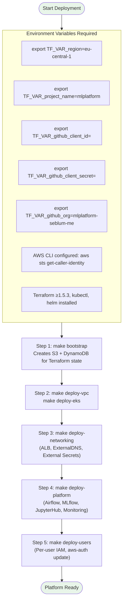
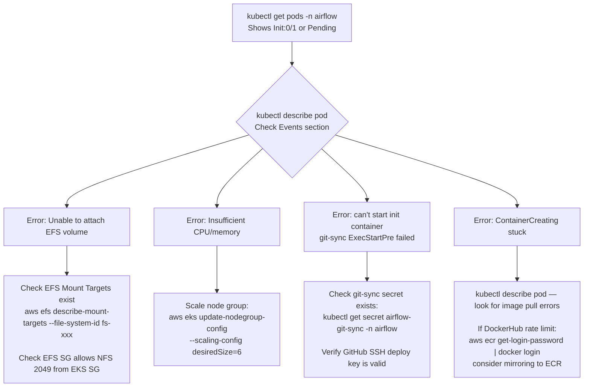
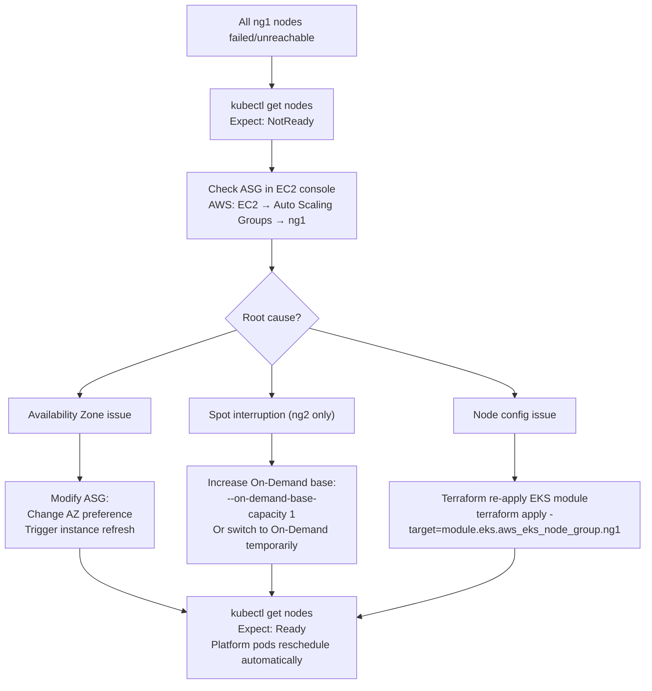
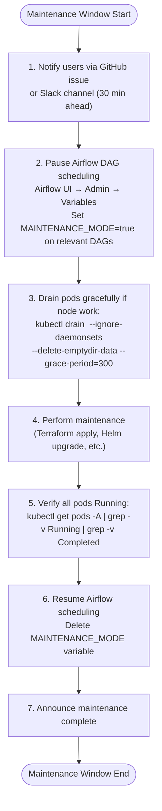

# Operations Runbook

> **Audience**: Platform SRE and infrastructure engineers  
> **Purpose**: Day-to-day operational procedures — deployment, scaling, incident response, and maintenance

---

## Quick Reference

| Command | Purpose |
|---------|---------|
| `cd deployment && make bootstrap` | First-time bootstrap (remote state) |
| `make deploy-all` | Full platform deploy |
| `make destroy-all` | Tear down entire platform |
| `kubectl get pods -A` | Check all pod status |
| `kubectl logs -n airflow <pod>` | Stream Airflow logs |
| `terraform plan -var-file=dev.tfvars` | Preview infrastructure changes |

---

## 1. Initial Deployment

### Prerequisites Checklist



### Step-by-Step Commands

```bash
# ── 1. Bootstrap (run ONCE) ────────────────────────────────────────────────
cd deployment/bootstrap
terraform init
terraform apply -auto-approve
# Creates:
#   S3 bucket:   mlplatform-terraform-state
#   DynamoDB:    mlplatform-terraform-locks

# ── 2. VPC ─────────────────────────────────────────────────────────────────
cd ../infrastructure/vpc
terraform init -backend-config=backend.tf
terraform apply -var-file=../../dev.tfvars

# ── 3. EKS Cluster ─────────────────────────────────────────────────────────
cd ../eks
terraform init -backend-config=backend.tf
terraform apply -var-file=../../dev.tfvars
# Outputs:  cluster_name, cluster_endpoint, node_group IDs

# Update kubeconfig:
aws eks update-kubeconfig --name mlplatform --region eu-central-1

# ── 4. Networking (ALB, ExternalDNS, External Secrets) ────────────────────
cd ../networking/application-load-balancer
terraform init && terraform apply

cd ../external-dns
terraform init && terraform apply

# ── 5. External Secrets Operator ───────────────────────────────────────────
cd ../../modules/external-secrets
terraform init && terraform apply

# ── 6. Applications (in parallel if desired) ──────────────────────────────
cd ../../modules/airflow && terraform apply
cd ../../modules/mlflow && terraform apply
cd ../../modules/jupyterhub && terraform apply
cd ../../modules/monitoring && terraform apply
cd ../../modules/sagemaker && terraform apply
cd ../../modules/dashboard && terraform apply

# ── 7. User Profiles ───────────────────────────────────────────────────────
cd ../../modules/user-profiles
terraform apply
# Creates IAM users, roles, access keys, K8s aws-auth entries
```

---

## 2. Makefile Targets Reference

```bash
# From deployment/ directory
make help              # List all available targets

# Infrastructure
make bootstrap         # create S3/DynamoDB state backend
make deploy-vpc        # deploy VPC, subnets, NAT gateway
make deploy-eks        # deploy EKS cluster + node groups
make deploy-networking # deploy ALB controller, ExternalDNS

# Modules
make deploy-airflow    # deploy Airflow Helm release
make deploy-mlflow     # deploy MLflow Helm release
make deploy-jupyterhub # deploy JupyterHub Helm release
make deploy-monitoring # deploy Prometheus + Grafana
make deploy-sagemaker  # deploy SageMaker ECR + Streamlit app
make deploy-dashboard  # deploy Vue.js dashboard
make deploy-users      # provision per-user IAM + K8s RBAC

# Aggregates
make deploy-all        # deploy entire platform from scratch
make destroy-all       # destroy entire platform (DANGER!)

# State
make show              # terraform show for main module
make plan              # terraform plan for main module
```

---

## 3. Managing Kubernetes Workloads

### Checking Platform Health

```bash
# Overall status — all namespaces
kubectl get pods -A -o wide

# Per-namespace status
kubectl get pods -n airflow
kubectl get pods -n mlflow
kubectl get pods -n jupyterhub
kubectl get pods -n monitoring
kubectl get pods -n sagemaker
kubectl get pods -n external-secrets

# Check all services/ingresses
kubectl get svc,ingress -A

# Node status + resource utilisation
kubectl get nodes -o wide
kubectl top nodes
kubectl top pods -A --sort-by=memory
```

### Viewing Logs

```bash
# Airflow scheduler logs
kubectl logs -n airflow -l component=scheduler --tail=100 -f

# Airflow webserver logs
kubectl logs -n airflow -l component=webserver --tail=100 -f

# Airflow worker (KubernetesExecutor pods — ephemeral)
kubectl logs -n airflow -l dag_id=<dag-id> --tail=200

# MLflow server logs
kubectl logs -n mlflow deployment/mlflow --tail=100 -f

# JupyterHub hub logs
kubectl logs -n jupyterhub deployment/jupyterhub --tail=100 -f

# JupyterHub user server
kubectl logs -n jupyterhub jupyter-<username> --tail=100

# External Secrets operator
kubectl logs -n external-secrets deployment/external-secrets --tail=100 -f

# Cluster Autoscaler
kubectl logs -n kube-system deployment/cluster-autoscaler-aws-cluster-autoscaler --tail=100 -f

# ALB Ingress Controller
kubectl logs -n kube-system deployment/aws-load-balancer-controller --tail=100 -f

# ExternalDNS
kubectl logs -n kube-system deployment/external-dns --tail=100

# Generic: show previous container logs (after crash)
kubectl logs -n <namespace> <pod-name> --previous
```

### Restarting Deployments

```bash
# Rolling restart (zero-downtime)
kubectl rollout restart deployment/mlflow -n mlflow
kubectl rollout restart deployment/jupyterhub -n jupyterhub

# Restart Airflow scheduler (drain in-flight tasks first)
kubectl rollout restart deployment/airflow-scheduler -n airflow

# Watch rollout progress
kubectl rollout status deployment/mlflow -n mlflow

# Force-delete a stuck pod (it will be recreated by the Deployment)
kubectl delete pod <pod-name> -n <namespace>
```

---

## 4. Scaling Operations

### Node Group Manual Scaling

```bash
# Scale ng1 up (base nodes)
aws eks update-nodegroup-config \
  --cluster-name mlplatform \
  --nodegroup-name ng1 \
  --scaling-config minSize=4,maxSize=6,desiredSize=6

# Scale ng2 up for heavy ML workloads
aws eks update-nodegroup-config \
  --cluster-name mlplatform \
  --nodegroup-name ng2 \
  --scaling-config minSize=0,maxSize=3,desiredSize=2

# Check Cluster Autoscaler status
kubectl describe configmap cluster-autoscaler-status -n kube-system
```

### Node Group Configuration (Current)

| Node Group | Instance | Min | Max | Taint | Purpose |
|-----------|----------|-----|-----|-------|---------|
| ng0 | t3.small | 0 | 5 | None | Airflow spillover |
| ng1 | t3.medium | 4 | 6 | None | Base platform pods |
| ng2 | t3.large | 0 | 3 | NoSchedule | Heavy ML (explicit toleration required) |

### Scaling a Specific Deployment

```bash
# Scale JupyterHub proxy (optional)
kubectl scale deployment jupyterhub-proxy -n jupyterhub --replicas=2

# Scale MLflow to 2 replicas
kubectl scale deployment/mlflow -n mlflow --replicas=2

# Note: Airflow components (scheduler, webserver) are managed by Helm
# Scale via Helm values update:
helm upgrade airflow apache-airflow/airflow \
  -n airflow \
  --reuse-values \
  --set scheduler.replicas=2
```

---

## 5. Adding / Removing Users

### Adding a New User

1. Edit `profiles/user-list.yaml`:

```yaml
# Add new user entry:
users:
  - username: "jane-doe"
    role: "Developer"          # or "User"
    github_username: "janedoe"
    team: "team-analytics"
```

2. Apply:

```bash
cd deployment/modules/user-profiles
terraform plan   # Review: IAM user, role, policy, aws-auth entry
terraform apply
```

3. Share credentials:

```bash
# Credentials are stored in Secrets Manager:
aws secretsmanager get-secret-value \
  --secret-id mlplatform/user/jane-doe/access-key \
  --query SecretString --output text
# → Share via secure channel (1Password, email-encrypted, etc.)
```

### Removing a User

```bash
# Edit profiles/user-list.yaml — remove the user entry

cd deployment/modules/user-profiles
terraform plan   # Review: IAM user deletion, K8s RBAC removal
terraform apply

# Verify removal from aws-auth ConfigMap:
kubectl get configmap aws-auth -n kube-system -o yaml | grep -A5 "jane-doe"
# Should return nothing
```

---

## 6. Helm Release Management

### Listing Current Releases

```bash
helm list -A
# NAME               NAMESPACE   CHART                           APP VERSION
# airflow            airflow     apache-airflow-8.7.1            2.6.3
# mlflow             mlflow      mlflow-0.1.0                    2.4.1
# jupyterhub         jupyterhub  jupyterhub-2.0.0                2.0.0
# kube-prometheus... monitoring  kube-prometheus-stack-19.7.2    v0.60.1
# grafana            monitoring  grafana-6.57.4                  9.5.5
# external-secrets   external-secrets external-secrets-0.x.x    0.x.x
# aws-load-balancer-controller kube-system aws-load-balancer-controller...
# external-dns       kube-system external-dns-6.20.4             0.13.4
```

### Upgrading a Helm Release

```bash
# Always --dry-run first
helm upgrade airflow apache-airflow/airflow \
  -n airflow \
  --values deployment/modules/airflow/helm/values.yaml \
  --dry-run

# Then apply
helm upgrade airflow apache-airflow/airflow \
  -n airflow \
  --values deployment/modules/airflow/helm/values.yaml

# Roll back if issues
helm rollback airflow 1 -n airflow   # 1 = previous revision
helm history airflow -n airflow      # see revision history
```

### Troubleshooting Failed Helm Releases

```bash
# Check release status
helm status mlflow -n mlflow

# Get all K8s events for a namespace
kubectl get events -n mlflow --sort-by=.lastTimestamp

# Describe a failing pod
kubectl describe pod <pod-name> -n mlflow

# Common "stuck in pending": check node capacity
kubectl describe pod <pending-pod> -n mlflow | grep -A10 "Events:"
# Look for: "Insufficient cpu" or "Insufficient memory" → scale up nodes
```

---

## 7. Terraform State Operations

### Common Terraform Workflows

```bash
# Import an existing resource into state:
terraform import aws_s3_bucket.mlflow_artifacts mlflow-artifact-bucket-name

# Remove resource from state (without destroying it):
terraform state rm aws_iam_user.mlflow_user

# Taint resource for forced recreation:
terraform taint module.mlflow.aws_db_instance.mlflow_db
terraform apply  # Will destroy and recreate the tainted resource

# View current state:
terraform state list
terraform state show module.mlflow.aws_db_instance.mlflow_db

# Unlock stuck state (after crash):
terraform force-unlock <LOCK_ID>
# Get LOCK_ID from DynamoDB: mlplatform-terraform-locks
# aws dynamodb scan --table-name mlplatform-terraform-locks
```

### Migrating Terraform State

See `docs/migrate_remote_state.md` for detailed migration instructions.

---

## 8. Troubleshooting Common Failures

### Failure: Airflow Pods Stuck in "Init" / "Pending"



### Failure: MLflow Can't Connect to MySQL

```bash
# 1. Check if the ExternalSecret populated the K8s Secret:
kubectl get secret mlflow-secrets -n mlflow -o jsonpath='{.data}' | base64 -d

# 2. Check External Secrets sync status:
kubectl get externalsecret -n mlflow
# Look for: Status=SecretSyncedError

# 3. Check ESO logs:
kubectl logs -n external-secrets deployment/external-secrets-cert-controller | tail -50

# 4. Verify RDS endpoint is correct:
aws rds describe-db-instances --query 'DBInstances[*].Endpoint.Address'

# 5. Manually test connectivity from a debug pod:
kubectl run -it --rm debug --image=mysql:8 -n mlflow --restart=Never -- \
  mysql -h <RDS_ENDPOINT> -P 5432 -u mlflow -p
```

### Failure: JupyterHub OAuth Error (GitHub)

```bash
# 1. Check JupyterHub hub config:
kubectl get secret jupyterhub-config -n jupyterhub -o yaml

# 2. Verify GitHub OAuth App callback URL matches:
# Should be: https://<domain>/jupyterhub/hub/oauth_callback

# 3. Check GitHub OAuth App settings:
# → GitHub → Settings → Developer Settings → OAuth Apps
# → Check Authorization callback URL matches above

# 4. Check hub logs for OAuth errors:
kubectl logs -n jupyterhub deployment/jupyterhub --tail=100 | grep -i "oauth\|error\|403\|401"

# 5. Verify GitHub org membership:
# User must be member of github_org set in Hub config
# Check: hub.config.GitHubOAuthenticator.allowed_organizations
kubectl get configmap jupyterhub-config -n jupyterhub -o yaml | grep allowed_org
```

### Failure: DNS Not Resolving (ExternalDNS)

```bash
# 1. Check ExternalDNS logs:
kubectl logs -n kube-system deployment/external-dns --tail=100

# 2. Check if Ingress has correct annotation:
kubectl get ingress -A -o yaml | grep "kubernetes.io/ingress.class\|alb"

# 3. Verify Route53 record was created:
aws route53 list-resource-record-sets \
  --hosted-zone-id <ZONE_ID> \
  --query 'ResourceRecordSets[*].Name'

# 4. Check IRSA role permissions for ExternalDNS:
kubectl describe sa external-dns -n kube-system | grep "Annotations"
# Should show: eks.amazonaws.com/role-arn: arn:aws:iam::...

# 5. Check ALB controller has created the ALB:
aws elbv2 describe-load-balancers | grep -i "mlplatform"
```

### Failure: Cluster Autoscaler Not Scaling

```bash
# 1. Check autoscaler logs:
kubectl logs -n kube-system deployment/cluster-autoscaler-aws-cluster-autoscaler --tail=100

# 2. Check pending pods (autoscaler should see these):
kubectl get pods -A --field-selector=status.phase=Pending

# 3. Verify node group has correct tags for autoscaler discovery:
aws autoscaling describe-auto-scaling-groups \
  --query 'AutoScalingGroups[*].[AutoScalingGroupName,Tags[?Key==`k8s.io/cluster-autoscaler/enabled`]]'

# 4. Check autoscaler IRSA role:
kubectl describe sa cluster-autoscaler -n kube-system | grep role-arn
```

---

## 9. Monitoring & Alerting Operations

### Accessing Dashboards

| Dashboard | URL | Auth |
|-----------|-----|------|
| Grafana | `https://<domain>/grafana` | GitHub OAuth (grafana-user-team) |
| Prometheus UI | Port-forward only (not exposed via ingress) | None |
| Airflow | `https://<domain>/airflow` | GitHub OAuth |
| MLflow | `https://<domain>/mlflow` | GitHub OAuth |
| JupyterHub | `https://<domain>/jupyterhub` | GitHub OAuth |
| Sagemaker Dashboard | `https://<domain>/sagemaker` | GitHub OAuth |

### Port-Forward for Local Access

```bash
# Prometheus
kubectl port-forward -n monitoring svc/kube-prometheus-stack-prometheus 9090:9090
# Access: http://localhost:9090

# Grafana (if ingress not working)
kubectl port-forward -n monitoring svc/grafana 3000:80
# Access: http://localhost:3000

# MLflow (direct)
kubectl port-forward -n mlflow svc/mlflow 5000:5000
# Access: http://localhost:5000

# Airflow
kubectl port-forward -n airflow svc/airflow-webserver 8080:8080
```

### Key Prometheus Queries for Health Checks

```promql
-- Node CPU utilisation
100 - (avg by(node) (rate(node_cpu_seconds_total{mode="idle"}[5m])) * 100)

-- Pod restart count (last 1h)
increase(kube_pod_container_status_restarts_total[1h]) > 0

-- PVC usage % (EFS)
kubelet_volume_stats_used_bytes / kubelet_volume_stats_capacity_bytes * 100

-- MLflow pod ready?
kube_pod_status_ready{namespace="mlflow", condition="true"}

-- Airflow scheduler heartbeat
airflow_scheduler_heartbeat  -- should be > 0 and recent

-- Node memory pressure
kube_node_status_condition{condition="MemoryPressure",status="true"}
```

### Manually Triggering Alertmanager (if enabled)

```bash
# AlertManager is disabled in current config
# To enable:
helm upgrade kube-prometheus-stack prometheus-community/kube-prometheus-stack \
  -n monitoring \
  --reuse-values \
  --set alertmanager.enabled=true \
  --set alertmanager.config.global.slack_api_url="https://hooks.slack.com/..."
```

---

## 10. Backup & Restore Procedures

### RDS Snapshot (Manual)

```bash
# Create manual snapshot for Airflow PostgreSQL
aws rds create-db-snapshot \
  --db-instance-identifier airflow-db \
  --db-snapshot-identifier airflow-backup-$(date +%Y%m%d)

# Create manual snapshot for MLflow MySQL
aws rds create-db-snapshot \
  --db-instance-identifier mlflow-db \
  --db-snapshot-identifier mlflow-backup-$(date +%Y%m%d)

# List available snapshots
aws rds describe-db-snapshots \
  --query 'DBSnapshots[*].[DBSnapshotIdentifier,SnapshotCreateTime,Status]' \
  --output table

# Restore from snapshot
aws rds restore-db-instance-from-db-snapshot \
  --db-instance-identifier airflow-db-restore \
  --db-snapshot-identifier airflow-backup-20250101
```

### MLflow Artifact Backup (S3)

```bash
# MLflow artifacts are stored in S3 (durable by default)
# Sync to backup bucket:
aws s3 sync s3://mlplatform-mlflow-artifacts s3://mlplatform-mlflow-artifacts-backup

# Enable versioning on artifact bucket (recommended):
aws s3api put-bucket-versioning \
  --bucket mlplatform-mlflow-artifacts \
  --versioning-configuration Status=Enabled
```

### Airflow DAG Backup

```bash
# DAGs are in a GitHub repo (git-sync pulls from there)
# The git repository IS the backup — ensure:
# 1. The repo is not deleted from GitHub
# 2. Force-push protection is enabled on main branch

# Check current git-sync configuration:
kubectl get deployment airflow-scheduler -n airflow -o yaml | grep -A5 git-sync
```

---

## 11. Certificate Management

### ACM Certificates (ALB)

```bash
# List all ACM certificates
aws acm list-certificates --certificate-statuses ISSUED

# Check certificate expiry
aws acm describe-certificate \
  --certificate-arn arn:aws:acm:eu-central-1:xxx:certificate/yyy \
  --query 'Certificate.[DomainName,NotAfter,Status]'

# ACM auto-renews if domain validation DNS records exist in Route53
# ExternalDNS manages these — ensure ExternalDNS is healthy
```

---

## 12. Disaster Recovery Runbook

### Scenario: EKS Node Group Failure



### Scenario: RDS Failure / Data Corruption

```bash
# 1. Identify the issue
aws rds describe-db-instances --query 'DBInstances[*].[DBInstanceIdentifier,DBInstanceStatus]'

# 2. If corruption — restore from latest automated backup
aws rds restore-db-instance-to-point-in-time \
  --source-db-instance-identifier airflow-db \
  --target-db-instance-identifier airflow-db-restored \
  --restore-time 2025-01-01T12:00:00Z   # Use time before corruption

# 3. Update Secrets Manager with new RDS endpoint
aws secretsmanager update-secret \
  --secret-id mlplatform/airflow/db-host \
  --secret-string "airflow-db-restored.xxx.eu-central-1.rds.amazonaws.com"

# 4. Trigger ESO secret refresh
kubectl annotate externalsecret airflow-external-secret -n airflow \
  force-sync=$(date +%s) --overwrite

# 5. Restart Airflow pods to pick up new connection
kubectl rollout restart deployment -n airflow
```

### Scenario: Full Platform Rebuild

```bash
# If cluster is unrecoverable, rebuild from Terraform state

# 1. Ensure state is intact (check S3 bucket)
aws s3 ls s3://mlplatform-terraform-state/

# 2. Rebuild from scratch (bootstrap is idempotent)
cd deployment && make bootstrap

# 3. Re-run full deploy
make deploy-vpc
make deploy-eks

# Update kubeconfig
aws eks update-kubeconfig --name mlplatform --region eu-central-1

# Continue with remaining modules
make deploy-networking
make deploy-platform
make deploy-users
```

---

## 13. Maintenance Windows

### Planned Maintenance Checklist



### EKS Version upgrade (annual)

```bash
# 1. Check current version
kubectl version --short

# 2. Review AWS EKS upgrade checklist for target version
# https://docs.aws.amazon.com/eks/latest/userguide/update-cluster.html

# 3. Update cluster (in Terraform):
# variables.tf: cluster_version = "1.29"  # from 1.24
terraform plan  # Review changes
terraform apply

# 4. Update node groups (rolling)
terraform apply -target=module.eks.aws_eks_node_group.ng1

# 5. Update add-ons (CoreDNS, kube-proxy, VPC CNI)
aws eks update-addon --cluster-name mlplatform --addon-name coredns --addon-version v1.10.1-eksbuild.4
aws eks update-addon --cluster-name mlplatform --addon-name kube-proxy --addon-version v1.29.0-eksbuild.1
aws eks update-addon --cluster-name mlplatform --addon-name vpc-cni --addon-version v1.16.0-eksbuild.1
```
