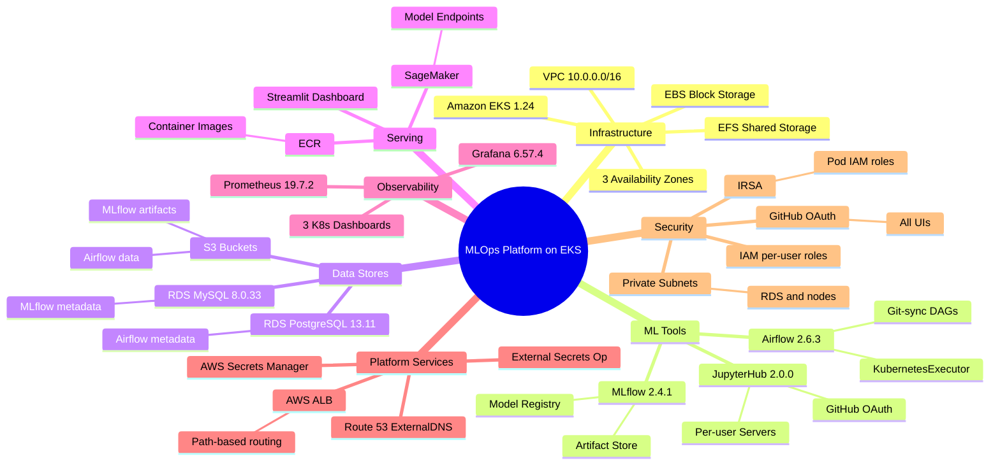

# MLOps Platform on EKS — Documentation Wiki

> **Enterprise MLOps platform** running on Amazon EKS, built entirely with Terraform.  
> Provides a unified, secure, multi-user environment for the full ML lifecycle from experimentation to production.

---

## Quick Navigation

| # | Document | What it covers |
|---|----------|---------------|
| [01](01_system_overview.md) | **System Overview** | Executive summary, component catalogue, tech stack |
| [02](02_high_level_design.md) | **High-Level Design (HLD)** | C4 context/container diagrams, AWS service map, module dependency graph |
| [03](03_low_level_design.md) | **Low-Level Design (LLD)** | K8s resources per namespace, RDS schemas, IAM role map, Helm configs, storage |
| [04a](04_data_flows/01_ml_training_pipeline.md) | **Data Flow — ML Training Pipeline** | Airflow DAG → KubernetesExecutor → S3 → MLflow logging |
| [04b](04_data_flows/02_model_deployment_sagemaker.md) | **Data Flow — Model Deployment** | MLflow model → ECR → SageMaker endpoint → Streamlit dashboard |
| [04c](04_data_flows/03_jupyterhub_interactive_dev.md) | **Data Flow — Interactive Development** | GitHub OAuth → JupyterHub spawn → EFS → MLflow tracking |
| [04d](04_data_flows/04_user_onboarding.md) | **Data Flow — User Onboarding** | Terraform user-profiles → IAM user/role → Secrets Manager → aws-auth |
| [04e](04_data_flows/05_terraform_cicd_deployment.md) | **Data Flow — Infrastructure Deployment** | Bootstrap → S3 backend → per-module parallel Terraform deploys |
| [04f](04_data_flows/06_monitoring_alerting.md) | **Data Flow — Monitoring & Alerting** | Prometheus scrape → Grafana dashboards → GitHub OAuth |
| [04g](04_data_flows/07_secrets_rotation.md) | **Data Flow — Secrets Rotation** | AWS Secrets Manager → ESO sync → K8s Secret → pod reload |
| [05](05_enterprise_scaling_challenges.md) | **Enterprise Scaling Challenges** | 7 challenges at Amazon-scale: isolation, IAM, cost, multi-region, data lake, compliance, GitOps |
| [06](06_security_architecture.md) | **Security Architecture** | Threat model, IAM trust boundaries, network security, hardening roadmap |
| [07](07_operations_runbook.md) | **Operations Runbook** | Terraform commands, scaling procedures, troubleshooting, log access |
| [viz](visualization/README.md) | **3D Visualization Scripts** | Interactive Python graphs (Plotly 3D + PyVis) |

---

## Platform at a Glance



---

## Component Versions

| Component | Version | Namespace | Helm Chart Source |
|-----------|---------|-----------|-------------------|
| EKS | 1.24 | — | AWS managed |
| Airflow | 2.6.3 | `airflow` | airflow-helm.github.io 8.7.1 |
| MLflow | 2.4.1 | `mlflow` | Local custom chart |
| JupyterHub | 2.0.0 | `jupyterhub` | jupyterhub.github.io 2.0.0 |
| Prometheus | 19.7.2 | `monitoring` | prometheus-community |
| Grafana | 6.57.4 | `monitoring` | grafana.github.io |
| AWS LBC | 2.4.2 | `kube-system` | aws.github.io/eks-charts |
| ExternalDNS | 6.20.4 | `kube-system` | charts.bitnami.com |
| EFS CSI Driver | latest | `kube-system` | kubernetes-sigs.github.io |

---

## Repository Structure Overview

```
mlops-mlplatform-on-eks/
├── deployment/
│   ├── main.tf                 ← Root module wiring all components
│   ├── locals.tf               ← Computed values (name_prefix, URIs, var lists)
│   ├── variables.tf            ← All input variables + deploy_* feature flags
│   ├── bootstrap/              ← S3 + DynamoDB Terraform state backend
│   ├── infrastructure/
│   │   ├── eks/                ← EKS cluster, node groups, CSI drivers
│   │   ├── vpc/                ← VPC, subnets, NAT, security groups
│   │   ├── rds/                ← PostgreSQL + MySQL databases
│   │   └── networking/         ← ALB controller + ExternalDNS
│   └── modules/
│       ├── airflow/            ← Airflow Helm release + IAM + RDS
│       ├── mlflow/             ← MLflow Helm release + IAM + S3
│       ├── jupyterhub/         ← JupyterHub Helm release
│       ├── monitoring/         ← Prometheus + Grafana Helm releases
│       ├── sagemaker/          ← ECR + IAM + Streamlit Helm release
│       ├── dashboard/          ← Vue.js frontend Helm release
│       ├── external-secrets/   ← External Secrets Operator
│       ├── user-profiles/      ← Per-user IAM + Secrets Manager
│       └── tfstate-backend/    ← Reusable S3/DynamoDB backend module
├── profiles/
│   └── user-list.yaml          ← Declarative user roster with role assignments
├── docs/                       ← Legacy docs (ESO integration, state migration)
├── tests/                      ← Terratest integration tests
└── wiki/                       ← This documentation suite
```

---

## Prerequisites to Deploy

| Requirement | Details |
|-------------|---------|
| Terraform | `>= 1.5.3` |
| AWS CLI | Configured with admin credentials |
| kubectl | Compatible with EKS 1.24 |
| Helm | `>= 3.x` |
| GitHub Org | With teams: `airflow-admin-team`, `airflow-users-team` |
| Route 53 Hosted Zone | Domain name for ingress |
| GitHub OAuth Apps | One per component (Airflow, JupyterHub, Grafana) |

See [Installation.md](../Installation.md) for full setup instructions.

---

## Key Design Principles

1. **Infrastructure as Code** — Every resource is Terraform-managed; no manual changes.
2. **IRSA over static credentials** — All pods authenticate to AWS via OIDC federation; no access keys on nodes.
3. **GitHub as Identity Provider** — Single OAuth handshake authenticates all platform components.
4. **Modular & optional** — Each ML tool has a `deploy_X = true/false` feature flag; deploy only what you need.
5. **Private by default** — All worker nodes and databases live in private subnets; only ALB is public-facing.
6. **Ephemeral compute** — Airflow uses `KubernetesExecutor`; task pods are created on demand and destroyed after completion.
